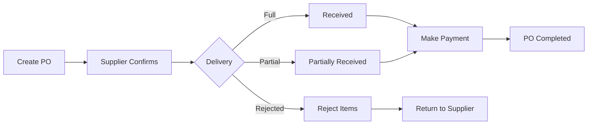
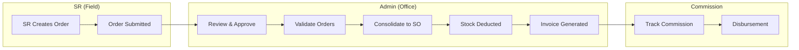
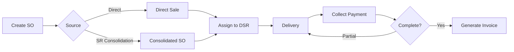
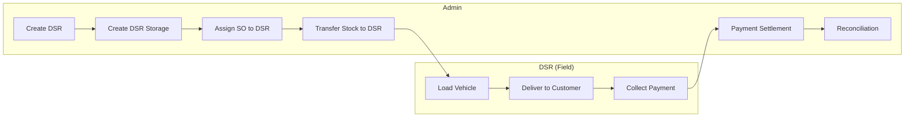

# Shoudagor ERP - User Manual

> **Version:** 1.0  
> **Last Updated:** 2026-02-08  
> **Audience:** All system users (Admin, Super Admin, Sales Representatives, Delivery Staff)

---

## Table of Contents

1. [Introduction & Getting Started](#1-introduction--getting-started)
2. [System Configuration (Super Admin)](#2-system-configuration-super-admin)
3. [Master Data Management](#3-master-data-management)
4. [Procurement Management](#4-procurement-management)
5. [Warehouse Operations](#5-warehouse-operations)
6. [Sales Representative Module](#6-sales-representative-module)
7. [Sales Management](#7-sales-management)
8. [Delivery Operations (DSR)](#8-delivery-operations-dsr)
9. [Billing & Invoicing](#9-billing--invoicing)
10. [Reports & Analytics](#10-reports--analytics)

---

## 1. Introduction & Getting Started

### 1.1 System Overview

**Shoudagor** is a comprehensive multi-tenant business management system (ERP) designed specifically for the Bangladeshi market. The system manages complete business operations including:

- **Inventory Management** – Products, variants, categories, units
- **Procurement** – Purchase orders, supplier management
- **Sales** – Direct sales, POS, customer management
- **Field Sales (SR)** – Mobile sales force with order consolidation
- **Delivery (DSR)** – Delivery workforce with stock management
- **Warehouse** – Storage locations, stock transfers, adjustments
- **Billing** – Invoices, expenses
- **Reports** – Inventory analytics, purchase reports

### 1.2 User Roles

The system supports four distinct user roles with different access levels:

| Role | Access Level | Primary Functions |
|------|-------------|-------------------|
| **Super Admin** | Full system access | User management, system configuration, DSR storage setup |
| **Admin** | Business operations | All inventory, procurement, sales, warehouse, billing, reports |
| **Sales Representative (SR)** | Mobile sales | Create orders, view assigned products/customers |
| **Delivery Sales Rep (DSR)** | Delivery operations | View assignments, manage inventory, record deliveries |

### 1.3 Logging In

1. Open the application in your web browser
2. You will see the **Login** page with the Bitoroni logo
3. Enter your credentials:
   - **Email**: Your registered email address
   - **Password**: Your account password
4. Click the **Login** button
5. Upon successful login, you will be redirected to your role-specific dashboard

> **Tip:** Click the eye icon (👁️) next to the password field to show/hide your password while typing.

### 1.4 Dashboard Overview

After logging in, you will see your **Dashboard** which varies based on your role:

#### Admin Dashboard

The Admin Dashboard displays key business metrics:

| Statistic | Description |
|-----------|-------------|
| **Total Sales** | Sum of all sales amounts |
| **Total Orders** | Count of all sales orders |
| **Active Products** | Number of product variants in the system |
| **Pending Dues** | Total customer outstanding balances |

**Quick Actions** panel provides shortcuts to:
- ➕ **New Sale** – Create a new sales order
- 🧮 **POS System** – Open the Point of Sale interface
- 📦 **Add Product** – Add a new product
- 🛒 **New Purchase** – Create a purchase order

The **Recent Activity** section shows recent transactions.

#### DSR Dashboard

DSRs see a simplified dashboard focused on their delivery assignments and inventory.

### 1.5 Navigation Structure

The application uses a sidebar navigation with the following main sections:

**Main Menu:**
- 📊 Dashboard
- 📦 Products (Categories, Units, Product Groups)
- 👥 Customers (Beats, Dues)
- 🏭 Suppliers
- 🛒 Purchases
- 💰 Sales (Invoices, POS)
- 👔 Sales Representatives
- 🚚 DSR (Delivery Sales Representatives)
- 🏢 Warehouse
- 💵 Expenses
- 📈 Reports
- ⚙️ Settings

**Bookmarks Bar:** Pin frequently used pages for quick access.

---

## 2. System Configuration (Super Admin)

> **Access:** Super Admin role only (Routes: `/super-admin/*`)

### 2.1 User Categories

User Categories define permission groups for users. Navigate to:  
**Super Admin → User Categories**

**View User Categories:**
- See list of all defined roles/permission groups
- Each category shows: Name, Description, Status

**Create New User Category:**
1. Click **+ Add New**
2. Enter:
   - **Category Name** (e.g., "Warehouse Manager")
   - **Description** (optional)
   - **Status** (Active/Inactive)
3. Click **Save**

### 2.2 User Management

Manage all system users. Navigate to:  
**Super Admin → Users**

**View Users:**
- See all system users with their roles
- Filter by status, search by name/email

**Create New User:**
1. Click **+ Add New**
2. Enter user details:
   - Basic Info: Name, Email, Phone
   - Authentication: Password
   - Role: Select User Category
   - Company Access (for multi-tenant)
3. Click **Save**

### 2.3 DSR Storage Management

Create virtual storage locations for Delivery Sales Representatives. Navigate to:  
**Super Admin → DSR Storage**

**Create DSR Storage:**
1. Click **+ Add New**
2. Enter storage details:
   - Storage Name
   - Associated DSR
   - Warehouse reference
3. Click **Save**

---

## 3. Master Data Management

> **Access:** Admin role (Routes: `/products/*`, `/categories/*`, `/units/*`, etc.)

Master data forms the foundation of all business transactions. Set up this data before creating purchases or sales.

### 3.1 Categories Management

Categories organize your products hierarchically. Navigate to:  
**Products → Categories**

**View Categories:**
- See all product categories in a list
- Categories can have parent-child relationships

**Create Category:**
1. Click **+ Add Category**
2. Enter:
   - **Category Name** (e.g., "Beverages", "Electronics")
   - **Parent Category** (optional, for subcategories)
   - **Description** (optional)
   - **Status** (Active/Inactive)
3. Click **Save**

### 3.2 Units of Measure

Units define how products are measured and sold. Navigate to:  
**Products → Units**

**View Units:**
- See all units with their conversion factors
- Common units: PCS, KG, Box, Carton

**Create Unit:**
1. Click **+ Add Unit**
2. Enter:
   - **Unit Name** (e.g., "Kilogram")
   - **Short Name** (e.g., "KG")
   - **Base Unit** (optional, for conversions)
   - **Conversion Factor** (e.g., 1 Carton = 12 PCS)
3. Click **Save**

> **Example Conversion:** If you create "Carton" with base unit "PCS" and conversion factor 12, the system knows 1 Carton = 12 Pieces.

### 3.3 Products & Variants

Products are the items you buy and sell. Each product can have multiple variants.  
Navigate to: **Products**

**View Products:**
- See all product variants in a searchable table
- Table shows: Name, SKU, Category, Unit, Price, Stock Status
- Use the search bar for quick lookup (Elasticsearch-powered)
- Apply filters by category

**Create Product:**
1. Click **+ Add Product**
2. Enter product information:
   - **Product Code** (auto-generated or manual)
   - **Product Name**
   - **Category** (select from dropdown)
   - **Description** (optional, can auto-generate)
   - **Status** (Active/Inactive)
3. Click **Continue** to add variants

**Add Variants:**
1. After creating the product, add variants
2. For each variant, enter:
   - **Variant Name** (e.g., "500g", "Red", "Large")
   - **SKU** (Stock Keeping Unit – unique identifier)
   - **Barcode** (optional)
   - **Unit of Measure**
   - **Sale Price**
   - **Purchase Price** (cost)
3. Click **Save Variant**

**Edit Product/Variant:**
1. Click the **⋮** (more options) button on any product row
2. Select **Edit**
3. Modify details and save

**Set Pricing:**
1. Click the **⋮** button → **Set Price**
2. Enter:
   - Sale Price
   - Purchase Price
   - Effective Date
3. Save the price

### 3.4 Product Groups

Group multiple products for bulk operations or bundling. Navigate to:  
**Products → Product Groups**

**Create Product Group:**
1. Click **+ Add Product Group**
2. Enter:
   - **Group Name**
   - **Description**
   - **Products** (select products to include)
3. Click **Save**

### 3.5 Suppliers

Suppliers are vendors from whom you purchase goods. Navigate to:  
**Contacts → Suppliers**

**View Suppliers:**
- See all suppliers with contact details
- View balance/payment status

**Create Supplier:**
1. Click **+ Add Supplier**
2. Enter:
   - **Company Name**
   - **Contact Person**
   - **Contact Email**
   - **Contact Phone**
   - **Address** (Country, State, City, Zip)
   - **Payment Terms** (optional)
3. Click **Save**

### 3.6 Customers

Customers are parties to whom you sell. Navigate to:  
**Contacts → Customers**

**View Customers:**
- See all customers with contact details and balances
- View credit limits and store credits

**Create Customer:**
1. Click **+ Add Customer**
2. Enter:
   - **Customer Name**
   - **Contact Person**
   - **Contact Email**
   - **Contact Phone**
   - **Address**
   - **Credit Limit** (optional)
   - **Store Credit** (optional)
   - **Beat Assignment** (optional)
3. Click **Save**

**Customer Dues:**
Navigate to **Customers → Dues** to see customers with outstanding balances.

### 3.7 Beats (Customer Routes)

Beats are geographic or logical groupings of customers for route planning. Navigate to:  
**Customers → Beats**

**Create Beat:**
1. Click **+ Add Beat**
2. Enter:
   - **Beat Name** (e.g., "Area 1", "Monday Route")
   - **Description**
   - **Assigned Customers** (optional, can add later)
3. Click **Save**

**Assign Customers to Beat:**
1. Open the beat details
2. Click **Assign Customers**
3. Select customers to add to this beat
4. Save

### 3.8 Storage Locations

Storage locations are physical places within warehouses. Navigate to:  
**Warehouse → Storage Locations**

**Create Storage Location:**
1. Click **+ Add Storage Location**
2. Enter:
   - **Location Name**
   - **Location Code**
   - **Warehouse** (parent warehouse)
   - **Description**
3. Click **Save**

---

## 4. Procurement Management

> **Access:** Admin role (Route: `/purchases/*`)  
> **Purpose:** Manage supplier purchase orders, deliveries, payments, and returns

### 4.1 Procurement Workflow Overview

### 4.2 Viewing Purchase Orders

Navigate to: **Purchases**

The Purchases page displays all purchase orders with:

| Column | Description |
|--------|-------------|
| **Order Number** | Click to view order details |
| **Supplier** | Supplier company name |
| **Order Date** | When the PO was created |
| **Expected Delivery Date** | Scheduled delivery date |
| **Status** | Pending, Received, Cancelled |
| **Payment Status** | Unpaid, Partial, Paid |
| **Delivery Status** | Pending, Partial, Received |
| **Total Amount** | Order total value |
| **Amount Paid** | Payments made so far |
| **Location** | Target storage location |

**Filtering Options:**
- **Location** – Filter by storage location
- **Supplier** – Filter by supplier
- **Status** – Filter by order status
- **Order Date Range** – Filter by order date
- **Delivery Date Range** – Filter by expected delivery
- **Amount Range** – Filter by total amount

**Export:** Click **Download Report** to export purchase orders as PDF.

### 4.3 Creating a Purchase Order

1. Navigate to **Purchases** → Click **+ New Purchase**
2. Fill in the order header:
   - **Supplier** (required) – Select from dropdown
   - **Storage Location** (required) – Where goods will be received
   - **Order Date** – Defaults to today
   - **Expected Delivery Date** – Estimated arrival
   - **Notes** (optional) – Additional instructions

3. Add line items:
   - Click **+ Add Item**
   - **Product** – Search and select product
   - **Variant** – Select specific variant (SKU)
   - **Unit of Measure** – Select unit
   - **Quantity** – Enter required quantity
   - **Unit Price** – Purchase price per unit
   - **Amount** – Auto-calculated (Qty × Price)

4. **Bulk Import (Optional):**
   - Click the upload icon to import items from Excel/CSV
   - Template columns: Product Name, SKU, Quantity, Unit Price

5. **Product Groups (Optional):**
   - Click **+ Add Product Group** to add predefined product bundles

6. Review the **Total Amount** at the bottom
7. Click **Save Purchase Order**

> **Tip:** You can add multiple line items. Use the trash icon to remove items.

### 4.4 Recording Delivery (Receiving Goods)

When supplier delivers goods:

1. Go to **Purchases**
2. Find the purchase order → Click **⋮** (Actions) → **Get Delivery**
3. The delivery form shows all line items with:
   - **Ordered Quantity** – Original order quantity
   - **Previously Received** – Already delivered
   - **Pending Quantity** – Remaining to receive
   - **Received Quantity** – Enter actual received amount
   - **Returned Quantity** – Items returned on receipt
   - **Rejected Quantity** – Items rejected on inspection

4. For each item, enter the quantities received
5. Add **Delivery Notes** if needed
6. Click **Save Delivery**

**Delivery Statuses:**
- **Pending** – No deliveries yet
- **Partial** – Some items received, more expected
- **Received** – All items fully received

### 4.5 Making Payments

To record supplier payments:

1. Go to **Purchases**
2. Find the purchase order → Click **⋮** → **Make Payment**
3. Enter payment details:
   - **Payment Amount** – Amount being paid
   - **Payment Method** – Cash, Bank Transfer, Cheque, etc.
   - **Payment Date** – When payment was made
   - **Reference Number** (optional) – Transaction reference
   - **Notes** (optional) – Payment remarks

4. Click **Save Payment**

**Payment Statuses:**
- **Unpaid** – No payments made
- **Partial** – Some amount paid, balance remaining
- **Paid** – Full amount paid

### 4.6 Processing Returns

If you need to return items to the supplier:

1. Go to **Purchases**
2. Find the purchase order → Click **⋮** → **Return Purchase**
3. The return form shows items eligible for return:
   - **Received Quantity** – What was received
   - **Return Quantity** – How many to return

4. Enter the quantities to return for each item
5. Add **Return Reason** or notes
6. Click **Process Return**

> **Note:** Returns affect inventory – stock will be deducted when return is processed.

### 4.7 Viewing Payment & Delivery History

To see all payments or deliveries for an order:

1. Click **⋮** (Actions) on any purchase order
2. Select:
   - **View Payments** – See all payment records
   - **View Deliveries** – See all delivery receipts

Each record shows date, amount/quantity, and notes.

---

## 5. Warehouse Operations

> **Access:** Admin role (Routes: `/warehouse/*`)  
> **Purpose:** Manage inventory stock, transfers between locations, and adjustments

### 5.1 Inventory Stock View

Navigate to: **Warehouse → Inventory**

View current stock levels across all storage locations:

| Column | Description |
|--------|-------------|
| **Product** | Product name |
| **Variant** | Specific variant/SKU |
| **Location** | Storage location |
| **Quantity** | Current stock quantity |
| **Unit** | Unit of measure |
| **Last Updated** | When stock was last modified |

**Features:**
- Search by product name or SKU
- Filter by storage location
- Filter by product category

### 5.2 Stock Transfers

Move inventory between storage locations.

Navigate to: **Warehouse → Inventory Stock → Transfer**

**Create Transfer:**
1. Click **+ New Transfer**
2. Enter:
   - **From Location** – Source storage location
   - **To Location** – Destination storage location
   - **Transfer Date**
   - **Notes** (optional)

3. Add items to transfer:
   - **Product/Variant** – Select item
   - **Quantity** – Amount to transfer (cannot exceed available stock)

4. Click **Process Transfer**

> **Important:** Stock is immediately deducted from source and added to destination.

### 5.3 Stock Adjustments

Correct stock levels for discrepancies (damage, loss, found items, etc.).

Navigate to: **Warehouse → Inventory Stock → Adjustment**

**Create Adjustment:**
1. Click **+ New Adjustment**
2. Enter:
   - **Storage Location** – Where adjustment applies
   - **Adjustment Date**
   - **Reason** – Why adjustment is needed

3. Add adjustment items:
   - **Product/Variant** – Select item
   - **Current Quantity** – Shows existing stock
   - **Adjustment Type** – Increase or Decrease
   - **Adjustment Quantity** – Amount to add/subtract
   - **New Quantity** – Auto-calculated result

4. Click **Save Adjustment**

**Common Adjustment Reasons:**
- Stock count correction
- Damaged goods
- Found items
- Expired products
- Sample/promotional use

---

## 6. Sales Representative (SR) Module

> **Access:** Admin role for management, SR role for order creation  
> **Purpose:** Manage mobile sales workforce, field orders, consolidation, and commissions

### 6.1 SR Workflow Overview

### 6.2 Managing Sales Representatives (Admin)

Navigate to: **Sales Representatives**

**View SRs:**
- See all Sales Representatives with their codes, names, and status
- View assigned products and customers count

**Create New SR:**
1. Click **+ Add SR**
2. Enter:
   - **SR Code** – Unique identifier
   - **User Account** – Link to system user
   - **Commission Rate** (%) – For calculating earnings
   - **Status** – Active/Inactive
3. Save

**Assign Products to SR:**
1. Open SR details or click **Assign Products**
2. Select products the SR is authorized to sell
3. Optionally set specific pricing for SR

**Assign Customers to SR:**
1. Open SR details or click **Assign Customers**
2. Select customers the SR will handle
3. Can also assign entire beats at once

### 6.3 SR Order Creation (SR Role)

> **Access:** SR role only (Route: `/sr/orders/*`)

When logged in as an SR:

Navigate to: **My Orders**

**View My Orders:**
- See all orders created by this SR
- Filter by status (Pending, Approved, Consolidated)

**Create New Order:**
1. Click **+ New Order**
2. Select **Customer** from assigned customers
3. Add line items:
   - Select from assigned products
   - Enter quantity
   - **Negotiated Price** – Can adjust if authorized
4. Enter **Expected Shipment Date**
5. Add **Notes** if needed
6. Click **Submit Order**

**SR Products & Customers:**
- `/sr/products` – View products assigned to you
- `/sr/customers` – View customers assigned to you
- `/sr/phone-suggestions` – Submit customer phone number corrections

### 6.4 SR Order Consolidation (Admin)

This is a key process that converts SR orders into actual Sales Orders.

Navigate to: **Sales Representatives → Unconsolidated Orders**

**View Unconsolidated Orders:**
- Groups orders by customer
- Shows number of pending orders per customer

**Consolidation Process:**
1. Click **Validate** on a customer row
2. In the dialog:
   - **Select Orders** – Check approved SR orders to include
   - **Select Storage Location** – Where stock will be taken from
3. Click **Validate Selected Orders**
   - System checks stock availability
   - Shows warnings if stock is insufficient
4. If validation passes:
   - Set **Expected Shipment Date**
   - Add **Consolidation Notes** (optional)
5. Click **Generate Consolidated Order**

**Result:**
- Creates a Sales Order linked to the SR orders
- Deducts stock from selected storage location
- Original SR orders marked as "consolidated"
- Sales Order shows "SR Consolidated: Yes"

### 6.5 SR Commission & Disbursement

Navigate to: **Sales Representatives → Commissions**

**View Undisbursed Commissions:**
- Shows SRs with pending commission amounts
- Based on consolidated and delivered orders

**Disbursement:**
1. Select SR or orders to disburse
2. Enter disbursement details
3. Record payment
4. Commission status updates to "Disbursed"

**Disbursement History:**
Navigate to **Sales Representatives → Disbursement History** to view past payments.

---

## 7. Sales Management

> **Access:** Admin role (Routes: `/sales/*`, `/invoices/*`)  
> **Purpose:** Manage direct sales orders, deliveries, payments, returns, and invoicing

### 7.1 Sales Workflow Overview

### 7.2 Viewing Sales Orders

Navigate to: **Sales**

The Sales page displays all orders with:

| Column | Description |
|--------|-------------|
| **Order Number** | Click to view details |
| **Customer** | Customer name |
| **Storage** | Source storage location |
| **Order Date** | When created |
| **Shipment Date** | Expected delivery |
| **Status** | Pending, Shipped, Delivered, Cancelled |
| **Payment Status** | Unpaid, Partial, Paid |
| **Delivery Status** | Pending, Partial, Delivered |
| **DSR Info** | Assigned DSR name/code |
| **SR Consolidated** | Yes/No if from SR orders |
| **SR Orders** | List of consolidated SR order numbers |
| **Total / Effective Total** | Order amounts |
| **Paid** | Amount received |

**Filtering:**
- Storage Location, Status, Customer
- Order Date Range, Shipment Date Range
- Amount Range

### 7.3 Creating a Direct Sales Order

1. Navigate to **Sales** → Click **+ New Sale**
2. Fill order header:
   - **Customer** (required)
   - **Storage Location** (required)
   - **Order Date**
   - **Expected Shipment Date**
   - **Notes**
3. Add line items:
   - **Product/Variant** – Search and select
   - **Quantity**
   - **Unit Price** – Sale price
   - **Discount** (optional)
4. Review **Total Amount**
5. Click **Save Order**

### 7.4 Point of Sale (POS)

For quick retail transactions:

Navigate to: **Sales → POS** (Route: `/sales/pos`)

**POS Features:**
- Quick product search
- Barcode scanning support
- Cart-based interface
- Multiple payment methods
- Instant receipt printing

**Using POS:**
1. Search or scan product
2. Click to add to cart
3. Adjust quantities as needed
4. Select payment method
5. Process payment
6. Print receipt

### 7.5 Recording Deliveries

1. Go to **Sales**
2. Find the order → Click **⋮** → **Make Delivery**
3. Enter delivery details:
   - **Delivered Quantity** per item
   - **Delivery Date**
   - **Notes**
4. Click **Save Delivery**

**Partial Deliveries:** If not delivering full order, status shows "Partial".

### 7.6 Recording Payments

1. Go to **Sales**
2. Find the order → Click **⋮** → **Make Payment**
3. Enter:
   - **Amount**
   - **Payment Method** (Cash, Card, Bank Transfer, etc.)
   - **Payment Date**
   - **Reference** (optional)
4. Click **Save Payment**

### 7.7 Processing Returns

1. Go to **Sales**
2. Find the order → Click **⋮** → **Return**
3. Enter return quantities per item
4. Add return reason
5. Click **Process Return**

> Stock is added back to inventory when return is processed.

### 7.8 DSR Assignment

To assign a sales order to a Delivery Sales Representative:

1. Go to **Sales**
2. Find the order → Click **⋮** → **Add to DSR**
3. Select DSR from dropdown
4. Click **Assign**

The order appears in the DSR's assignment queue.

### 7.9 Invoice Generation

**Quick Print:**
- Click **⋮** → **Quick Print** for simple receipt

**Formal Invoice:**
1. Click **⋮** → **Generate & Print Formal Invoice**
2. System creates an Invoice record linked to the Sales Order
3. Invoice appears in **Invoices** page
4. Print dialog opens automatically

**View Payments/Deliveries:**
- Click **View Payments** to see payment history
- Click **View Deliveries** to see delivery history

---

## 8. Delivery Operations (DSR)

> **Access:** Admin role for management, DSR role for delivery execution  
> **Purpose:** Manage delivery workforce, stock loading, deliveries, and payment collection

### 8.1 DSR Workflow Overview

### 8.2 Managing DSRs (Admin)

Navigate to: **DSR**

**View DSRs:**
- See all Delivery Sales Representatives
- View DSR code, name, payment on hand, status

**Create New DSR:**
1. Click **+ Add DSR**
2. Enter:
   - **DSR Code**
   - **User Account** – Link to system user
   - **Commission Rate**
   - **Status**
3. Save

### 8.3 DSR Storage & Stock (Admin)

Each DSR has a virtual storage location (like their vehicle/van).

Navigate to: **DSR → Storage**

**View DSR Storages:**
- See all DSR storage locations
- View current stock levels

**Transfer Stock to DSR:**
1. Find DSR storage
2. Click **Transfer Stock**
3. Select items and quantities
4. Process transfer

Stock moves from warehouse to DSR's virtual storage.

### 8.4 SO Assignment to DSR (Admin)

Navigate to: **DSR → SO Assignments**

**View Assignments:**
- See all Sales Orders assigned to DSRs
- Filter by DSR, status

**Assign New:**
- From Sales page: **⋮** → **Add to DSR**
- Or from DSR Assignments page: **+ New Assignment**

Assignment Status:
- **Assigned** – Waiting to load
- **In Progress** – DSR has loaded and is delivering
- **Completed** – Delivery finished

### 8.5 DSR Payment Settlement (Admin)

When DSR returns with collected payments:

Navigate to: **DSR → Settlements**

**Settlement Process:**
1. Click **+ New Settlement**
2. Select DSR
3. Enter amount collected
4. Record settlement
5. DSR's "Payment on Hand" decreases

**View History:**
See all past settlements with dates and amounts.

### 8.6 DSR Mobile View (DSR Role)

> **Access:** DSR role only (Route: `/dsr/my-*`)

**My Assignments:**
Navigate to **My Assignments** to see assigned orders.

For each assignment:
- View order details
- Mark items as delivered
- Record collected payments
- Update delivery status

**My Inventory:**
Navigate to **My Inventory** to see:
- Current stock in your DSR storage
- Quantities available for delivery

---

## 9. Billing & Invoicing

> **Access:** Admin role (Routes: `/invoices/*`, `/expenses/*`)

### 9.1 Invoice Management

Navigate to: **Invoices**

**View Invoices:**
- See all generated invoices
- Filter by status, date, customer
- View payment status

**Invoice Details:**
- Invoice Number
- Customer
- Items with quantities and prices
- Subtotal, Discounts, Tax
- Total Amount
- Payment Status

**Actions:**
- Print invoice
- View linked Sales Order

### 9.2 Expense Tracking

Navigate to: **Expenses**

**View Expenses:**
- See all recorded business expenses
- Filter by category, date, payment method

**Create Expense:**
1. Click **+ Add Expense**
2. Enter:
   - **Category** (e.g., Rent, Utilities, Supplies)
   - **Amount**
   - **Payment Method**
   - **Date**
   - **Description**
   - **Receipt/Reference** (optional)
3. Click **Save**

---

## 10. Reports & Analytics

> **Access:** Admin role (Routes: `/reports/*`)

### 10.1 Reports Dashboard

Navigate to: **Reports**

Overview of available reports and quick metrics.

### 10.2 Inventory Reports

Navigate to: **Reports → Inventory**

**Inventory KPI Ribbon:**
- Total Inventory Value
- Stock Count
- Average Cost per Unit
- Active Products

**FIFO Aging Report:**
Shows inventory age buckets:
- 0-30 days (fresh)
- 31-60 days
- 61-90 days
- 90+ days (aging)

Helps identify slow-moving inventory.

**Current Stock Report:**
- Stock levels by product/variant
- Location breakdown
- Value calculations

### 10.3 Purchase Order Reports

Navigate to: **Reports → Purchase Order**

**Filter Options:**
- By Year
- By Date Range

**Metrics:**
- Total PO Amount
- Total Paid
- Outstanding Balance
- Delivery Performance
- Fill Rate Analysis

---

## Appendix A: Keyboard Shortcuts

| Action | Shortcut |
|--------|----------|
| Search | `Ctrl/Cmd + K` |
| Save | `Ctrl/Cmd + S` |
| New Item | `Ctrl/Cmd + N` |

---

## Appendix B: Status Reference

### Order Statuses
| Status | Meaning |
|--------|---------|
| Pending | Order created, awaiting action |
| Shipped | Items dispatched |
| Delivered | Items received by customer |
| Cancelled | Order cancelled |

### Payment Statuses
| Status | Meaning |
|--------|---------|
| Unpaid | No payment received |
| Partial | Some payment received |
| Paid | Full amount received |

### Delivery Statuses
| Status | Meaning |
|--------|---------|
| Pending | Not yet delivered |
| Partial | Some items delivered |
| Completed/Delivered | All items delivered |

---

*End of User Manual*

