# Batch Inventory Module - User Manual Flow Diagrams

## Table of Contents
1. [Overview](#overview)
2. [Batch Inventory Module Entry Point](#1-batch-inventory-module-entry-point)
3. [Batch Management Workflow](#2-batch-management-workflow)
4. [Movement Ledger Workflow](#3-movement-ledger-workflow)
5. [Batch Reports & Analytics](#4-batch-reports--analytics)
6. [Sales Order Batch Allocation](#5-sales-order-batch-allocation)
7. [Returns with Batch Tracking](#6-returns-with-batch-tracking)
8. [Inventory Settings & Configuration](#7-inventory-settings--configuration)
9. [Stock Transfer with Batches](#8-stock-transfer-with-batches)
10. [Inventory Adjustment with Batches](#9-inventory-adjustment-with-batches)
11. [Data Models](#10-data-models)

---

## Overview

The Batch Inventory Module provides per-receipt cost tracking for inventory management. Instead of using a single average cost, the system tracks each purchase receipt as a separate "batch" with its own cost, enabling accurate FIFO (First-In-First-Out), LIFO (Last-In-First-Out), or Weighted Average Cost valuation.

### Key Entities
- **Batch**: A group of inventory items received together with its own unit cost
- **Inventory Movement**: Immutable ledger recording every stock change with locked cost
- **Sales Order Batch Allocation**: Links sales orders to specific batches for COGS tracking
- **Company Inventory Setting**: Configuration for batch tracking and valuation mode
- **DSR Batch Allocation**: Tracks batch inventory loaded to Delivery Sales Representatives

### Core Functions
- **Track Batches**: Monitor quantity received vs quantity on hand per batch
- **Movement Ledger**: View complete audit trail of all inventory changes
- **Cost Allocation**: Automatically allocate batches using FIFO, LIFO, or Weighted Average
- **Batch Reports**: Stock by batch, inventory aging, COGS, margin analysis
- **Return Traceability**: Link returns back to original purchase batches

---

## 1. Batch Inventory Module Entry Point

### User Journey Overview

```mermaid
flowchart TD
    %% User Entry
    A["👤 User logs into Shoudagor ERP"] --> B{"📍 Where do you want to go?"}
    
    %% Navigation Options
    B -->|Click 'Inventory'<br/>in main menu| C["📦 Inventory Stock Page"]
    B -->|Click 'Batches'<br/>in main menu| D["📦 Batch Management Page"]
    B -->|Click 'Movement Ledger'<br/>in main menu| E["📝 Movement Ledger Page"]
    B -->|Click 'Settings' → 'Inventory'<br/>in main menu| F["⚙️ Inventory Settings"]
    
    %% Batch Management Page Components
    D --> D1["📊 Batch List Table"]
    D --> D2["🔍 Search & Filter Panel"]
    D --> D3["⚡ Quick Action Buttons"]
    
    %% Table Columns
    D1 --> D1a["Batch ID<br/>Unique identifier"]
    D1 --> D1b["Product Name<br/>Associated product"]
    D1 --> D1c["Variant SKU<br/>Stock Keeping Unit"]
    D1 --> D1d["Qty Received<br/>Total units received"]
    D1 --> D1e["Qty On Hand<br/>Available stock"]
    D1 --> D1f["Unit Cost<br/>Cost per unit at receipt"]
    D1 --> D1g["Received Date<br/>When batch was added"]
    D1 --> D1h["Status<br/>active/depleted/expired"]
    D1 --> D1i["Location<br/>Storage location"]
    
    %% Search & Filters
    D2 --> D2a["🔎 Search by product name"]
    D2 --> D2b["📂 Filter by Product"]
    D2 --> D2c["🎨 Filter by Variant"]
    D2 --> D2d["🏭 Filter by Location"]
    D2 --> D2e["📊 Filter by Status"]
    D2 --> D2f["🏷️ Filter by Lot Number"]
    
    %% Action Buttons
    D3 --> D3a["📊 View Reports"]
    D3 --> D3b["📥 Export Data"]
    
    %% Row Actions
    D --> D4["⋮ Actions Menu (per row)"]
    D4 --> D4a["👁️ View Details"]
    D4 --> D4b["📝 Edit Notes/Lot"]
    D4 --> D4c["📋 View Movements"]
    
    %% Movement Ledger Page
    E --> E1["📋 Movement List Table"]
    E --> E2["🔍 Filter Movements"]
    E1 --> E1a["Movement Type<br/>IN, OUT, RETURN_IN, etc."]
    E1 --> E1b["Reference<br/>Source document"]
    E1 --> E1c["Quantity<br/>Positive/Negative"]
    E1 --> E1d["Unit Cost<br/>Locked at transaction"]
    
    %% Settings Page
    F --> F1["📊 Batch Tracking Toggle"]
    F --> F2["📊 Valuation Mode Select<br/>FIFO, LIFO, WEIGHTED_AVG"]
    
    %% Styling
    classDef userAction fill:#e1f5ff,stroke:#01579b,stroke-width:2px
    classDef page fill:#fff8e1,stroke:#ff6f00,stroke-width:2px
    classDef component fill:#f3e5f5,stroke:#7b1fa2,stroke-width:2px
    classDef data fill:#e8f5e9,stroke:#2e7d32,stroke-width:2px
    
    class A,B,C,D,E,F userAction
    class D1,E1,F1,F2 page
    class D2,D3,D4,E2 component
    class D1a,D1b,D1c,D1d,D1e,D1f,D1g,D1h,D1i,D2a,D2b,D2c,D2d,D2e,D2f,D3a,D3b,D4a,D4b,D4c,E1a,E1b,E1c,E1d data
```

### How to Navigate the Batch Inventory Page

1. **Getting There**: Click "Inventory" in the left sidebar, then select "Batches" or "Movement Ledger"
2. **What You See**: A table listing all inventory batches with filtering options above
3. **Quick Actions**: Use the buttons at the top for reports and exports
4. **Row Actions**: Click the "⋮" (three dots) on any row to view details, edit, or see movements

### UI Elements - Batch List Page

| Component | Type | Description |
|-----------|------|-------------|
| Search Input | Text Field | Search by product name |
| Product Filter | Dropdown | Select from available products |
| Variant Filter | Dropdown | Filter by specific variant |
| Location Filter | Dropdown | Filter by warehouse location |
| Status Filter | Dropdown | active, depleted, expired, returned, quarantined |
| Lot Number Filter | Text | Filter by lot number |
| Include Depleted | Checkbox | Show/hide depleted batches |
| View Reports | Button | Navigate to batch reports |
| Export | Button | Download batch data as Excel |
| Batch Table | Data Table | Paginated list with sorting |
| Actions Menu | Dropdown | View Details, Edit, View Movements |

---

## 2. Batch Management Workflow

### 2.1 Viewing Batch Details

**Overview**: This workflow guides you through viewing detailed information about a specific batch.

```mermaid
flowchart TD
    %% Start
    A["👤 User wants to view batch details"] --> B["📦 On Batch Management Page"]
    
    %% Find Batch
    B --> C["🔍 Use filters to find batch<br/>Or scroll through list"]
    C --> D["⋮ Click 'Actions' menu<br/>on the batch row"]
    
    %% View Details
    D --> E["👁️ Select 'View Details'"]
    E --> F["🪟 Batch Detail Page Opens"]
    
    %% Detail Sections
    F --> G["📋 Batch Information Section"]
    G --> G1["🏷️ Batch ID"]
    G --> G2["📦 Product Name"]
    G --> G3["🎨 Variant SKU"]
    G --> G4["🏷️ Lot Number"]
    G --> G5["📅 Received Date"]
    
    F --> H["📊 Quantity Section"]
    H --> H1["📥 Quantity Received<br/>Total when created"]
    H --> H2["📦 Quantity On Hand<br/>Currently available"]
    H --> H3["📤 Quantity Used<br/>Already allocated/sold"]
    
    F --> I["💰 Cost Section"]
    I --> I1["💵 Unit Cost<br/>Cost at time of receipt"]
    I --> I2["💰 Total Value<br/>Qty On Hand × Unit Cost"]
    I --> I3["🔒 Cost Status<br/>Locked if used in sales"]
    
    F --> J["📍 Location Section"]
    J --> J1["🏭 Storage Location"]
    J --> J2["🏢 Supplier Name<br/>If from purchase"]
    
    F --> K["📊 Status Section"]
    K --> K1["✓ Status Badge<br/>active/depleted/expired"]
    K --> K2["⚠️ Is Synthetic<br/>Auto-created for returns"]
    K --> K3["📄 Source Type<br/>purchase/return/adjustment"]
    
    %% Related Data
    F --> L["📋 Related Information"]
    L --> L1["📎 Purchase Order Link<br/>If from PO"]
    L --> L2["📝 Notes"]
    
    %% Movement History
    F --> M["📜 Movement History Section"]
    M --> M1["📊 List of all movements<br/>for this batch"]
    M --> M2["🔍 Filter by movement type"]
    M --> M3["📅 Sort by date"]
    
    %% Styling
    classDef start fill:#e3f2fd,stroke:#1565c0,stroke-width:2px
    classDef step fill:#fff3e0,stroke:#ef6c00,stroke-width:2px
    classDef info fill:#f3e5f5,stroke:#7b1fa2,stroke-width:2px
    classDef data fill:#e8f5e9,stroke:#2e7d32,stroke-width:2px
    
    class A,B,C,D,E start
    class F,G,H,I,J,K,L,M step
    class G1,G2,G3,G4,G5,H1,H2,H3,I1,I2,I3,J1,J2,K1,K2,K3,L1,L2 info
    class M1,M2,M3 data
```

### 2.2 Batch List Loading Flow

**What happens when you open the Batch Management page:**

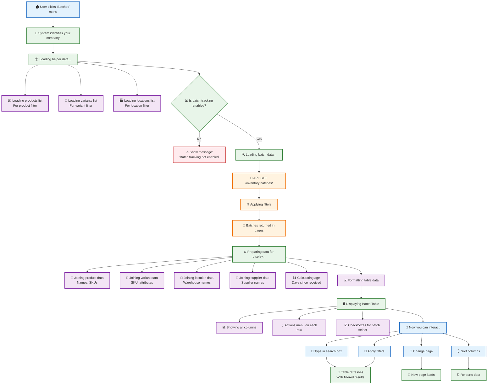

### 📱 Quick Guide: Finding Batches

| What you want to do | How to do it |
|---------------------|--------------|
| **Search by product** | Type in the search box |
| **Filter by location** | Use the "Location" dropdown |
| **Show active batches only** | Select "active" from Status filter |
| **Find depleted batches** | Check "Include Depleted" checkbox |
| **Find by lot number** | Enter lot number in the filter |
| **View batch details** | Click "⋮" on row → View Details |
| **View movement history** | Click "⋮" on row → View Movements |

### 2.3 Editing Batch Information

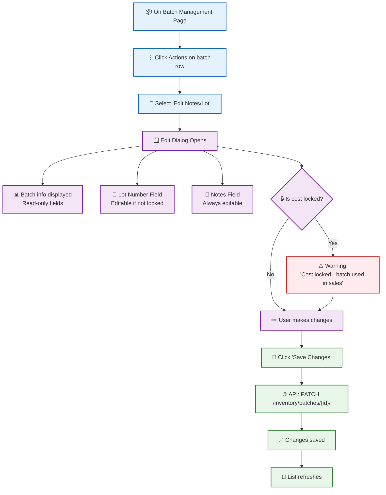

---

## 3. Movement Ledger Workflow

### 3.1 Viewing the Movement Ledger

**Overview**: The Movement Ledger is an immutable record of all inventory changes with locked costs.

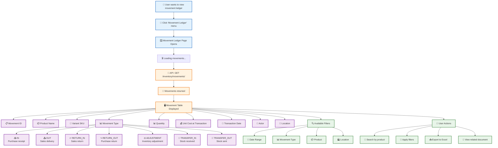

### 3.2 Movement Types Explained

| Movement Type | Description | When Created |
|---------------|-------------|--------------|
| **IN** | Positive quantity | Purchase receipt, positive adjustment, opening balance |
| **OUT** | Negative quantity | Sales delivery, batch allocation |
| **RETURN_IN** | Positive quantity | Sales return received back |
| **RETURN_OUT** | Negative quantity | Purchase return sent back |
| **ADJUSTMENT** | Positive or negative | Manual inventory adjustments |
| **TRANSFER_IN** | Positive quantity | Stock received at destination |
| **TRANSFER_OUT** | Negative quantity | Stock sent from source |

### 💡 Important Notes

- **Cost Immutability**: Once a batch has OUT movements, its unit cost is locked and cannot be modified
- **Audit Trail**: Every movement creates an immutable record with the cost locked at transaction time
- **Related Movements**: Return movements are linked to their original OUT movements for traceability
- **Reference Documents**: Each movement links to its source document (PO, SO, Adjustment, etc.)

---

## 4. Batch Reports & Analytics

### 4.1 Available Reports Overview

```mermaid
flowchart TD
    A["📊 Batch Reports Menu"] --> B["📦 Stock by Batch Report"]
    A --> C["📅 Inventory Aging Report"]
    A --> D["💰 COGS by Period Report"]
    A --> E["📈 Batch P&L Report"]
    A --> F["💹 Margin Analysis Report"]
    
    %% Stock by Batch
    B --> B1["Current inventory by batch"]
    B --> B2["Total value calculation"]
    B --> B3["Age of each batch"]
    B --> B4["Export to Excel"]
    
    %% Inventory Aging
    C --> C1["Stock age categories"]
    C1 --> C1a["0-30 days"]
    C1 --> C1b["31-60 days"]
    C1 --> C1c["61-90 days"]
    C1 --> C1d["91-180 days"]
    C1 --> C1e["180+ days"]
    C --> C2["Value by age bucket"]
    
    %% COGS
    D --> D1["Monthly COGS summary"]
    D --> D2["By product breakdown"]
    D --> D3["Actual batch costs used"]
    
    %% P&L
    E --> E1["Revenue by batch"]
    E --> E2["Cost by batch"]
    E --> E3["Profit calculation"]
    E --> E4["Margin percentage"]
    
    %% Margin
    F --> F1["Revenue vs Cost"]
    F --> F2["Gross profit"]
    F --> F3["Margin % by product"]
    
    %% Styling
    classDef report fill:#e3f2fd,stroke:#1565c0,stroke-width:2px
    classDef detail fill:#fff3e0,stroke:#ef6c00,stroke-width:2px
    classDef aging fill:#f3e5f5,stroke:#7b1fa2,stroke-width:2px
    
    class A,B,C,D,E,F report
    class B1,B2,B3,B4,C2,D1,D2,D3,E1,E2,E3,E4,F1,F2,F3 detail
    class C1,C1a,C1b,C1c,C1d,C1e aging
```

### 4.2 Stock by Batch Report Flow

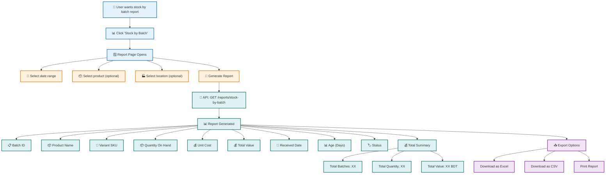

### 4.3 Inventory Aging Report

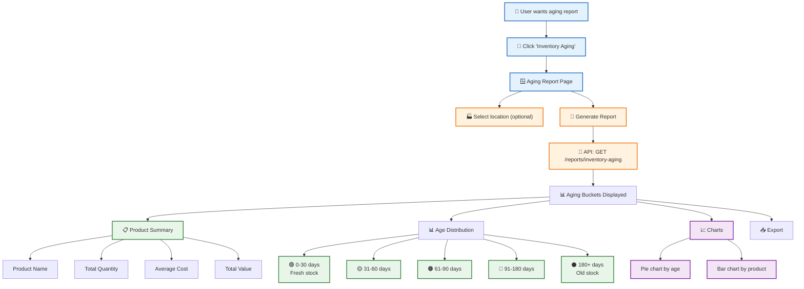

### 📊 Report Usage Guide

| Report | Purpose | Use When |
|--------|---------|----------|
| **Stock by Batch** | View current inventory grouped by batch | Monthly inventory review |
| **Inventory Aging** | Identify old stock that needs attention | Managing stock freshness |
| **COGS by Period** | Calculate cost of goods sold | Monthly financial closing |
| **Batch P&L** | Analyze profit by batch | Understanding profitability |
| **Margin Analysis** | View margins by product | Pricing decisions |

---

## 5. Sales Order Batch Allocation

### 5.1 How Batch Allocation Works

**Overview**: When a sales order is delivered, the system automatically allocates inventory from batches based on the company's valuation mode.

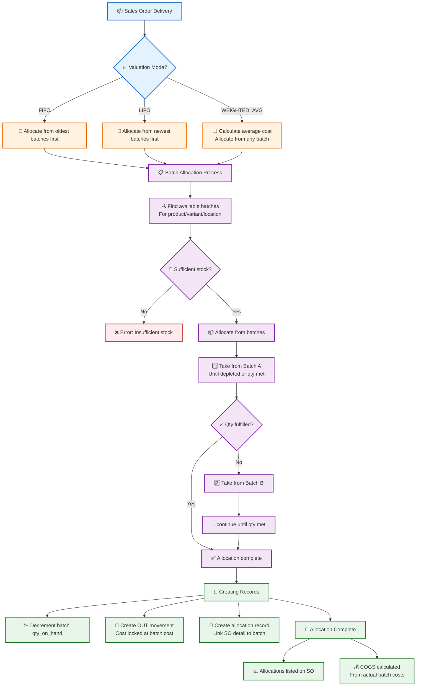

### 5.2 Viewing Allocations on a Sales Order

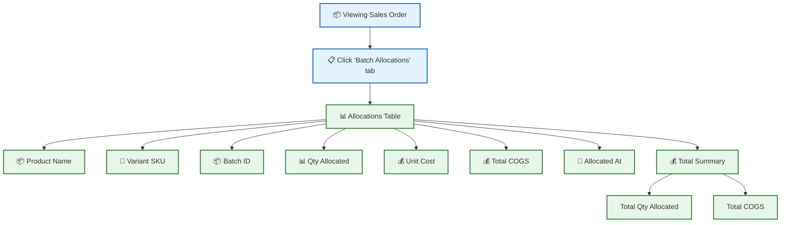

### 💡 Allocation Tips

1. **FIFO Mode**: Oldest batches are used first, good for perishable goods
2. **LIFO Mode**: Newest batches are used first, better for non-perishables
3. **Weighted Average**: Costs are averaged, simpler but less precise
4. **COGS Accuracy**: Actual batch costs are locked and used for COGS calculation
5. **Traceability**: Every sale is linked to specific batches for full traceability

---

## 6. Returns with Batch Tracking

### 6.1 Sales Return Batch Processing

**Overview**: When processing a sales return, the system attempts to return stock to the original batch.

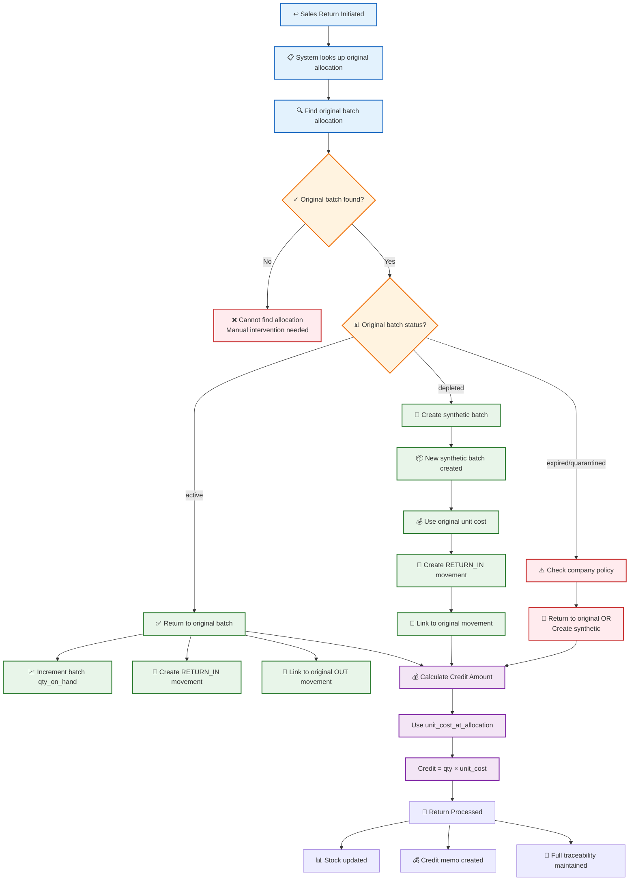

### 💡 Return Handling Notes

| Scenario | Action | Result |
|----------|--------|--------|
| Original batch active | Return to original batch | qty_on_hand increased |
| Original batch depleted | Create synthetic batch | New batch with original cost |
| Original batch expired | Policy-dependent | Return to original or synthetic |
| No allocation found | Manual intervention | Administrator review required |

---

## 7. Inventory Settings & Configuration

### 7.1 Enabling Batch Tracking

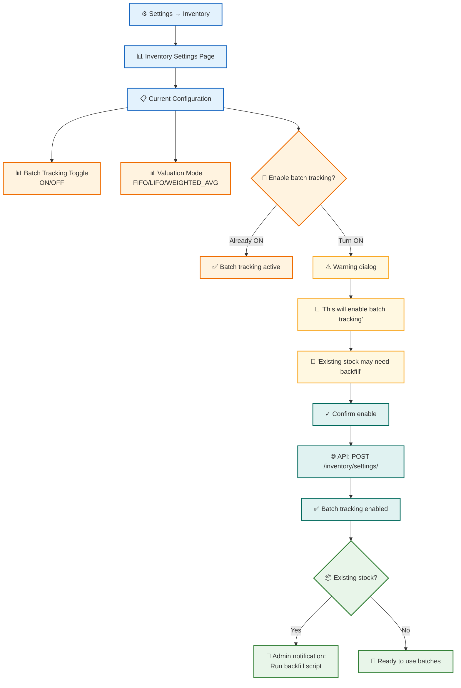

### 7.2 Changing Valuation Mode

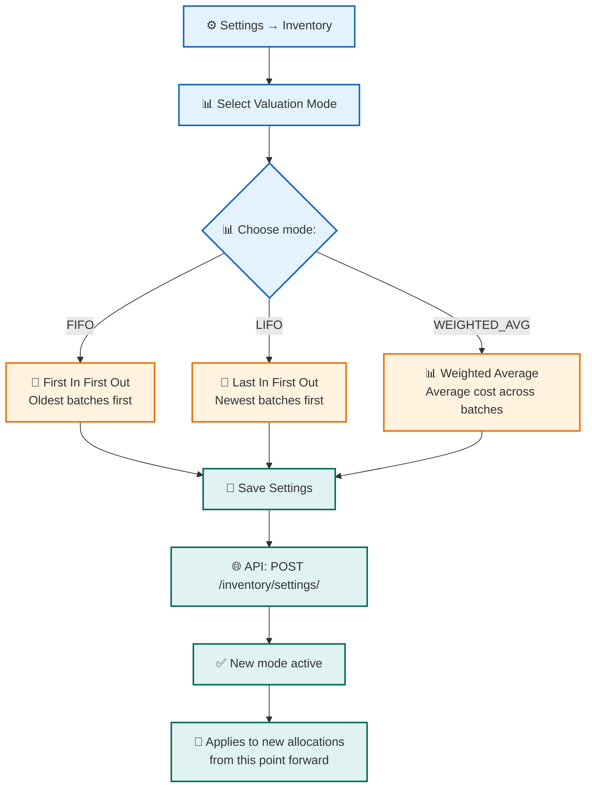

### 📊 Valuation Mode Comparison

| Mode | Description | Best For |
|------|-------------|----------|
| **FIFO** | Oldest batches allocated first | Perishable goods, inflationary markets |
| **LIFO** | Newest batches allocated first | Non-perishables, deflationary markets |
| **WEIGHTED_AVG** | Average cost across all batches | Simplified accounting, stable prices |

---

## 8. Stock Transfer with Batches

### 8.1 Batch Transfer Flow

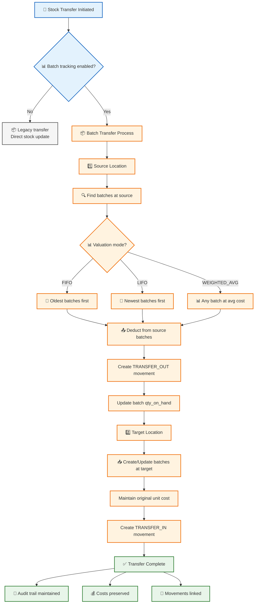

---

## 9. Inventory Adjustment with Batches

### 9.1 Batch Adjustment Flow

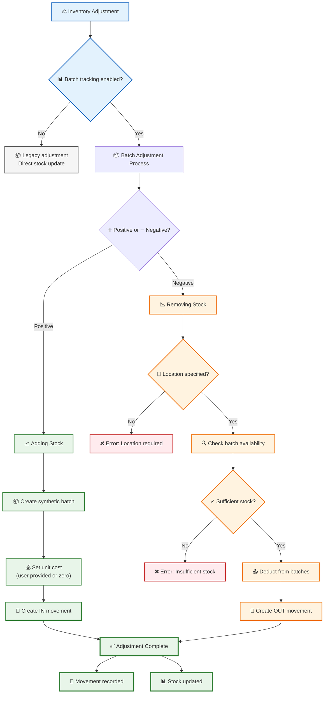

---

## 10. Data Models

### 10.1 Batch Inventory Entity Relationships

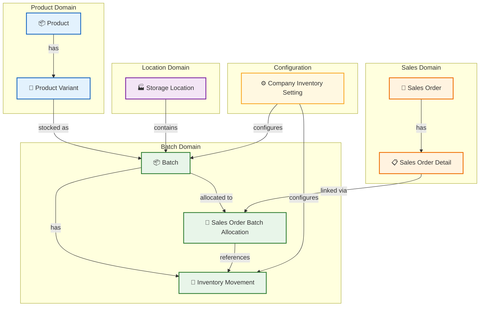

### 10.2 Key Fields Reference

#### Batch
| Field | Type | Description |
|-------|------|-------------|
| batch_id | Integer | Unique identifier |
| product_id | Integer | Reference to Product |
| variant_id | Integer | Reference to ProductVariant (optional) |
| qty_received | Decimal | Total quantity received in batch |
| qty_on_hand | Decimal | Available quantity remaining |
| unit_cost | Decimal | Cost per unit at time of receipt |
| received_date | DateTime | When batch was created |
| supplier_id | Integer | Reference to Supplier |
| lot_number | String | Lot/batch number for tracking |
| status | String | active, depleted, expired, returned, quarantined |
| location_id | Integer | Storage location |
| is_synthetic | Boolean | True if auto-created (returns, etc.) |
| source_type | String | purchase, return, adjustment, transfer, synthetic |

#### Inventory Movement
| Field | Type | Description |
|-------|------|-------------|
| movement_id | Integer | Unique identifier |
| batch_id | Integer | Reference to Batch |
| product_id | Integer | Reference to Product |
| variant_id | Integer | Reference to ProductVariant |
| qty | Decimal | Positive=inbound, negative=outbound |
| movement_type | String | IN, OUT, RETURN_IN, RETURN_OUT, ADJUSTMENT, TRANSFER_IN, TRANSFER_OUT |
| ref_type | String | Source document type |
| ref_id | Integer | Source document ID |
| unit_cost_at_txn | Decimal | Cost locked at transaction time |
| txn_timestamp | DateTime | When movement occurred |
| location_id | Integer | Storage location |

#### Company Inventory Setting
| Field | Type | Description |
|-------|------|-------------|
| setting_id | Integer | Unique identifier |
| company_id | Integer | Reference to Company |
| valuation_mode | String | FIFO, LIFO, WEIGHTED_AVG |
| batch_tracking_enabled | Boolean | Feature flag |

---

## Common Questions

### Q: What happens when batch tracking is enabled for the first time?
**A**: Existing inventory stock needs to be backfilled into batches. Contact your administrator to run the backfill script.

### Q: Can I disable batch tracking after enabling it?
**A**: This is not recommended as it will break cost traceability. Contact support if needed.

### Q: Why can't I edit the unit cost of some batches?
**A**: Once a batch has been used in sales (has OUT movements), its cost is locked for COGS accuracy.

### Q: What is a "synthetic" batch?
**A**: Synthetic batches are auto-created during returns when the original batch is depleted, or during adjustments.

### Q: How is COGS calculated with batch tracking?
**A**: COGS uses the actual unit_cost_at_allocation from the batches that were allocated to each sale.

### Q: What happens to batches during stock transfer?
**A**: Batches are transferred between locations with their original costs preserved, creating TRANSFER_IN and TRANSFER_OUT movements.

### Q: Can I see which batches were used for a specific sale?
**A**: Yes, view the Sales Order and click the "Batch Allocations" tab to see all batch allocations.

### Q: What is the difference between qty_received and qty_on_hand?
**A**: qty_received is the total when the batch was created; qty_on_hand is what's currently available after allocations.

---

## API Endpoints Reference

### Batches
- `GET /inventory/batches/` - List batches with filters
- `GET /inventory/batches/{id}/` - Get batch details
- `POST /inventory/batches/` - Create batch (admin only)
- `PATCH /inventory/batches/{id}/` - Update batch notes/lot

### Product Batches
- `GET /products/{id}/batches` - Get batches for a product

### Inventory Settings
- `GET /inventory/settings/` - Get company inventory settings
- `POST /inventory/settings/` - Update settings

### Reports
- `GET /reports/stock-by-batch` - Stock by batch report
- `GET /reports/inventory-aging` - Inventory aging report
- `GET /reports/cogs-by-period` - COGS by period
- `GET /reports/batch-pnl` - Batch P&L report
- `GET /reports/margin-analysis` - Margin analysis

---

*Document Version: 1.0 | Shoudagor ERP Batch Inventory Module*
