# Claims and Schemes Module - User Manual Flow Diagrams

## Table of Contents
1. [Overview](#overview)
2. [Claims Module Entry Point](#1-claims-module-entry-point)
3. [Scheme Creation Workflow](#2-scheme-creation-workflow)
4. [Scheme Management Workflow](#3-scheme-management-workflow)
5. [Claim Application on Orders](#4-claim-application-on-orders)
6. [Claim Log Management](#5-claim-log-management)
7. [Re-evaluation and Reversal Workflow](#6-re-evaluation-and-reversal-workflow)
8. [Reports and Analytics](#7-reports-and-analytics)
9. [Data Models](#8-data-models)

---

## Overview

The Claims and Schemes Module manages promotional offers, discounts, and free quantity benefits in the Shoudagor ERP system. It enables businesses to create flexible incentive programs that automatically apply to Purchase Orders and Sales Orders.

### Key Entities
- **ClaimScheme**: Master promotion configuration (name, type, duration, trigger products)
- **ClaimSlab**: Tiered benefit thresholds within a scheme (Buy X Get Y, discount slabs)
- **ClaimLog**: Audit trail of scheme applications on orders

### Scheme Types
| Type | Description | Use Case |
|------|-------------|----------|
| **Buy X Get Y** | Free quantity based on purchase quantity | "Buy 10 Get 1 Free" |
| **Rebate Flat** | Fixed discount amount per threshold met | "Get $50 off per 100 units" |
| **Rebate Percentage** | Percentage discount on qualifying quantity | "Get 10% off per 50 units" |
| **Tiered Pricing** | Unit price reduction based on order value | "Spend $1000, pay $9/unit" |

### Applicability
- **Purchase Orders**: Schemes apply when buying from suppliers
- **Sales Orders**: Schemes apply when selling to customers

---

## 1. Claims Module Entry Point

### User Journey Overview

```mermaid
flowchart TD
    %% User Entry
    A["👤 User logs into Shoudagor ERP"] --> B{"📍 Where do you want to go?"}
    
    %% Navigation Options
    B -->|Click 'Claims & Schemes'<br/>in main menu| C["🏷️ Claims Dashboard"]
    
    %% Dashboard Components
    C --> C1["📊 Dashboard Overview Cards"]
    C --> C2["📈 Scheme Summary Section"]
    C --> C3["💰 Claim Summary Section"]
    C --> C4["🏆 Top Performing Schemes"]
    C --> C5["📦 Top Claimed Products"]
    C --> C6["🕐 Recent Claim Logs"]
    C --> C7["📉 Monthly Trend Chart"]
    
    %% Scheme Summary Cards
    C2 --> C2a["Active Schemes<br/>Currently running"]
    C2 --> C2b["Expired Schemes<br/>Past end date"]
    C2 --> C2c["Expiring Soon<br/>Within 30 days"]
    C2 --> C2d["By Type<br/>Buy X Get Y / Rebate / Tiered"]
    C2 --> C2e["By Module<br/>Purchase vs Sale"]
    
    %% Claim Summary Cards
    C3 --> C3a["Total Claims Applied<br/>Count of applications"]
    C3 --> C3b["Total Free Quantity<br/>Units given free"]
    C3 --> C3c["Total Discount Amount<br/>Money saved"]
    C3 --> C3d["By Order Type<br/>PO vs SO claims"]
    C3 --> C3e["By Status<br/>Active / Reversed / Adjusted"]
    
    %% Quick Action Buttons
    C --> C8["⚡ Quick Action Buttons"]
    C8 --> C8a["➕ Create New Scheme"]
    C8 --> C8b["📋 View All Schemes"]
    C8 --> C8c["📜 View Claim Logs"]
    
    %% Navigation Sub-menu
    B -->|Click 'All Schemes'| D["📋 Schemes Listing Page"]
    B -->|Click 'Claim Logs'| E["📜 Claim Logs Page"]
    
    %% Schemes List Components
    D --> D1["🔍 Search & Filter Panel"]
    D --> D2["📊 Schemes Table"]
    D --> D3["➕ Add Scheme Button"]
    
    %% Search & Filters
    D1 --> D1a["🔎 Search by name"]
    D1 --> D1b["📂 Filter by Type"]
    D1 --> D1c["✓ Filter by Status"]
    D1 --> D1d["📅 Date Range Filter"]
    D1 --> D1e["📦 Filter by Product"]
    
    %% Table Columns
    D2 --> D2a["Scheme Name"]
    D2 --> D2b["Type<br/>Buy X Get Y / Rebate"]
    D2 --> D2c["Applicable To<br/>Purchase / Sale"]
    D2 --> D2d["Trigger Product<br/>What activates it"]
    D2 --> D2e["Date Range<br/>Start - End"]
    D2 --> D2f["Status<br/>Active/Inactive/Expired"]
    D2 --> D2g["Slabs Count<br/>Number of tiers"]
    
    %% Row Actions
    D --> D4["⋮ Actions Menu (per row)"]
    D4 --> D4a["✏️ Edit Scheme"]
    D4 --> D4b["🗑️ Delete Scheme"]
    D4 --> D4c["📊 View Details"]
    D4 --> D4d["📜 View Claim Logs"]
    
    %% Claim Logs Components
    E --> E1["🔍 Filter Panel"]
    E --> E2["📜 Claim Logs Table"]
    
    %% Log Filters
    E1 --> E1a["📅 Date Range"]
    E1 --> E1b["📦 Filter by Product"]
    E1 --> E1c["🏷️ Filter by Scheme"]
    E1 --> E1d["📋 Filter by Order Type<br/>PO / SO"]
    E1 --> E1e["🔢 Filter by Order ID"]
    
    %% Styling
    classDef userAction fill:#e1f5ff,stroke:#01579b,stroke-width:2px
    classDef page fill:#fff8e1,stroke:#ff6f00,stroke-width:2px
    classDef component fill:#f3e5f5,stroke:#7b1fa2,stroke-width:2px
    classDef data fill:#e8f5e9,stroke:#2e7d32,stroke-width:2px
    classDef metric fill:#ffebee,stroke:#c62828,stroke-width:2px
    
    class A,B,C,D,E userAction
    class C1,D2,E2 page
    class C2,C3,C4,C5,C6,C7,D1,D3,D4,E1 component
    class C2a,C2b,C2c,C2d,C2e,C3a,C3b,C3c,C3d,C3e,D2a,D2b,D2c,D2d,D2e,D2f,D2g data
    class C8,C8a,C8b,C8c metric
```

### How to Navigate the Claims Module

1. **Getting There**: Click "Claims & Schemes" in the left sidebar menu after logging in
2. **Dashboard View**: See summary cards showing scheme and claim statistics at a glance
3. **Quick Actions**: Use buttons to create new schemes or view detailed lists
4. **Scheme Management**: Click "All Schemes" to manage existing schemes
5. **Audit Trail**: Click "Claim Logs" to review all scheme applications

### Dashboard Metrics Explained

| Metric | What It Shows | Why It Matters |
|--------|---------------|----------------|
| **Active Schemes** | Currently running promotions | See what's currently available |
| **Expired Schemes** | Past promotions | Review historical offers |
| **Expiring Soon** | Schemes ending within 30 days | Plan renewals or replacements |
| **Total Claims** | Number of times schemes applied | Usage frequency indicator |
| **Free Quantity** | Total free units given | Inventory impact |
| **Discount Amount** | Total money saved/given | Financial impact |
| **Top Schemes** | Best performing promotions | ROI analysis |
| **Top Products** | Most claimed items | Popular products |

---

## 2. Scheme Creation Workflow

### 2.1 Step-by-Step: Creating a New Scheme

**Overview**: This workflow guides you through creating a promotional scheme with tiered benefits that automatically apply to qualifying orders.

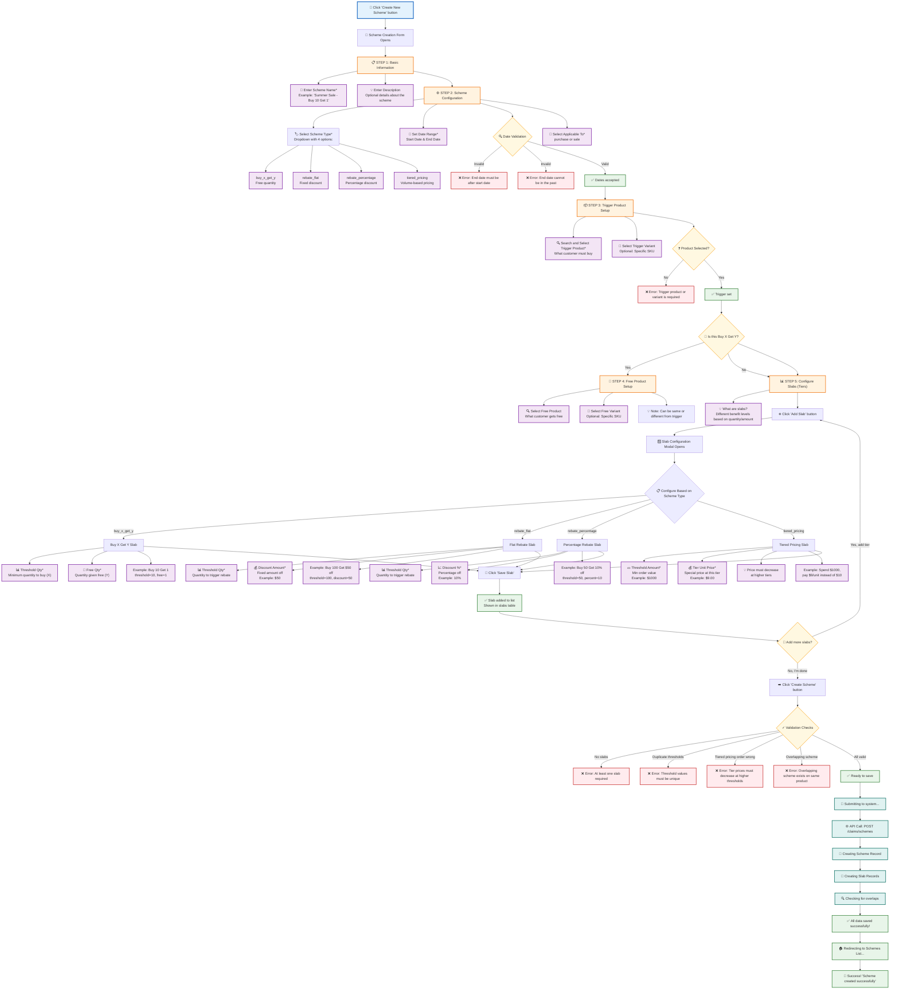

### 💡 Tips for Scheme Creation

1. **Scheme Name**: Use descriptive names that indicate the benefit (e.g., "Q1 Promo - Buy 10 Get 1 Free")
2. **Date Planning**: Set start date in the future to prepare upcoming promotions
3. **Trigger Product**: Can be at product level (all variants) or specific variant
4. **Slab Design**: Create progressive tiers for better incentives (e.g., Buy 10 get 1, Buy 20 get 3)
5. **Overlap Check**: System prevents overlapping schemes on same product during same period

### 2.2 Scheme Type Selection Guide

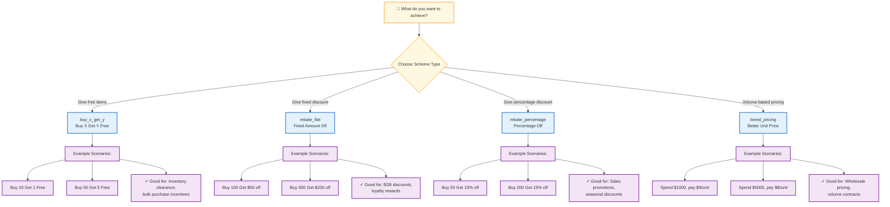

### 2.3 Field Requirements & Validation

| Field | Required | Validation Rules | Scheme Types |
|-------|----------|------------------|--------------|
| Scheme Name | Yes | Min 1 char | All |
| Scheme Type | Yes | Must select one of 4 types | All |
| Start Date | Yes | Must be valid date | All |
| End Date | Yes | Must be after start date | All |
| Applicable To | Yes | "purchase" or "sale" | All |
| Trigger Product | Yes | Must exist in system | All |
| Trigger Variant | No | If set, must belong to trigger product | All |
| Free Product | No | Required for buy_x_get_y | buy_x_get_y |
| Free Variant | No | Optional even for buy_x_get_y | buy_x_get_y |
| Threshold Qty | Conditional | Required for non-tiered types | buy_x_get_y, rebate_* |
| Threshold Amount | Conditional | Required for tiered_pricing | tiered_pricing |
| Free Qty | Conditional | Required for buy_x_get_y | buy_x_get_y |
| Discount Amount | Conditional | Required for rebate_flat | rebate_flat |
| Discount % | Conditional | Required for rebate_percentage | rebate_percentage |
| Tier Unit Price | Conditional | Required for tiered_pricing | tiered_pricing |

---

## 3. Scheme Management Workflow

### 3.1 Editing a Scheme

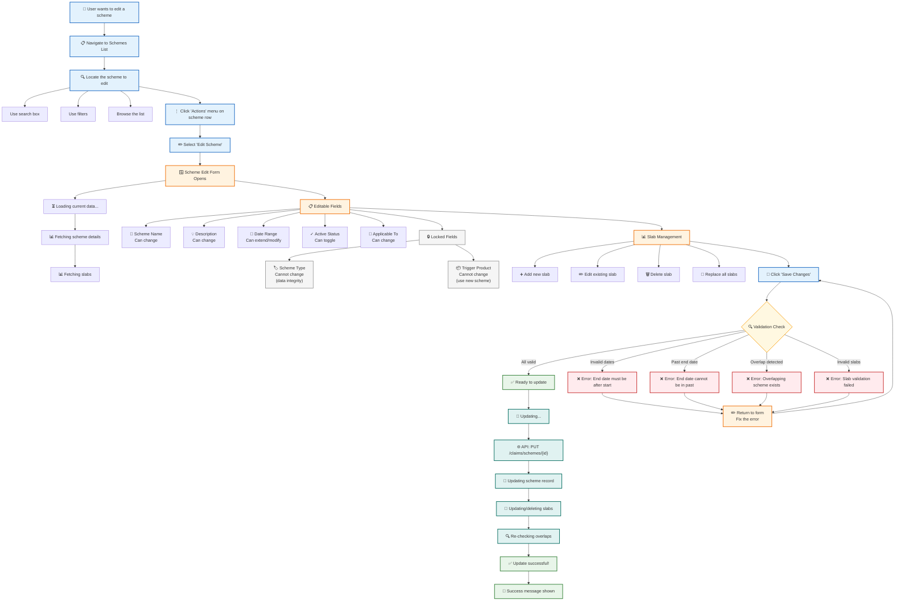

### 3.2 Deleting a Scheme

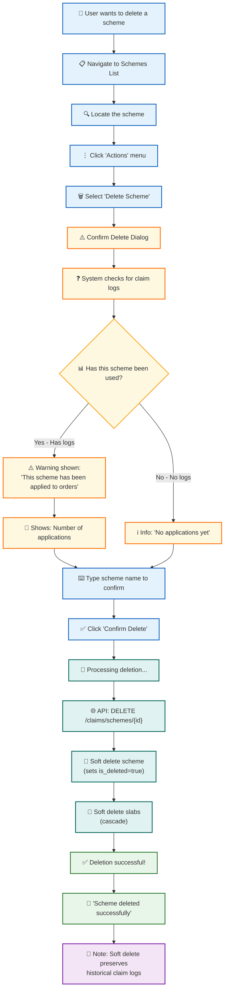

### 3.3 Viewing Scheme Details

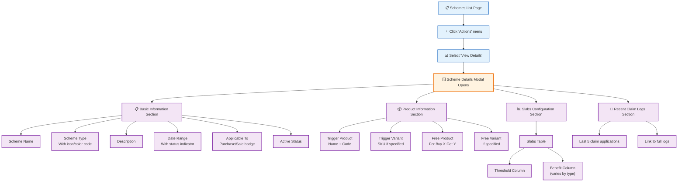

---

## 4. Claim Application on Orders

### 4.1 How Claims Auto-Apply to Orders

**Overview**: When creating or editing Purchase Orders or Sales Orders, the system automatically evaluates and applies eligible schemes.

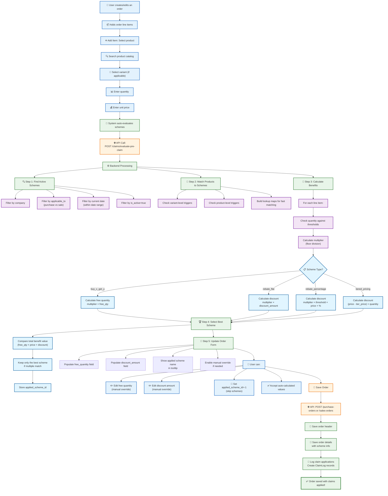

### 4.2 Claim Application Example: Buy X Get Y

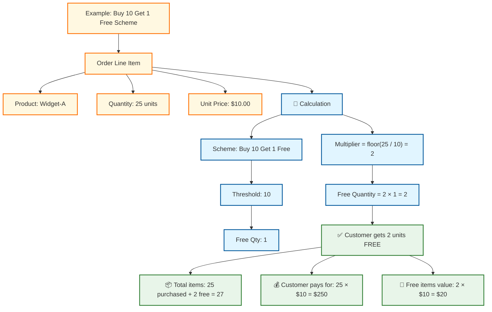

### 4.3 Claim Application Example: Tiered Pricing

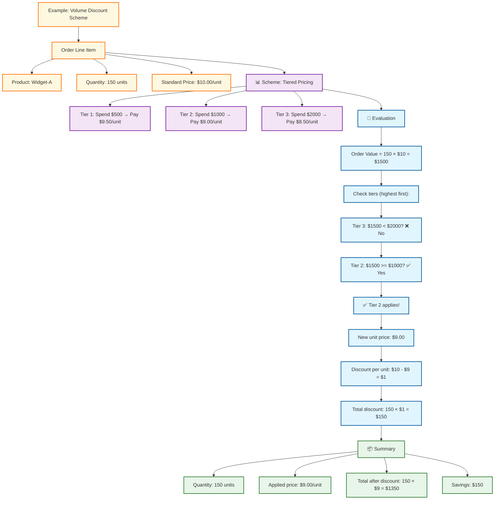

---

## 5. Claim Log Management

### 5.1 Viewing Claim Logs

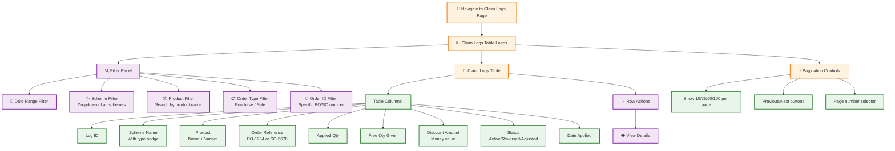

### 5.2 Understanding Claim Log Status

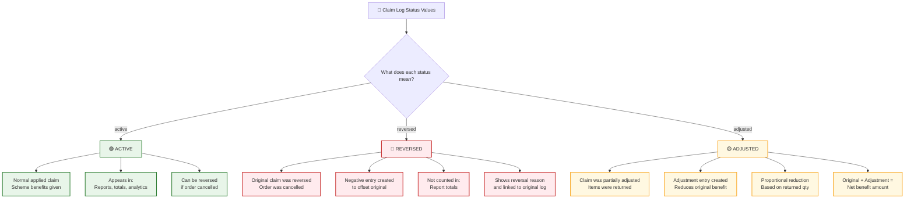

---

## 6. Re-evaluation and Reversal Workflow

### 6.1 When to Re-evaluate Schemes

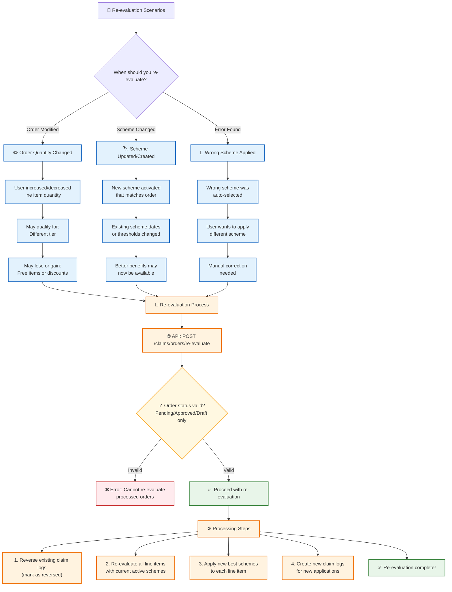

### 6.2 Reversing Claims for Cancelled Orders

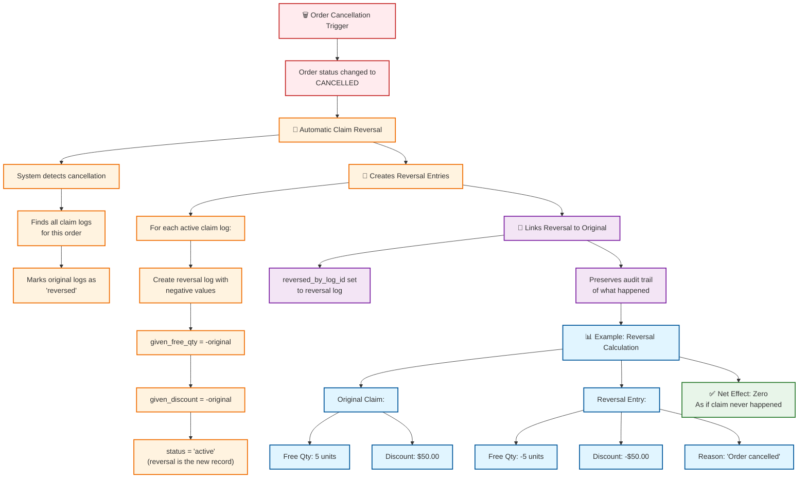

### 6.3 Adjusting Claims for Partial Returns

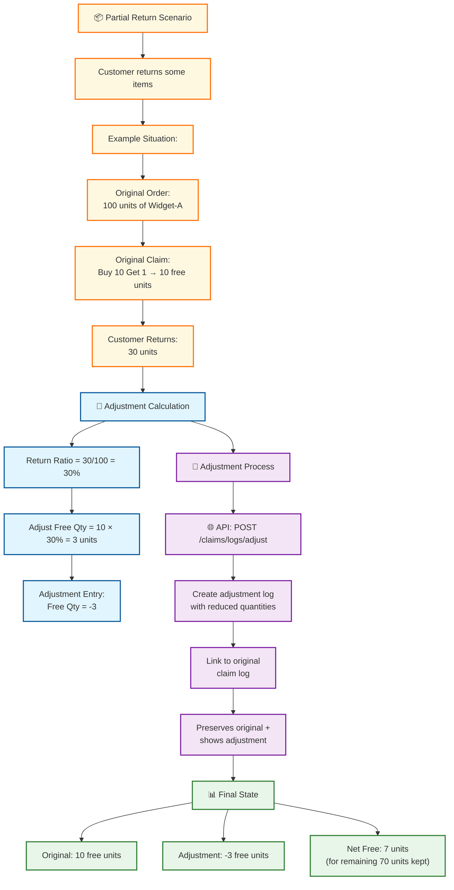

---

## 7. Reports and Analytics

### 7.1 Available Reports

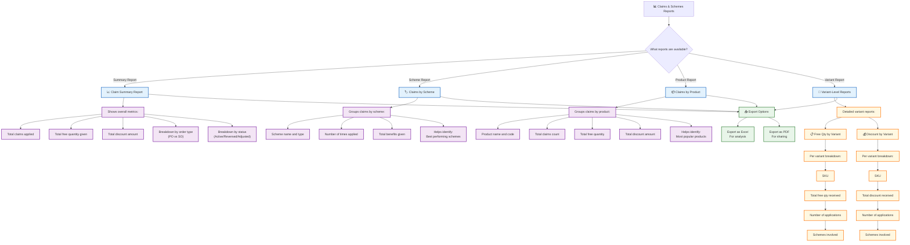

### 7.2 Generating a Report

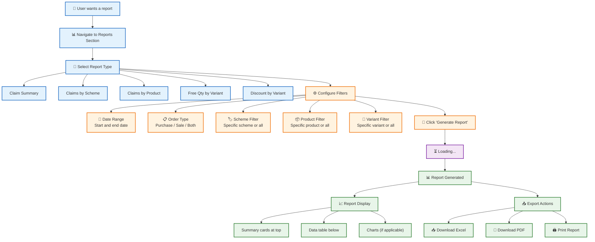

---

## 8. Data Models

### 8.1 Entity Relationship Diagram

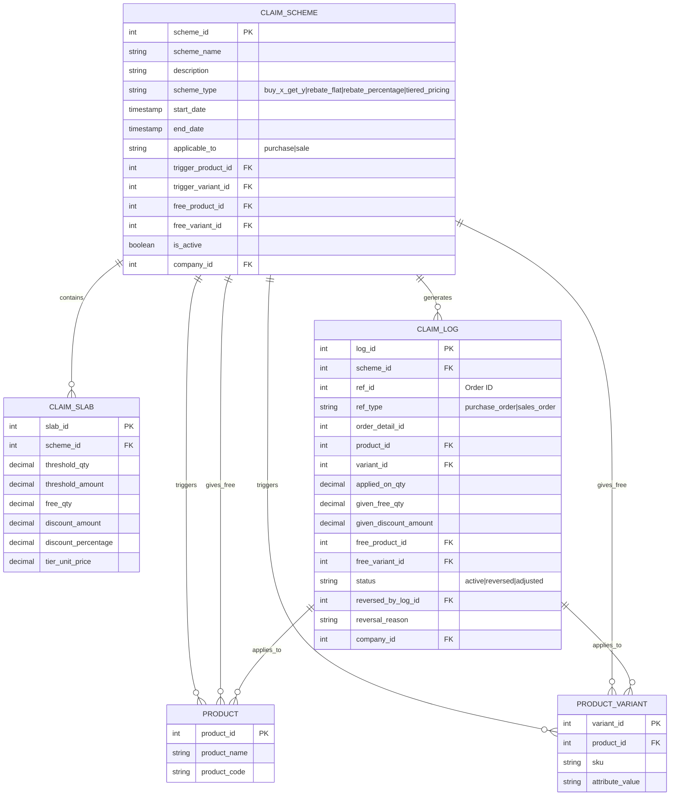

### 8.2 Model Field Descriptions

#### ClaimScheme
| Field | Type | Description |
|-------|------|-------------|
| scheme_id | Integer | Primary key, auto-generated |
| scheme_name | String(200) | Human-readable name for the promotion |
| description | String(500) | Optional detailed description |
| scheme_type | String(50) | Type: buy_x_get_y, rebate_flat, rebate_percentage, tiered_pricing |
| start_date | Timestamp | When the scheme becomes active |
| end_date | Timestamp | When the scheme expires |
| applicable_to | String(50) | Applies to: purchase (PO) or sale (SO) |
| trigger_product_id | Integer | FK to Product - what triggers the scheme |
| trigger_variant_id | Integer | FK to Variant - specific SKU trigger (optional) |
| free_product_id | Integer | FK to Product - what to give free (Buy X Get Y only) |
| free_variant_id | Integer | FK to Variant - specific free SKU (optional) |
| is_active | Boolean | Whether scheme is currently active |
| company_id | Integer | FK to company (multi-tenant) |

#### ClaimSlab
| Field | Type | Description |
|-------|------|-------------|
| slab_id | Integer | Primary key, auto-generated |
| scheme_id | Integer | FK to parent ClaimScheme |
| threshold_qty | Decimal | Quantity to trigger this slab (non-tiered) |
| threshold_amount | Decimal | Order value to trigger (tiered_pricing only) |
| free_qty | Decimal | Free quantity to give (Buy X Get Y) |
| discount_amount | Decimal | Fixed discount amount (rebate_flat) |
| discount_percentage | Decimal | Discount percentage (rebate_percentage) |
| tier_unit_price | Decimal | Special unit price (tiered_pricing) |

#### ClaimLog
| Field | Type | Description |
|-------|------|-------------|
| log_id | Integer | Primary key, auto-generated |
| scheme_id | Integer | FK to applied ClaimScheme |
| ref_id | Integer | Order ID (PO or SO) |
| ref_type | String(50) | 'purchase_order' or 'sales_order' |
| order_detail_id | Integer | Specific line item ID |
| product_id | Integer | FK to Product that was ordered |
| variant_id | Integer | FK to Variant that was ordered |
| applied_on_qty | Decimal | Quantity the scheme applied to |
| given_free_qty | Decimal | Free quantity given (can be negative for reversals) |
| given_discount_amount | Decimal | Discount amount (can be negative for reversals) |
| free_product_id | Integer | FK to free product (Buy X Get Y) |
| free_variant_id | Integer | FK to free variant (Buy X Get Y) |
| status | String(20) | 'active', 'reversed', or 'adjusted' |
| reversed_by_log_id | Integer | Self-referential FK for reversals |
| reversal_reason | String(500) | Why claim was reversed/adjusted |
| company_id | Integer | FK to company (multi-tenant) |

---

## Appendix: Common Scenarios

### Scenario 1: Creating a Simple Buy 10 Get 1 Free

```mermaid
flowchart LR
    A["Create Scheme"] --> B["Name: 'Summer Promo'"]
    B --> C["Type: buy_x_get_y"]
    C --> D["Applicable: sale"]
    D --> E["Trigger: Product-X"]
    E --> F["Free: Same Product-X"]
    F --> G["Add Slab:"]
    G --> H["Threshold: 10"]
    H --> I["Free: 1"]
    I --> J["Save Scheme"]
```

### Scenario 2: Creating Tiered Volume Discounts

```mermaid
flowchart LR
    A["Create Scheme"] --> B["Name: 'Volume Discount'"]
    B --> C["Type: tiered_pricing"]
    C --> D["Applicable: purchase"]
    D --> E["Trigger: Product-Y"]
    E --> F["Slab 1: $500 → $9.50"]
    F --> G["Slab 2: $1000 → $9.00"]
    G --> H["Slab 3: $2000 → $8.50"]
    H --> I["Save Scheme"]
```

### Scenario 3: Finding Claim Impact on Sales

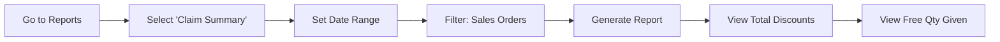

---

**Document Version**: 1.0  
**Module**: Claims and Schemes  
**Last Updated**: May 2026  
**Compatible with**: Shoudagor ERP v2.0+
