# DSR Module - User Manual Flow Diagrams

## Table of Contents
1. [Overview](#overview)
2. [DSR Module Entry Point](#1-dsr-module-entry-point)
3. [DSR Management Workflow](#2-dsr-management-workflow)
4. [DSR Storage Management](#3-dsr-storage-management)
5. [DSR SO Assignment Workflow](#4-dsr-so-assignment-workflow)
6. [DSR Load/Unload Workflow](#5-dsr-loadunload-workflow)
7. [DSR Delivery & Payment Collection](#6-dsr-delivery--payment-collection)
8. [DSR Settlement Workflow](#7-dsr-settlement-workflow)
9. [DSR Dashboard & Reporting](#8-dsr-dashboard--reporting)
10. [Data Models](#9-data-models)

---

## Overview

The DSR (Delivery Sales Representative) Module manages field sales operations, enabling delivery representatives to process orders, manage inventory in their vehicles/vans, collect payments, and handle returns on the go.

### Key Entities
- **DSR (Delivery Sales Representative)**: Field sales agent with van/storage
- **DSR Storage**: Physical storage location (van, warehouse, shop) linked to DSR
- **DSR SO Assignment**: Links Sales Orders to DSRs for delivery
- **DSR Inventory Stock**: Products currently loaded in DSR's van
- **DSR Payment Settlement**: Records of payment collection from DSRs

### User Roles
- **Admin**: Manages DSRs, assignments, and settlements
- **DSR User**: Field representative who loads orders, delivers, collects payments

---

## 1. DSR Module Entry Point

### User Journey Overview

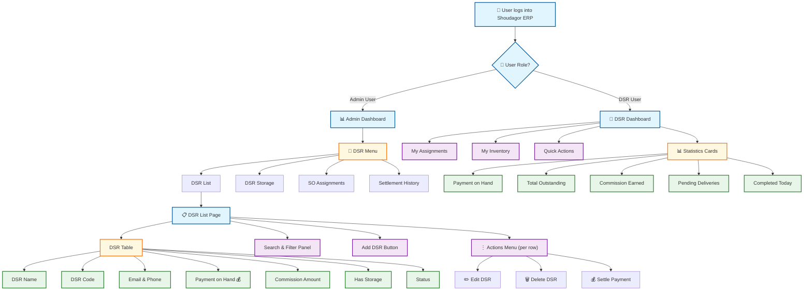

### How to Navigate the DSR Module

**For Admin Users:**
1. **Getting There**: Click "DSR" in the left sidebar menu after logging in
2. **What You See**: DSR list with payment balances, storage status, and action menus
3. **Quick Actions**: Add new DSRs, view storage locations, manage assignments
4. **Row Actions**: Click "⋮" (three dots) on any DSR row to edit, delete, or settle payments

**For DSR Users:**
1. **Getting There**: Dashboard auto-loads with DSR-specific view
2. **What You See**: Summary of assignments, inventory, and financial status
3. **Quick Actions**: Access my assignments, view inventory, process deliveries

### UI Elements - DSR List Page (Admin View)

| Component | Type | Description |
|-----------|------|-------------|
| DSR Name | Text | Representative's name |
| DSR Code | Text | Unique identifier code |
| Payment on Hand | Currency | Cash collected, pending settlement |
| Commission Amount | Currency | Earned commission balance |
| Has Storage | Yes/No | Whether storage location is configured |
| Status | Badge | Active/Inactive indicator |
| Add DSR | Button | Navigate to creation page |
| Actions Menu | Dropdown | Edit, Delete, Settle Payment |

---

## 2. DSR Management Workflow

### 2.1 Creating a New DSR

**Overview**: Create a Delivery Sales Representative record with contact info and initial payment balance.

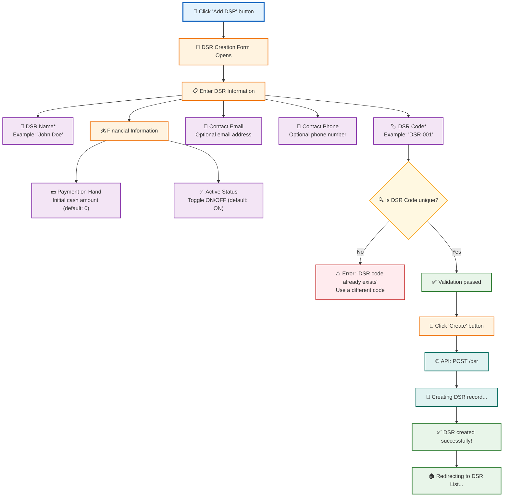

### 2.2 Editing a DSR

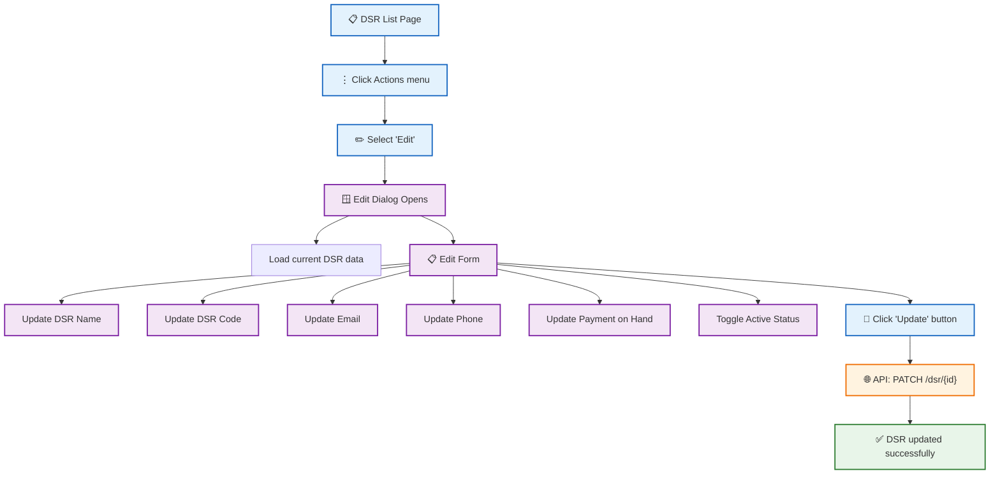

### 2.3 Field Requirements & Validation

| Field | Required | Validation Rules |
|-------|----------|------------------|
| DSR Name | Yes | Min 1 char, max 200 |
| DSR Code | Yes | Unique per company, max 50 chars |
| Contact Email | No | Valid email format |
| Contact Phone | No | Max 20 chars |
| Payment on Hand | No | Decimal number |
| Is Active | No | Boolean, default true |

---

## 3. DSR Storage Management

### 3.1 Creating DSR Storage

**Overview**: Each DSR needs a storage location (van, mini-warehouse, or shop) to hold inventory for deliveries.

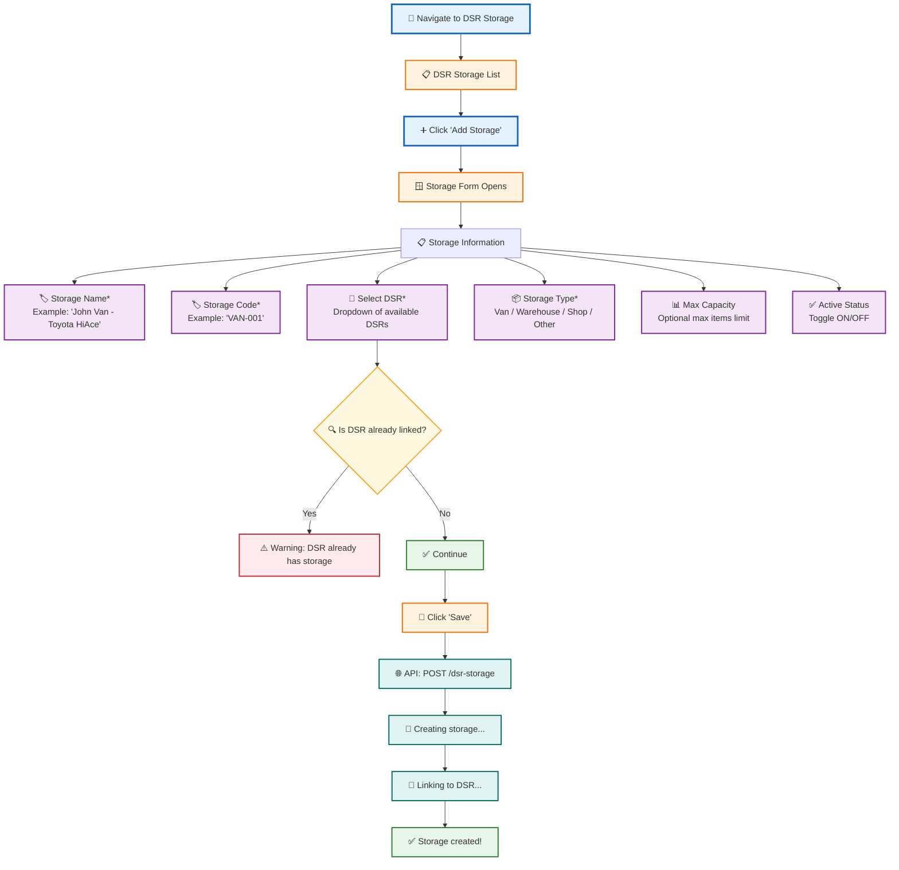

### 3.2 Storage Types

| Type | Description | Use Case |
|------|-------------|----------|
| **Van** | Mobile vehicle storage | Field delivery reps |
| **Warehouse** | Fixed warehouse space | Mini distribution centers |
| **Shop** | Retail shop location | Store-within-store model |
| **Other** | Custom location type | Special arrangements |

---

## 4. DSR SO Assignment Workflow

### 4.1 Assigning Sales Order to DSR

**Overview**: Admin assigns a confirmed Sales Order to a DSR for delivery. The DSR must have storage configured.

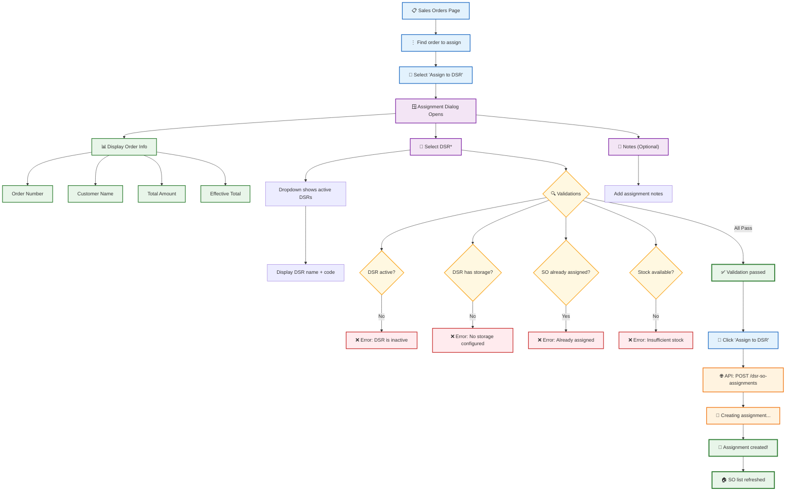

### 4.2 Assignment Status Flow

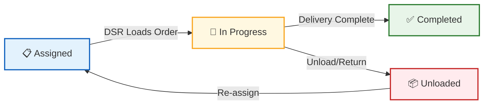

---

## 5. DSR Load/Unload Workflow

### 5.1 Loading Sales Order to Van

**Overview**: DSR transfers Sales Order items from warehouse to their van storage for delivery.

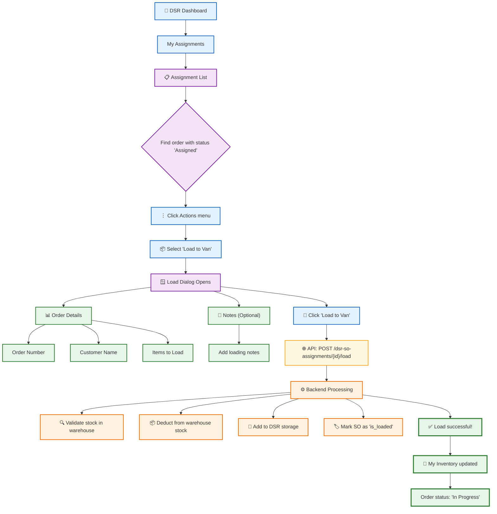

### 5.2 Unloading Sales Order from Van

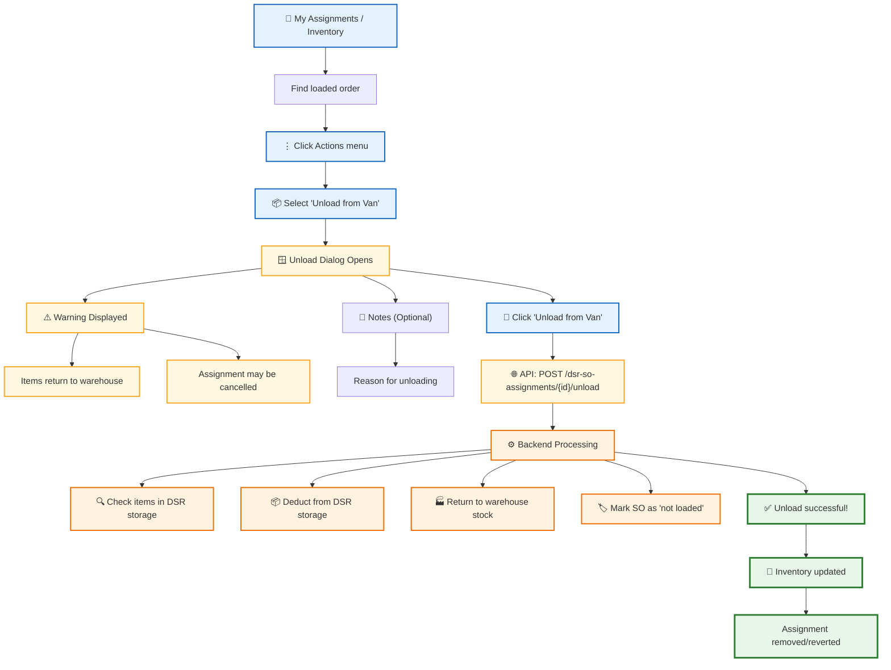

---

## 6. DSR Delivery & Payment Collection

### 6.1 Making Delivery

**Overview**: DSR delivers loaded items to customer, records accepted and rejected quantities.

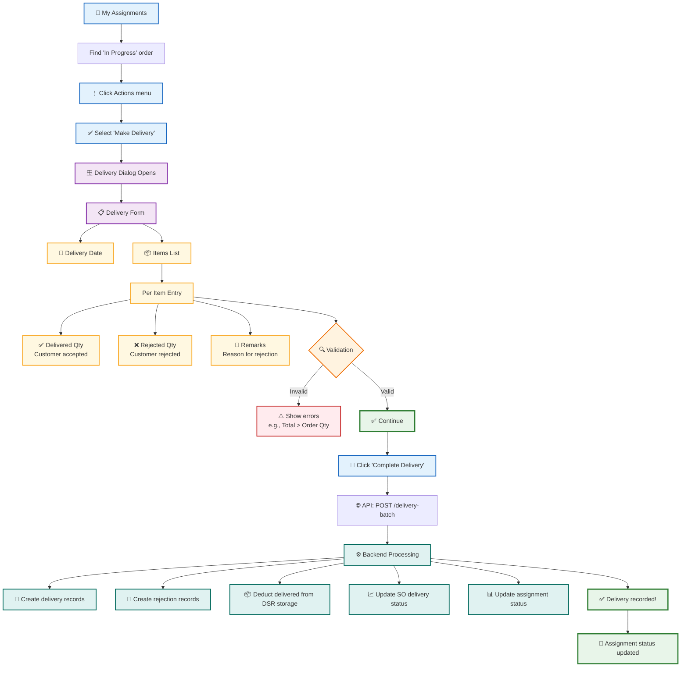

### 6.2 Collecting Payment

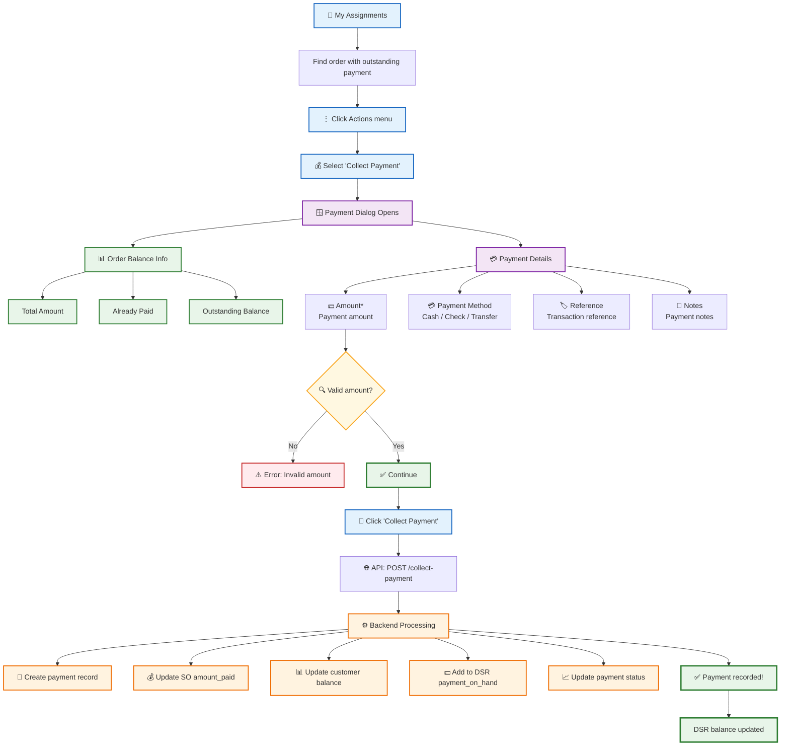

---

## 7. DSR Settlement Workflow

### 7.1 Recording Payment Settlement

**Overview**: Admin collects cash from DSR and records the settlement, reducing DSR's payment_on_hand balance.

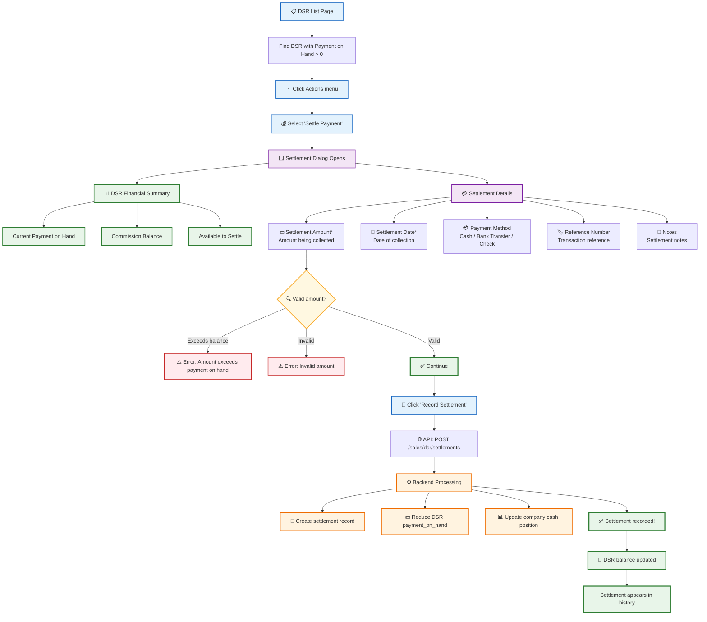

### 7.2 Settlement History

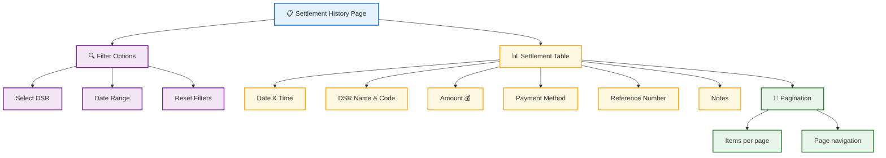

---

## 8. DSR Dashboard & Reporting

### 8.1 DSR Dashboard (DSR User View)

```mermaid
flowchart TD
    A["📱 DSR Dashboard"] --> B["📊 Statistics Cards"]
    B --> B1["💰 Payment on Hand<br/>Current cash holding"]
    B --> B2["💳 Total Outstanding<br/>Yet to collect"]
    B --> B3["✅ Commission Earned<br/>Commission balance"]
    
    A --> C["📈 Activity Summary"]
    C --> C1["Collection Today"]
    C --> C2["Pending Deliveries"]
    C --> C3["Completed Today"]
    C --> C4["Total Deliveries"]
    
    A --> D["📋 Recent Assignments"]
    D --> D1["Last 5 assignments"]
    D --> D2["Order number link"]
    D --> D3["Customer name"]
    D --> D4["Status badge"]
    
    A --> E["⚡ Quick Actions"]
    E --> E1["🔗 My Assignments"]
    E --> E2["📦 My Inventory"]
    E --> E3["🏢 DSR Storage"]
    
    A --> F["💵 Financial Summary"]
    F --> F1["Active Assignments"]
    F --> F2["Current Cash Hand"]
    F --> F3["Remaining to Collect"]
    F --> F4["Commission Balance"]
    
    %% Styling
    classDef dashboard fill:#e3f2fd,stroke:#1565c0,stroke-width:2px
    classDef stats fill:#fff8e1,stroke:#f9a825,stroke-width:2px
    classDef activity fill:#e8f5e9,stroke:#2e7d32,stroke-width:2px
    classDef table fill:#f3e5f5,stroke:#7b1fa2,stroke-width:2px
    classDef actions fill:#fff3e0,stroke:#ef6c00,stroke-width:2px
    classDef finance fill:#e0f2f1,stroke:#00695c,stroke-width:2px
    
    class A dashboard
    class B,B1,B2,B3 stats
    class C,C1,C2,C3,C4 activity
    class D,D1,D2,D3,D4 table
    class E,E1,E2,E3 actions
    class F,F1,F2,F3,F4 finance
```

### 8.2 My Inventory Page (DSR View)

```mermaid
flowchart TD
    A["📦 My Inventory Page"] --> B["🔍 Search Products"]
    B --> B1["Search by name/code"]
    B --> B2["Debounce 300ms"]
    
    A --> C["📋 Inventory Table"]
    C --> C1["Product Name & Code"]
    C --> C2["Variant Name"]
    C --> C3["Quantity<br/>Badge with color"]
    C --> C4["Unit"]
    C --> C5["Storage Name"]
    
    A --> D["📄 Pagination"]
    D --> D1["20 items per page"]
    D --> D2["Page navigation"]
    
    A --> E["⚠️ No Storage Alert"]
    E --> E1["Show if no storage assigned"]
    E --> E2["Contact admin message"]
    
    A --> F["📭 Empty State"]
    F --> F1["No stock message"]
    F --> F2["Link to My Assignments"]
    
    %% Styling
    classDef page fill:#e3f2fd,stroke:#1565c0,stroke-width:2px
    classDef search fill:#f3e5f5,stroke:#7b1fa2,stroke-width:2px
    classDef table fill:#fff8e1,stroke:#f9a825,stroke-width:2px
    classDef data fill:#e8f5e9,stroke:#2e7d32,stroke-width:2px
    classDef alert fill:#ffebee,stroke:#c62828,stroke-width:2px
    classDef empty fill:#fff3e0,stroke:#ef6c00,stroke-width:2px
    
    class A page
    class B,B1,B2 search
    class C,C1,C2,C3,C4,C5 table
    class D,D1,D2 data
    class E,E1,E2 alert
    class F,F1,F2 empty
```

---

## 9. Data Models

### 9.1 Entity Relationship

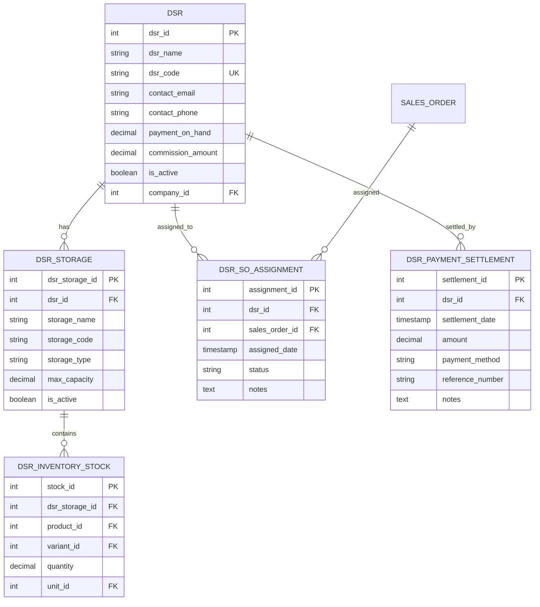

### 9.2 Status Definitions

| Entity | Status Values | Description |
|--------|---------------|-------------|
| **DSR** | Active, Inactive | Whether DSR can be assigned orders |
| **DSR SO Assignment** | assigned, in_progress, completed | Assignment lifecycle |
| **Sales Order (is_loaded)** | true, false | Whether order is loaded to DSR van |
| **Sales Order (delivery_status)** | Pending, Partial, Delivered | Delivery progress |
| **Sales Order (payment_status)** | Unpaid, Partial, Paid | Payment collection progress |

---

## Quick Reference: Common Actions

| Action | Who | Path | Key Points |
|--------|-----|------|------------|
| **Create DSR** | Admin | DSR → Add DSR | Unique code required |
| **Create Storage** | Admin | DSR Storage → Add | Link to existing DSR |
| **Assign SO** | Admin | Sales → Assign to DSR | DSR must have storage |
| **Load Order** | DSR | My Assignments → Load | Transfers stock to van |
| **Make Delivery** | DSR | My Assignments → Deliver | Record accepted/rejected |
| **Collect Payment** | DSR | My Assignments → Payment | Updates DSR balance |
| **Settle Payment** | Admin | DSR → Settle Payment | Reduces DSR on-hand |
| **Process Return** | DSR | My Assignments → Return | Handle rejected items |

---

## API Endpoints Reference

| Endpoint | Method | Purpose |
|----------|--------|---------|
| `/dsr` | GET, POST | List/create DSRs |
| `/dsr/{id}` | GET, PATCH, DELETE | Manage single DSR |
| `/dsr-storage` | GET, POST | List/create storage |
| `/dsr-so-assignments` | GET, POST | List/create assignments |
| `/dsr-so-assignments/{id}/load` | POST | Load SO to DSR |
| `/dsr-so-assignments/{id}/unload` | POST | Unload SO from DSR |
| `/dsr-so-assignments/{id}/deliver` | POST | Mark delivered |
| `/dsr-so-assignments/{id}/collect-payment` | POST | Record payment |
| `/sales/dsr/settlements` | GET, POST | Settlement history |
| `/dsr-my-inventory-stock` | GET | DSR's current stock |
| `/dsr-summary` | GET | DSR dashboard stats |
| `/dsr-my-assignments` | GET | DSR's assignments |
