# Expense Module - User Manual Flow Diagrams

## Table of Contents
1. [Overview](#overview)
2. [Expense Module Entry Point](#1-expense-module-entry-point)
3. [Expense Creation Workflow](#2-expense-creation-workflow)
4. [Expense Listing & Search](#3-expense-listing--search)
5. [Expense Edit/Update Workflow](#4-expense-editupdate-workflow)
6. [Expense Deletion Workflow](#5-expense-deletion-workflow)
7. [Expense Category Management](#6-expense-category-management)
8. [Expense Reports & Analytics](#7-expense-reports--analytics)
9. [Data Models](#8-data-models)

---

## Overview

The Expense Module is a comprehensive expense tracking and management system within Shoudagor ERP. It enables businesses to record, categorize, analyze, and report on all business expenditures with multi-category support and detailed analytics.

### Key Entities
- **Expense**: Core expense record (title, amount, date, payment method, description)
- **Expense Category**: Classification system for organizing expenses (supports multi-category tagging)
- **Payment Method**: How the expense was paid (cash, card, bank)
- **Expense Statistics**: Aggregated data for dashboard insights
- **Expense Reports**: Detailed analytics including trends, patterns, and breakdowns

---

## 1. Expense Module Entry Point

### User Journey Overview

```mermaid
flowchart TD
    %% User Entry
    A["👤 User logs into Shoudagor ERP"] --> B{"📍 Where do you want to go?"}
    
    %% Navigation Options
    B -->|Click 'Expenses'<br/>in main menu| C["💰 Expenses Listing Page"]
    B -->|Click 'Expense Categories'<br/>in main menu| D["📁 Expense Categories Page"]
    B -->|Click 'Reports → Expenses'<br/>in main menu| E["📊 Expense Reports Page"]
    
    %% Expenses Page Components
    C --> C1["📊 Expenses Table"]
    C --> C2["🔍 Filter Panel"]
    C --> C3["📈 Statistics Cards"]
    C --> C4["⚡ Quick Action Buttons"]
    
    %% Table Columns
    C1 --> C1a["Title<br/>Expense Description"]
    C1 --> C1b["Categories<br/>Multiple category tags"]
    C1 --> C1c["Amount<br/>Expense value in BDT"]
    C1 --> C1d["Payment Method<br/>Cash/Card/Bank"]
    C1 --> C1e["Expense Date<br/>When incurred"]
    
    %% Statistics Cards
    C3 --> C3a["Total Expenses<br/>Count of all expenses"]
    C3 --> C3b["Total Amount<br/>Sum of all expenses"]
    C3 --> C3c["Average Amount<br/>Mean expense value"]
    C3 --> C3d["Top Category<br/>Highest spend category"]
    
    %% Filters
    C2 --> C2a["📂 Categories<br/>Multi-select filter"]
    C2 --> C2b["💳 Payment Method<br/>Cash/Card/Bank"]
    C2 --> C2c["📅 Date Range<br/>From/To picker"]
    C2 --> C2d["💰 Amount Range<br/>Min/Max slider"]
    
    %% Action Buttons
    C4 --> C4a["➕ Add Expense"]
    
    %% Row Actions
    C --> C5["⋮ Actions Menu (per row)"]
    C5 --> C5a["✏️ Edit Expense"]
    C5 --> C5b["🗑️ Delete Expense"]
    
    %% Expense Categories Page
    D --> D1["📁 Categories Table"]
    D --> D2["➕ Add Category Button"]
    D --> D3["🔍 Search Categories"]
    
    %% Reports Page
    E --> E1["📊 Category Breakdown Chart"]
    E --> E2["📈 Monthly Trend Chart"]
    E --> E3["📅 Daily Pattern Chart"]
    E --> E4["📊 Weekly Trend Chart"]
    E --> E5["🏆 Top Expenses Table"]
    
    %% Styling
    classDef userAction fill:#e1f5ff,stroke:#01579b,stroke-width:2px
    classDef page fill:#fff8e1,stroke:#ff6f00,stroke-width:2px
    classDef component fill:#f3e5f5,stroke:#7b1fa2,stroke-width:2px
    classDef data fill:#e8f5e9,stroke:#2e7d32,stroke-width:2px
    
    class A,B,C,D,E userAction
    class C1,D1,E1 page
    class C2,C3,C4,C5,D2,D3 component
    class C1a,C1b,C1c,C1d,C1e,C2a,C2b,C2c,C2d,C3a,C3b,C3c,C3d,C4a,C5a,C5b data
```

### How to Navigate the Expenses Page

1. **Getting There**: Click "Expenses" in the left sidebar menu after logging in
2. **What You See**: A dashboard with statistics cards at the top, followed by a filter panel and expenses table
3. **Quick Actions**: Use the "Add Expense" button to create new expenses
4. **Row Actions**: Click the "⋮" (three dots) on any row to edit or delete that expense

### UI Elements - Expenses List Page

| Component | Type | Description |
|-----------|------|-------------|
| Statistics Cards | Info Cards | Total Expenses, Total Amount, Average Amount, Top Category |
| Categories Filter | Multi-Select | Select multiple expense categories to filter |
| Payment Method Filter | Dropdown | Filter by cash, card, or bank |
| Date Range | Date Picker | Select from/to dates for filtering |
| Amount Range | Slider | Min/Max amount range filter |
| Add Expense | Button | Navigate to expense creation page |
| Expenses Table | Data Table | Paginated list with sorting |
| Actions Menu | Dropdown | Edit, Delete options per expense |

---

## 2. Expense Creation Workflow

### 2.1 Step-by-Step: Creating a New Expense

**Overview**: This workflow guides you through recording a new business expense with multi-category support.

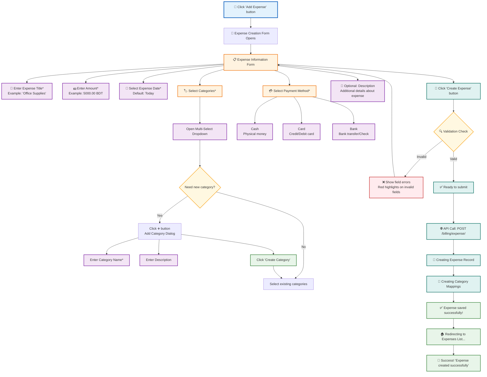

### 2.2 Field Requirements & Validation

| Field | Required | Validation Rules |
|-------|----------|------------------|
| Title | Yes | Min 1 character, max 255 |
| Amount | Yes | Number > 0, max 18 digits with 2 decimals |
| Expense Date | Yes | Valid date, not future date |
| Categories | Yes | At least one category must be selected |
| Payment Method | Yes | Must be 'cash', 'card', or 'bank' |
| Description | No | Max 500 characters |

### 2.3 Multi-Category Selection Flow

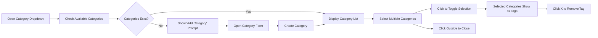

### 💡 Tips for Expense Creation

1. **Be Descriptive**: Use clear titles like "Q1 Office Stationery" instead of just "Supplies"
2. **Multi-Category**: Tag expenses with multiple categories for better reporting (e.g., "Travel" + "Marketing")
3. **Payment Method**: Choose accurately for cash flow tracking
4. **Date Accuracy**: Record the actual expense date, not the entry date

---

## 3. Expense Listing & Search

### 3.1 How the Expenses Page Loads

**What happens when you open the Expenses page:**

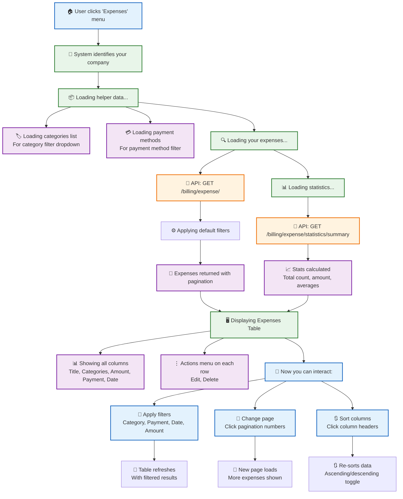

### 📱 Quick Guide: Finding Expenses

| What you want to do | How to do it |
|---------------------|--------------|
| **Filter by category** | Use the "Categories" multi-select dropdown |
| **Filter by payment method** | Use the "Payment Method" dropdown |
| **Filter by date range** | Use the date pickers to select from/to dates |
| **Filter by amount** | Use the amount range slider |
| **Sort by amount** | Click the "Amount" column header |
| **View more expenses** | Click page numbers at the bottom |
| **Edit an expense** | Click the "⋮" (three dots) on that row → Edit |
| **Delete an expense** | Click the "⋮" (three dots) on that row → Delete |

### 3.2 Filter Architecture

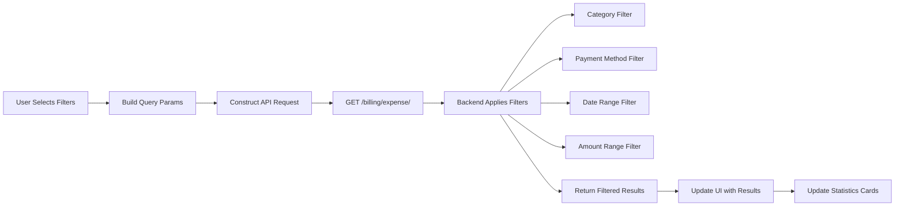

### 3.3 Table Columns Display

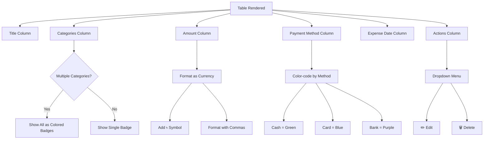

---

## 4. Expense Edit/Update Workflow

### 4.1 Editing an Expense

**Use this workflow to update an existing expense:**

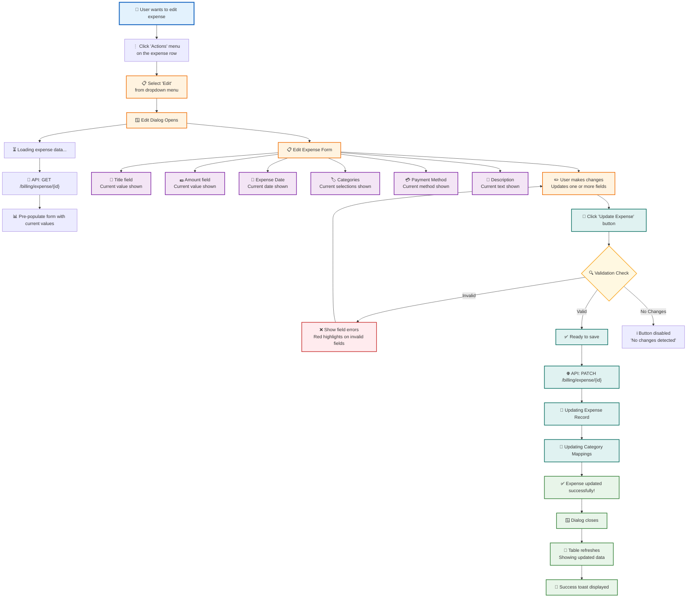

### 4.2 What Can Be Edited

| Field | Editable | Notes |
|-------|----------|-------|
| Title | Yes | Must remain unique and valid |
| Amount | Yes | Must be positive number |
| Expense Date | Yes | Can be past or present date |
| Categories | Yes | Can add/remove categories |
| Payment Method | Yes | Can switch between methods |
| Description | Yes | Optional field |
| Company | No | Fixed to user's company |
| Created Date | No | System-generated |

---

## 5. Expense Deletion Workflow

### 5.1 Deleting an Expense

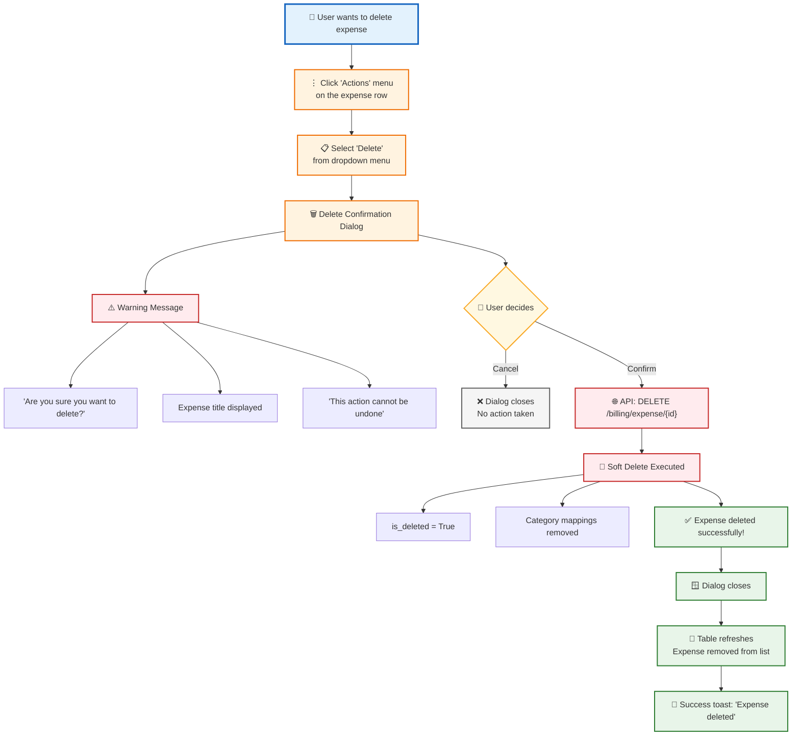

---

## 6. Expense Category Management

### 6.1 Category Management Entry Point

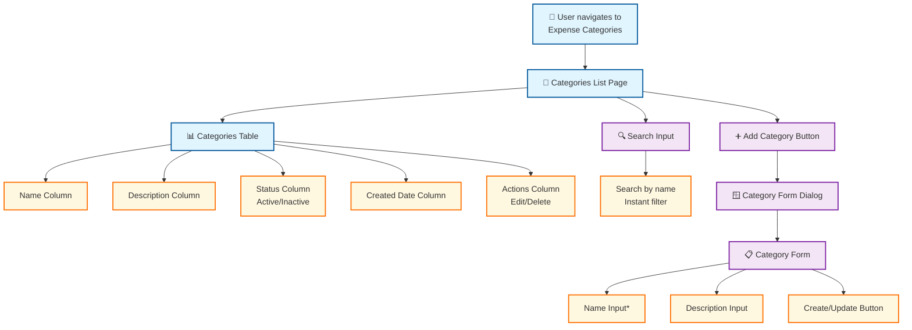

### 6.2 Creating a New Category

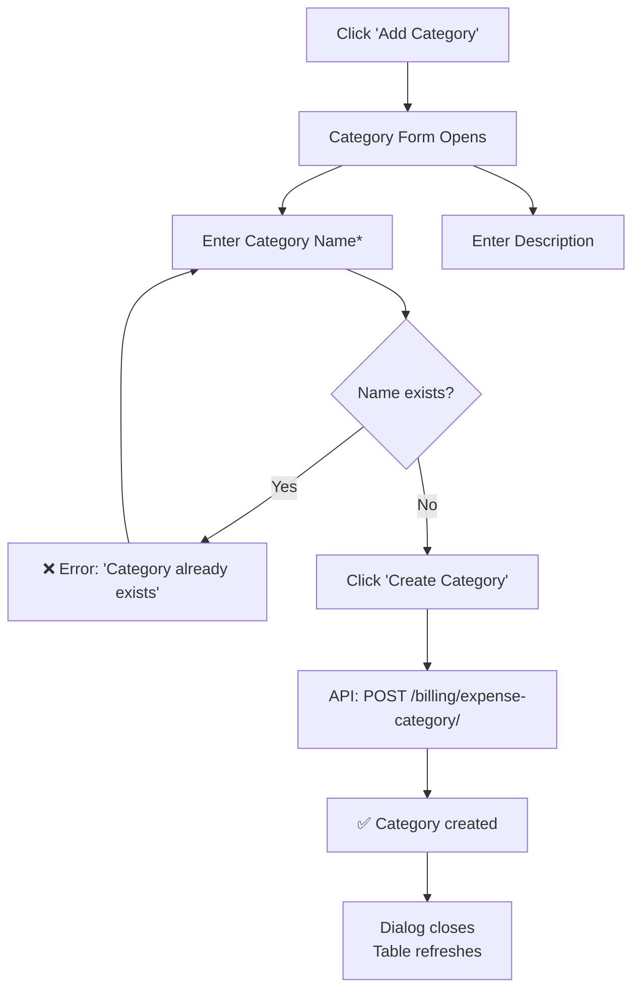

### 6.3 Category Usage in Expenses

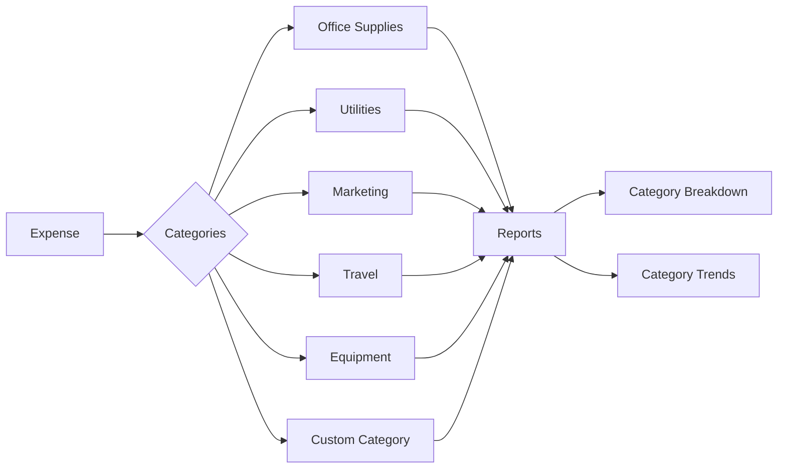

---

## 7. Expense Reports & Analytics

### 7.1 Reports Dashboard Overview

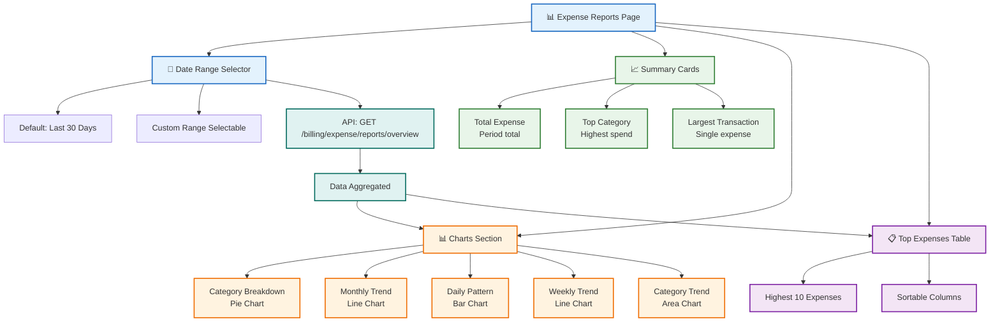

### 7.2 Report Data Flow

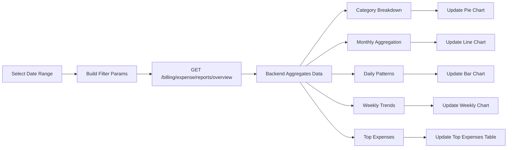

### 7.3 Available Reports

| Report | Type | Description |
|--------|------|-------------|
| Category Breakdown | Pie Chart | Spending distribution by category |
| Monthly Trend | Line Chart | Spending over months |
| Daily Pattern | Bar Chart | Spending by day of week |
| Weekly Trend | Line Chart | Spending by week |
| Category Trend | Area Chart | Category spending over time |
| Top Expenses | Table | Highest individual expenses |

---

## 8. Data Models

### 8.1 Expense Entity

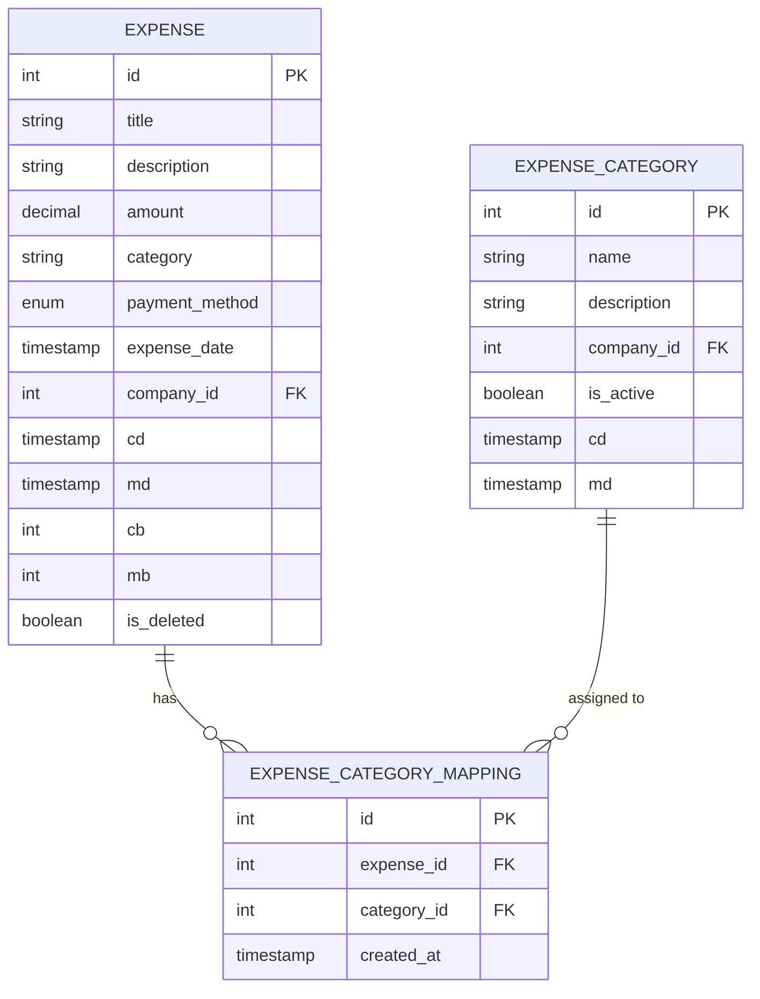

### 8.2 Expense Schema Definition

```typescript
// Expense Base Schema
interface Expense {
  id: number;
  title: string;
  description?: string;
  amount: number;
  category?: string;           // Legacy single category
  categories: ExpenseCategory[]; // Multi-category support
  category_ids: number[];
  payment_method: 'cash' | 'card' | 'bank';
  expense_date: string;        // ISO date string
  company_id: number;
  cd: string;                  // Created date
  md: string;                  // Modified date
}

// Expense Category Schema
interface ExpenseCategory {
  id: number;
  name: string;
  description?: string;
  is_active: boolean;
  company_id: number;
}

// Filter Parameters
interface ExpenseFilterParams {
  categories?: string[];
  payment_method?: 'cash' | 'card' | 'bank';
  expense_date_start?: string;
  expense_date_end?: string;
  amount_min?: number;
  amount_max?: number;
}

// Statistics Response
interface ExpenseStatistics {
  total_count: number;
  total_amount: number;
  average_amount: number;
  category_breakdown: Record<string, number>;
  payment_method_breakdown: Record<string, number>;
}

// Report Response
interface ExpenseReportsResponse {
  category_breakdown: Array<{
    category: string;
    total_amount: number;
    transaction_count: number;
  }>;
  monthly_trend: Array<{
    month: string;
    total_amount: number;
  }>;
  daily_pattern: Array<{
    day_of_week: number;
    day_name: string;
    total_amount: number;
  }>;
  weekly_trend: Array<{
    week_start: string;
    total_amount: number;
  }>;
  top_expenses: Expense[];
  category_trend: Array<{
    month: string;
    category: string;
    total_amount: number;
  }>;
}
```

### 8.3 API Endpoints

| Method | Endpoint | Description |
|--------|----------|-------------|
| GET | `/api/company/billing/expense/` | List expenses with filters |
| POST | `/api/company/billing/expense/` | Create new expense |
| GET | `/api/company/billing/expense/{id}` | Get single expense |
| PATCH | `/api/company/billing/expense/{id}` | Update expense |
| DELETE | `/api/company/billing/expense/{id}` | Delete expense |
| GET | `/api/company/billing/expense/statistics/summary` | Get statistics |
| GET | `/api/company/billing/expense/reports/overview` | Get reports data |
| GET | `/api/company/billing/expense-category/` | List categories |
| POST | `/api/company/billing/expense-category/` | Create category |
| GET | `/api/company/billing/expense-category/{id}` | Get single category |
| PATCH | `/api/company/billing/expense-category/{id}` | Update category |
| DELETE | `/api/company/billing/expense-category/{id}` | Delete category |

---

## Summary

The Expense Module provides a complete solution for tracking and analyzing business expenses:

1. **Easy Recording**: Quick expense entry with multi-category support
2. **Flexible Categorization**: Tag expenses with multiple categories for detailed tracking
3. **Comprehensive Filtering**: Filter by category, payment method, date, and amount
4. **Visual Analytics**: Charts and graphs for spending insights
5. **Detailed Reports**: Category breakdowns, trends, and patterns
6. **Soft Delete**: Safe deletion with recovery possibility

For support or questions, contact your system administrator.
