# Inventory Module - User Manual Flow Diagrams

## Table of Contents
1. [Overview](#overview)
2. [Inventory Module Entry Point](#1-inventory-module-entry-point)
3. [Inventory Stock View & Search](#2-inventory-stock-view--search)
4. [Stock Transfer Workflow](#3-stock-transfer-workflow)
5. [Inventory Adjustment Workflow](#4-inventory-adjustment-workflow)
6. [Single Item Stock Transfer](#5-single-item-stock-transfer)
7. [Bulk Stock Transfer](#6-bulk-stock-transfer)
8. [Inventory Reports & Analytics](#7-inventory-reports--analytics)
9. [Data Models](#8-data-models)

---

## Overview

The Inventory Module manages all stock-related operations in Shoudagor ERP. It tracks inventory across multiple warehouse locations, enables stock transfers between locations, handles inventory adjustments, and provides comprehensive stock visibility and reporting.

### Key Entities
- **Inventory Stock**: Current stock quantities at specific locations
- **Stock Transfer**: Movement of stock between warehouse locations
- **Inventory Adjustment**: Manual corrections to stock quantities
- **Storage Location**: Physical places where inventory is stored (warehouses, shelves, bins)
- **Inventory Transaction**: Record of all stock movements (in, out, transfers, adjustments)

### Core Functions
- **View Inventory**: See stock levels across all locations
- **Stock Transfer**: Move inventory between locations
- **Adjust Stock**: Correct inventory quantities manually
- **Track History**: View all inventory transactions
- **Monitor Levels**: Check reorder points and safety stock

---

## 1. Inventory Module Entry Point

### User Journey Overview

```mermaid
flowchart TD
    %% User Entry
    A["👤 User logs into Shoudagor ERP"] --> B{"📍 Where do you want to go?"}
    
    %% Navigation Options
    B -->|Click 'Inventory'<br/>in main menu| C["📦 Inventory Stock Page"]
    B -->|Click 'Stock Transfer'<br/>in main menu| D["🚚 Stock Transfer Page"]
    B -->|Click 'Adjustments'<br/>in main menu| E["⚖️ Inventory Adjustments Page"]
    B -->|Click 'Warehouses'<br/>in main menu| F["🏭 Warehouse Management"]
    
    %% Inventory Stock Page Components
    C --> C1["📊 Inventory Stock Table"]
    C --> C2["🔍 Search & Filter Panel"]
    C --> C3["⚡ Quick Action Buttons"]
    
    %% Table Columns
    C1 --> C1a["Product Name<br/>What item is this"]
    C1 --> C1b["SKU<br/>Stock Keeping Unit"]
    C1 --> C1c["Variant<br/>Size, Color, Type"]
    C1 --> C1d["Location<br/>Where it's stored"]
    C1 --> C1e["Quantity<br/>Current stock count"]
    C1 --> C1f["Unit<br/>Pieces, kg, liters..."]
    C1 --> C1g["Last Stock Take<br/>When counted"]
    
    %% Search & Filters
    C2 --> C2a["🔎 Search by product name<br/>(instant search)"]
    C2 --> C2b["📂 Filter by Location"]
    C2 --> C2c["📦 Filter by Product"]
    C2 --> C2d["🎨 Filter by Variant"]
    
    %% Action Buttons
    C3 --> C3a["🚚 Transfer Stock"]
    C3 --> C3b["⚖️ Adjust Stock"]
    C3 --> C3c["📥 Export Stock Report"]
    
    %% Row Actions
    C --> C4["⋮ Actions Menu (per row)"]
    C4 --> C4a["🚚 Transfer This Stock"]
    C4 --> C4b["⚖️ Adjust Quantity"]
    C4 --> C4c["📋 View Transaction History"]
    
    %% Stock Transfer Page
    D --> D1["📋 Transfer List Table"]
    D --> D2["➕ Create Transfer Button"]
    D --> D3["🔍 Filter Transfers"]
    
    %% Adjustment Page
    E --> E1["📋 Adjustments List"]
    E --> E2["➕ Create Adjustment"]
    
    %% Styling
    classDef userAction fill:#e1f5ff,stroke:#01579b,stroke-width:2px
    classDef page fill:#fff8e1,stroke:#ff6f00,stroke-width:2px
    classDef component fill:#f3e5f5,stroke:#7b1fa2,stroke-width:2px
    classDef data fill:#e8f5e9,stroke:#2e7d32,stroke-width:2px
    
    class A,B,C,D,E,F userAction
    class C1,D1,E1 page
    class C2,C3,C4,D2,D3,E2 component
    class C1a,C1b,C1c,C1d,C1e,C1f,C1g,C2a,C2b,C2c,C2d,C3a,C3b,C3c,C4a,C4b,C4c data
```

### How to Navigate the Inventory Page

1. **Getting There**: Click "Inventory" in the left sidebar menu after logging in
2. **What You See**: A table showing all inventory items across all locations
3. **Quick Actions**: Use buttons at the top for transfers, adjustments, and exports
4. **Row Actions**: Click the "⋮" (three dots) on any row to perform actions on that specific stock item

### UI Elements - Inventory Stock Page

| Component | Type | Description |
|-----------|------|-------------|
| Search Input | Text Field | Debounced search (500ms) by product name |
| Location Filter | Dropdown | Filter by warehouse location |
| Product Filter | Dropdown | Filter by specific product |
| Variant Filter | Dropdown | Filter by product variant |
| Transfer Stock | Button | Navigate to stock transfer page |
| Adjust Stock | Button | Open adjustment dialog |
| Export | Button | Download inventory report as Excel |
| Inventory Table | Data Table | Paginated list with sorting |
| Actions Menu | Dropdown | Transfer, Adjust, View History |

---

## 2. Inventory Stock View & Search

### 2.1 How the Inventory Page Loads

**What happens when you open the Inventory page:**

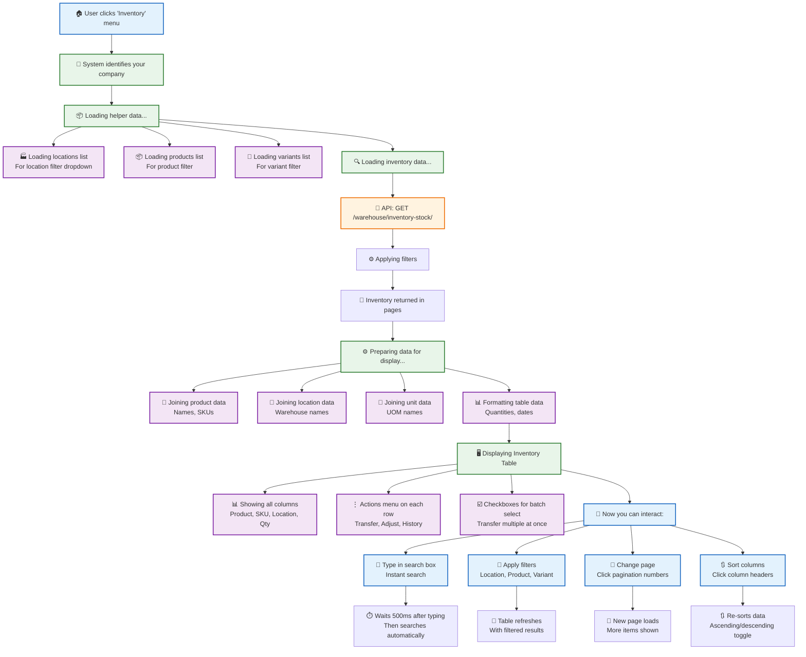

### 📱 Quick Guide: Finding Inventory

| What you want to do | How to do it |
|---------------------|--------------|
| **Search by product** | Type in the search box - results appear instantly |
| **Filter by location** | Click the "Location" dropdown and select warehouse |
| **Find low stock** | Sort by "Quantity" column (ascending) |
| **View by product** | Use the "Product" filter dropdown |
| **Transfer stock** | Click "⋮" on row → Transfer This Stock |
| **Adjust quantity** | Click "⋮" on row → Adjust Quantity |

### 2.2 Inventory Stock Table Columns

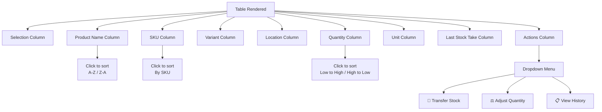

---

## 3. Stock Transfer Workflow

### 3.1 Step-by-Step: Creating a Stock Transfer

**Overview**: This workflow guides you through transferring inventory from one location to another.

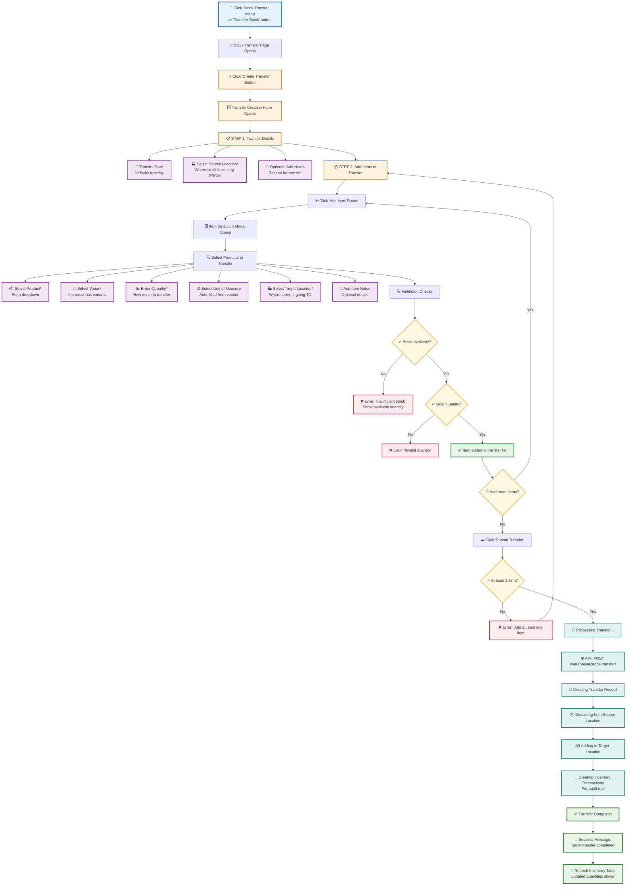

### 💡 Tips for Stock Transfers

1. **Check Stock First**: Verify available quantity in source location before transferring
2. **Same Company**: Source and target locations must belong to your company
3. **Batch Tracking**: If batch tracking is enabled, batches are automatically transferred
4. **UOM Conversion**: Quantities are automatically converted to base UOM
5. **Audit Trail**: Every transfer creates transaction records for tracking

### 3.2 Stock Transfer Status Flow

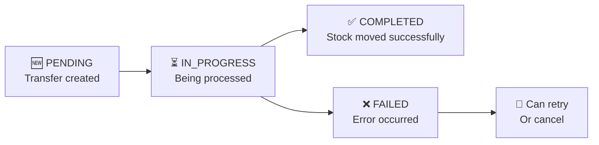

---

## 4. Inventory Adjustment Workflow

### 4.1 Step-by-Step: Creating an Inventory Adjustment

**Overview**: Use this workflow to manually adjust stock quantities (for damaged goods, stock takes, corrections).

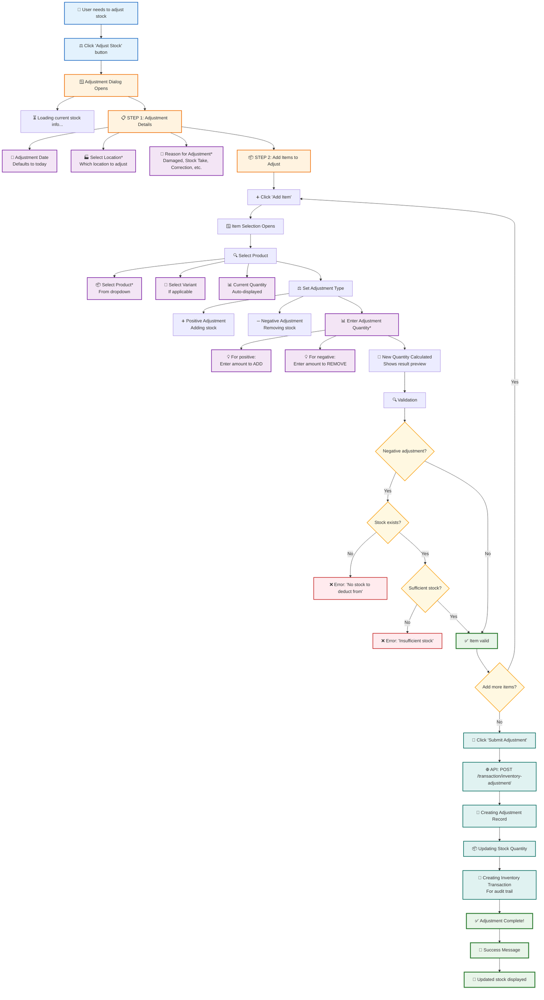

### 💡 When to Use Adjustments

| Scenario | Adjustment Type | Example |
|----------|----------------|---------|
| **Damaged goods** | Negative | 10 items broken, reduce by 10 |
| **Stock take surplus** | Positive | Found 5 extra items, add 5 |
| **Stock take shortage** | Negative | Missing 3 items, reduce by 3 |
| **Initial stock setup** | Positive | Adding opening balance |
| **Data correction** | Positive/Negative | Fix wrongly entered quantity |

### ⚠️ Important Notes

- **Negative Adjustments**: Require existing stock - cannot deduct from zero
- **Batch Tracking**: If enabled, batch quantities are also adjusted
- **Audit Trail**: All adjustments create transaction records with reasons
- **Permissions**: Some users may need approval for large adjustments

---

## 5. Single Item Stock Transfer

### 5.1 Quick Transfer from Inventory Row

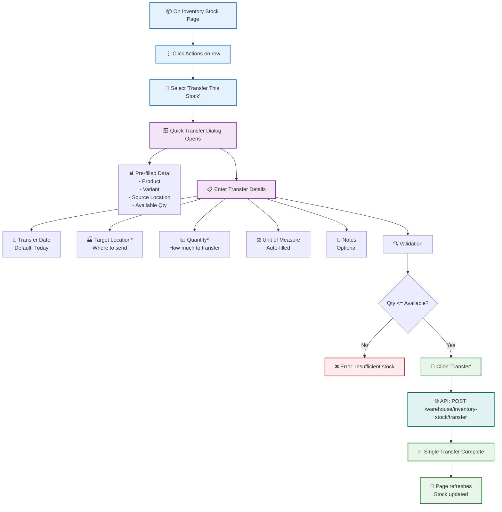

---

## 6. Bulk Stock Transfer

### 6.1 Transferring Multiple Items at Once

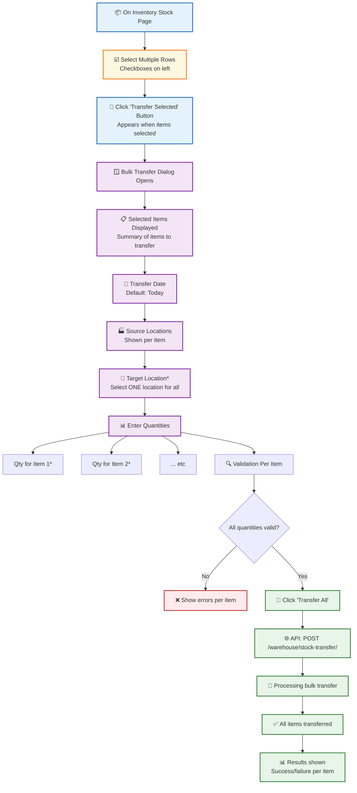

---

## 7. Inventory Reports & Analytics

### 7.1 Available Reports

```mermaid
flowchart TD
    A["📊 Inventory Reports Menu"] --> B["📦 Stock Summary Report"]
    A --> C["🚚 Stock Transfer Report"]
    A --> D["⚖️ Adjustment Report"]
    A --> E["📈 Transaction History"]
    A --> F["🔔 Low Stock Alert"]
    
    B --> B1["Current stock by location"]
    B --> B2["Stock value calculation"]
    B --> B3["Export to Excel"]
    
    C --> C1["All transfers with dates"]
    C --> C2["Source → Target summary"]
    C --> C3["Filter by date range"]
    
    D --> D1["All adjustments with reasons"]
    D --> D2["Positive vs Negative"]
    D --> D3["Filter by adjustment type"]
    
    E --> E1["Every stock movement"]
    E --> E2["Transaction type filter<br/>IN, OUT, TRANSFER, ADJUST"]
    E --> E3["Audit trail for compliance"]
    
    F --> F1["Items below reorder level"]
    F --> F2["Items at safety stock"]
    F --> F3["Export alert list"]
```

### 7.2 Exporting Inventory Data

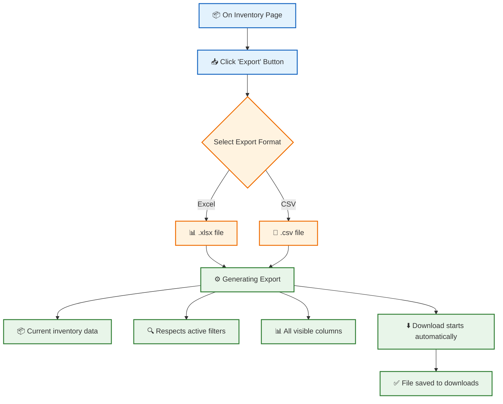

---

## 8. Data Models

### 8.1 Inventory Entity Relationships

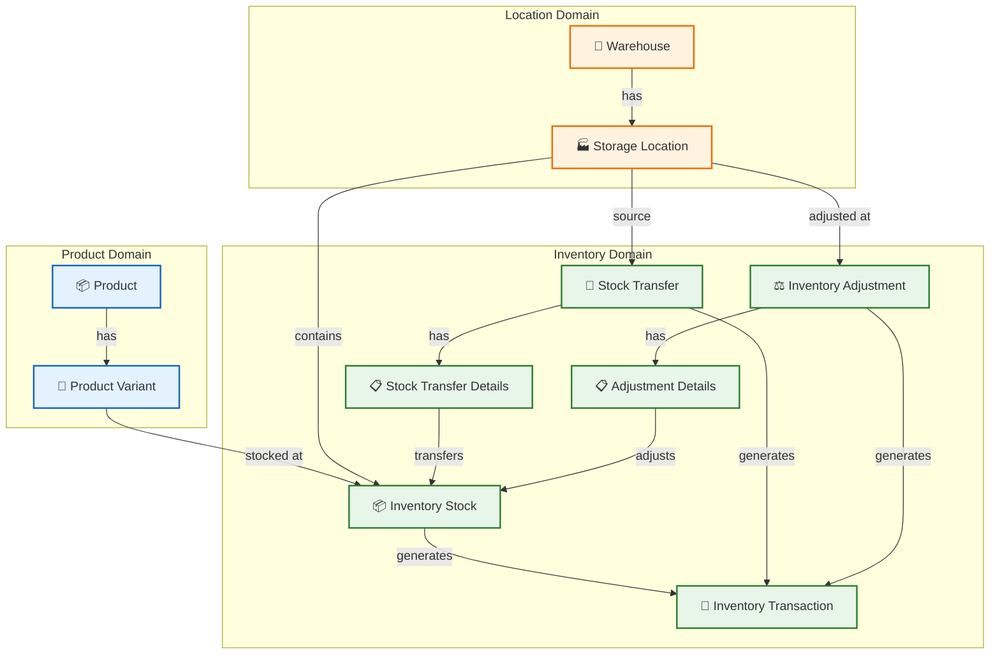

### 8.2 Key Fields Reference

#### Inventory Stock
| Field | Type | Description |
|-------|------|-------------|
| stock_id | Integer | Unique identifier |
| product_id | Integer | Reference to Product |
| variant_id | Integer | Reference to ProductVariant (optional) |
| location_id | Integer | Reference to StorageLocation |
| quantity | Decimal | Current stock quantity |
| uom_id | Integer | Unit of Measure |
| last_stock_take_date | DateTime | Last physical count |

#### Stock Transfer
| Field | Type | Description |
|-------|------|-------------|
| transfer_id | Integer | Unique identifier |
| transfer_code | String | Human-readable code |
| transfer_date | DateTime | When transfer occurred |
| source_location_id | Integer | Origin location |
| status | String | PENDING, COMPLETED, FAILED |
| notes | Text | Additional information |

#### Inventory Adjustment
| Field | Type | Description |
|-------|------|-------------|
| adjustment_id | Integer | Unique identifier |
| adjustment_code | String | Human-readable code |
| adjustment_date | DateTime | When adjustment made |
| location_id | Integer | Where adjustment applied |
| reason | String | Why adjustment was made |

### 8.3 Inventory Transaction Types

| Transaction Type | Description | When Created |
|------------------|-------------|------------|
| **STOCK_IN** | Stock received | Purchase receipts, production |
| **STOCK_OUT** | Stock shipped | Sales, consumption |
| **STOCK_TRANSFER_OUT** | Left source location | Stock transfers |
| **STOCK_TRANSFER_IN** | Arrived at destination | Stock transfers |
| **ADJUSTMENT** | Manual correction | Inventory adjustments |

---

## Common Questions

### Q: Can I transfer stock between different companies?
**A**: No, stock transfers are only allowed between locations within the same company.

### Q: What happens if I try to transfer more than available?
**A**: The system will show an error: "Insufficient stock" and display the available quantity.

### Q: Can I undo a stock transfer?
**A**: No, but you can create a reverse transfer going the opposite direction.

### Q: Why can't I adjust stock to negative?
**A**: The system prevents negative inventory. You can only deduct existing stock.

### Q: What's the difference between Transfer and Adjustment?
**A**: Transfer moves stock between locations (quantity stays same). Adjustment changes quantity at a location.

---

## API Endpoints Reference

### Inventory Stock
- `GET /warehouse/inventory-stock/` - List inventory stock
- `POST /warehouse/inventory-stock/` - Create stock record
- `PATCH /warehouse/inventory-stock/{id}` - Update stock
- `DELETE /warehouse/inventory-stock/{id}` - Delete stock

### Stock Transfer
- `GET /warehouse/stock-transfer/` - List transfers
- `POST /warehouse/stock-transfer/` - Create transfer
- `GET /warehouse/stock-transfer/{id}` - Get transfer details
- `POST /warehouse/inventory-stock/transfer` - Single item transfer

### Inventory Adjustment
- `GET /transaction/inventory-adjustment/` - List adjustments
- `POST /transaction/inventory-adjustment/` - Create adjustment
- `GET /transaction/inventory-adjustment/{id}` - Get adjustment details

---

*Document Version: 1.0 | Shoudagor ERP Inventory Module*
