# Product Module - User Manual Flow Diagrams

## Table of Contents
1. [Overview](#overview)
2. [Product Module Entry Point](#1-product-module-entry-point)
3. [Product Creation Workflow](#2-product-creation-workflow)
4. [Product Listing & Search](#3-product-listing--search)
5. [Product Edit/Update Workflow](#4-product-editupdate-workflow)
6. [Product Import Workflow](#5-product-import-workflow)
7. [Variant Management Workflow](#6-variant-management-workflow)
8. [Price Management Workflow](#7-price-management-workflow)
9. [Product Group Management](#8-product-group-management)
10. [Image Management Workflow](#9-image-management-workflow)
11. [Product Category Management](#10-product-category-management)
12. [Unit of Measure Management](#11-unit-of-measure-management)
13. [Data Models](#12-data-models)

---

## Overview

The Product Module is the central inventory management system of Shoudagor ERP. It manages the complete product lifecycle including master data, variants, pricing, categorization, grouping, and media assets.

### Key Entities
- **Product**: Master data (name, code, category, description)
- **Product Variant**: Specific SKUs with attributes (size, color, etc.)
- **Product Price**: Multiple price types with effective dates
- **Product Group**: Logical grouping of products
- **Product Category**: Hierarchical classification
- **Product Image**: Media assets linked to variants

---

## 1. Product Module Entry Point

### User Journey Overview


```mermaid
flowchart TD
    %% User Entry
    A["👤 User logs into Shoudagor ERP"] --> B{"📍 Where do you want to go?"}
    
    %% Navigation Options
    B -->|Click 'Products'<br/>in main menu| C["📦 Products Listing Page"]
    B -->|Click 'Product Groups'<br/>in main menu| D["📁 Product Groups Page"]
    B -->|Click 'Categories'<br/>in main menu| E["🏷️ Categories Page"]
    B -->|Click 'Units'<br/>in main menu| F["⚖️ Units of Measure Page"]
    
    %% Products Page Components
    C --> C1["📊 Product Variants Table"]
    C --> C2["🔍 Search & Filter Panel"]
    C --> C3["⚡ Quick Action Buttons"]
    
    %% Table Columns
    C1 --> C1a["SKU<br/>Stock Keeping Unit"]
    C1 --> C1b["Variant<br/>Size, Color, Type"]
    C1 --> C1c["Product Name"]
    C1 --> C1d["Category<br/>Electronics, Clothing..."]
    C1 --> C1e["Product Group<br/>Promotions, Featured..."]
    C1 --> C1f["Stock Info<br/>Quantity, Reorder Level"]
    C1 --> C1g["Pricing<br/>Purchase, Selling Price"]
    C1 --> C1h["Status<br/>Active/Inactive"]
    
    %% Search & Filters
    C2 --> C2a["🔎 Search by name<br/>(instant search)"]
    C2 --> C2b["📂 Filter by Category"]
    C2 --> C2c["✓ Filter by Status"]
    C2 --> C2d["💰 Filter by Price Range"]
    C2 --> C2e["📁 Filter by Product Group"]
    
    %% Action Buttons
    C3 --> C3a["➕ Add Product"]
    C3 --> C3b["📤 Import / 📥 Export"]
    C3 --> C3c["🗑️ Batch Delete"]
    
    %% Row Actions
    C --> C4["⋮ Actions Menu (per row)"]
    C4 --> C4a["✏️ Edit Product"]
    C4 --> C4b["🗑️ Delete Product"]
    C4 --> C4c["➕ Create Variant"]
    C4 --> C4d["📁 Assign to Group"]
    C4 --> C4e["💰 Update Pricing"]
    C4 --> C4f["📸 Manage Images"]
    
    %% Product Groups Page
    D --> D1["📁 Groups Table"]
    D --> D2["➕ Add Group Button"]
    
    %% Styling
    classDef userAction fill:#e1f5ff,stroke:#01579b,stroke-width:2px
    classDef page fill:#fff8e1,stroke:#ff6f00,stroke-width:2px
    classDef component fill:#f3e5f5,stroke:#7b1fa2,stroke-width:2px
    classDef data fill:#e8f5e9,stroke:#2e7d32,stroke-width:2px
    
    class A,B,C,D,E,F userAction
    class C1,D1 page
    class C2,C3,C4,D2 component
    class C1a,C1b,C1c,C1d,C1e,C1f,C1g,C1h,C2a,C2b,C2c,C2d,C2e,C3a,C3b,C3c,C4a,C4b,C4c,C4d,C4e,C4f data
```

### How to Navigate the Products Page

1. **Getting There**: Click "Products" in the left sidebar menu after logging in
2. **What You See**: A table listing all your product variants with filtering options above
3. **Quick Actions**: Use the buttons at the top for common tasks (Add, Import/Export)
4. **Row Actions**: Click the "⋮" (three dots) on any row to edit, delete, or manage that specific product

### UI Elements - Products List Page

| Component | Type | Description |
|-----------|------|-------------|
| Search Input | Text Field | Debounced search (500ms) by product name |
| Category Filter | Dropdown | Select from available categories |
| Status Filter | Dropdown | Active/Inactive filter |
| Price Range | Slider | Min/Max price range filter |
| Product Group Filter | Dropdown | Filter by variant group |
| Add Product | Button | Navigate to creation page |
| Import/Export | Button | Excel import/export functionality |
| Products Table | Data Table | Paginated list with sorting |
| Actions Menu | Dropdown | Edit, Delete, Create Variant, Assign Group, Update Price, Manage Images |

---

## 2. Product Creation Workflow

### 2.1 Step-by-Step: Creating a New Product

**Overview**: This workflow guides you through creating a product with all its variants, pricing, and initial stock in one seamless process.

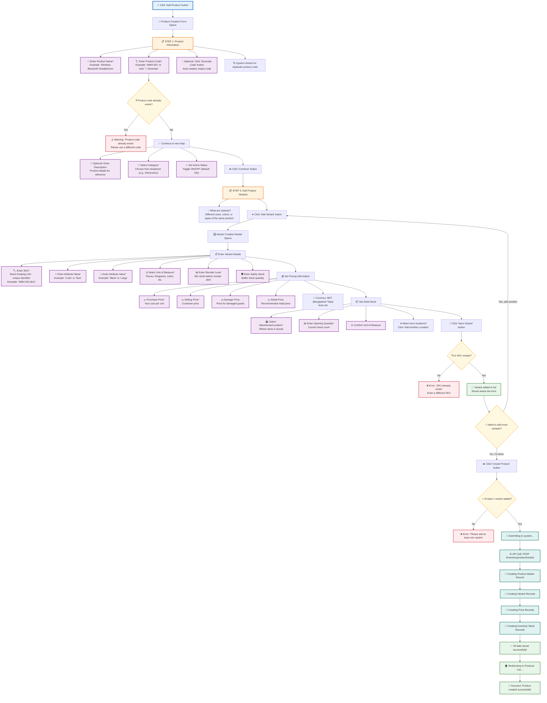
```mermaid
flowchart TD
    %% Start
    A["🚀 Click 'Add Product' button"] --> B["📄 Product Creation Form Opens"]
    
    %% Step 1: Product Information
    B --> C["📋 STEP 1: Product Information"]
    C --> C1["📝 Enter Product Name*<br/>Example: 'Wireless Bluetooth Headphones'"]
    C --> C2["🏷️ Enter Product Code*<br/>Example: 'WBH-001' or click '🎲 Generate'"]
    C --> C3["💡 Optional: Click 'Generate Code' button<br/>Auto-creates unique code"]
    C --> C4["🔍 System checks for duplicate product code"]
    
    %% Duplicate Check
    C2 --> D{"❓ Product code already exists?"}
    D -->|Yes| D1["⚠️ Warning: 'Product code already exists'<br/>Please use a different code"]
    D -->|No| E["✅ Continue to next step"]
    
    %% Additional Fields
    E --> E1["📝 Optional: Enter Description<br/>Product details for reference"]
    E --> E2["📂 Select Category*<br/>Choose from dropdown (e.g., Electronics)"]
    E --> E3["✓ Set Active Status<br/>Toggle ON/OFF (default: ON)"]
    E --> E4["➡️ Click 'Continue' button"]
    
    %% Step 2: Add Variants
    E4 --> F["📦 STEP 2: Add Product Variants"]
    F --> F0["💡 What are variants?<br/>Different sizes, colors, or types of the same product"]
    F --> F1["➕ Click 'Add Variant' button"]
    F1 --> F2["🪟 Variant Creation Modal Opens"]
    
    %% Variant Details
    F2 --> G["📋 Enter Variant Details"]
    G --> G1["🏷️ Enter SKU*<br/>Stock Keeping Unit - unique identifier<br/>Example: 'WBH-001-BLK'"]
    G --> G2["📌 Enter Attribute Name<br/>Example: 'Color' or 'Size'"]
    G --> G3["🎨 Enter Attribute Value*<br/>Example: 'Black' or 'Large'"]
    G --> G4["⚖️ Select Unit of Measure*<br/>Pieces, Kilograms, Liters, etc."]
    G --> G5["📊 Enter Reorder Level<br/>Min stock before reorder alert"]
    G --> G6["🛡️ Enter Safety Stock<br/>Buffer stock quantity"]
    
    %% Pricing Section
    G --> H["💰 Set Pricing Information"]
    H --> H1["💵 Purchase Price*<br/>Your cost per unit"]
    H --> H2["💵 Selling Price*<br/>Customer price"]
    H --> H3["💵 Damage Price<br/>Price for damaged goods"]
    H --> H4["💵 Retail Price<br/>Recommended retail price"]
    H --> H5["💱 Currency: BDT (Bangladesh Taka)<br/>Auto-set"]
    
    %% Inventory Section
    H --> I["📦 Set Initial Stock"]
    I --> I1["🏭 Select Warehouse/Location*<br/>Where stock is stored"]
    I --> I2["📊 Enter Opening Quantity*<br/>Current stock count"]
    I --> I3["⚖️ Confirm Unit of Measure"]
    I --> I4["➕ Need more locations?<br/>Click 'Add Another Location'"]
    
    %% Save Variant
    I --> J["💾 Click 'Save Variant' button"]
    J --> K{"🔍 Is SKU unique?"}
    K -->|No| K1["❌ Error: 'SKU already exists'<br/>Enter a different SKU"]
    K -->|Yes| L["✅ Variant added to list<br/>Shown below the form"]
    
    %% Add More or Continue
    L --> M{"🤔 Need to add more variants?"}
    M -->|Yes, add another| F1
    M -->|No, I'm done| N["➡️ Click 'Create Product' button"]
    
    %% Validation
    N --> O{"✓ At least 1 variant added?"}
    O -->|No| O1["❌ Error: 'Please add at least one variant'"]
    O -->|Yes| P["🔄 Submitting to system..."]
    
    %% Backend Process
    P --> Q["🌐 API Call: POST /inventory/product/nested"]
    Q --> R["💾 Creating Product Master Record"]
    R --> S["💾 Creating Variant Records"]
    S --> T["💾 Creating Price Records"]
    T --> U["💾 Creating Inventory Stock Records"]
    U --> V["✅ All data saved successfully!"]
    V --> W["🏠 Redirecting to Products List..."]
    W --> X["🎉 Success! 'Product created successfully'"]
    
    %% Styling
    classDef start fill:#e3f2fd,stroke:#1565c0,stroke-width:3px
    classDef step fill:#fff3e0,stroke:#ef6c00,stroke-width:2px
    classDef input fill:#f3e5f5,stroke:#7b1fa2,stroke-width:2px
    classDef decision fill:#fff8e1,stroke:#f9a825,stroke-width:2px
    classDef error fill:#ffebee,stroke:#c62828,stroke-width:2px
    classDef success fill:#e8f5e9,stroke:#2e7d32,stroke-width:2px
    classDef backend fill:#e0f2f1,stroke:#00695c,stroke-width:2px
    
    class A start
    class C,F step
    class C1,C2,C3,E1,E2,E3,G1,G2,G3,G4,G5,G6,H1,H2,H3,H4,I1,I2,I3 input
    class D,K,M,O decision
    class D1,K1,O1 error
    class L,V,W,X success
    class P,Q,R,S,T,U backend
```

### 💡 Tips for Product Creation

1. **Product Code**: Use a consistent format (e.g., category + number: ELE-001)
2. **SKU Format**: Include product code + variant identifier (e.g., ELE-001-BLK for Black)
3. **Variants**: Create variants for different colors, sizes, or configurations
4. **Pricing**: Set at least Purchase Price (your cost) and Selling Price (customer price)
5. **Stock**: Enter opening stock for accurate inventory tracking

### 2.2 Variant Creation Modal Flow

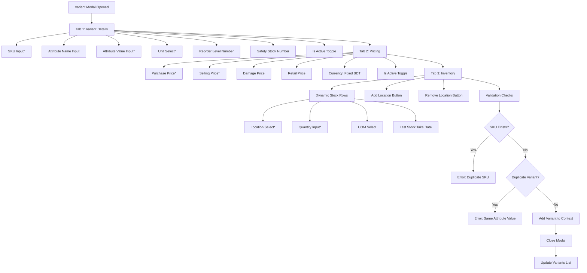
```mermaid
flowchart TD
    A[Variant Modal Opened] --> B[Tab 1: Variant Details]
    B --> B1["SKU Input*"]
    B --> B2[Attribute Name Input]
    B --> B3["Attribute Value Input*"]
    B --> B4["Unit Select*"]
    B --> B5[Reorder Level Number]
    B --> B6[Safety Stock Number]
    B --> B7[Is Active Toggle]
    
    B --> C[Tab 2: Pricing]
    C --> C1["Purchase Price*"]
    C --> C2["Selling Price*"]
    C --> C3[Damage Price]
    C --> C4[Retail Price]
    C --> C5[Currency: Fixed BDT]
    C --> C6[Is Active Toggle]
    
    C --> D[Tab 3: Inventory]
    D --> D1[Dynamic Stock Rows]
    D1 --> D1a["Location Select*"]
    D1 --> D1b["Quantity Input*"]
    D1 --> D1c[UOM Select]
    D1 --> D1d[Last Stock Take Date]
    D --> D2[Add Location Button]
    D --> D3[Remove Location Button]
    
    D --> E[Validation Checks]
    E --> E1{SKU Exists?}
    E1 -->|Yes| E1a[Error: Duplicate SKU]
    E1 -->|No| E2{Duplicate Variant?}
    E2 -->|Yes| E2a[Error: Same Attribute Value]
    E2 -->|No| F[Add Variant to Context]
    
    F --> G[Close Modal]
    G --> H[Update Variants List]
```

### 2.3 Field Requirements & Validation

| Field | Required | Validation Rules |
|-------|----------|------------------|
| Product Name | Yes | Min 1 char, unique check |
| Product Code | Yes | Min 1 char, unique per company |
| Category | Yes | Must exist in system |
| Description | No | Max 500 chars |
| SKU | Yes | Unique per company |
| Attribute Name | Yes | Min 1 char |
| Attribute Value | Yes | Min 1 char |
| Unit of Measure | Yes | Must exist in system |
| Purchase Price | Yes | Number > 0 |
| Selling Price | Yes | Number > 0 |
| Location | Yes | Must exist in system |
| Quantity | Yes | Number >= 0 |

---

## 3. Product Listing & Search

### 3.1 How the Products Page Loads

**What happens when you open the Products page:**

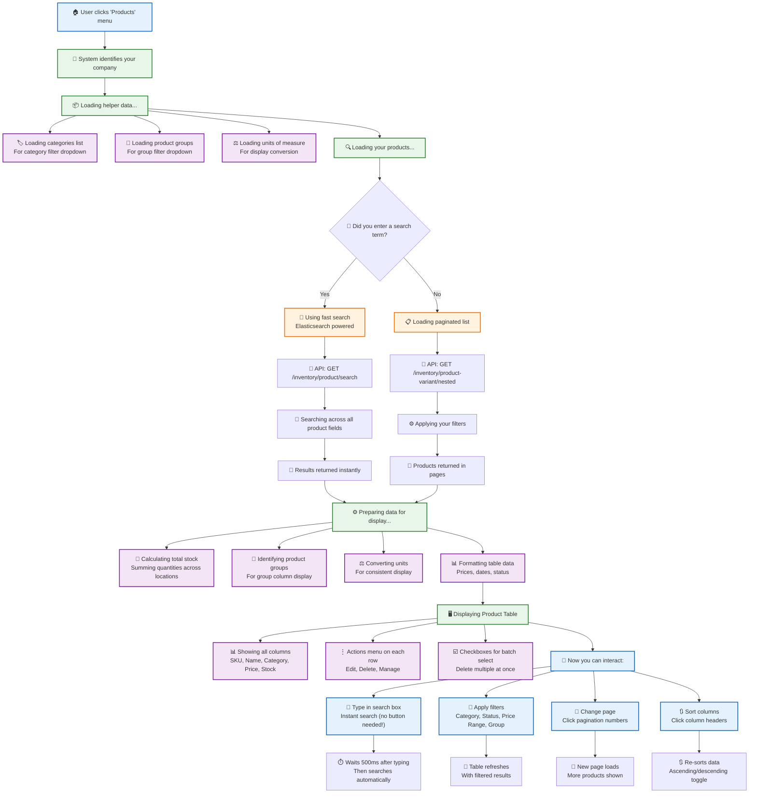
```mermaid
flowchart TD
    %% Page Load
    A["🏠 User clicks 'Products' menu"] --> B["🔐 System identifies your company"]
    
    %% Loading Supporting Data
    B --> C["📦 Loading helper data..."]
    C --> C1["🏷️ Loading categories list<br/>For category filter dropdown"]
    C --> C2["📁 Loading product groups<br/>For group filter dropdown"]
    C --> C3["⚖️ Loading units of measure<br/>For display conversion"]
    
    %% Loading Products
    C --> D["🔍 Loading your products..."]
    D --> D1{"💭 Did you enter a search term?"}
    
    %% Search Path
    D1 -->|Yes| E["🚀 Using fast search<br/>Elasticsearch powered"]
    E --> E1["📡 API: GET /inventory/product/search"]
    E1 --> E2["🔎 Searching across all product fields"]
    E2 --> E3["📄 Results returned instantly"]
    
    %% Normal List Path
    D1 -->|No| F["📋 Loading paginated list"]
    F --> F1["📡 API: GET /inventory/product-variant/nested"]
    F1 --> F2["⚙️ Applying your filters"]
    F2 --> F3["📄 Products returned in pages"]
    
    %% Data Processing
    E3 --> G["⚙️ Preparing data for display..."]
    F3 --> G
    G --> G1["🧮 Calculating total stock<br/>Summing quantities across locations"]
    G --> G2["📁 Identifying product groups<br/>For group column display"]
    G --> G3["⚖️ Converting units<br/>For consistent display"]
    G --> G4["📊 Formatting table data<br/>Prices, dates, status"]
    
    %% Display
    G4 --> H["🖥️ Displaying Product Table"]
    H --> H1["📊 Showing all columns<br/>SKU, Name, Category, Price, Stock"]
    H --> H2["⋮ Actions menu on each row<br/>Edit, Delete, Manage"]
    H --> H3["☑️ Checkboxes for batch select<br/>Delete multiple at once"]
    
    %% User Interactions
    H --> I["👤 Now you can interact:"]
    I --> I1["🔎 Type in search box<br/>Instant search (no button needed!)"]
    I --> I2["📂 Apply filters<br/>Category, Status, Price Range, Group"]
    I --> I3["📄 Change page<br/>Click pagination numbers"]
    I --> I4["🔃 Sort columns<br/>Click column headers"]
    
    %% System Response
    I1 --> J["⏱️ Waits 500ms after typing<br/>Then searches automatically"]
    I2 --> K["🔄 Table refreshes<br/>With filtered results"]
    I3 --> L["📄 New page loads<br/>More products shown"]
    I4 --> M["🔃 Re-sorts data<br/>Ascending/descending toggle"]
    
    %% Styling
    classDef userAction fill:#e3f2fd,stroke:#1565c0,stroke-width:2px
    classDef system fill:#e8f5e9,stroke:#2e7d32,stroke-width:2px
    classDef data fill:#f3e5f5,stroke:#7b1fa2,stroke-width:2px
    classDef api fill:#fff3e0,stroke:#ef6c00,stroke-width:2px
    
    class A,I,I1,I2,I3,I4 userAction
    class B,C,D,G,H system
    class C1,C2,C3,G1,G2,G3,G4,H1,H2,H3 data
    class E,F api
```

### 📱 Quick Guide: Finding Products

| What you want to do | How to do it |
|---------------------|--------------|
| **Search by name** | Just start typing in the search box - results appear instantly |
| **Filter by category** | Click the "Category" dropdown and select |
| **Show only active** | Use the "Status" filter dropdown |
| **Find expensive items** | Use the price range slider |
| **Sort by price** | Click the "Purchase Price" column header |
| **View more products** | Click page numbers at the bottom |
| **Edit a product** | Click the "⋮" (three dots) on that row → Edit |

### 3.2 Search & Filter Architecture

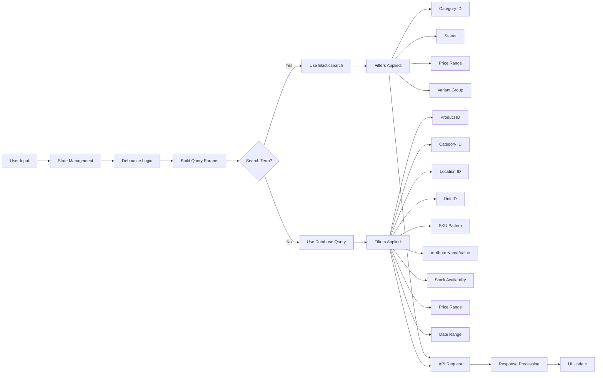
```mermaid
flowchart LR
    A[User Input] --> B[State Management]
    B --> C[Debounce Logic]
    C --> D[Build Query Params]
    
    D --> E{Search Term?}
    E -->|Yes| F[Use Elasticsearch]
    E -->|No| G[Use Database Query]
    
    F --> F1[Filters Applied:]
    F1 --> F1a[Category ID]
    F1 --> F1b[Status]
    F1 --> F1c[Price Range]
    F1 --> F1d[Variant Group]
    
    G --> G1[Filters Applied:]
    G1 --> G1a[Product ID]
    G1 --> G1b[Category ID]
    G1 --> G1c[Location ID]
    G1 --> G1d[Unit ID]
    G1 --> G1e[SKU Pattern]
    G1 --> G1f[Attribute Name/Value]
    G1 --> G1g[Stock Availability]
    G1 --> G1h[Price Range]
    G1 --> G1i[Date Range]
    
    F1 --> H[API Request]
    G1 --> H
    H --> I[Response Processing]
    I --> J[UI Update]
```

### 3.3 Table Columns Display

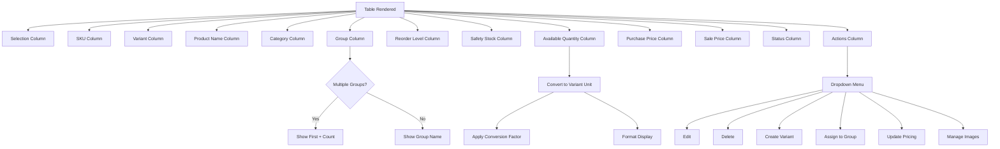
```mermaid
flowchart TD
    A[Table Rendered] --> B[Selection Column]
    A --> C[SKU Column]
    A --> D[Variant Column]
    A --> E[Product Name Column]
    A --> F[Category Column]
    A --> G[Group Column]
    A --> H[Reorder Level Column]
    A --> I[Safety Stock Column]
    A --> J[Available Quantity Column]
    A --> K[Purchase Price Column]
    A --> L[Sale Price Column]
    A --> M[Status Column]
    A --> N[Actions Column]
    
    G --> G1{Multiple Groups?}
    G1 -->|Yes| G1a[Show First + Count]
    G1 -->|No| G1b[Show Group Name]
    
    J --> J1[Convert to Variant Unit]
    J1 --> J1a[Apply Conversion Factor]
    J1 --> J1b[Format Display]
    
    N --> N1[Dropdown Menu]
    N1 --> N1a[Edit]
    N1 --> N1b[Delete]
    N1 --> N1c[Create Variant]
    N1 --> N1d[Assign to Group]
    N1 --> N1e[Update Pricing]
    N1 --> N1f[Manage Images]
```

---

## 4. Product Edit/Update Workflow

### 4.1 Editing a Product's Price

**Use this workflow to update pricing for an existing product variant:**

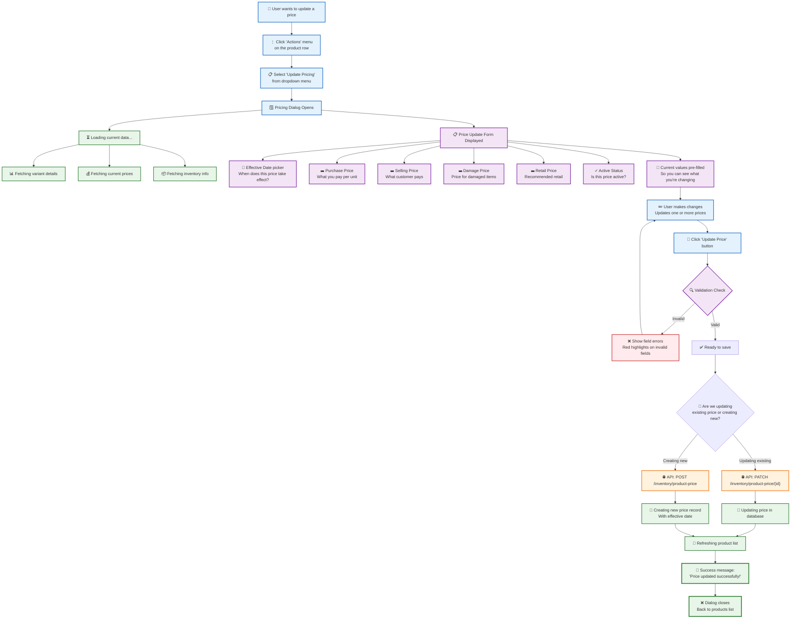
```mermaid
flowchart TD
    %% Start
    A["👤 User wants to update a price"] --> B["⋮ Click 'Actions' menu<br/>on the product row"]
    
    %% Action Menu
    B --> C["📋 Select 'Update Pricing'<br/>from dropdown menu"]
    C --> D["🪟 Pricing Dialog Opens"]
    
    %% Loading Data
    D --> D0["⏳ Loading current data..."]
    D0 --> D1["📊 Fetching variant details"]
    D0 --> D2["💰 Fetching current prices"]
    D0 --> D3["📦 Fetching inventory info"]
    
    %% Form Display
    D --> E["📋 Price Update Form Displayed"]
    E --> E1["📅 Effective Date picker<br/>When does this price take effect?"]
    E --> E2["💵 Purchase Price<br/>What you pay per unit"]
    E --> E3["💵 Selling Price<br/>What customer pays"]
    E --> E4["💵 Damage Price<br/>Price for damaged items"]
    E --> E5["💵 Retail Price<br/>Recommended retail"]
    E --> E6["✓ Active Status<br/>Is this price active?"]
    
    %% Current Values Shown
    E --> F["👀 Current values pre-filled<br/>So you can see what you're changing"]
    
    %% User Input
    F --> G["✏️ User makes changes<br/>Updates one or more prices"]
    G --> H["💾 Click 'Update Price' button"]
    
    %% Validation
    H --> I{"🔍 Validation Check"}
    I -->|Invalid| I1["❌ Show field errors<br/>Red highlights on invalid fields"]
    I1 --> G
    I -->|Valid| J["✅ Ready to save"]
    
    %% API Decision
    J --> K{"💭 Are we updating<br/>existing price or creating new?"}
    K -->|Updating existing| L["🌐 API: PATCH /inventory/product-price/{id}"]
    K -->|Creating new| M["🌐 API: POST /inventory/product-price"]
    
    %% Backend
    L --> N["💾 Updating price in database"]
    M --> O["💾 Creating new price record<br/>With effective date"]
    
    %% Completion
    N --> P["🔄 Refreshing product list"]
    O --> P
    P --> Q["🎉 Success message:<br/>'Price updated successfully!'"]
    Q --> R["❌ Dialog closes<br/>Back to products list"]
    
    %% Styling
    classDef userAction fill:#e3f2fd,stroke:#1565c0,stroke-width:2px
    classDef form fill:#f3e5f5,stroke:#7b1fa2,stroke-width:2px
    classDef system fill:#e8f5e9,stroke:#2e7d32,stroke-width:2px
    classDef api fill:#fff3e0,stroke:#ef6c00,stroke-width:2px
    classDef error fill:#ffebee,stroke:#c62828,stroke-width:2px
    classDef success fill:#e8f5e9,stroke:#2e7d32,stroke-width:3px
    
    class A,B,C,D,G,H userAction
    class E,E1,E2,E3,E4,E5,E6,F,I form
    class D0,D1,D2,D3,N,O,P system
    class L,M api
    class I1 error
    class Q,R success
```

### 💡 When to Update Pricing

| Scenario | What to do |
|----------|------------|
| **Seasonal price change** | Set new effective date for future price |
| **Cost increase** | Update purchase price and selling price |
| **Sale/promotion** | Create new price with future effective date |
| **End of promotion** | Create price with end date, or set inactive |
| **Wrong price entered** | Edit immediately to correct it |

### 📝 Important Notes

- **Effective Date**: New prices can be scheduled for future dates
- **Price History**: System keeps all price records with effective dates
- **Active Status**: Inactive prices won't be used in new transactions
- **Multiple Prices**: You can have multiple price records with different effective dates

### 4.2 Create Variant from Existing Product

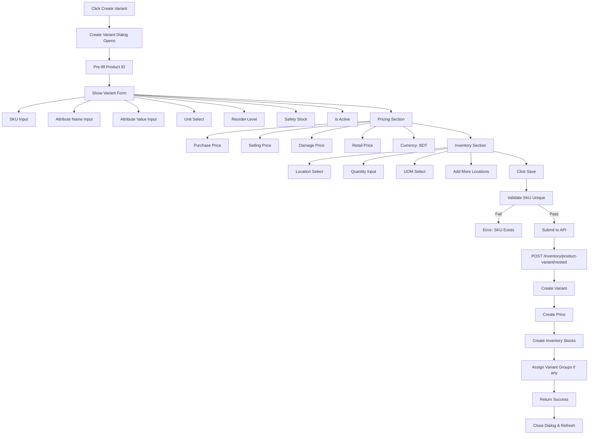
```mermaid
flowchart TD
    A[Click Create Variant] --> B[Create Variant Dialog Opens]
    B --> C[Pre-fill Product ID]
    C --> D[Show Variant Form]
    
    D --> D1[SKU Input]
    D --> D2[Attribute Name Input]
    D --> D3[Attribute Value Input]
    D --> D4[Unit Select]
    D --> D5[Reorder Level]
    D --> D6[Safety Stock]
    D --> D7[Is Active]
    
    D --> E[Pricing Section]
    E --> E1[Purchase Price]
    E --> E2[Selling Price]
    E --> E3[Damage Price]
    E --> E4[Retail Price]
    E --> E5[Currency: BDT]
    
    E --> F[Inventory Section]
    F --> F1[Location Select]
    F --> F2[Quantity Input]
    F --> F3[UOM Select]
    F --> F4[Add More Locations]
    
    F --> G[Click Save]
    G --> H[Validate SKU Unique]
    H -->|Fail| H1[Error: SKU Exists]
    H -->|Pass| I[Submit to API]
    
    I --> J[POST /inventory/product-variant/nested]
    J --> K[Create Variant]
    K --> L[Create Price]
    L --> M[Create Inventory Stocks]
    M --> N[Assign Variant Groups if any]
    N --> O[Return Success]
    O --> P[Close Dialog & Refresh]
```

---

## 5. Product Import Workflow

### 5.1 Bulk Import via Excel

**Import multiple products at once using an Excel file. Perfect for initial setup or large updates!**

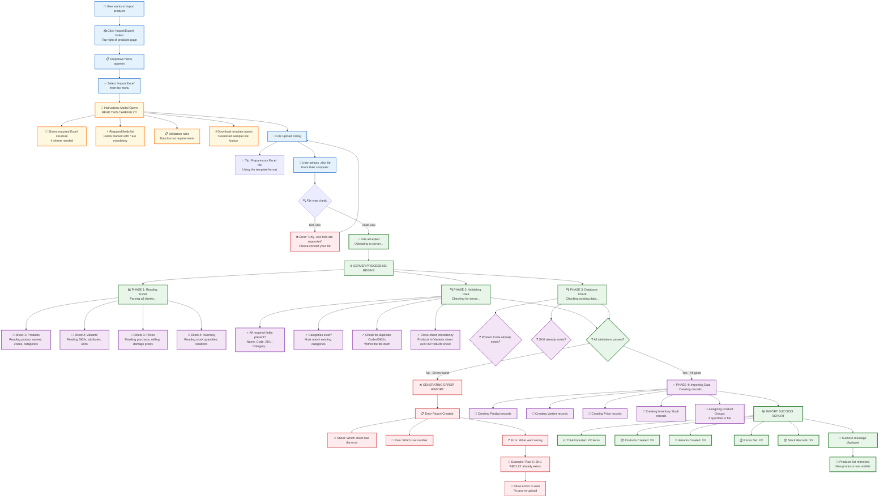
```mermaid
flowchart TD
    %% Start
    A["👤 User wants to import products"] --> B["📤 Click 'Import/Export' button<br/>Top-right of products page"]
    
    %% Menu
    B --> C["📋 Dropdown menu appears"]
    C --> D["✅ Select 'Import Excel'<br/>from the menu"]
    
    %% Instructions
    D --> E["📖 Instructions Modal Opens<br/>READ THIS CAREFULLY!"]
    E --> E1["📄 Shows required Excel structure<br/>4 sheets needed"]
    E --> E2["⭐ Required fields list<br/>Fields marked with * are mandatory"]
    E --> E3["📋 Validation rules<br/>Data format requirements"]
    E --> E4["⬇️ Download template option<br/>'Download Sample File' button"]
    
    %% File Selection
    E --> F["📁 File Upload Dialog"]
    F --> F0["💡 Tip: Prepare your Excel file<br/>Using the template format"]
    F --> G["📂 User selects .xlsx file<br/>From their computer"]
    
    %% Validation
    G --> H{"🔍 File type check"}
    H -->|Not .xlsx| H1["❌ Error: 'Only .xlsx files are supported'<br/>Please convert your file"]
    H1 --> F
    H -->|Valid .xlsx| I["✅ File accepted<br/>Uploading to server..."]
    
    %% Server Processing
    I --> J["⚙️ SERVER PROCESSING BEGINS"]
    
    %% Phase 1
    J --> J1["📊 PHASE 1: Reading Excel<br/>Parsing all sheets..."]
    J1 --> J1a["📄 Sheet 1: Products<br/>Reading product names, codes, categories"]
    J1 --> J1b["📄 Sheet 2: Variants<br/>Reading SKUs, attributes, units"]
    J1 --> J1c["📄 Sheet 3: Prices<br/>Reading purchase, selling, damage prices"]
    J1 --> J1d["📄 Sheet 4: Inventory<br/>Reading stock quantities, locations"]
    
    %% Phase 2
    J --> J2["🔍 PHASE 2: Validating Data<br/>Checking for errors..."]
    J2 --> J2a["✓ All required fields present?<br/>Name, Code, SKU, Category..."]
    J2 --> J2b["✓ Categories exist?<br/>Must match existing categories"]
    J2 --> J2c["✓ Check for duplicate Codes/SKUs<br/>Within the file itself"]
    J2 --> J2d["✓ Cross-sheet consistency<br/>Products in Variants sheet exist in Products sheet"]
    
    %% Phase 3
    J --> J3["🔍 PHASE 3: Database Check<br/>Checking existing data..."]
    J3 --> J3a{"❓ Product Code already exists?"}
    J3 --> J3b{"❓ SKU already exists?"}
    
    %% Validation Result
    J2 --> K{"❓ All validations passed?"}
    J3 --> K
    
    %% Error Path
    K -->|No - Errors found| L["❌ GENERATING ERROR REPORT"]
    L --> L1["📋 Error Report Created:"]
    L1 --> L2["📄 Sheet: Which sheet had the error"]
    L1 --> L3["🔢 Row: Which row number"]
    L1 --> L4["❓ Error: What went wrong"]
    L4 --> L5["📖 Example: 'Row 5: SKU 'ABC123' already exists'"]
    L5 --> L6["👤 Show errors to user<br/>Fix and re-upload"]
    
    %% Success Path
    K -->|Yes - All good| M["✅ PHASE 4: Importing Data<br/>Creating records..."]
    M --> M1["💾 Creating Product records"]
    M --> M2["💾 Creating Variant records"]
    M --> M3["💾 Creating Price records"]
    M --> M4["💾 Creating Inventory Stock records"]
    M --> M5["📁 Assigning Product Groups<br/>If specified in file"]
    
    %% Success Report
    M --> N["📊 IMPORT SUCCESS REPORT"]
    N --> N1["📈 Total Imported: XX items"]
    N --> N2["📦 Products Created: XX"]
    N --> N3["🎨 Variants Created: XX"]
    N --> N4["💰 Prices Set: XX"]
    N --> N5["📦 Stock Records: XX"]
    N --> O["🎉 Success message displayed"]
    O --> P["🔄 Products list refreshed<br/>New products now visible!"]
    
    %% Styling
    classDef userAction fill:#e3f2fd,stroke:#1565c0,stroke-width:2px
    classDef instruction fill:#fff8e1,stroke:#ff6f00,stroke-width:2px
    classDef system fill:#e8f5e9,stroke:#2e7d32,stroke-width:2px
    classDef phase fill:#f3e5f5,stroke:#7b1fa2,stroke-width:2px
    classDef error fill:#ffebee,stroke:#c62828,stroke-width:2px
    classDef success fill:#e8f5e9,stroke:#2e7d32,stroke-width:3px
    
    class A,B,C,D,F,G userAction
    class E,E1,E2,E3,E4 instruction
    class J,J1,J2,J3 system
    class J1a,J1b,J1c,J1d,J2a,J2b,J2c,J2d,J3a,J3b,M,M1,M2,M3,M4,M5 phase
    class H1,L,L1,L2,L3,L4,L5,L6 error
    class K,I,N,N1,N2,N3,N4,N5,O,P success
```

### 📋 Excel File Structure

Your import file **MUST** have these 4 sheets in this exact order:

| Sheet | Purpose | Required Fields |
|-------|---------|-----------------|
| **1. Products** | Master product data | product_code*, product_name*, category_name* |
| **2. Variants** | SKU variants | product_code*, sku*, attribute_name*, attribute_value*, unit_name* |
| **3. Prices** | Pricing info | sku*, purchase_price*, selling_price*, effective_date* |
| **4. InventoryStocks** | Initial stock | sku*, location_name*, quantity* |

### 💡 Pro Tips for Successful Import

1. **Download the template first** - Use the sample file as your starting point
2. **Check your categories** - All categories in your file must already exist in the system
3. **Unique codes** - Product codes and SKUs must be unique across your entire inventory
4. **Cross-sheet consistency** - Every product_code in Variants sheet must exist in Products sheet
5. **Start small** - Test with 5-10 products first before importing hundreds
6. **Backup your data** - Export existing products before bulk import (just in case!)

### ❌ Common Import Errors

| Error | Cause | Solution |
|-------|-------|----------|
| "Product code already exists" | Duplicate in file or DB | Use unique product codes |
| "Category not found" | Category doesn't exist | Create categories first |
| "SKU already exists" | SKU used before | Use unique SKUs |
| "Required field missing" | Empty cell in * field | Fill all required fields |
| "Invalid file format" | Not .xlsx file | Save as Excel (.xlsx) format |

---

### 5.2 Excel Sheet Structure

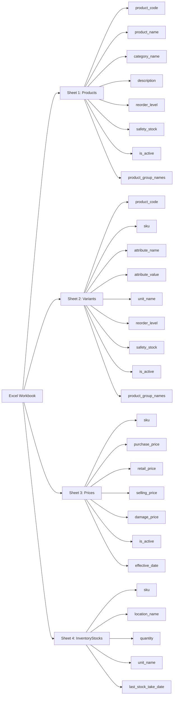
```mermaid
flowchart LR
    A[Excel Workbook] --> B[Sheet 1: Products]
    A --> C[Sheet 2: Variants]
    A --> D[Sheet 3: Prices]
    A --> E[Sheet 4: InventoryStocks]
    
    B --> B1["product_code"]
    B --> B2["product_name"]
    B --> B3["category_name"]
    B --> B4["description"]
    B --> B5["reorder_level"]
    B --> B6["safety_stock"]
    B --> B7["is_active"]
    B --> B8["product_group_names"]
    
    C --> C1["product_code"]
    C --> C2["sku"]
    C --> C3["attribute_name"]
    C --> C4["attribute_value"]
    C --> C5["unit_name"]
    C --> C6["reorder_level"]
    C --> C7["safety_stock"]
    C --> C8["is_active"]
    C --> C9["product_group_names"]
    
    D --> D1["sku"]
    D --> D2["purchase_price"]
    D --> D3["retail_price"]
    D --> D4["selling_price"]
    D --> D5["damage_price"]
    D --> D6["is_active"]
    D --> D7["effective_date"]
    
    E --> E1["sku"]
    E --> E2["location_name"]
    E --> E3["quantity"]
    E --> E4["unit_name"]
    E --> E5["last_stock_take_date"]
```

---

## 6. Variant Management Workflow

### 6.1 Managing Product Variants

**Variants are different versions of the same product (e.g., different sizes, colors). Here's how to manage them:**

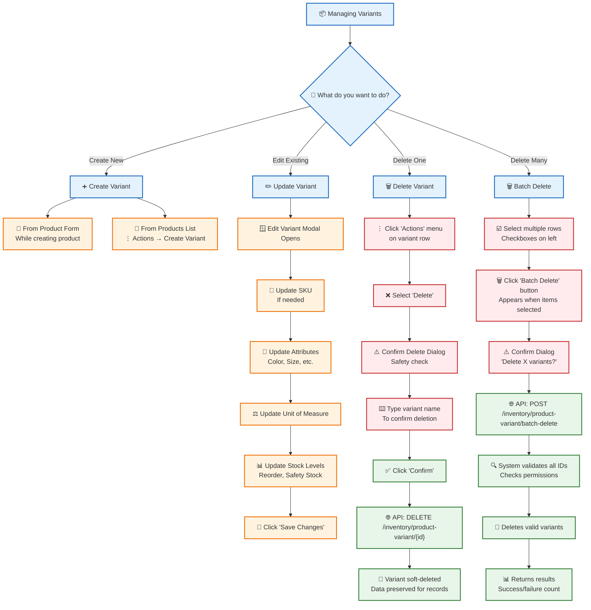
```mermaid
flowchart TD
    %% Entry Points
    A["📦 Managing Variants"] --> B{"🤔 What do you want to do?"}
    
    %% Create Variant Options
    B -->|Create New| C["➕ Create Variant"]
    C --> C1["📍 From Product Form<br/>While creating product"]
    C --> C2["📍 From Products List<br/>⋮ Actions → Create Variant"]
    
    %% Update Variant
    B -->|Edit Existing| D["✏️ Update Variant"]
    D --> D1["🪟 Edit Variant Modal Opens"]
    D1 --> D2["📝 Update SKU<br/>If needed"]
    D2 --> D3["🎨 Update Attributes<br/>Color, Size, etc."]
    D3 --> D4["⚖️ Update Unit of Measure"]
    D4 --> D5["📊 Update Stock Levels<br/>Reorder, Safety Stock"]
    D5 --> D6["💾 Click 'Save Changes'"]
    
    %% Delete Single
    B -->|Delete One| E["🗑️ Delete Variant"]
    E --> E1["⋮ Click 'Actions' menu<br/>on variant row"]
    E1 --> E2["❌ Select 'Delete'"]
    E2 --> E3["⚠️ Confirm Delete Dialog<br/>Safety check"]
    E3 --> E4["⌨️ Type variant name<br/>To confirm deletion"]
    E4 --> E5["✅ Click 'Confirm'"]
    E5 --> E6["🌐 API: DELETE /inventory/product-variant/{id}"]
    E6 --> E7["💾 Variant soft-deleted<br/>Data preserved for records"]
    
    %% Batch Delete
    B -->|Delete Many| F["🗑️ Batch Delete"]
    F --> F1["☑️ Select multiple rows<br/>Checkboxes on left"]
    F1 --> F2["🗑️ Click 'Batch Delete' button<br/>Appears when items selected"]
    F2 --> F3["⚠️ Confirm Dialog<br/>'Delete X variants?'"]
    F3 --> F4["🌐 API: POST /inventory/product-variant/batch-delete"]
    F4 --> F5["🔍 System validates all IDs<br/>Checks permissions"]
    F5 --> F6["💾 Deletes valid variants"]
    F6 --> F7["📊 Returns results<br/>Success/failure count"]
    
    %% Styling
    classDef action fill:#e3f2fd,stroke:#1565c0,stroke-width:2px
    classDef process fill:#fff3e0,stroke:#ef6c00,stroke-width:2px
    classDef system fill:#e8f5e9,stroke:#2e7d32,stroke-width:2px
    classDef delete fill:#ffebee,stroke:#c62828,stroke-width:2px
    
    class A,B,C,D,E,F action
    class C1,C2,D1,D2,D3,D4,D5,D6 process
    class E1,E2,E3,E4,F1,F2,F3 delete
    class E5,E6,E7,F4,F5,F6,F7 system
```

### 💡 When to Use Each Action

| Action | When to Use | Example |
|--------|-------------|---------|
| **Create Variant** | Product has new size/color | Adding "Blue" color to existing shirt |
| **Update Variant** | Change SKU, attributes, or stock levels | Update reorder level based on sales |
| **Delete Variant** | Discontinue a specific variant | Stop selling "Small" size |
| **Batch Delete** | Clean up multiple discontinued items | Remove all "2023 Collection" variants |

### ⚠️ Important Notes

- **Deleting a variant** is permanent (soft delete - recoverable by admin)
- **Check for stock** before deleting - system may warn if inventory exists
- **Update prices separately** - Price changes use the "Update Pricing" action

### 6.2 Variant Listing with Filters


```mermaid
flowchart TD
    A[Variant List Endpoint] --> B[Filter Parameters]
    
    B --> B1["Basic Filters"]
    B1 --> B1a["product_id"]
    B1 --> B1b["unit_id"]
    B1 --> B1c["is_active"]
    B1 --> B1d["sku - partial match"]
    
    B --> B2["Attribute Filters"]
    B2 --> B2a["attribute_name - partial"]
    B2 --> B2b["attribute_value - partial"]
    
    B --> B3["Numeric Range Filters"]
    B3 --> B3a["reorder_level_min/max"]
    B3 --> B3b["safety_stock_min/max"]
    
    B --> B4["Date Range Filters"]
    B4 --> B4a["created_date_start/end"]
    B4 --> B4b["modified_date_start/end"]
    
    B --> B5["Enhanced Filters"]
    B5 --> B5a["has_stock - boolean"]
    B5 --> B5b["price_range_min/max"]
    B5 --> B5c["variant_group_id"]
    B5 --> B5d["warehouse_id"]
    
    B --> C["Sorting Options"]
    C --> C1["sku_asc/desc"]
    C --> C2["attribute_name/value_asc/desc"]
    C --> C3["reorder_level_asc/desc"]
    C --> C4["created_date_asc/desc"]
    C --> C5["product_name_asc/desc"]
    C --> C6["price_asc/desc"]
    C --> C7["total_stock_asc/desc"]
    
    B --> D["Response Structure"]
    C --> D
    D --> D1["total_count"]
    D --> D2["filtered_count"]
    D --> D3["unit_ids[]"]
    D --> D4["start_created_date"]
    D --> D5["latest_created_date"]
    D --> D6["price_ranges{min,max}"]
    D --> D7["stock_summary{}"]
    D --> D8["data[]"]
```

---

## 7. Price Management Workflow

### 7.1 Price Structure


```mermaid
flowchart TD
    A["Product Price"] --> B["Price Types"]
    B --> B1["Purchase Price"]
    B --> B2["Maximum Retail Price"]
    B --> B3["Minimum Retail Price"]
    B --> B4["Retail Price"]
    B --> B5["Maximum Selling Price"]
    B --> B6["Minimum Selling Price"]
    B --> B7["Selling Price"]
    B --> B8["Damage Price"]
    
    A --> C["Price Metadata"]
    C --> C1["price_id - PK"]
    C --> C2["product_id - FK"]
    C --> C3["variant_id - FK"]
    C --> C4["effective_date - TIMESTAMP"]
    C --> C5["currency_id - FK"]
    C --> C6["is_active - BOOLEAN"]
    
    A --> D["Audit Fields"]
    D --> D1["cb - Created By"]
    D --> D2["cd - Created Date"]
    D --> D3["mb - Modified By"]
    D --> D4["md - Modified Date"]
```

### 7.2 Update Pricing Flow

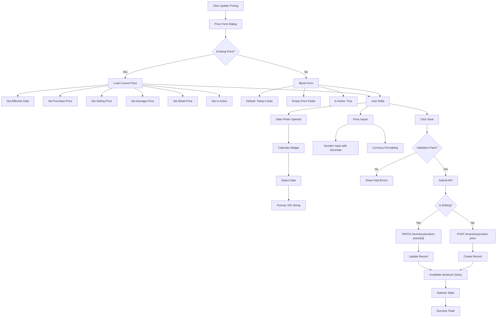
```mermaid
flowchart TD
    A["Click Update Pricing"] --> B["Price Form Dialog"]
    B --> C{"Existing Price?"}
    
    C -->|Yes| D["Load Current Price"]
    D --> D1["Set Effective Date"]
    D --> D2["Set Purchase Price"]
    D --> D3["Set Selling Price"]
    D --> D4["Set Damage Price"]
    D --> D5["Set Retail Price"]
    D --> D6["Set Is Active"]
    
    C -->|No| E["Blank Form"]
    E --> E1["Default: Today's Date"]
    E --> E2["Empty Price Fields"]
    E --> E3["Is Active: True"]
    
    D --> F["User Edits"]
    E --> F
    
    F --> G["Date Picker Opened"]
    G --> G1["Calendar Widget"]
    G1 --> G2["Select Date"]
    G2 --> G3["Format: ISO String"]
    
    F --> H["Price Inputs"]
    H --> H1["Number Input with Decimals"]
    H --> H2["Currency Formatting"]
    
    F --> I["Click Save"]
    I --> J{"Validation Pass?"}
    J -->|No| K["Show Field Errors"]
    J -->|Yes| L["Submit API"]
    
    L --> M{"Is Editing?"}
    M -->|Yes| N["PATCH /inventory/product-price/{id}"]
    M -->|No| O["POST /inventory/product-price"]
    
    N --> P["Update Record"]
    O --> Q["Create Record"]
    
    P --> R["Invalidate /products Query"]
    Q --> R
    R --> S["Refresh Table"]
    S --> T["Success Toast"]
```

---

## 8. Product Group Management

### 8.1 Managing Product Groups

**Product Groups help you organize products for promotions, collections, or reporting. Example: "Summer Sale", "Featured Items", "New Arrivals"**

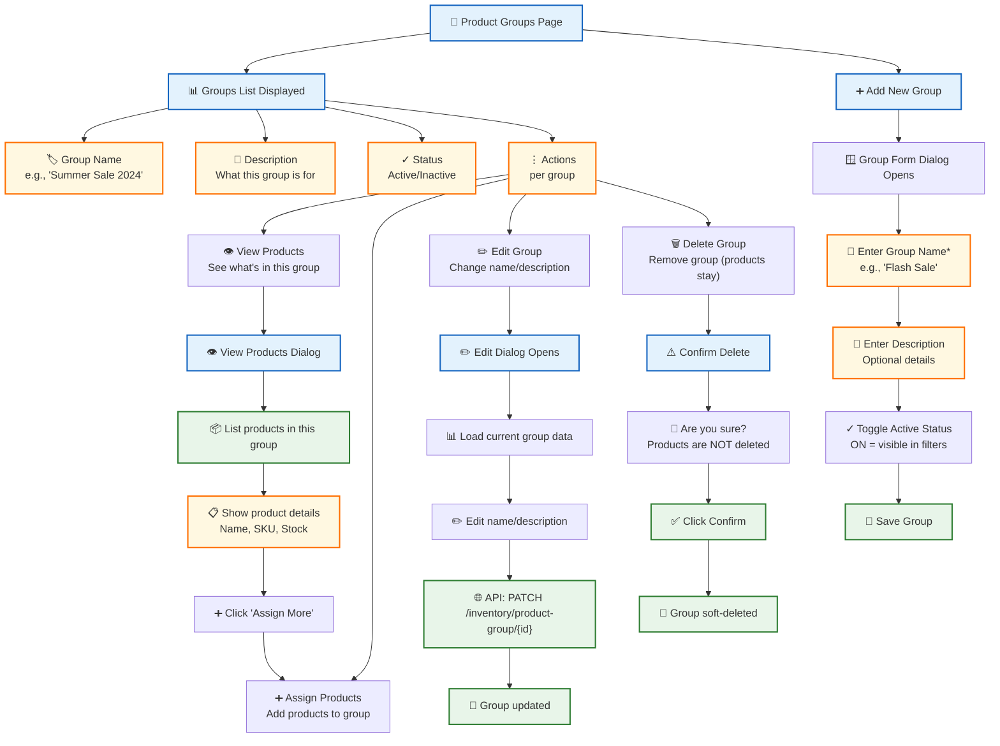
```mermaid
flowchart TD
    %% Entry
    A["📁 Product Groups Page"] --> B["📊 Groups List Displayed"]
    
    %% List Columns
    B --> B1["🏷️ Group Name<br/>e.g., 'Summer Sale 2024'"]
    B --> B2["📝 Description<br/>What this group is for"]
    B --> B3["✓ Status<br/>Active/Inactive"]
    B --> B4["⋮ Actions<br/>per group"]
    
    %% Actions
    B4 --> B4a["👁️ View Products<br/>See what's in this group"]
    B4 --> B4b["➕ Assign Products<br/>Add products to group"]
    B4 --> B4c["✏️ Edit Group<br/>Change name/description"]
    B4 --> B4d["🗑️ Delete Group<br/>Remove group (products stay)"]
    
    %% Create Group
    A --> C["➕ Add New Group"]
    C --> C1["🪟 Group Form Dialog Opens"]
    C1 --> C2["📝 Enter Group Name*<br/>e.g., 'Flash Sale'"]
    C2 --> C3["📄 Enter Description<br/>Optional details"]
    C3 --> C4["✓ Toggle Active Status<br/>ON = visible in filters"]
    C4 --> C5["💾 Save Group"]
    
    %% Edit Flow
    B4c --> D["✏️ Edit Dialog Opens"]
    D --> D1["📊 Load current group data"]
    D1 --> D2["✏️ Edit name/description"]
    D2 --> D3["🌐 API: PATCH /inventory/product-group/{id}"]
    D3 --> D4["💾 Group updated"]
    
    %% Delete Flow
    B4d --> E["⚠️ Confirm Delete"]
    E --> E1["🤔 Are you sure?<br/>Products are NOT deleted"]
    E1 --> E2["✅ Click Confirm"]
    E2 --> E3["💾 Group soft-deleted"]
    
    %% View Products Flow
    B4a --> F["👁️ View Products Dialog"]
    F --> F1["📦 List products in this group"]
    F1 --> F2["📋 Show product details<br/>Name, SKU, Stock"]
    F2 --> F3["➕ Click 'Assign More'"]
    F3 --> B4b
    
    %% Styling
    classDef action fill:#e3f2fd,stroke:#1565c0,stroke-width:2px
    classDef info fill:#fff8e1,stroke:#ff6f00,stroke-width:2px
    classDef system fill:#e8f5e9,stroke:#2e7d32,stroke-width:2px
    
    class A,B,C,D,E,F action
    class B1,B2,B3,B4,C2,C3,F2 info
    class C5,D3,D4,E2,E3,F1 system
```

### 💡 Common Use Cases for Product Groups

| Group Type | Purpose | Example |
|------------|---------|---------|
| **Promotions** | Sale items | "Summer Sale 2024", "Black Friday" |
| **Collections** | Themed products | "Winter Collection", "Eco-Friendly" |
| **Reporting** | Category analysis | "High-Margin Items", "Slow Movers" |
| **Featured** | Homepage display | "New Arrivals", "Best Sellers" |
| **Inventory** | Stock management | "Discontinued", "Clearance" |

---

### 8.2 Assigning Products to Groups

**Add products to a group to categorize them for promotions or filtering:**

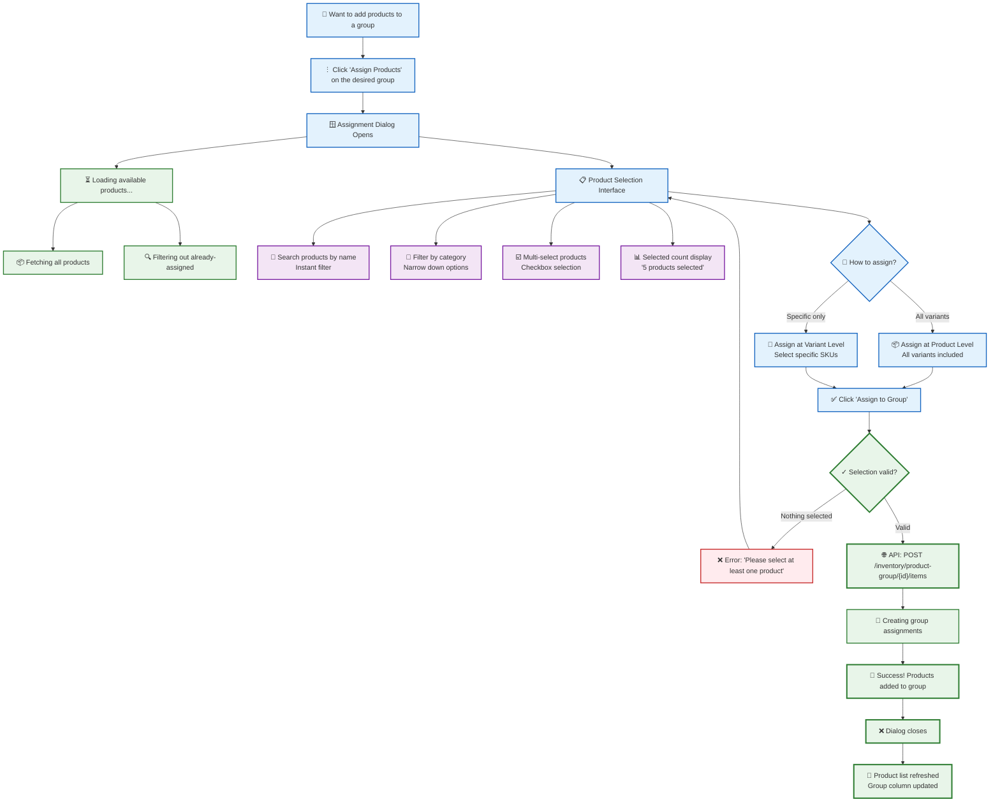
```mermaid
flowchart TD
    %% Start
    A["👤 Want to add products to a group"] --> B["⋮ Click 'Assign Products'<br/>on the desired group"]
    
    %% Loading
    B --> C["🪟 Assignment Dialog Opens"]
    C --> C0["⏳ Loading available products..."]
    C0 --> C1["📦 Fetching all products"]
    C0 --> C2["🔍 Filtering out already-assigned"]
    
    %% Selection Interface
    C --> D["📋 Product Selection Interface"]
    D --> D1["🔎 Search products by name<br/>Instant filter"]
    D --> D2["📂 Filter by category<br/>Narrow down options"]
    D --> D3["☑️ Multi-select products<br/>Checkbox selection"]
    D --> D4["📊 Selected count display<br/>'5 products selected'"]
    
    %% Assignment Type
    D --> E{"🤔 How to assign?"}
    E -->|All variants| E1["📦 Assign at Product Level<br/>All variants included"]
    E -->|Specific only| E2["🎨 Assign at Variant Level<br/>Select specific SKUs"]
    
    %% Action
    E1 --> F["✅ Click 'Assign to Group'"]
    E2 --> F
    
    %% Validation
    F --> G{"✓ Selection valid?"}
    G -->|Nothing selected| G1["❌ Error: 'Please select at least one product'"]
    G1 --> D
    G -->|Valid| H["🌐 API: POST /inventory/product-group/{id}/items"]
    
    %% Completion
    H --> I["💾 Creating group assignments"]
    I --> J["🎉 Success! Products added to group"]
    J --> K["❌ Dialog closes"]
    K --> L["🔄 Product list refreshed<br/>Group column updated"]
    
    %% Styling
    classDef userAction fill:#e3f2fd,stroke:#1565c0,stroke-width:2px
    classDef selection fill:#f3e5f5,stroke:#7b1fa2,stroke-width:2px
    classDef system fill:#e8f5e9,stroke:#2e7d32,stroke-width:2px
    classDef error fill:#ffebee,stroke:#c62828,stroke-width:2px
    classDef success fill:#e8f5e9,stroke:#2e7d32,stroke-width:3px
    
    class A,B,C,D,E,E1,E2,F userAction
    class D1,D2,D3,D4 selection
    class C0,C1,C2,H,I system
    class G1 error
    class G,H,J,K,L success
```

### 📋 Assignment Level Guide

| Assignment Level | When to Use | Result |
|------------------|-------------|--------|
| **Product Level** | Group all variants together | All sizes/colors included |
| **Variant Level** | Only specific variants | e.g., only "Large" in "Big Sizes" group |

### 8.3 Group Display in Products Table

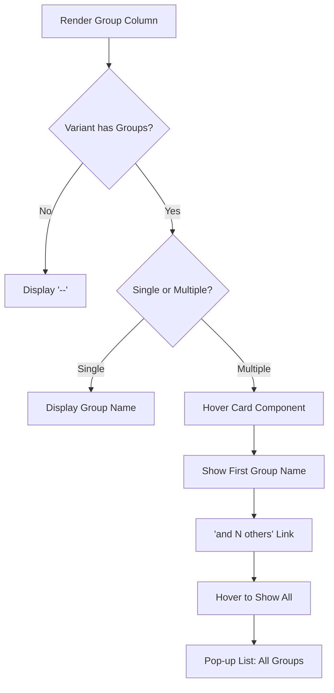
```mermaid
flowchart TD
    A["Render Group Column"] --> B{"Variant has Groups?"}
    B -->|No| C["Display '--'"]
    B -->|Yes| D{"Single or Multiple?"}
    
    D -->|Single| E["Display Group Name"]
    D -->|Multiple| F["Hover Card Component"]
    
    F --> F1["Show First Group Name"]
    F1 --> F2["'and N others' Link"]
    F2 --> F3["Hover to Show All"]
    F3 --> F4["Pop-up List: All Groups"]
```

---

## 9. Image Management Workflow

### 9.1 Managing Product Images

**Upload and manage product images to showcase your variants in catalogs and online stores.**

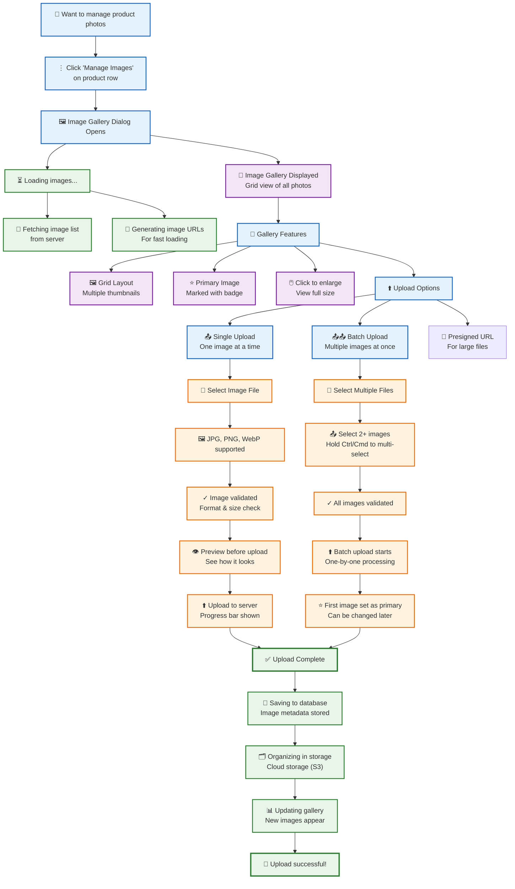
```mermaid
flowchart TD
    %% Entry
    A["👤 Want to manage product photos"] --> B["⋮ Click 'Manage Images'<br/>on product row"]
    
    %% Loading Gallery
    B --> C["🖼️ Image Gallery Dialog Opens"]
    C --> C0["⏳ Loading images..."]
    C0 --> C1["📡 Fetching image list<br/>from server"]
    C0 --> C2["🔗 Generating image URLs<br/>For fast loading"]
    C --> C3["🎨 Image Gallery Displayed<br/>Grid view of all photos"]
    
    %% Gallery Display
    C3 --> D["📸 Gallery Features"]
    D --> D1["🖼️ Grid Layout<br/>Multiple thumbnails"]
    D --> D2["⭐ Primary Image<br/>Marked with badge"]
    D --> D3["🖱️ Click to enlarge<br/>View full size"]
    
    %% Upload Options
    D --> E["⬆️ Upload Options"]
    E --> E1["📤 Single Upload<br/>One image at a time"]
    E --> E2["📤📤 Batch Upload<br/>Multiple images at once"]
    E --> E3["🚀 Presigned URL<br/>For large files"]
    
    %% Single Upload
    E1 --> F["📂 Select Image File"]
    F --> F1["🖼️ JPG, PNG, WebP supported"]
    F1 --> F2["✓ Image validated<br/>Format & size check"]
    F2 --> F3["👁️ Preview before upload<br/>See how it looks"]
    F3 --> F4["⬆️ Upload to server<br/>Progress bar shown"]
    
    %% Batch Upload
    E2 --> G["📂 Select Multiple Files"]
    G --> G1["📤 Select 2+ images<br/>Hold Ctrl/Cmd to multi-select"]
    G1 --> G2["✓ All images validated"]
    G2 --> G3["⬆️ Batch upload starts<br/>One-by-one processing"]
    G3 --> G4["⭐ First image set as primary<br/>Can be changed later"]
    
    %% Completion
    F4 --> I["✅ Upload Complete"]
    G4 --> I
    I --> I1["💾 Saving to database<br/>Image metadata stored"]
    I1 --> I2["🗂️ Organizing in storage<br/>Cloud storage (S3)"]
    I2 --> I3["📊 Updating gallery<br/>New images appear"]
    I3 --> I4["🎉 Upload successful!"]
    
    %% Styling
    classDef userAction fill:#e3f2fd,stroke:#1565c0,stroke-width:2px
    classDef gallery fill:#f3e5f5,stroke:#7b1fa2,stroke-width:2px
    classDef upload fill:#fff3e0,stroke:#ef6c00,stroke-width:2px
    classDef system fill:#e8f5e9,stroke:#2e7d32,stroke-width:2px
    classDef success fill:#e8f5e9,stroke:#2e7d32,stroke-width:3px
    
    class A,B,C,D,E,E1,E2 userAction
    class C3,D1,D2,D3 gallery
    class F,G,F1,F2,F3,F4,G1,G2,G3,G4 upload
    class C0,C1,C2,I1,I2,I3 system
    class I,I4 success
```

### 📸 Image Guidelines

| Aspect | Recommendation | Why |
|--------|------------------|-----|
| **Format** | JPG or WebP | Best balance of quality & size |
| **Size** | Under 5MB per image | Faster uploads & loading |
| **Dimensions** | 1000x1000px minimum | Clear display on all devices |
| **Background** | White or transparent | Professional look |
| **Primary Image** | Best photo first | First impression matters |

---

### 9.2 Image Gallery Operations

**Once images are uploaded, you can organize them:**

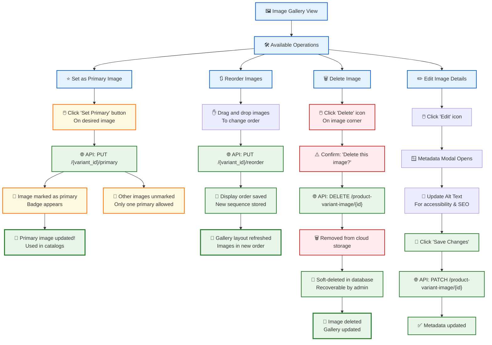
```mermaid
flowchart TD
    %% Gallery Entry
    A["🖼️ Image Gallery View"] --> B["🛠️ Available Operations"]
    
    %% Set Primary
    B --> C["⭐ Set as Primary Image"]
    C --> C1["🖱️ Click 'Set Primary' button<br/>On desired image"]
    C1 --> C2["🌐 API: PUT /{variant_id}/primary"]
    C2 --> C3["💾 Image marked as primary<br/>Badge appears"]
    C2 --> C4["🔄 Other images unmarked<br/>Only one primary allowed"]
    C3 --> C5["🎉 Primary image updated!<br/>Used in catalogs"]
    
    %% Reorder
    B --> D["🔃 Reorder Images"]
    D --> D1["✋ Drag and drop images<br/>To change order"]
    D1 --> D2["🌐 API: PUT /{variant_id}/reorder"]
    D2 --> D3["💾 Display order saved<br/>New sequence stored"]
    D3 --> D4["🎉 Gallery layout refreshed<br/>Images in new order"]
    
    %% Delete
    B --> E["🗑️ Delete Image"]
    E --> E1["🖱️ Click 'Delete' icon<br/>On image corner"]
    E1 --> E2["⚠️ Confirm: 'Delete this image?'"]
    E2 --> E3["🌐 API: DELETE /product-variant-image/{id}"]
    E3 --> E4["🗑️ Removed from cloud storage"]
    E4 --> E5["💾 Soft-deleted in database<br/>Recoverable by admin"]
    E5 --> E6["🎉 Image deleted<br/>Gallery updated"]
    
    %% Edit Metadata
    B --> F["✏️ Edit Image Details"]
    F --> F1["🖱️ Click 'Edit' icon"]
    F1 --> F2["🪟 Metadata Modal Opens"]
    F2 --> F3["📝 Update Alt Text<br/>For accessibility & SEO"]
    F3 --> F4["💾 Click 'Save Changes'"]
    F4 --> F5["🌐 API: PATCH /product-variant-image/{id}"]
    F5 --> F6["✅ Metadata updated"]
    
    %% Styling
    classDef operation fill:#e3f2fd,stroke:#1565c0,stroke-width:2px
    classDef primary fill:#fff8e1,stroke:#ff6f00,stroke-width:2px
    classDef delete fill:#ffebee,stroke:#c62828,stroke-width:2px
    classDef system fill:#e8f5e9,stroke:#2e7d32,stroke-width:2px
    classDef success fill:#e8f5e9,stroke:#2e7d32,stroke-width:3px
    
    class A,B,C,D,E,F operation
    class C1,C3,C4,C5 primary
    class E1,E2,E3,E4 delete
    class C2,D2,D3,E3,E5,F4,F5,F6 system
    class C5,D4,E6 success
```

### 🛠️ Image Operations Guide

| Operation | How to Do It | When to Use |
|-----------|--------------|-------------|
| **Set Primary** | Click ⭐ on image | Change which photo shows first |
| **Reorder** | Drag images left/right | Organize for better presentation |
| **Delete** | Click 🗑️ then confirm | Remove old/duplicate images |
| **Edit Alt Text** | Click ✏️ icon | Improve accessibility & SEO |

---

## 10. Product Category Management

### 10.1 Managing Product Categories

**Categories help you organize products hierarchically. Example: Electronics → Computers → Laptops**

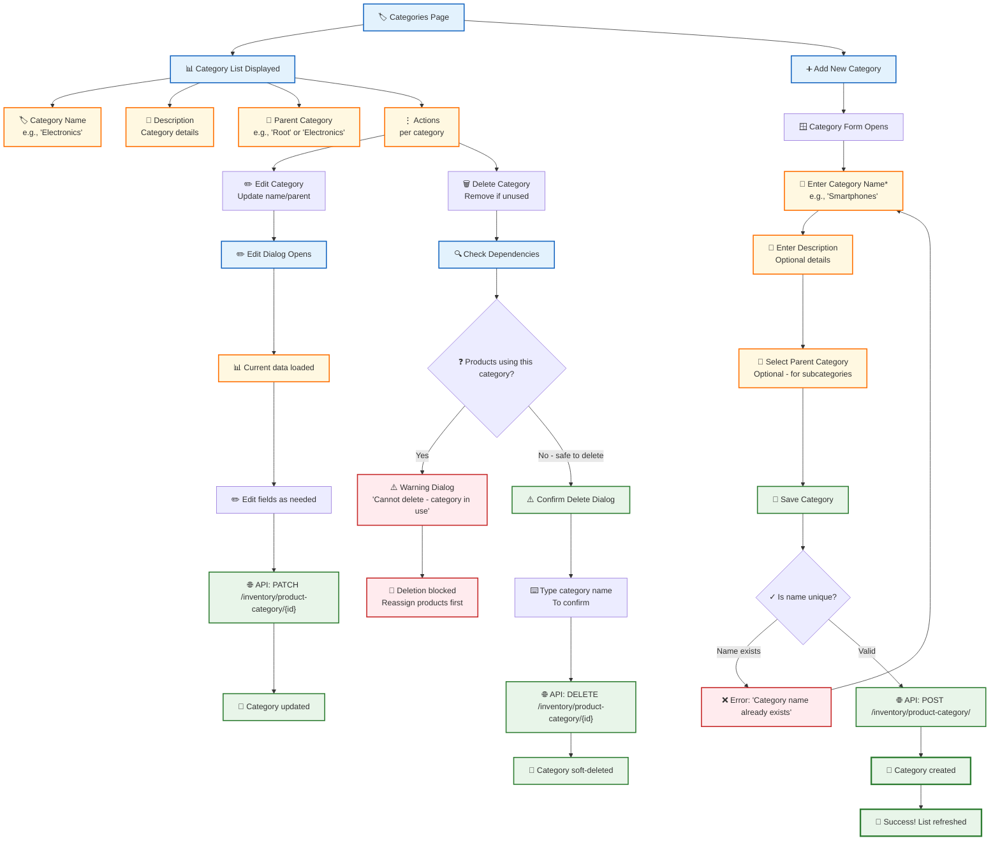
```mermaid
flowchart TD
    %% Entry
    A["🏷️ Categories Page"] --> B["📊 Category List Displayed"]
    
    %% List Columns
    B --> B1["🏷️ Category Name<br/>e.g., 'Electronics'"]
    B --> B2["📝 Description<br/>Category details"]
    B --> B3["📂 Parent Category<br/>e.g., 'Root' or 'Electronics'"]
    B --> B4["⋮ Actions<br/>per category"]
    
    %% Actions
    B4 --> B4a["✏️ Edit Category<br/>Update name/parent"]
    B4 --> B4b["🗑️ Delete Category<br/>Remove if unused"]
    
    %% Create Category
    A --> C["➕ Add New Category"]
    C --> C1["🪟 Category Form Opens"]
    C1 --> C2["📝 Enter Category Name*<br/>e.g., 'Smartphones'"]
    C2 --> C3["📄 Enter Description<br/>Optional details"]
    C3 --> C4["📂 Select Parent Category<br/>Optional - for subcategories"]
    C4 --> C5["💾 Save Category"]
    
    %% Validation
    C5 --> F{"✓ Is name unique?"}
    F -->|Name exists| F1["❌ Error: 'Category name already exists'"]
    F1 --> C2
    F -->|Valid| F2["🌐 API: POST /inventory/product-category/"]
    F2 --> F3["💾 Category created"]
    F3 --> F4["🎉 Success! List refreshed"]
    
    %% Edit Flow
    B4a --> D["✏️ Edit Dialog Opens"]
    D --> D1["📊 Current data loaded"]
    D1 --> D2["✏️ Edit fields as needed"]
    D2 --> D3["🌐 API: PATCH /inventory/product-category/{id}"]
    D3 --> D4["💾 Category updated"]
    
    %% Delete Flow
    B4b --> E["🔍 Check Dependencies"]
    E --> E1{"❓ Products using this category?"}
    E1 -->|Yes| E2["⚠️ Warning Dialog<br/>'Cannot delete - category in use'"]
    E2 --> E3["🛑 Deletion blocked<br/>Reassign products first"]
    E1 -->|No - safe to delete| E4["⚠️ Confirm Delete Dialog"]
    E4 --> E5["⌨️ Type category name<br/>To confirm"]
    E5 --> E6["🌐 API: DELETE /inventory/product-category/{id}"]
    E6 --> E7["💾 Category soft-deleted"]
    
    %% Styling
    classDef action fill:#e3f2fd,stroke:#1565c0,stroke-width:2px
    classDef info fill:#fff8e1,stroke:#ff6f00,stroke-width:2px
    classDef system fill:#e8f5e9,stroke:#2e7d32,stroke-width:2px
    classDef error fill:#ffebee,stroke:#c62828,stroke-width:2px
    classDef success fill:#e8f5e9,stroke:#2e7d32,stroke-width:3px
    
    class A,B,C,D,E action
    class B1,B2,B3,B4,C2,C3,C4,D1 info
    class C5,F2,F3,D3,D4,E4,E6,E7 system
    class F1,E2,E3 error
    class F3,F4 success
```

### 💡 Category Hierarchy Tips

| Level | Example | Use Case |
|-------|---------|----------|
| **Parent** | Electronics | Broad classification |
| **Child** | Computers | Sub-category under Electronics |
| **Grandchild** | Laptops | Specific under Computers |

- Products can only be assigned to the lowest level (leaf) categories
- Parent categories help with filtering and reporting
- Keep hierarchy shallow (2-3 levels) for simplicity

### 10.2 Category Listing with Filters

```mermaid
flowchart TD
    A["Category List Endpoint"] --> B["Filter Parameters"]
    
    B --> B1["Basic Filters"]
    B1 --> B1a["category_id"]
    B1 --> B1b["category_name - contains"]
    B1 --> B1c["category_code - exact"]
    B1 --> B1d["description - contains"]
    
    B --> B2["Date Range Filters"]
    B2 --> B2a["cd_start"]
    B2 --> B2b["cd_end"]
    
    B --> C["Sorting Options"]
    C --> C1["cd_asc/desc"]
    C --> C2["category_name_asc/desc"]
    
    B --> D["Response Structure"]
    C --> D
    D --> D1["total_count"]
    D --> D2["data[]"]
    D --> D3["category_id"]
    D --> D4["category_name"]
    D --> D5["description"]
    D --> D6["parent_category_id"]
    D --> D7["parent_category_name"]
```

### 10.3 Category Form Fields

| Field | Required | Description |
|-------|----------|-------------|
| Category Name | Yes | Unique name for the category |
| Description | No | Brief description of category |
| Parent Category | No | Hierarchical parent (optional) |
| Company ID | Auto | Current user's company |

---

## 11. Unit of Measure Management

### 11.1 Managing Units of Measure

**Units define how you measure your products (pieces, kg, liters). Set up base units and conversions for accurate inventory tracking.**

```mermaid
flowchart TD
    %% Entry
    A["⚖️ Units Management Page"] --> B["📊 Unit List Displayed"]
    
    %% List Columns
    B --> B1["📛 Unit Name<br/>e.g., 'Kilogram'"]
    B --> B2["🏷️ Symbol<br/>e.g., 'kg'"]
    B --> B3["🔢 Conversion Factor<br/>e.g., '1000' for grams"]
    B --> B4["⭐ Base Unit<br/>Yes/No indicator"]
    B --> B5["⋮ Actions<br/>per unit"]
    
    %% Actions
    B5 --> B5a["✏️ Edit Unit<br/>Update details"]
    B5 --> B5b["🗑️ Delete Unit<br/>Remove if unused"]
    
    %% Create Unit
    A --> C["➕ Add New Unit"]
    C --> C1["🪟 Unit Form Opens"]
    C1 --> C2["📝 Enter Unit Name*<br/>e.g., 'Gram'"]
    C2 --> C3["🏷️ Enter Unit Symbol*<br/>e.g., 'gm'"]
    C3 --> C4["⭐ Is this a Base Unit?<br/>Toggle ON/OFF"]
    
    %% Base vs Derived
    C4 --> D{"❓ Base Unit or Derived?"}
    D -->|Yes - Base Unit| D1["✅ Auto-set conversion_factor=1<br/>This is the standard"]
    D -->|No - Derived Unit| D2["📂 Select Base Unit*<br/>e.g., 'Kilogram'"]
    D2 --> D3["🔢 Enter Conversion Factor*<br/>How many = 1 base unit"]
    D3 --> D4["⚠️ Factor must be >= 2<br/>Or 0.1, 0.5 for smaller units"]
    
    %% Save
    D1 --> E["💾 Save Unit"]
    D4 --> E
    
    %% Validation
    E --> F{"✓ Is name/symbol unique?"}
    F -->|Already exists| F1["❌ Error: 'Unit name or symbol already exists'"]
    F1 --> C2
    F -->|Valid| F2["🌐 API: POST /inventory/unit-of-measure/"]
    F2 --> F3["💾 Unit created"]
    F3 --> F4["🎉 Success! List refreshed"]
    
    %% Edit Flow
    B5a --> G["✏️ Edit Dialog Opens"]
    G --> G1["📊 Current data loaded"]
    G1 --> G2["✏️ Edit fields as needed<br/>Cannot change base status"]
    G2 --> G3["🌐 API: PATCH /inventory/unit-of-measure/{id}"]
    G3 --> G4["💾 Unit updated"]
    
    %% Delete Flow
    B5b --> H["🔍 Check Dependencies"]
    H --> H1{"❓ Other units depend on this?"}
    H1 -->|Yes| H2["⚠️ Dependency Dialog<br/>'Cannot delete - units rely on this'"]
    H2 --> H3["📋 List of dependent units shown"]
    H3 --> H4["🛑 Delete dependent units first"]
    H1 -->|No| H5{"❓ Products use this unit?"}
    H5 -->|Yes - in use| H6["⚠️ Warning Dialog<br/>'Unit in use by products'"]
    H5 -->|No - safe| H7["⚠️ Confirm Delete Dialog"]
    H7 --> H8["🌐 API: DELETE /inventory/unit-of-measure/{id}"]
    H8 --> H9["💾 Unit soft-deleted"]
    
    %% Styling
    classDef action fill:#e3f2fd,stroke:#1565c0,stroke-width:2px
    classDef info fill:#fff8e1,stroke:#ff6f00,stroke-width:2px
    classDef system fill:#e8f5e9,stroke:#2e7d32,stroke-width:2px
    classDef error fill:#ffebee,stroke:#c62828,stroke-width:2px
    classDef success fill:#e8f5e9,stroke:#2e7d32,stroke-width:3px
    
    class A,B,C,D,E action
    class B1,B2,B3,B4,B5,C2,C3,C4,D1,D3,D4 info
    class C5,F2,F3,G3,G4,H7,H8,H9 system
    class F1,H2,H3,H4,H6 error
    class F3,F4 success
```

### ⚖️ Understanding Units

| Unit Type | Example | Conversion | Use Case |
|-----------|---------|------------|----------|
| **Base Unit** | Kilogram | 1 | Standard reference |
| **Larger Derived** | Tonne | 0.001 | 1 tonne = 1000 kg |
| **Smaller Derived** | Gram | 1000 | 1000 gm = 1 kg |
| **Count** | Pieces | 1 | Discrete items |

### 💡 Best Practices

1. **Start with base units** - Create kg, liter, piece first
2. **Use common symbols** - 'kg' not 'kilos', 'L' not 'liters'
3. **Conversion logic** - Derived units = how many = 1 base unit
4. **Cannot delete if used** - Products must switch units first
5. **Plan before creating** - Changing units affects all products using them

### 11.2 Unit Listing with Filters

```mermaid
flowchart TD
    A["Unit List Endpoint"] --> B["Filter Parameters"]
    
    B --> B1["Basic Filters"]
    B1 --> B1a["unit_of_measure_id"]
    B1 --> B1b["uom_name - contains"]
    B1 --> B1c["uom_code - exact"]
    
    B --> B2["Date Range Filters"]
    B2 --> B2a["cd_start"]
    B2 --> B2b["cd_end"]
    
    B --> C["Sorting Options"]
    C --> C1["cd_asc/desc"]
    C --> C2["uom_name_asc/desc"]
    
    B --> D["Response Structure"]
    C --> D
    D --> D1["total_count"]
    D --> D2["data[]"]
    D --> D3["unit_id"]
    D --> D4["unit_name"]
    D --> D5["unit_symbol"]
    D --> D6["conversion_factor"]
    D --> D7["is_base"]
    D --> D8["base_id"]
```

### 11.3 Unit Form Fields

| Field | Required | Description |
|-------|----------|-------------|
| Unit Name | Yes | Full name (e.g., Kilogram) |
| Unit Symbol | Yes | Short code (e.g., kg, gm) |
| Is Base Unit | Yes | Toggle for base/derived unit |
| Base Unit | Conditional | Required if not base unit |
| Conversion Factor | Conditional | Required if not base (>= 2) |
| Company ID | Auto | Current user's company |

### 11.4 Unit Relationships

```mermaid
flowchart LR
    A["Base Unit: Kilogram"] --> B["Derived: Gram"]
    A --> C["Derived: Milligram"]
    A --> D["Derived: Tonne"]
    
    B --> B1["conversion_factor: 1000"]
    B --> B2["1 kg = 1000 gm"]
    
    C --> C1["conversion_factor: 1000000"]
    C --> C2["1 kg = 1000000 mg"]
    
    D --> D1["conversion_factor: 0.001"]
    D --> D2["1 kg = 0.001 tonne"]
```

---

## 12. Data Models

### 12.1 Entity Relationship Diagram

```mermaid
erDiagram
    PRODUCT ||--o{ PRODUCT_VARIANT : has
    PRODUCT ||--o{ PRODUCT_PRICE : has
    PRODUCT ||--o{ INVENTORY_STOCK : has
    PRODUCT }o--o{ PRODUCT_GROUP : belongs_to
    PRODUCT ||--|| PRODUCT_CATEGORY : classified_by
    
    PRODUCT_VARIANT ||--o{ PRODUCT_PRICE : has
    PRODUCT_VARIANT ||--o{ INVENTORY_STOCK : has
    PRODUCT_VARIANT ||--o{ PRODUCT_VARIANT_IMAGE : has
    PRODUCT_VARIANT }o--o{ VARIANT_GROUP : belongs_to
    PRODUCT_VARIANT ||--|| UNIT_OF_MEASURE : measured_in
    
    PRODUCT_GROUP ||--o{ PRODUCT_GROUP_ITEMS : contains
    VARIANT_GROUP ||--o{ VARIANT_GROUP_ITEMS : contains
    
    PRODUCT ||--o{ BATCH : tracked_by
    PRODUCT_VARIANT ||--o{ BATCH : tracked_by
    
    PRODUCT {
        int product_id PK
        string product_name
        string product_code
        int category_id FK
        string description
        int reorder_level
        int safety_stock
        boolean is_active
        int company_id FK
    }
    
    PRODUCT_VARIANT {
        int variant_id PK
        int product_id FK
        string sku
        string attribute_name
        string attribute_value
        int unit_id FK
        int reorder_level
        int safety_stock
        boolean is_active
    }
    
    PRODUCT_PRICE {
        int price_id PK
        int product_id FK
        int variant_id FK
        timestamp effective_date
        decimal purchase_price
        decimal retail_price
        decimal selling_price
        decimal damage_price
        int currency_id FK
        boolean is_active
    }
    
    PRODUCT_CATEGORY {
        int category_id PK
        string category_name
        int parent_category_id FK
        string description
    }
    
    PRODUCT_GROUP {
        int product_group_id PK
        string group_name
        string description
        boolean is_active
        int company_id FK
    }
    
    VARIANT_GROUP {
        int variant_group_id PK
        string group_name
        string description
        boolean is_active
        int company_id FK
    }
    
    UNIT_OF_MEASURE {
        int unit_id PK
        string unit_name
        string unit_symbol
        decimal conversion_factor
        boolean is_base
    }
    
    PRODUCT_VARIANT_IMAGE {
        int image_id PK
        int variant_id FK
        string s3_key
        string file_name
        int file_size
        string mime_type
        boolean is_primary
        int display_order
        string alt_text
        string upload_status
    }
```

### 10.2 API Endpoints Reference

```mermaid
flowchart LR
    A["Product APIs"] --> A1["GET /inventory/product/"]
    A --> A2["POST /inventory/product/"]
    A --> A3["POST /inventory/product/nested"]
    A --> A4["GET /inventory/product/{id}"]
    A --> A5["PATCH /inventory/product/{id}"]
    A --> A6["DELETE /inventory/product/{id}"]
    A --> A7["POST /inventory/product/batch-delete"]
    A --> A8["GET /inventory/product/search"]
    
    B["Variant APIs"] --> B1["GET /inventory/product-variant/"]
    B --> B2["GET /inventory/product-variant/nested"]
    B --> B3["POST /inventory/product-variant/"]
    B --> B4["POST /inventory/product-variant/nested"]
    B --> B5["PATCH /inventory/product-variant/{id}"]
    B --> B6["DELETE /inventory/product-variant/{id}"]
    B --> B7["POST /inventory/product-variant/batch-delete"]
    B --> B8["POST /inventory/product-variant/by-ids"]
    
    C["Price APIs"] --> C1["GET /inventory/product-price/"]
    C --> C2["POST /inventory/product-price/"]
    C --> C3["PATCH /inventory/product-price/{id}"]
    C --> C4["DELETE /inventory/product-price/{id}"]
    
    D["Group APIs"] --> D1["GET /inventory/product-group/"]
    D --> D2["POST /inventory/product-group/"]
    D --> D3["GET /inventory/product-group/{id}"]
    D --> D4["PATCH /inventory/product-group/{id}"]
    D --> D5["DELETE /inventory/product-group/{id}"]
    D --> D6["POST /inventory/product-group/{id}/items"]
    
    E["Category APIs"] --> E1["GET /inventory/product-category/"]
    E --> E2["POST /inventory/product-category/"]
    E --> E3["PATCH /inventory/product-category/{id}"]
    E --> E4["DELETE /inventory/product-category/{id}"]
    
    F["Image APIs"] --> F1["GET /product-variant-image/{variant_id}"]
    F --> F2["POST /product-variant-image/upload"]
    F --> F3["POST /product-variant-image/batch-upload"]
    F --> F4["PUT /product-variant-image/{variant_id}/primary"]
    F --> F5["PUT /product-variant-image/{variant_id}/reorder"]
    F --> F6["DELETE /product-variant-image/{image_id}"]
    F --> F7["POST /product-variant-image/presigned-url/request"]
    
    G["Import APIs"] --> G1["POST /inventory/product/import-excel"]
    G --> G2["POST /inventory/product/import-excel-nested"]
```

---

## Appendix: UI Component Mapping

### Frontend Page Structure

```
/src/pages/products/
├── Products.tsx              # Main listing page
├── ProductStats.tsx        # Statistics view

/src/pages/product-groups/
└── ProductGroups.tsx       # Group management

/src/pages/categories/
├── Categories.tsx          # Category listing
└── new/
    └── AddCategory.tsx     # Category creation

/src/pages/units/
├── Units.tsx               # Unit listing
└── new/
    └── AddUnit.tsx         # Unit creation

/src/components/forms/
├── ProductForm.tsx         # Product creation/edit
├── AddVariantModal.tsx     # Variant creation
├── ProductPriceForm.tsx    # Price management
├── ProductGroupForm.tsx    # Group creation/edit
├── AssignGroupForm.tsx     # Assign to group
├── AssignProductForm.tsx   # Assign products to group
├── CreateVariantDirectlyModal.tsx  # Direct variant creation
├── EditVariantPriceForm.tsx # Variant price edit
├── CategoryForm.tsx        # Category creation/edit
└── UnitForm.tsx            # Unit creation/edit

/src/components/
├── ProductsFilter.tsx      # Filter panel
├── ProductGroupFilter.tsx  # Group filter
├── shared/
│   ├── ProductImageGallery.tsx  # Image management
│   └── ActiveInactiveStatus.tsx # Status badge

/src/lib/api/
├── productsApi.ts          # Product API calls
├── productVariantApi.ts    # Variant API calls
├── productPricesApi.ts     # Price API calls
├── productGroupApi.ts      # Group API calls
├── productVariantImageApi.ts # Image API calls
├── categoryApi.ts          # Category API calls
└── unitOfMeasure.ts        # Unit API calls

/src/lib/schema/
├── products.ts             # Product schemas
├── productVariants.ts      # Variant schemas
```

---

## Summary

The Product Module provides a comprehensive inventory management solution with the following key capabilities:

1. **Complete Product Lifecycle**: Create, read, update, delete products with full nested data (variants, prices, inventory)
2. **Flexible Variant Management**: Support for multiple SKUs per product with attribute-based differentiation
3. **Advanced Pricing**: Multiple price types with effective date tracking
4. **Organizational Tools**: Categories and groups for product classification
5. **Bulk Operations**: Excel import/export with validation and batch delete
6. **Media Management**: Image upload with primary image support and gallery management
7. **Search & Discovery**: Elasticsearch-powered search with extensive filtering
8. **Stock Integration**: Initial inventory setup with location tracking

All workflows follow a consistent pattern: **List → Select → Action → Form → Validate → Submit → Feedback → Refresh**.
