# Purchase Module - User Manual Flow Diagrams

## Table of Contents
1. [Overview](#overview)
2. [Purchase Module Entry Point](#1-purchase-module-entry-point)
3. [Purchase Order Creation Workflow](#2-purchase-order-creation-workflow)
4. [Purchase Order Listing & Search](#3-purchase-order-listing--search)
5. [Goods Receipt (GRN) Workflow](#4-goods-receipt-grn-workflow)
6. [Purchase Return Workflow](#5-purchase-return-workflow)
7. [Payment Workflow](#6-payment-workflow)
8. [Purchase Order Status Management](#7-purchase-order-status-management)
9. [Purchase Order Cancellation & Deletion](#8-purchase-order-cancellation--deletion)
10. [Supplier Management](#9-supplier-management)
11. [Data Models](#10-data-models)

---

## Overview

The Purchase Module manages all procurement operations in Shoudagor ERP. It handles the complete purchase lifecycle from order creation to goods receipt, returns, and supplier payments.

### Key Entities
- **Purchase Order (PO)**: Master order document with supplier, date, location
- **Purchase Order Detail**: Line items with product, quantity, price, discounts
- **ProductOrderDeliveryDetail**: Records of goods received (GRN entries)
- **ProductOrderPaymentDetail**: Records of payments made to suppliers
- **Supplier**: Vendor information with contact details and balance tracking

### Core Functions
- **Create PO**: Raise purchase orders to suppliers
- **Receive Goods**: Record deliveries and update inventory (GRN)
- **Process Returns**: Return damaged/excess goods to suppliers
- **Make Payments**: Pay suppliers against purchase orders
- **Track Status**: Monitor order, payment, and delivery status
- **Supplier Balance**: Track payable amounts per supplier

---

## 1. Purchase Module Entry Point

### User Journey Overview

```mermaid
flowchart TD
    %% User Entry
    A["👤 User logs into Shoudagor ERP"] --> B{"📍 Where do you want to go?"}
    
    %% Navigation Options
    B -->|Click 'Purchases'<br/>in main menu| C["📋 Purchases Listing Page"]
    B -->|Click 'Suppliers'<br/>in main menu| D["🏭 Suppliers Page"]
    B -->|Click 'New Purchase'<br/>quick action| E["➕ Create Purchase Order"]
    
    %% Purchases Page Components
    C --> C1["📊 Purchase Orders Table"]
    C --> C2["🔍 Search & Filter Panel"]
    C --> C3["⚡ Quick Action Buttons"]
    
    %% Table Columns
    C1 --> C1a["Order Number<br/>PO-XXXX format"]
    C1 --> C1b["Supplier Name<br/>Who you're buying from"]
    C1 --> C1c["Order Date<br/>When PO was created"]
    C1 --> C1d["Expected Delivery<br/>When goods should arrive"]
    C1 --> C1e["Total Amount<br/>Order value"]
    C1 --> C1f["Status<br/>Open/Partial/Completed/Cancelled"]
    C1 --> C1g["Payment Status<br/>Pending/Partial/Paid"]
    C1 --> C1h["Delivery Status<br/>Pending/Partial/Received"]
    
    %% Search & Filters
    C2 --> C2a["🔎 Search by order number"]
    C2 --> C2b["🏭 Filter by Supplier"]
    C2 --> C2c["📍 Filter by Location"]
    C2 --> C2d["✓ Filter by Status"]
    C2 --> C2e["📅 Date range filter"]
    C2 --> C2f["💰 Amount range filter"]
    
    %% Action Buttons
    C3 --> C3a["➕ New Purchase"]
    C3 --> C3b["📥 Download Report"]
    
    %% Row Actions
    C --> C4["⋮ Actions Menu (per row)"]
    C4 --> C4a["💰 Make Payment"]
    C4 --> C4b["🚚 Get Delivery (GRN)"]
    C4 --> C4c["📦 Return Purchase"]
    C4 --> C4d["👁️ View Details"]
    C4 --> C4e["🗑️ Delete"]
    
    %% Suppliers Page
    D --> D1["📋 Suppliers Table"]
    D --> D2["➕ Add Supplier Button"]
    
    %% Styling
    classDef userAction fill:#e1f5ff,stroke:#01579b,stroke-width:2px
    classDef page fill:#fff8e1,stroke:#ff6f00,stroke-width:2px
    classDef component fill:#f3e5f5,stroke:#7b1fa2,stroke-width:2px
    classDef data fill:#e8f5e9,stroke:#2e7d32,stroke-width:2px
    
    class A,B,C,D,E userAction
    class C1,D1 page
    class C2,C3,C4,D2 component
    class C1a,C1b,C1c,C1d,C1e,C1f,C1g,C1h,C2a,C2b,C2c,C2d,C2e,C2f,C3a,C3b,C4a,C4b,C4c,C4d,C4e data
```

### How to Navigate the Purchases Page

1. **Getting There**: Click "Purchases" in the left sidebar menu after logging in
2. **What You See**: A table listing all purchase orders with filtering options above
3. **Quick Actions**: Use the "New Purchase" button to create orders, "Download Report" for PDF export
4. **Row Actions**: Click the "⋮" (three dots) on any row to access payments, delivery, returns, or delete

### UI Elements - Purchases List Page

| Component | Type | Description |
|-----------|------|-------------|
| Search Input | Text Field | Search by order number |
| Supplier Filter | Dropdown | Filter by specific supplier |
| Location Filter | Dropdown | Filter by delivery location |
| Status Filter | Dropdown | Pending/Received/Cancelled |
| Order Date Range | Date Picker | Filter by order creation date |
| Delivery Date Range | Date Picker | Filter by expected delivery date |
| Amount Range | Slider | Min/Max amount filter |
| New Purchase | Button | Navigate to creation page |
| Download Report | Button | Generate PDF report |
| Purchases Table | Data Table | Paginated list with sorting |
| Actions Menu | Dropdown | Payment, Delivery, Return, View, Delete |

---

## 2. Purchase Order Creation Workflow

### 2.1 Step-by-Step: Creating a New Purchase Order

**Overview**: This workflow guides you through creating a purchase order with all items, pricing, and supplier details.

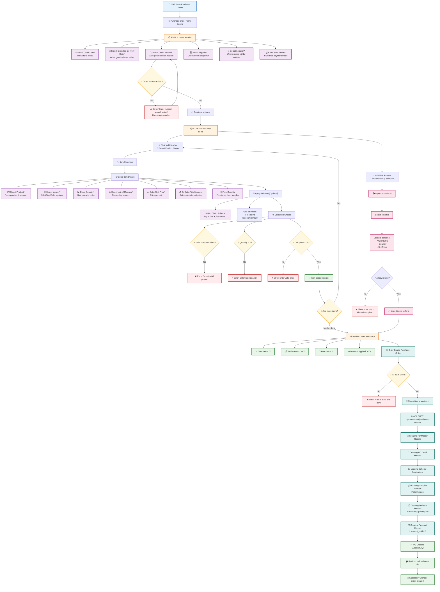

### 💡 Tips for Purchase Order Creation

1. **Supplier Selection**: Choose from existing suppliers (add new suppliers in Suppliers page first)
2. **Location**: Select where goods will be received (affects inventory stock location)
3. **Order Number**: Leave blank for auto-generation, or enter custom format
4. **Product Selection**: Search products by name, then select specific variant (SKU)
5. **Scheme Benefits**: Apply claim schemes for automatic discounts/free items
6. **Excel Import**: Use bulk import for large orders - download template first
7. **Advance Payment**: Enter amount paid if you're paying upfront

### 2.2 Field Requirements & Validation

| Field | Required | Validation Rules |
|-------|----------|------------------|
| Order Date | Yes | Valid date, defaults to today |
| Expected Delivery | Yes | Must be today or future date |
| Order Number | No | Unique per company if provided |
| Supplier | Yes | Must exist in system |
| Location | Yes | Must exist in system |
| Product | Yes | Must exist in system |
| Variant | Yes | Must belong to selected product |
| Quantity | Yes | Number > 0 |
| Unit of Measure | Yes | Must exist in system |
| Unit Price | Yes | Number >= 0 |

### 2.3 Excel Import Format

Your import file must have these columns:

| Column | Required | Description |
|--------|----------|-------------|
| **VariantSKU** | Yes | SKU of the variant to order |
| **ProductCode** | Alternative | Product code + VariantAttribute |
| **Quantity** | Yes | How many to order |
| **UnitPrice** | Yes | Price per unit |
| **UnitName** | No | Unit of measure (matches variant if omitted) |
| **VariantAttribute** | No | Required if using ProductCode instead of SKU |

---

## 3. Purchase Order Listing & Search

### 3.1 How the Purchases Page Loads

**What happens when you open the Purchases page:**

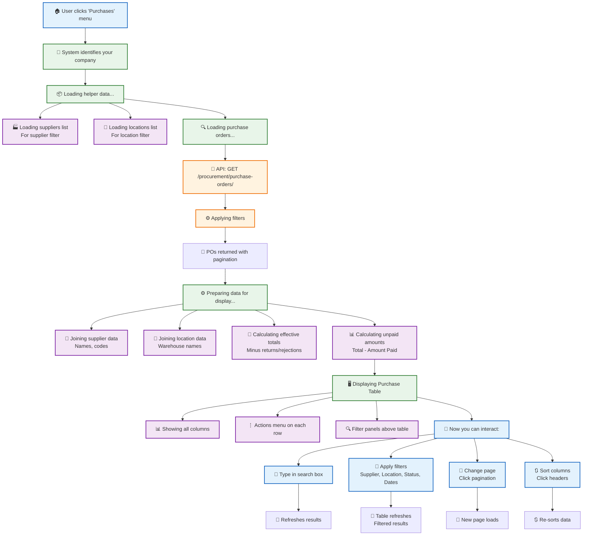

### 📱 Quick Guide: Finding Purchase Orders

| What you want to do | How to do it |
|---------------------|--------------|
| **Search by PO number** | Type in search box |
| **Filter by supplier** | Use "Supplier" dropdown |
| **Filter by location** | Use "Location" dropdown |
| **Show pending orders** | Use "Status" filter → Pending |
| **Find unpaid orders** | Sort by "Amount Unpaid" column |
| **View date range** | Use Order Date or Delivery Date filters |
| **Make payment** | Click "⋮" → Make Payment |
| **Record delivery** | Click "⋮" → Get Delivery |

### 3.2 Purchase Order Status Badges

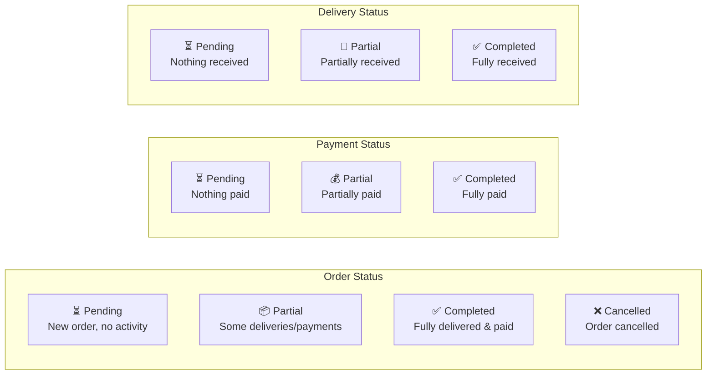

---

## 4. Goods Receipt (GRN) Workflow

### 4.1 Step-by-Step: Recording a Delivery (GRN)

**Overview**: Use this workflow when goods arrive from the supplier. This creates the Goods Received Note (GRN) and updates inventory.

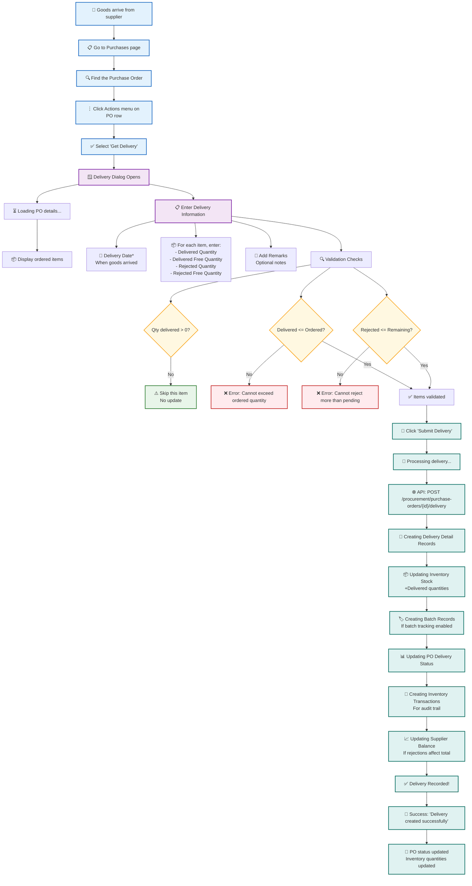

### 💡 Tips for Recording Deliveries

1. **Delivery Date**: Use the actual date goods arrived (may differ from expected date)
2. **Partial Deliveries**: You can record partial quantities - PO stays "Partial" status
3. **Rejected Items**: Record rejections for damaged/incorrect items - affects supplier balance
4. **Free Items**: Record delivered free quantities separately from ordered quantities
5. **Batch Creation**: If batch tracking is enabled, new batches are auto-created for received items
6. **Inventory Updates**: Stock is immediately added to the selected location

### 4.2 Understanding GRN Quantities

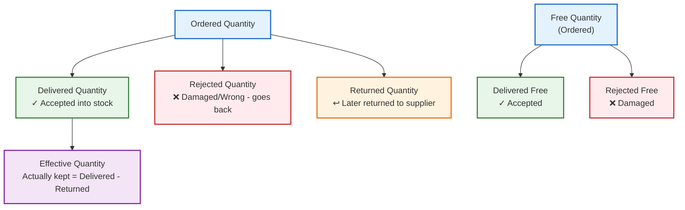

---

## 5. Purchase Return Workflow

### 5.1 Step-by-Step: Processing a Return to Supplier

**Overview**: Use this workflow when returning goods to the supplier (damaged, excess, wrong items).

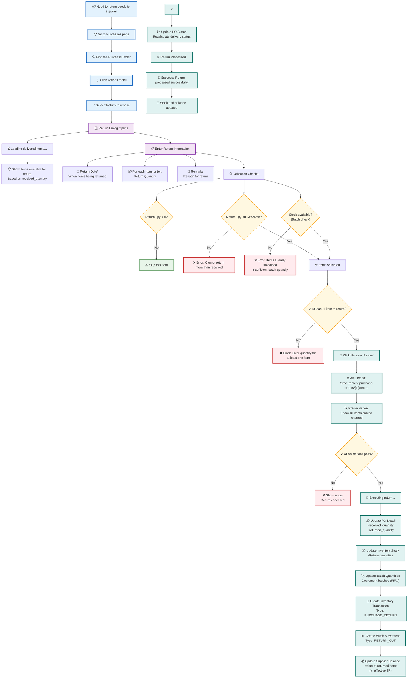

### 💡 Tips for Purchase Returns

1. **Return Eligibility**: Can only return items that have been received (based on received_quantity)
2. **Batch Tracking**: System checks batch availability - cannot return already-sold items
3. **FIFO Returns**: Batch quantities are reduced using FIFO (First In, First Out) method
4. **Supplier Balance**: Return value (at effective TP) is deducted from supplier balance
5. **Inventory Impact**: Stock is immediately reduced from the location
6. **Status Update**: PO delivery status is recalculated after return

### 5.2 Return vs Rejection

| Aspect | Rejection (During Delivery) | Return (After Acceptance) |
|--------|----------------------------|------------------------|
| **When** | At time of receiving goods | After goods accepted into stock |
| **Stock Impact** | Never added to inventory | Deducted from inventory |
| **Batch Impact** | No batch created for rejected | Batch quantity reduced |
| **Transaction** | No inventory transaction | PURCHASE_RETURN transaction |
| **Calculation** | Deducted from order total | Deducted from supplier balance |

---

## 6. Payment Workflow

### 6.1 Step-by-Step: Making a Payment to Supplier

**Overview**: Use this workflow to record payments made to suppliers against purchase orders.

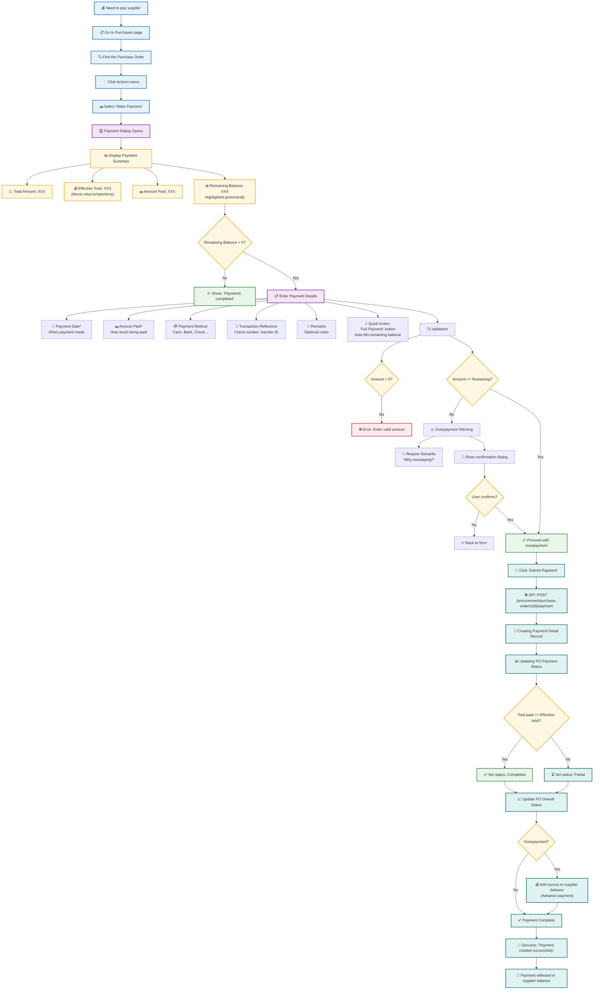

### 💡 Tips for Supplier Payments

1. **Full Payment Button**: Use "Full Payment" button to auto-fill the remaining balance
2. **Partial Payments**: Make multiple partial payments - system tracks cumulative amount paid
3. **Overpayments**: System allows overpayment with confirmation; excess goes to supplier balance as advance
4. **Payment Methods**: Enter method (Cash, Bank Transfer, Check) for record keeping
5. **Reference Number**: Record check numbers or transaction IDs for reconciliation
6. **Effective Total**: Payments are matched against effective total (minus returns/rejections)

---

## 7. Purchase Order Status Management

### 7.1 Status Flow Diagram

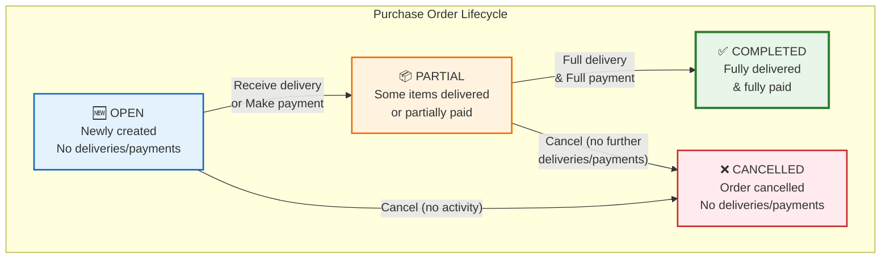

### 7.2 How Status Updates Work

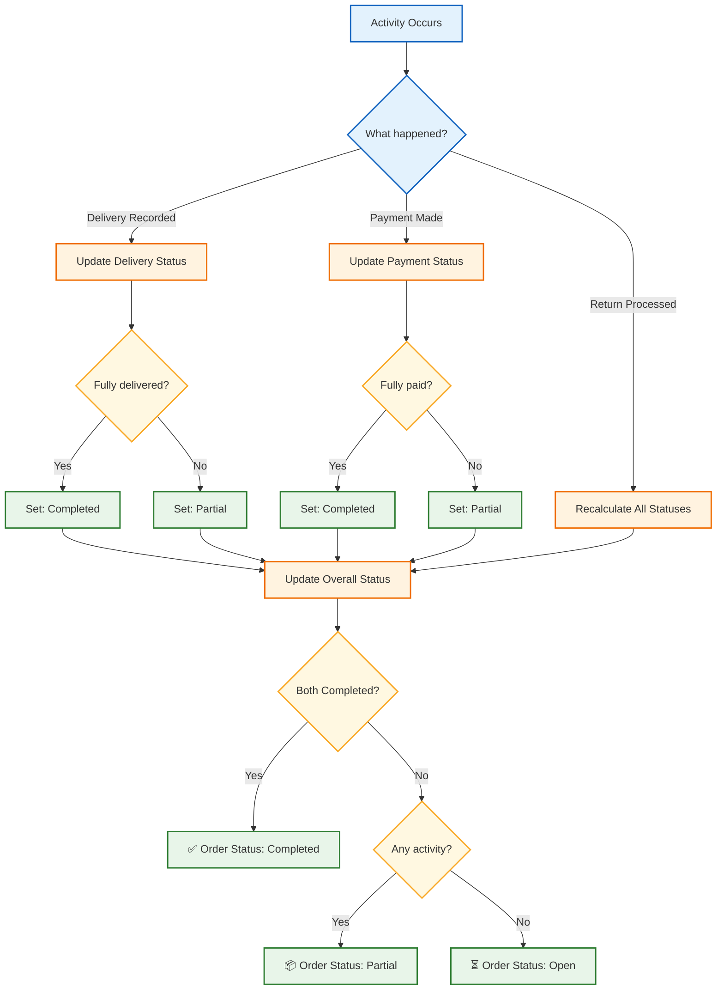

---

## 8. Purchase Order Cancellation & Deletion

### 8.1 Cancellation Workflow

**Cancel**: Soft-close an order that won't be fulfilled (reverses supplier balance).

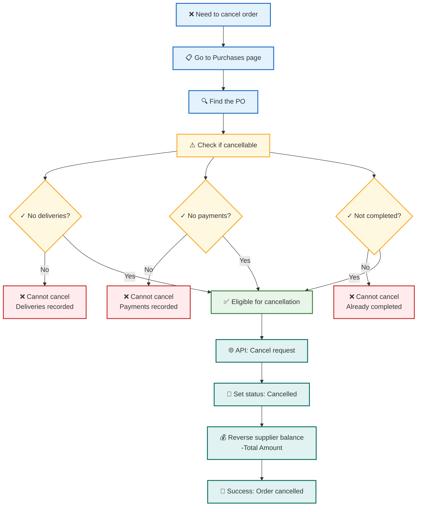

### 8.2 Deletion Workflow

**Delete**: Permanently remove an order (only allowed if no deliveries/payments).

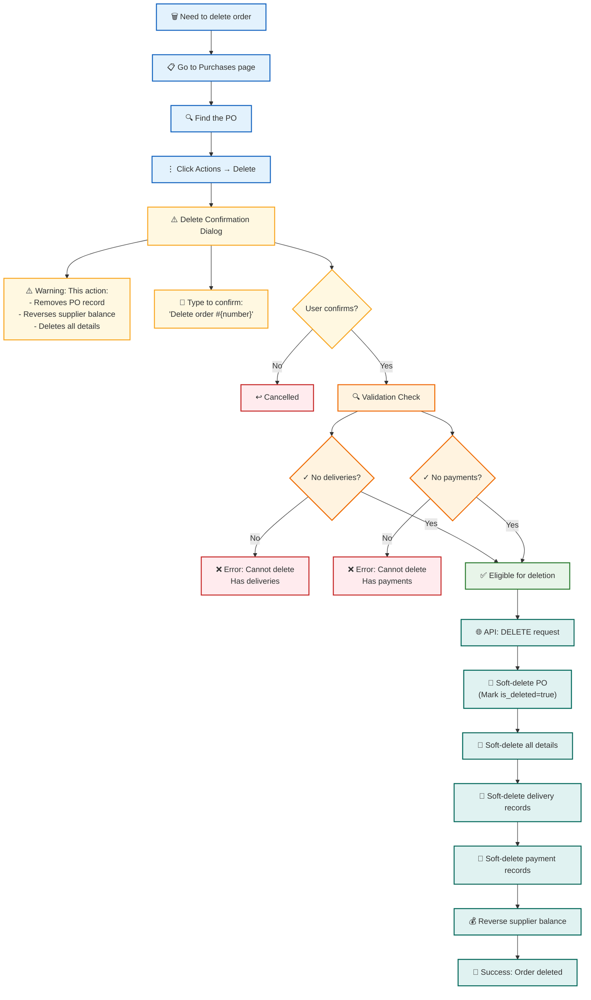

### 💡 Cancel vs Delete

| Aspect | Cancel | Delete |
|--------|--------|--------|
| **Purpose** | Stop order, keep record | Completely remove order |
| **Record** | PO marked "Cancelled" | PO soft-deleted (hidden) |
| **History** | Visible in list with status | Removed from main list |
| **Reversible** | No (permanent status) | Admin can restore |
| **Requirements** | No deliveries, no payments | Same as cancel |
| **Supplier Balance** | Reversed | Reversed |

---

## 9. Supplier Management

### 9.1 Supplier Entry Point

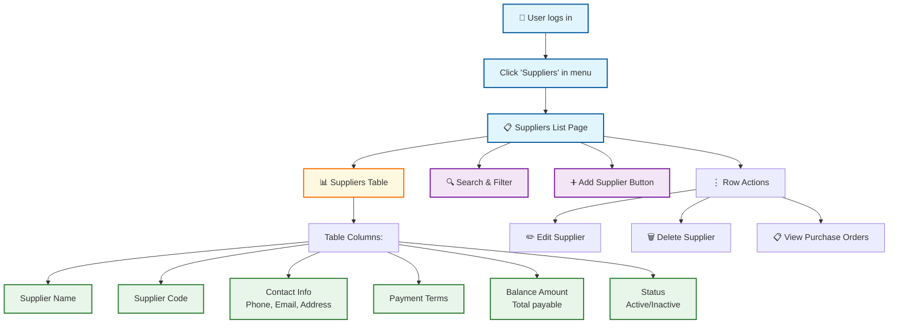

### 9.2 Supplier Balance Tracking

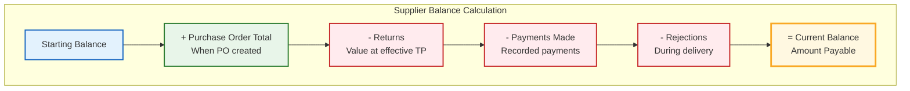

### 💡 Supplier Management Tips

1. **Balance Tracking**: Supplier balance automatically updates with every PO, return, and payment
2. **Payment Terms**: Record terms (e.g., "Net 30", "COD") for reference
3. **Contact Info**: Maintain complete address, phone, email for communication
4. **Code**: Use consistent supplier codes for easy identification
5. **Active Status**: Mark inactive suppliers to hide from PO dropdowns
6. **Purchase History**: View all POs for a supplier from the actions menu

---

## 10. Data Models

### 10.1 Purchase Order Entity Relationships

```mermaid
erDiagram
    PURCHASE_ORDER ||--o{ PURCHASE_ORDER_DETAIL : contains
    PURCHASE_ORDER ||--o{ PRODUCT_ORDER_PAYMENT_DETAIL : has
    PURCHASE_ORDER }o--|| SUPPLIER : from
    PURCHASE_ORDER }o--|| STORAGE_LOCATION : to
    PURCHASE_ORDER_DETAIL ||--o{ PRODUCT_ORDER_DELIVERY_DETAIL : receives
    PURCHASE_ORDER_DETAIL ||--o{ BATCH : creates
    PURCHASE_ORDER_DETAIL }o--|| PRODUCT : orders
    PURCHASE_ORDER_DETAIL }o--|| PRODUCT_VARIANT : specifies
    
    PURCHASE_ORDER {
        int purchase_order_id PK
        string order_number
        int supplier_id FK
        int location_id FK
        date order_date
        date expected_delivery_date
        decimal total_amount
        decimal amount_paid
        string status
        string payment_status
        string delivery_status
        int company_id
    }
    
    PURCHASE_ORDER_DETAIL {
        int purchase_order_detail_id PK
        int purchase_order_id FK
        int product_id FK
        int variant_id FK
        decimal quantity
        decimal unit_price
        decimal received_quantity
        decimal free_quantity
        decimal returned_quantity
        decimal rejected_quantity
        decimal discount_amount
        boolean is_free_item
    }
    
    PRODUCT_ORDER_DELIVERY_DETAIL {
        int delivery_detail_id PK
        int purchase_order_detail_id FK
        date delivery_date
        decimal delivered_quantity
        decimal delivered_free_quantity
        decimal rejected_quantity
        int received_by
    }
    
    PRODUCT_ORDER_PAYMENT_DETAIL {
        int payment_detail_id PK
        int purchase_order_id FK
        date payment_date
        decimal amount_paid
        string payment_method
        string transaction_reference
    }
    
    SUPPLIER {
        int supplier_id PK
        string supplier_name
        string supplier_code
        string payment_terms
        decimal balance_amount
        string phone
        string email
        string address
    }
```

### 10.2 Status Values Reference

| Entity | Status Values | Description |
|--------|--------------|-------------|
| **Purchase Order** | Open, Partial, Completed, Cancelled | Overall order status |
| **Payment Status** | Pending, Partial, Completed | Payment completion |
| **Delivery Status** | Pending, Partial, Completed | Goods receipt completion |

### 10.3 Important Calculations

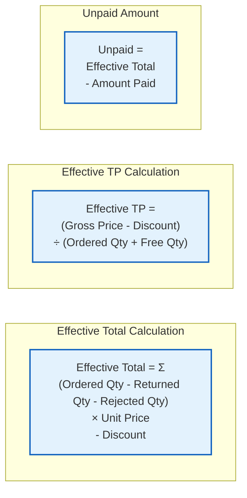

---

## Summary

The Purchase Module provides comprehensive procurement management capabilities:

### Key Workflows:
1. **Create PO** → Add items → Submit → Update supplier balance
2. **Receive Goods** → Record delivery → Update inventory → Create batches
3. **Process Returns** → Select items → Reduce stock → Update supplier balance
4. **Make Payments** → Enter amount → Update payment status → Track balance

### Status Tracking:
- **Order Status**: Open → Partial → Completed/Cancelled
- **Payment Status**: Pending → Partial → Completed
- **Delivery Status**: Pending → Partial → Completed

### Integration Points:
- **Inventory**: Deliveries add stock, returns deduct stock
- **Batches**: Deliveries create new batches with supplier info
- **Suppliers**: Balance tracks total payable, updated by all transactions
- **Accounting**: All transactions create audit trail entries

### Security & Validation:
- Cannot delete PO with deliveries or payments
- Cannot cancel completed orders
- Cannot return more than received
- Batch availability checked before returns
- Overpayments require confirmation with remarks
