# Sale Module - User Manual Flow Diagrams

## Table of Contents
1. [Overview](#overview)
2. [Sale Module Entry Point](#1-sale-module-entry-point)
3. [Sales Order Creation Workflow](#2-sales-order-creation-workflow)
4. [Sales Order Listing & Search](#3-sales-order-listing--search)
5. [Sales Order Edit/Update Workflow](#4-sales-order-editupdate-workflow)
6. [Customer Management Workflow](#5-customer-management-workflow)
7. [Payment Management Workflow](#6-payment-management-workflow)
8. [Delivery Management Workflow](#7-delivery-management-workflow)
9. [Returns & Rejections Workflow](#8-returns--rejections-workflow)
10. [DSR Assignment Workflow](#9-dsr-assignment-workflow)
11. [SR Order Workflow](#10-sr-order-workflow)
12. [Data Models](#11-data-models)

---

## Overview

The Sale Module is the central order management system of Shoudagor ERP. It manages the complete sales lifecycle including customer management, sales orders, payments, deliveries, returns, and SR (Sales Representative) operations.

### Key Entities
- **Customer**: Master customer data with credit limits and beat assignments
- **Sales Order**: Main order document with header and line items
- **Sales Order Detail**: Individual line items with products, quantities, and pricing
- **Sales Order Payment Detail**: Payment records linked to orders
- **Sales Order Delivery Detail**: Delivery/shipment records
- **SR Order**: Orders created by Sales Representatives
- **Sales Representative**: Field sales staff with customer assignments
- **DSR (Delivery Sales Representative)**: Delivery personnel with SO assignments
- **Beat**: Geographic sales territories/routes

---

## 1. Sale Module Entry Point

### User Journey Overview

```mermaid
flowchart TD
    %% User Entry
    A["👤 User logs into Shoudagor ERP"] --> B{"📍 Where do you want to go?"}
    
    %% Navigation Options
    B -->|Click 'Sales'<br/>in main menu| C["🛒 Sales Orders Listing Page"]
    B -->|Click 'Customers'<br/>in main menu| D["👥 Customers Page"]
    B -->|Click 'SR Orders'<br/>in main menu| E["📋 SR Orders Page"]
    B -->|Click 'Sales Reps'<br/>in main menu| F["🧑‍💼 Sales Representatives Page"]
    B -->|Click 'DSR'<br/>in main menu| G["🚚 Delivery Sales Representatives Page"]
    B -->|Click 'Beats'<br/>in main menu| H["🗺️ Beats/Routes Page"]
    
    %% Sales Page Components
    C --> C1["📊 Sales Orders Table"]
    C --> C2["🔍 Search & Filter Panel"]
    C --> C3["⚡ Quick Action Buttons"]
    
    %% Table Columns
    C1 --> C1a["Order Number<br/>Unique identifier"]
    C1 --> C1b["Customer<br/>Name & Code"]
    C1 --> C1c["Location<br/>Storage/Warehouse"]
    C1 --> C1d["Order Date<br/>Creation date"]
    C1 --> C1e["Shipment Date<br/>Expected delivery"]
    C1 --> C1f["Status<br/>Open/Delivered/Cancelled"]
    C1 --> C1g["Payment Status<br/>Pending/Partial/Paid"]
    C1 --> C1h["Delivery Status<br/>Pending/Shipped/Delivered"]
    C1 --> C1i["DSR Info<br/>Assigned delivery rep"]
    C1 --> C1j["Total Amount<br/>Order value"]
    C1 --> C1k["Effective Total<br/>After returns"]
    C1 --> C1l["Paid/Unpaid<br/>Payment tracking"]
    
    %% Search & Filters
    C2 --> C2a["🔎 Search by order number"]
    C2 --> C2b["👤 Filter by Customer"]
    C2 --> C2c["📍 Filter by Location"]
    C2 --> C2d["📊 Filter by Status"]
    C2 --> C2e["💰 Filter by Amount Range"]
    C2 --> C2f["📅 Order Date Range"]
    C2 --> C2g["📅 Shipment Date Range"]
    
    %% Action Buttons
    C3 --> C3a["➕ New Sale"]
    C3 --> C3b["📥 Download Report"]
    
    %% Row Actions
    C --> C4["⋮ Actions Menu (per row)"]
    C4 --> C4a["🖨️ Quick Print Invoice"]
    C4 --> C4b["📄 Generate Formal Invoice"]
    C4 --> C4c["💰 Make Payment"]
    C4 --> C4d["🚚 Make Delivery"]
    C4 --> C4e["↩️ Process Return"]
    C4 --> C4f["🚚 Add to DSR"]
    C4 --> C4g["👁️ View Payments"]
    C4 --> C4h["👁️ View Deliveries"]
    
    %% Customers Page
    D --> D1["👥 Customers Table"]
    D --> D2["➕ Add Customer Button"]
    D --> D3["📤 Import/Export"]
    
    %% Styling
    classDef userAction fill:#e1f5ff,stroke:#01579b,stroke-width:2px
    classDef page fill:#fff8e1,stroke:#ff6f00,stroke-width:2px
    classDef component fill:#f3e5f5,stroke:#7b1fa2,stroke-width:2px
    classDef data fill:#e8f5e9,stroke:#2e7d32,stroke-width:2px
    
    class A,B,C,D,E,F,G,H userAction
    class C1,D1 page
    class C2,C3,C4,D2,D3 component
    class C1a,C1b,C1c,C1d,C1e,C1f,C1g,C1h,C1i,C1j,C1k,C1l,C2a,C2b,C2c,C2d,C2e,C2f,C2g,C3a,C3b,C4a,C4b,C4c,C4d,C4e,C4f,C4g,C4h data
```

### How to Navigate the Sales Page

1. **Getting There**: Click "Sales" in the left sidebar menu after logging in
2. **What You See**: A table listing all sales orders with filtering options above
3. **Quick Actions**: Use the buttons at the top for common tasks (New Sale, Download Report)
4. **Row Actions**: Click the "⋮" (three dots) on any row to access order-specific actions

### UI Elements - Sales List Page

| Component | Type | Description |
|-----------|------|-------------|
| Customer Filter | Dropdown | Select from available customers |
| Location Filter | Dropdown | Filter by storage location |
| Status Filter | Dropdown | Order status (Open, Delivered, Cancelled) |
| Payment Status | Dropdown | Paid, Partial, Pending, Unpaid |
| Delivery Status | Dropdown | Pending, Shipped, Delivered, Received |
| Order Date Range | Date Picker | From/To date selection |
| Shipment Date Range | Date Picker | Expected shipment dates |
| Amount Range | Slider | Min/Max order amount filter |
| New Sale | Button | Navigate to creation page |
| Download Report | Button | PDF report generation |
| Sales Table | Data Table | Paginated list with sorting |
| Actions Menu | Dropdown | Print, Invoice, Payment, Delivery, Return, DSR |

---

## 2. Sales Order Creation Workflow

### 2.1 Step-by-Step: Creating a New Sales Order

**Overview**: This workflow guides you through creating a sales order with customer selection, product lines, pricing, and stock validation.

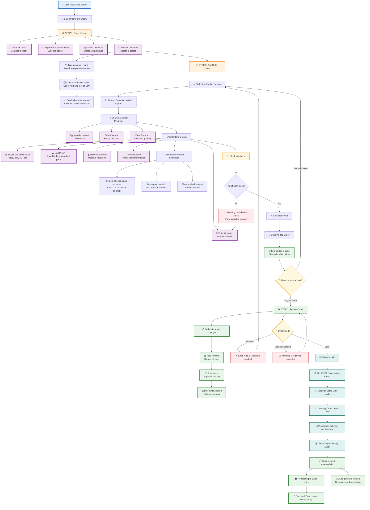

### 💡 Tips for Sales Order Creation

1. **Customer Selection**: Search by customer name - credit limit is checked automatically
2. **Stock Check**: System validates available stock before allowing order submission
3. **UOM Conversion**: Quantities are automatically converted to base units for stock tracking
4. **Schemes**: Active promotions are automatically applied based on products and quantities
5. **Free Items**: Scheme-generated free items appear as separate order lines

### 2.2 Order Line Item Structure

```mermaid
flowchart TD
    A[Order Line Item] --> B[Product Information]
    A --> C[Quantity Information]
    A --> D[Pricing Information]
    A --> E[Scheme Information]
    A --> F[Tracking Fields]
    
    B --> B1["product_id<br/>Product reference"]
    B --> B2["variant_id<br/>Variant reference"]
    B --> B3["product_name<br/>Display name"]
    B --> B4["variant_name<br/>Display variant"]
    
    C --> C1["quantity<br/>Ordered amount"]
    C --> C2["unit_of_measure_id<br/>UOM reference"]
    C --> C3["free_quantity<br/>Bonus items"]
    C --> C4["shipped_quantity<br/>Delivered amount"]
    C --> C5["returned_quantity<br/>Returned amount"]
    
    D --> D1["unit_price<br/>Price per unit"]
    D --> D2["discount_amount<br/>Line discount"]
    D --> D3["total_price<br/>quantity × unit_price"]
    
    E --> E1["applied_scheme_id<br/>Scheme reference"]
    E --> E2["scheme_name<br/>Display name"]
    E --> E3["is_free_item<br/>Flag for free lines"]
    E --> E4["parent_detail_id<br/>Link to parent line"]
    
    F --> F1["shipped_free_quantity<br/>Delivered free items"]
    F --> F2["returned_free_quantity<br/>Returned free items"]
    F --> F3["sr_order_detail_id<br/>Link to SR order"]
```

### 2.3 Field Requirements & Validation

| Field | Required | Validation Rules |
|-------|----------|------------------|
| Order Date | Yes | Valid date, defaults to today |
| Expected Shipment Date | No | Must be >= Order Date |
| Location | Yes | Must exist in system |
| Customer | Yes | Must exist in system |
| Product | Yes | Must exist in system |
| Variant | Yes | Must belong to product |
| Quantity | Yes | Number > 0 |
| Unit of Measure | Yes | Valid UOM for product |
| Unit Price | Yes | Number >= 0 |
| Discount Amount | No | Number >= 0, < line total |

---

## 3. Sales Order Listing & Search

### 3.1 How the Sales Page Loads

**What happens when you open the Sales page:**

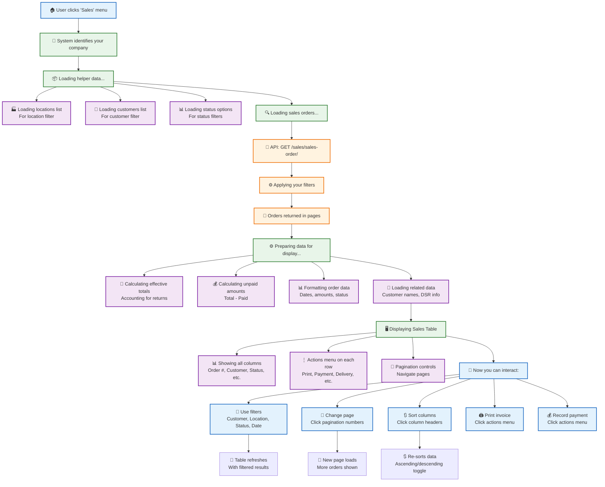

### 📱 Quick Guide: Finding Sales Orders

| What you want to do | How to do it |
|---------------------|--------------|
| **Filter by customer** | Use the "Customer" dropdown filter |
| **Show pending orders** | Use "Status" filter and select "Open" |
| **Find unpaid orders** | Use "Payment Status" filter and select "Pending" |
| **View orders by date** | Use Order Date or Shipment Date range pickers |
| **Sort by amount** | Click the "Total Amount" column header |
| **Quick print invoice** | Click ⋮ on row → "Quick Print Invoice" |
| **Record a payment** | Click ⋮ on row → "Make Payment" |
| **Process delivery** | Click ⋮ on row → "Make Delivery" |

### 3.2 Sales Order Status Workflow

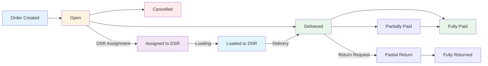

### 3.3 Table Columns Display

```mermaid
flowchart TD
    A[Table Rendered] --> B[Order Number]
    A --> C[Customer Name]
    A --> D[Customer Code]
    A --> E[Location]
    A --> F[Order Date]
    A --> G[Shipment Date]
    A --> H[Status Badge]
    A --> I[Payment Status]
    A --> J[Delivery Status]
    A --> K[DSR Info]
    A --> L[Source Badge]
    A --> M[Consolidated Badge]
    A --> N[Loaded Badge]
    A --> O[Total Amount]
    A --> P[Effective Total]
    A --> Q[Amount Paid]
    A --> R[Amount Unpaid]
    A --> S[Actions Column]
    
    H --> H1{Status Value}
    H1 -->|Open| H1a["Orange Badge"]
    H1 -->|Delivered| H1b["Green Badge"]
    H1 -->|Cancelled| H1c["Red Badge"]
    
    I --> I1{Payment Value}
    I1 -->|Paid| I1a["Green Badge"]
    I1 -->|Pending| I1b["Orange Badge"]
    I1 -->|Partial| I1c["Yellow Badge"]
    
    K --> K1{Has DSR?}
    K1 -->|Yes| K1a["DSR Name + Code"]
    K1 -->|No| K1b["--"]
    
    L --> L1{Source Value}
    L1 -->|Direct| L1a["Blue Badge"]
    L1 -->|Consolidated| L1b["Purple Badge"]
    
    S --> S1[Dropdown Menu]
    S1 --> S1a["Print Invoice"]
    S1 --> S1b["Generate Invoice"]
    S1 --> S1c["Make Payment"]
    S1 --> S1d["Make Delivery"]
    S1 --> S1e["Process Return"]
    S1 --> S1f["Add to DSR"]
    S1 --> S1g["View Payments"]
    S1 --> S1h["View Deliveries"]
```

---

## 4. Sales Order Edit/Update Workflow

### 4.1 Editing a Sales Order

**Modify existing order details before delivery:**

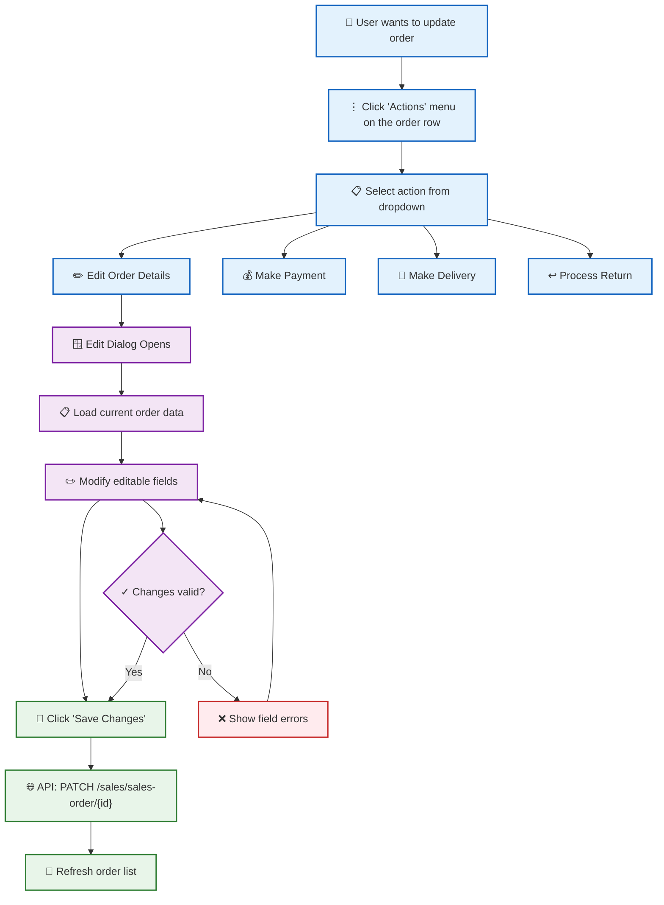

### 4.2 Order Cancellation Flow

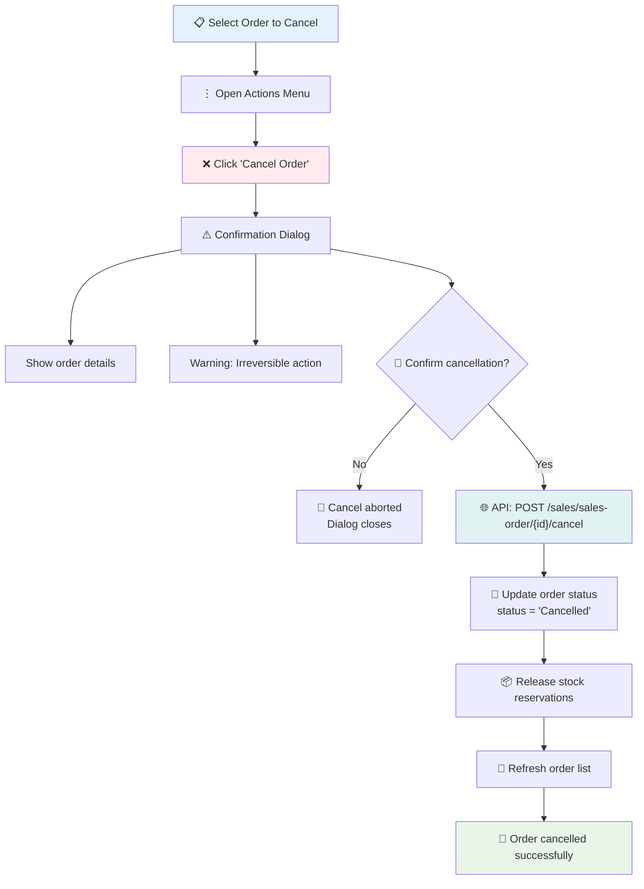

---

## 5. Customer Management Workflow

### 5.1 Customer List & Search

```mermaid
flowchart TD
    A["👤 Navigate to Customers"] --> B["📊 Customer List Loads"]
    B --> C["📋 Display Columns"]
    
    C --> C1["Customer Code<br/>Unique identifier"]
    C --> C2["Customer Name<br/>Business/Contact name"]
    C --> C3["Contact Info<br/>Phone, Email"]
    C --> C4["Address<br/>State, City, Zip"]
    C --> C5["Beat<br/>Assigned route"]
    C --> C6["Credit Limit<br/>Maximum credit"]
    C --> C7["Balance Amount<br/>Current balance"]
    C --> C8["Store Credit<br/>Available credit"]
    C --> C9["Status<br/>Active/Inactive"]
    
    B --> D["🔍 Filter Options"]
    D --> D1["State dropdown"]
    D --> D2["City dropdown"]
    D --> D3["Zip code"]
    D --> D4["Beat dropdown"]
    D --> D5["Status dropdown"]
    D --> D6["Date range<br/>Creation/sales date"]
    
    B --> E["⚡ Quick Actions"]
    E --> E1["➕ Add Customer"]
    E --> E2["📤 Import/Export"]
    E --> E3["🗑️ Batch Delete"]
    
    B --> F["⋮ Row Actions"]
    F --> F1["✏️ Edit Customer"]
    F --> F2["🗑️ Delete Customer"]
    F --> F3["🧑‍💼 Assign SR"]
    
    style A fill:#e3f2fd
    style B fill:#fff8e1
```

### 5.2 Creating a New Customer

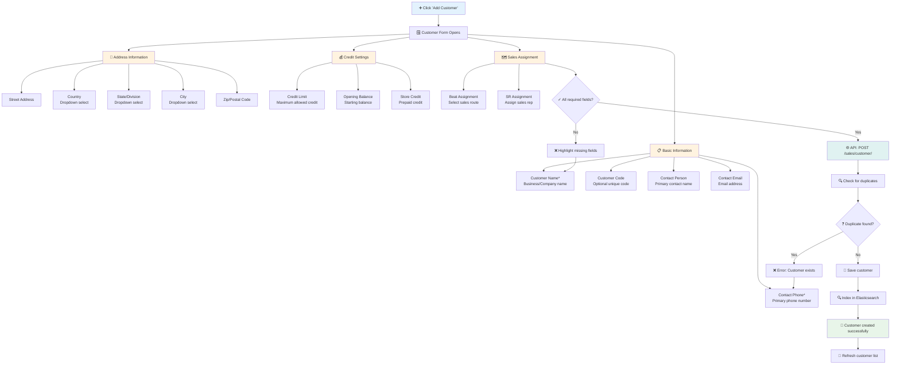

### 5.3 Customer Import via Excel

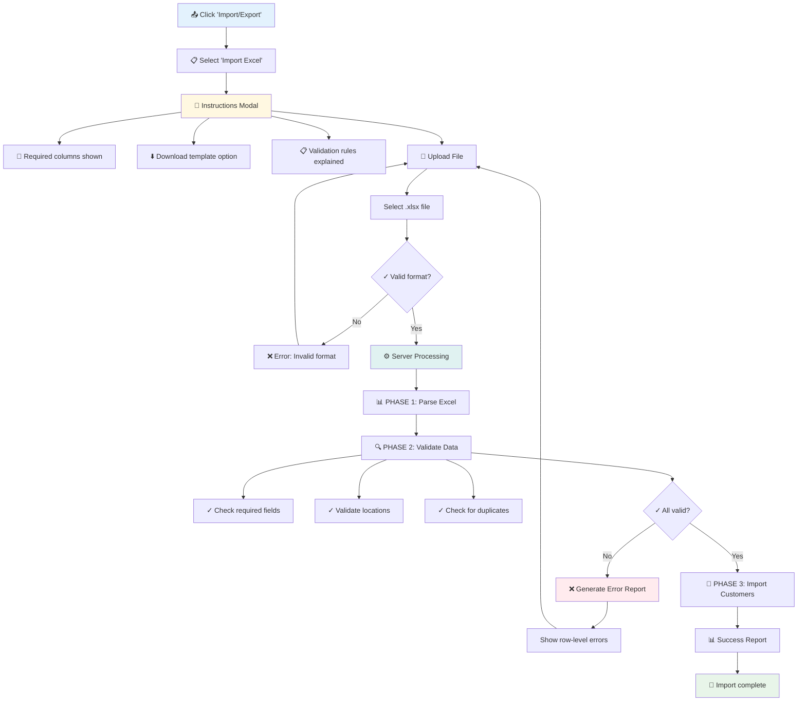

---

## 6. Payment Management Workflow

### 6.1 Recording a Payment

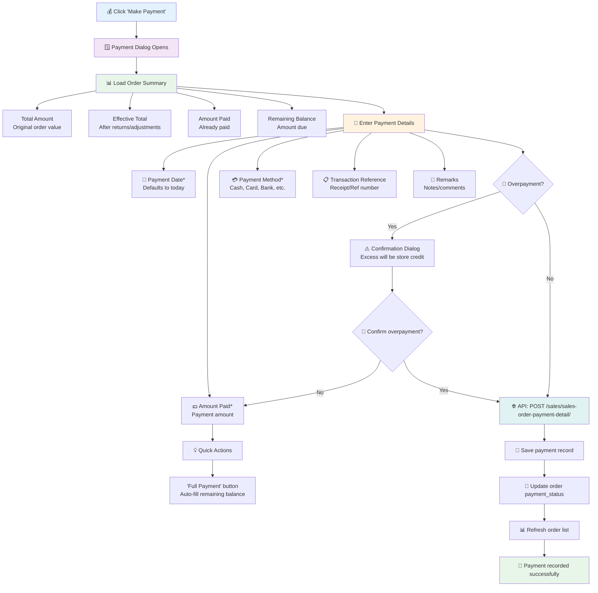

### 6.2 Viewing Payment History

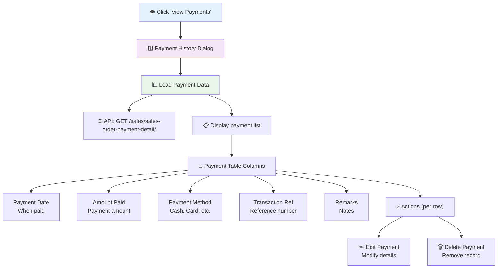

### 6.3 Payment Status Flow

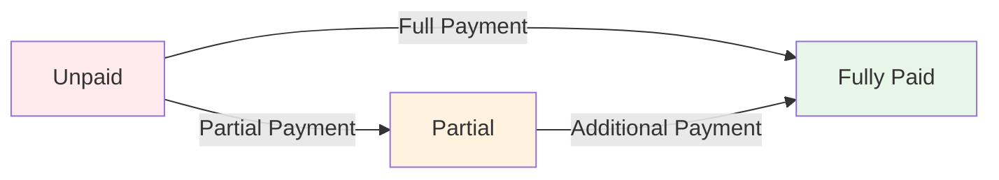

---

## 7. Delivery Management Workflow

### 7.1 Recording a Delivery

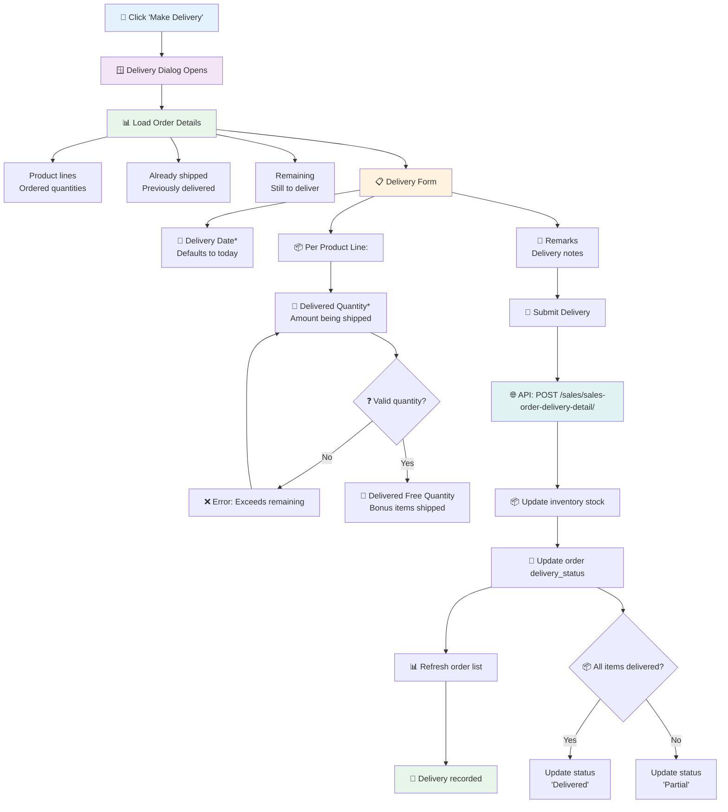

### 7.2 Delivery Status Flow

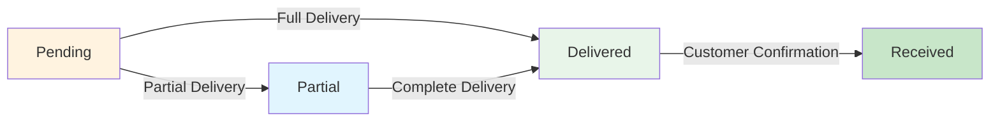

---

## 8. Returns & Rejections Workflow

### 8.1 Processing a Return

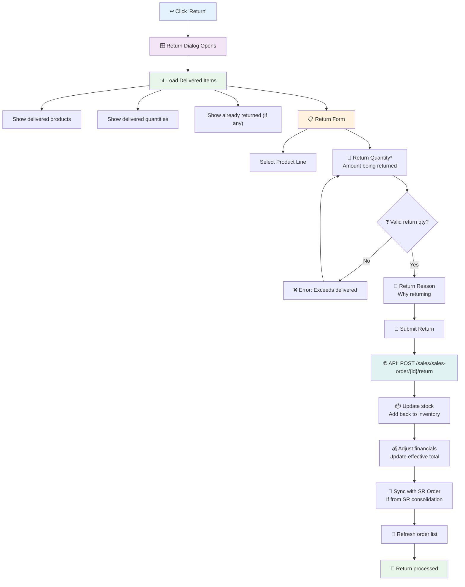

### 8.2 Processing Rejections (at Delivery)

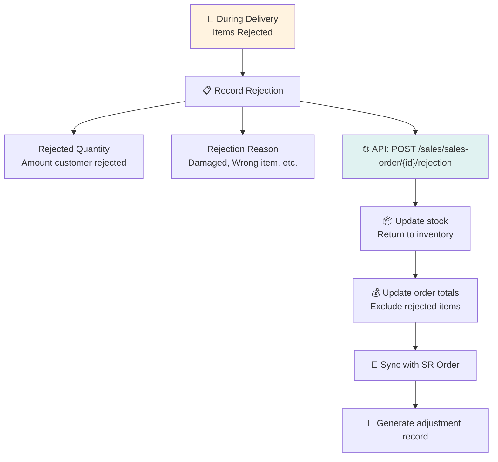

---

## 9. DSR Assignment Workflow

### 9.1 Assigning Sales Order to DSR

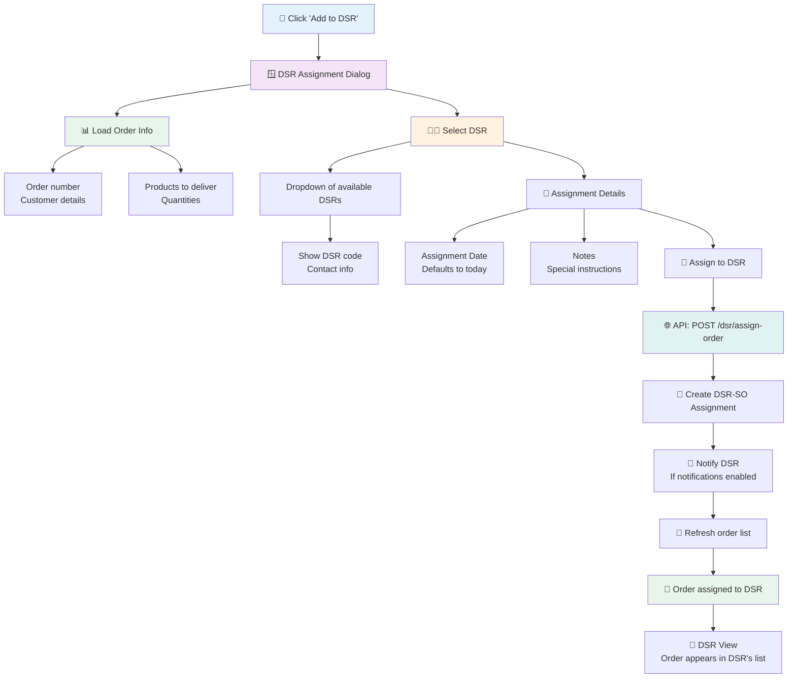

### 9.2 DSR Loading Process

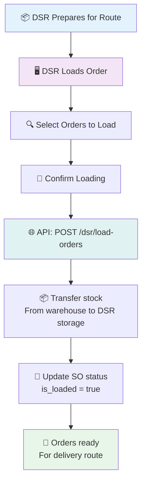

---

## 10. SR Order Workflow

### 10.1 SR Order Creation (Field Sales)

```mermaid
flowchart TD
    A["🧑‍💼 SR Logs into Mobile/App"] --> B["📋 SR Order Form"]
    
    B --> C["👤 Select Customer"]
    C --> C1["Show assigned customers<br/>Based on SR territory"]
    C1 --> C2["Validate customer assignment"]
    
    B --> D["📅 Order Details"]
    D --> D1["Order Date<br/>Defaults to today"]
    D --> D2["Location<br/>Delivery location"]
    
    B --> E["📦 Add Products"]
    E --> E1["Show SR-assigned products<br/>With prices"]
    E1 --> E2["Select product/variant"]
    E2 --> E3["Enter quantity"]
    E3 --> E4["💵 Negotiated Price<br/>May differ from standard"]
    
    E --> F["📊 Order Summary"]
    F --> F1["Calculate total<br/>Sum of (qty × negotiated_price)"]
    
    F --> G["💾 Submit SR Order"]
    G --> H["🌐 API: POST /sr/orders"]
    H --> I["💾 Create SR Order<br/>status = 'pending'"]
    I --> J["📧 Notify Admin<br/>For review/approval"]
    J --> K["🎉 SR Order submitted"]
    
    style A fill:#e3f2fd
    style B fill:#f3e5f5
    style C fill:#fff3e0
    style D fill:#fff3e0
    style E fill:#fff3e0
    style H fill:#e0f2f1
    style K fill:#e8f5e9
```

### 10.2 SR Order Approval & Consolidation

```mermaid
flowchart TD
    A["📋 Admin Views SR Orders"] --> B["📊 SR Order List"]
    B --> C{"🤔 Review Order"}
    
    C -->|Reject| D["❌ Reject Order"]
    D --> D1["Enter rejection reason"]
    D1 --> D2["🌐 API: Update status<br/>status = 'rejected'"]
    D2 --> D3["📧 Notify SR"]
    
    C -->|Approve| E["✅ Approve Order"]
    E --> E1["🌐 API: Update status<br/>status = 'approved'"]
    E1 --> E2["📧 Notify SR<br/>Order approved"]
    
    C -->|Consolidate| F["📦 Consolidate to SO"]
    F --> F1["Select multiple SR orders<br/>Same customer"]
    F1 --> F2["Select target location<br/>For stock allocation"]
    F2 --> F3["🌐 API: POST /consolidation/consolidate"]
    F3 --> F4["📦 Validate stock availability"]
    F4 --> F5{"✓ Sufficient stock?"}
    F5 -->|No| F6["❌ Show shortage details"]
    F6 --> F2
    F5 -->|Yes| F7["💾 Create Sales Order<br/>From SR orders"]
    F7 --> F8["📦 Reserve stock<br/>At selected location"]
    F8 --> F9["📝 Update SR orders<br/>status = 'consolidated'"]
    F9 --> F10["🔗 Link to parent SO"]
    F10 --> F11["🎉 Consolidation complete"]
    
    style A fill:#e3f2fd
    style B fill:#f3e5f5
    style D fill:#ffebee
    style E fill:#e8f5e9
    style F fill:#fff3e0
    style F7 fill:#e0f2f1
    style F11 fill:#e8f5e9
```

### 10.3 SR Order Status Flow

```mermaid
flowchart LR
    A[Pending] -->|Admin Review| B{Decision}
    B -->|Approve| C[Approved]
    B -->|Reject| D[Rejected]
    C -->|Consolidate| E[Consolidated]
    E -->|Create| F[Sales Order]
    
    style A fill:#fff3e0
    style B fill:#fff8e1
    style C fill:#e1f5fe
    style D fill:#ffebee
    style E fill:#f3e5f5
    style F fill:#e8f5e9
```

---

## 11. Data Models

### 11.1 Entity Relationship Diagram

```mermaid
erDiagram
    CUSTOMER ||--o{ SALES_ORDER : places
    CUSTOMER ||--o{ SR_ORDER : places_via_sr
    CUSTOMER }o--o{ BEAT : belongs_to
    CUSTOMER }o--o{ SALES_REPRESENTATIVE : assigned_to
    
    SALES_ORDER ||--o{ SALES_ORDER_DETAIL : contains
    SALES_ORDER ||--o{ SALES_ORDER_PAYMENT_DETAIL : has_payments
    SALES_ORDER ||--o{ SALES_ORDER_DELIVERY_DETAIL : has_deliveries
    SALES_ORDER }o--|| STORAGE_LOCATION : from_location
    SALES_ORDER }o--o{ DSR : assigned_to
    
    SALES_ORDER_DETAIL }o--|| PRODUCT : references
    SALES_ORDER_DETAIL }o--|| PRODUCT_VARIANT : references
    SALES_ORDER_DETAIL }o--o{ SR_ORDER_DETAIL : consolidated_from
    
    SR_ORDER ||--o{ SR_ORDER_DETAIL : contains
    SR_ORDER }o--|| SALES_REPRESENTATIVE : created_by
    SR_ORDER }o--|| CUSTOMER : for_customer
    
    SALES_REPRESENTATIVE ||--o{ SR_PRODUCT_ASSIGNMENT : has_products
    SALES_REPRESENTATIVE ||--o{ CUSTOMER_SR_ASSIGNMENT : has_customers
    
    DSR ||--o{ DSR_SO_ASSIGNMENT : has_assignments
    DSR ||--o{ DSR_PAYMENT_SETTLEMENT : has_settlements
    
    BEAT ||--o{ CUSTOMER : contains
    
    CUSTOMER {
        int customer_id PK
        string customer_name
        string customer_code
        string contact_phone
        string contact_email
        decimal credit_limit
        decimal store_credit
        decimal balance_amount
        int beat_id FK
    }
    
    SALES_ORDER {
        int sales_order_id PK
        string order_number
        int customer_id FK
        int location_id FK
        date order_date
        date expected_shipment_date
        string status
        string payment_status
        string delivery_status
        decimal total_amount
        decimal amount_paid
        boolean is_consolidated
        boolean is_loaded
        int loaded_by_dsr_id FK
    }
    
    SALES_ORDER_DETAIL {
        int sales_order_detail_id PK
        int sales_order_id FK
        int product_id FK
        int variant_id FK
        decimal quantity
        decimal unit_price
        decimal discount_amount
        decimal free_quantity
        decimal shipped_quantity
        decimal returned_quantity
        boolean is_free_item
        int applied_scheme_id FK
    }
    
    SALES_ORDER_PAYMENT_DETAIL {
        int payment_detail_id PK
        int sales_order_id FK
        date payment_date
        decimal amount_paid
        string payment_method
        string transaction_reference
    }
    
    SALES_ORDER_DELIVERY_DETAIL {
        int delivery_detail_id PK
        int sales_order_detail_id FK
        date delivery_date
        decimal delivered_quantity
        decimal delivered_free_quantity
        string remarks
    }
    
    SR_ORDER {
        int sr_order_id PK
        string order_number
        int sr_id FK
        int customer_id FK
        string status
        decimal total_amount
        decimal commission_amount
    }
    
    SR_ORDER_DETAIL {
        int sr_order_detail_id PK
        int sr_order_id FK
        int product_id FK
        int variant_id FK
        decimal quantity
        decimal negotiated_price
        decimal shipped_quantity
        decimal returned_quantity
    }
    
    SALES_REPRESENTATIVE {
        int sr_id PK
        string sr_name
        string sr_code
        string contact_phone
        string contact_email
        decimal commission_amount
    }
    
    DSR {
        int dsr_id PK
        string dsr_name
        string dsr_code
        decimal payment_on_hand
        decimal commission_amount
    }
    
    BEAT {
        int beat_id PK
        string beat_name
        string beat_code
        string description
    }
```

### 11.2 API Endpoints Reference

```mermaid
flowchart LR
    subgraph SalesOrders["Sales Orders"]
        A1["GET /sales/sales-order/"]
        A2["POST /sales/sales-order/"]
        A3["GET /sales/sales-order/{id}"]
        A4["PATCH /sales/sales-order/{id}"]
        A5["DELETE /sales/sales-order/{id}"]
        A6["POST /sales/sales-order/{id}/cancel"]
        A7["POST /sales/sales-order/{id}/return"]
        A8["POST /sales/sales-order/{id}/rejection"]
    end
    
    subgraph SalesOrderDetails["Order Details"]
        B1["GET /sales/sales-order-detail/"]
        B2["POST /sales/sales-order-detail/"]
        B3["PATCH /sales/sales-order-detail/{id}"]
        B4["DELETE /sales/sales-order-detail/{id}"]
    end
    
    subgraph Payments["Payments"]
        C1["GET /sales/sales-order-payment-detail/"]
        C2["POST /sales/sales-order-payment-detail/"]
        C3["PATCH /sales/sales-order-payment-detail/{id}"]
        C4["DELETE /sales/sales-order-payment-detail/{id}"]
    end
    
    subgraph Deliveries["Deliveries"]
        D1["GET /sales/sales-order-delivery-detail/"]
        D2["POST /sales/sales-order-delivery-detail/"]
        D3["PATCH /sales/sales-order-delivery-detail/{id}"]
        D4["DELETE /sales/sales-order-delivery-detail/{id}"]
    end
    
    subgraph Customers["Customers"]
        E1["GET /sales/customer/"]
        E2["POST /sales/customer/"]
        E3["PATCH /sales/customer/{id}"]
        E4["DELETE /sales/customer/{id}"]
        E5["POST /sales/customer/batch-delete"]
    end
    
    subgraph SROrders["SR Orders"]
        F1["GET /sr/sr-order/"]
        F2["POST /sr/sr-order/"]
        F3["PATCH /sr/sr-order/{id}"]
        F4["DELETE /sr/sr-order/{id}"]
    end
    
    subgraph Consolidation["Consolidation"]
        G1["POST /consolidation/consolidate"]
        G2["GET /consolidation/sr-consolidated-orders"]
    end
    
    subgraph DSR["DSR Management"]
        H1["GET /dsr/delivery-sales-representative/"]
        H2["POST /dsr/assign-order"]
        H3["POST /dsr/load-orders"]
    end
```

---

## Appendix: UI Component Mapping

### Frontend Page Structure

```
/src/pages/sales/
├── Sales.tsx                 # Main sales orders listing
├── ViewSaleDetails.tsx       # View payments/deliveries
└── new/
    └── AddSale.tsx           # Wrapper for new sale

/src/pages/customers/
├── Customers.tsx             # Customer listing
└── new/
    └── AddCustomer.tsx       # New customer form

/src/pages/sr-orders/
├── SROrders.tsx              # SR order listing
└── new/
    └── NewSROrder.tsx        # SR order creation

/src/pages/sales-representatives/
└── SalesRepresentatives.tsx  # SR management

/src/pages/dsr/
└── DeliverySalesRepresentatives.tsx  # DSR management

/src/components/forms/
├── SaleForm.tsx              # Main sales order form
├── SalesPaymentForm.tsx      # Payment recording
├── SalesDeliveryForm.tsx     # Delivery recording
├── SalesReturnForm.tsx       # Return processing
├── DSRAssignmentForm.tsx     # DSR assignment
├── CustomerForm.tsx          # Customer management
└── UnifiedDeliveryForm.tsx   # Combined delivery

/src/components/
├── SalesFilter.tsx           # Sales list filters
├── CustomerFilter.tsx        # Customer list filters
└── shared/
    ├── OrderStatus.tsx       # Status badge component
    └── ViewOrderDetails.tsx  # Order details dialog

/src/lib/api/
├── salesApi.ts               # Sales order APIs
├── customerApi.ts            # Customer APIs
├── srOrderApi.ts             # SR order APIs
└── salesRepresentativeApi.ts # SR management APIs

/src/lib/schema/
├── sales.ts                  # Sales order schemas
├── salesRepresentative.ts    # SR schemas
└── srOrder.ts                # SR order schemas
```

---

## Summary

The Sale Module provides a comprehensive order management solution with the following key capabilities:

1. **Complete Sales Lifecycle**: Create, manage, deliver, and track sales orders end-to-end
2. **Multi-Channel Orders**: Support for direct sales, SR orders, and consolidated orders
3. **Flexible Payments**: Record multiple payments with various methods, track balances
4. **Delivery Management**: Assign to DSRs, track loading, deliveries, and returns
5. **Customer Management**: Full customer master with credit limits, beats, and SR assignments
6. **Scheme/Promotion Integration**: Automatic application of discounts and free items
7. **Stock Integration**: Real-time stock validation and reservation
8. **Mobile/Field Sales**: SR mobile ordering with approval workflows
9. **DSR Operations**: Delivery tracking with payment collection and settlements

All workflows follow a consistent pattern: **List → Select → Action → Form → Validate → Submit → Feedback → Refresh**.
