# SR Module - User Manual Flow Diagrams

## Table of Contents
1. [Overview](#overview)
2. [SR Module Entry Point](#1-sr-module-entry-point)
3. [Sales Representative Management](#2-sales-representative-management)
4. [Customer Assignment Workflow](#3-customer-assignment-workflow)
5. [Product Assignment Workflow](#4-product-assignment-workflow)
6. [SR Order Workflow](#5-sr-order-workflow)
7. [Commission Disbursement Workflow](#6-commission-disbursement-workflow)
8. [Pending Customer Workflow](#7-pending-customer-workflow)
9. [SR Dashboard & Reports](#8-sr-dashboard--reports)
10. [Data Models](#9-data-models)

---

## Overview

The SR (Sales Representative) Module manages field sales operations in Shoudagor ERP. It provides comprehensive tools for managing sales representatives, their customer assignments, product portfolios, order processing, and commission tracking.

### Key Entities
- **Sales Representative (SR)**: Field sales staff who create orders and manage customers
- **Customer Assignment**: Links customers to specific SRs for territory management
- **Product Assignment**: Products allocated to SRs with custom pricing
- **SR Order**: Orders created by SRs on behalf of customers
- **Commission**: Earnings calculated on SR orders
- **Disbursement**: Commission payments to SRs
- **Pending Customer**: New customers added by SRs awaiting admin approval
- **Beat**: Geographic sales territory for efficient route planning

---

## 1. SR Module Entry Point

### User Journey Overview

```mermaid
flowchart TD
    %% User Entry
    A["👤 User logs into Shoudagor ERP"] --> B{"📍 Where do you want to go?"}
    
    %% Navigation Options
    B -->|Click 'Sales Reps'<br/>in main menu| C["🧑‍💼 Sales Representatives Listing Page"]
    B -->|Click 'SR Orders'<br/>in main menu| D["📋 SR Orders Page"]
    B -->|Click 'Pending Customers'<br/>in main menu| E["⏳ Pending Customers Page"]
    B -->|Click 'Beats'<br/>in main menu| F["🗺️ Beats/Routes Page"]
    
    %% Sales Reps Page Components
    C --> C1["📊 Sales Representatives Table"]
    C --> C2["🔍 Search & Filter Panel"]
    C --> C3["⚡ Quick Action Buttons"]
    
    %% Table Columns
    C1 --> C1a["SR Code<br/>Unique identifier"]
    C1 --> C1b["SR Name<br/>Full name"]
    C1 --> C1c["Contact Info<br/>Email & Phone"]
    C1 --> C1d["Status<br/>Active/Inactive"]
    C1 --> C1e["Commission Balance<br/>Current earnings"]
    C1 --> C1f["Total Orders<br/>Order count"]
    C1 --> C1g["Total Sales<br/>Sales amount"]
    C1 --> C1h["Created Date<br/>When added"]
    
    %% Search & Filters
    C2 --> C2a["🔎 Search by name/code"]
    C2 --> C2b["✓ Filter by Status"]
    C2 --> C2c["📅 Creation Date Range"]
    C2 --> C2d["🔢 Sort by name/code/date"]
    
    %% Action Buttons
    C3 --> C3a["➕ Add Sales Rep"]
    C3 --> C3b["📤 Import / 📥 Export"]
    
    %% Row Actions
    C --> C4["⋮ Actions Menu (per row)"]
    C4 --> C4a["✏️ Edit SR"]
    C4 --> C4b["🗑️ Delete SR"]
    C4 --> C4c["👥 Manage Customers"]
    C4 --> C4d["📦 Manage Products"]
    C4 --> C4e["📊 View Orders"]
    C4 --> C4f["💰 Disburse Commission"]
    
    %% SR Orders Page
    D --> D1["📋 SR Orders Table"]
    D --> D2["🔍 Filter by Status/Date/SR"]
    D --> D3["📊 Consolidation Actions"]
    
    %% Pending Customers Page
    E --> E1["⏳ Pending Approval Table"]
    E --> E2["✅ Approve/Reject Actions"]
    
    %% Styling
    classDef userAction fill:#e1f5ff,stroke:#01579b,stroke-width:2px
    classDef page fill:#fff8e1,stroke:#ff6f00,stroke-width:2px
    classDef component fill:#f3e5f5,stroke:#7b1fa2,stroke-width:2px
    classDef data fill:#e8f5e9,stroke:#2e7d32,stroke-width:2px
    
    class A,B,C,D,E,F userAction
    class C1,D1,E1 page
    class C2,C3,C4,D2,D3,E2 component
    class C1a,C1b,C1c,C1d,C1e,C1f,C1g,C1h,C2a,C2b,C2c,C2d,C3a,C3b,C4a,C4b,C4c,C4d,C4e,C4f data
```

### How to Navigate the SR Module

1. **Getting There**: Click "Sales Reps" in the left sidebar menu after logging in
2. **What You See**: A table listing all sales representatives with filtering options above
3. **Quick Actions**: Use the buttons at the top for common tasks (Add, Import/Export)
4. **Row Actions**: Click the "⋮" (three dots) on any row to manage that specific SR

### UI Elements - Sales Reps List Page

| Component | Type | Description |
|-----------|------|-------------|
| Search Input | Text Field | Search by SR name or code |
| Status Filter | Dropdown | Active/Inactive filter |
| Date Range | Date Picker | Creation date range filter |
| Sort Dropdown | Dropdown | Sort by name, code, or date |
| Add Sales Rep | Button | Navigate to creation page |
| Import/Export | Button | Excel import/export functionality |
| SR Table | Data Table | Paginated list with sorting |
| Actions Menu | Dropdown | Edit, Delete, Manage Customers, Manage Products, View Orders, Disburse Commission |

---

## 2. Sales Representative Management

### 2.1 Step-by-Step: Creating a New Sales Representative

**Overview**: This workflow guides you through creating a sales representative with all necessary details.

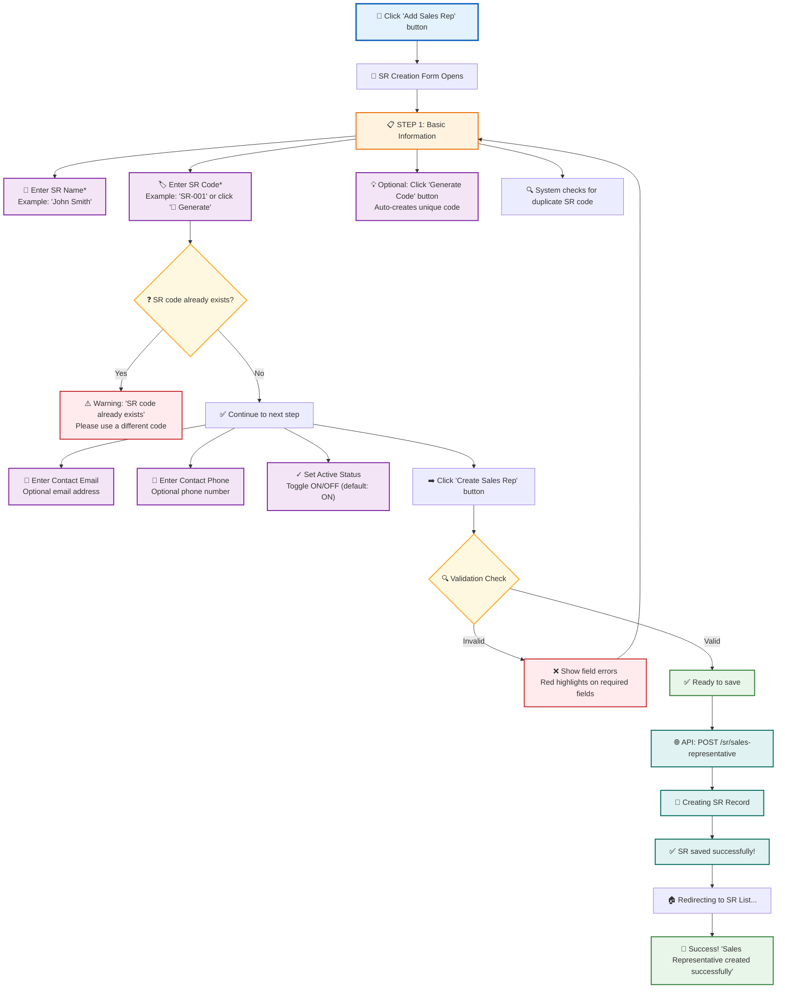

### 💡 Tips for SR Creation

1. **SR Code**: Use a consistent format (e.g., 'SR-' + number: SR-001)
2. **Unique Codes**: SR codes must be unique across your entire company
3. **Active Status**: New SRs are active by default; deactivate for temporary leave
4. **Contact Info**: Email and phone are optional but recommended for communication

### 2.2 Field Requirements & Validation

| Field | Required | Validation Rules |
|-------|----------|------------------|
| SR Name | Yes | Min 1 char, max 200 |
| SR Code | Yes | Min 1 char, max 50, unique per company |
| Contact Email | No | Valid email format, max 100 chars |
| Contact Phone | No | Max 20 chars |
| Is Active | Yes | Boolean, default true |

### 2.3 Editing a Sales Representative

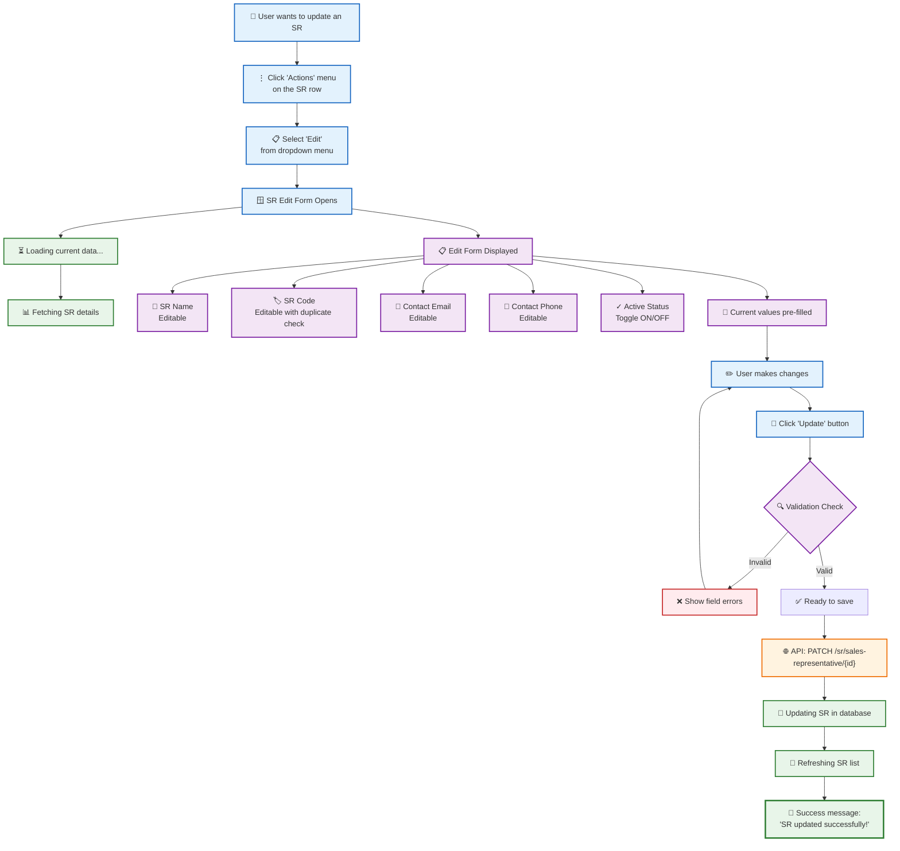

### 2.4 Deleting a Sales Representative

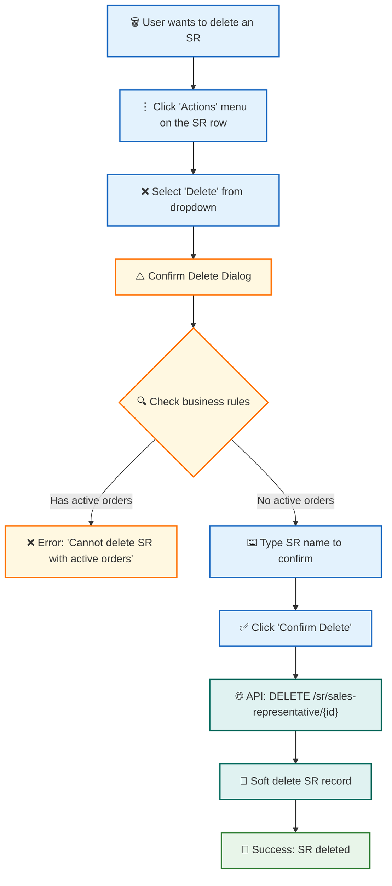

---

## 3. Customer Assignment Workflow

### 3.1 Assigning Customers to an SR

**Overview**: Manage which customers belong to each sales representative for territory management.

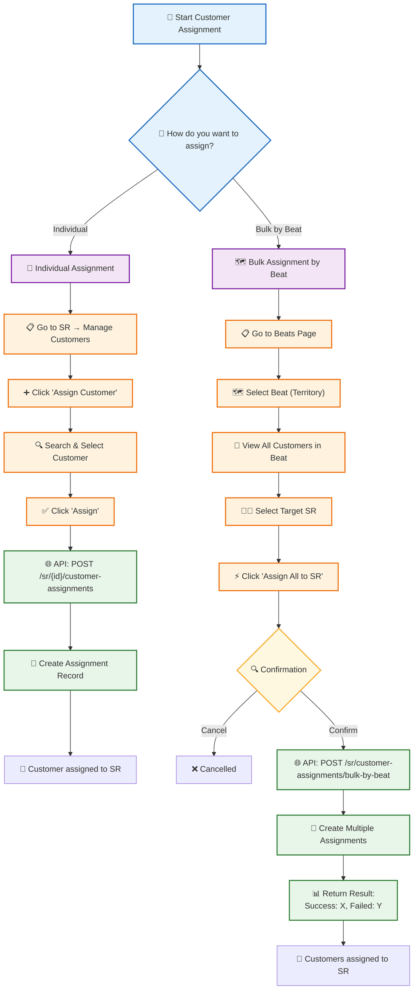

### 3.2 Customer Assignment Management

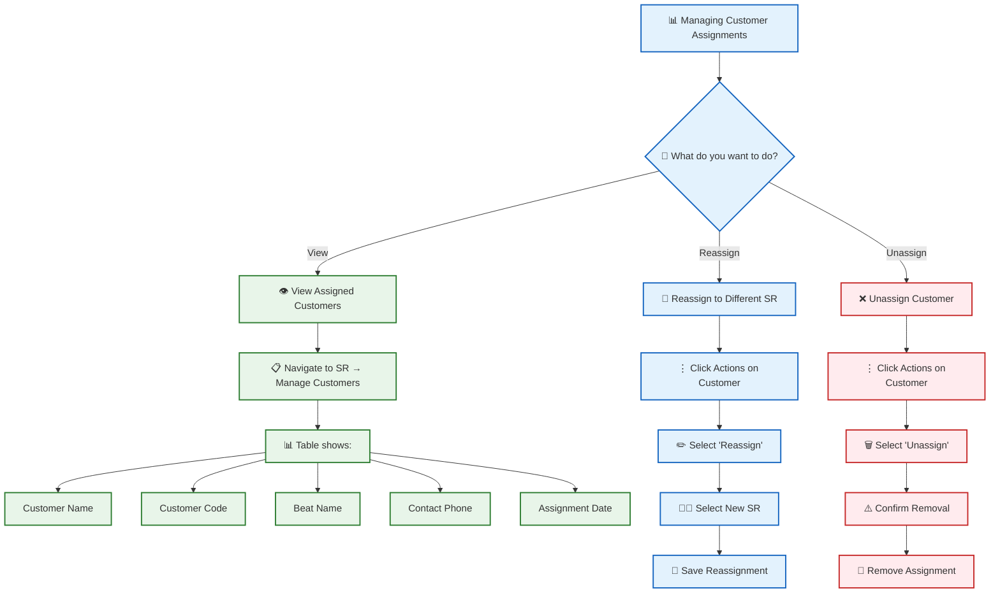

### 3.3 Field Requirements for Customer Assignment

| Field | Required | Description |
|-------|----------|-------------|
| SR ID | Yes | Sales Representative to assign to |
| Customer ID | Yes | Customer to be assigned |
| Assignment Date | Auto | Set to current timestamp |

---

## 4. Product Assignment Workflow

### 4.1 Assigning Products to an SR

**Overview**: Manage which products each SR can sell, with custom pricing and price override permissions.

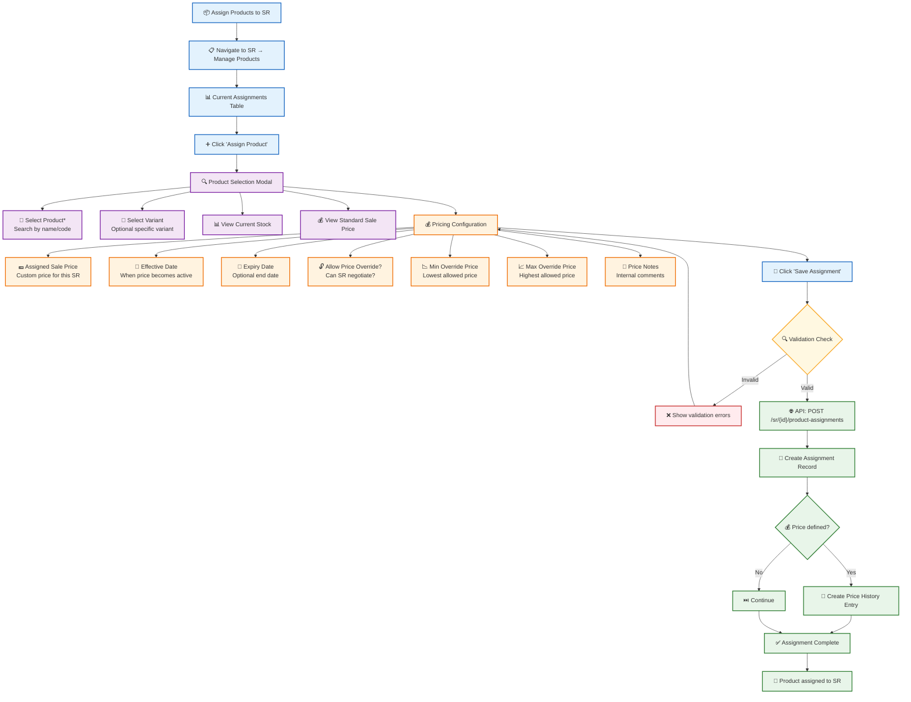

### 4.2 Updating Product Assignment Price

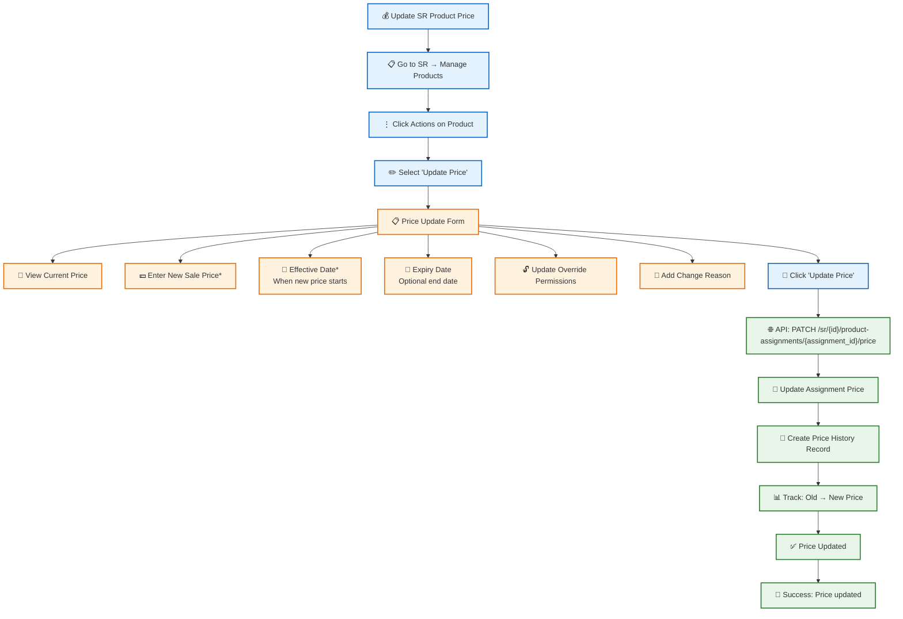

### 4.3 Product Assignment Field Reference

| Field | Required | Description |
|-------|----------|-------------|
| Product ID | Yes | Product to assign |
| Variant ID | No | Specific variant (optional) |
| Assigned Sale Price | No | Custom price for SR |
| Price Effective Date | No | When price starts |
| Price Expiry Date | No | When price ends |
| Allow Price Override | Yes | Can SR negotiate? Default: true |
| Min Override Price | No | Floor price for negotiation |
| Max Override Price | No | Ceiling price for negotiation |
| Price Notes | No | Internal comments |

---

## 5. SR Order Workflow

### 5.1 Creating an SR Order

**Overview**: SRs create orders for their assigned customers with negotiated pricing.

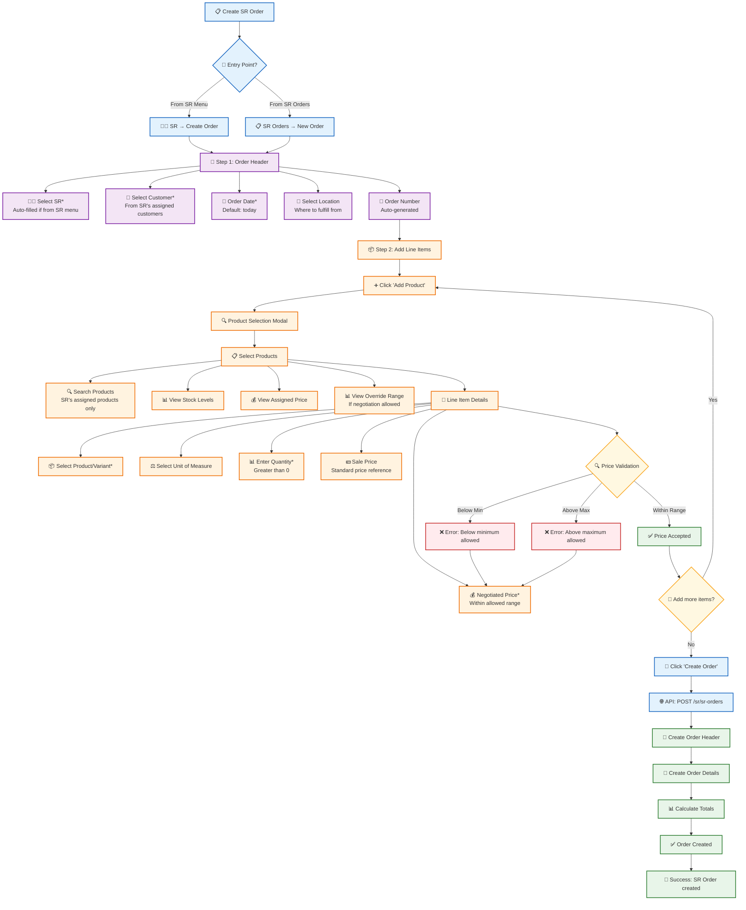

### 5.2 SR Order Consolidation

**Overview**: Multiple SR orders from the same customer can be consolidated into a single Sales Order.

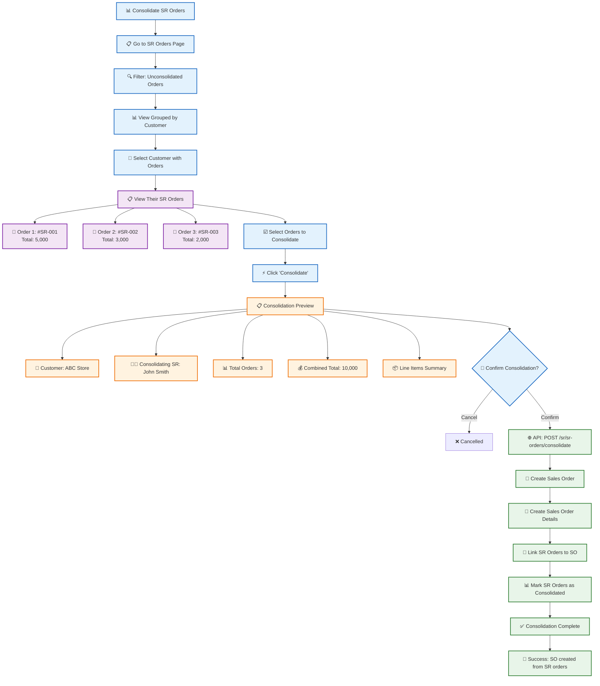

### 5.3 SR Order Status Management

| Status | Description | Actions Available |
|--------|-------------|-------------------|
| **Pending** | New order, not yet processed | Edit, Delete, Consolidate |
| **Approved** | Order approved for processing | View, Consolidate |
| **Consolidated** | Merged into a Sales Order | View only |
| **Cancelled** | Order cancelled | View only |

---

## 6. Commission Disbursement Workflow

### 6.1 Disbursing Commission to SR

**Overview**: Process commission payments to sales representatives based on their orders.

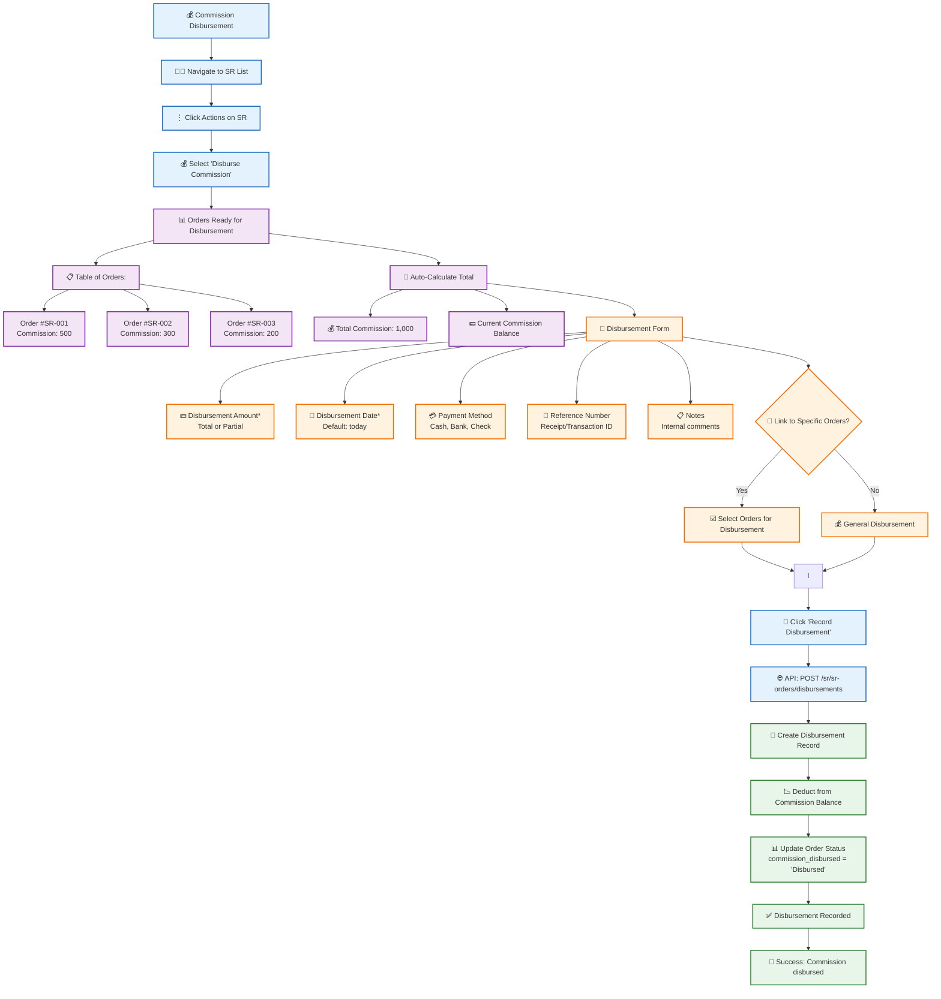

### 6.2 Bulk Commission Disbursement

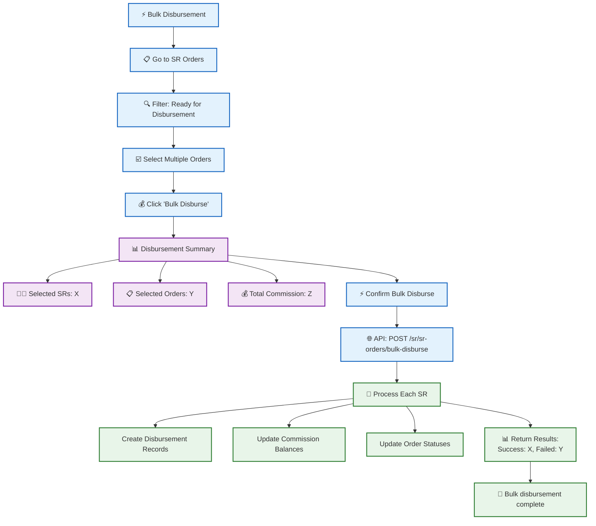

### 6.3 Commission Status Reference

| Status | Description | Next Action |
|--------|-------------|-------------|
| **Pending** | Order created, commission not yet calculated | System auto-calculates |
| **Ready** | Commission calculated, ready for disbursement | Process disbursement |
| **Disbursed** | Commission paid to SR | None |

---

## 7. Pending Customer Workflow

### 7.1 SR Adding a New Customer

**Overview**: SRs can add new customers that require admin approval before becoming active.

```mermaid
flowchart TD
    %% Start
    A["➕ SR Adds New Customer"] --> B["📱 SR Mobile/Web App"]
    B --> C["👤 Navigate to Customers"]
    C --> D["➕ Click 'Add Customer'"]
    
    %% Customer Form
    D --> E["📝 Customer Information Form"]
    E --> E1["📝 Customer Name*<br/>Business name"]
    E --> E2["📝 Customer Code<br/>Optional unique code"]
    E --> E3["👤 Contact Person<br/>Primary contact"]
    E --> E4["📱 Contact Phone*<br/>Primary phone"]
    E --> E5["📧 Contact Email<br/>Email address"]
    E --> E6["📍 Address<br/>Full address"]
    
    %% Location
    E --> F["🗺️ Location Details"]
    F --> F1["🌍 Country<br/>Select from list"]
    F --> F2["🏛️ State/Province<br/>Select from list"]
    F --> F3["🏙️ City<br/>Select from list"]
    F --> F4["📮 ZIP Code<br/>Postal code"]
    
    %% Business Details
    F --> G["💼 Business Details"]
    G --> G1["💰 Credit Limit<br/>If known"]
    G --> G2["🗺️ Beat/Territory<br/>Assign to route"]
    
    %% Submit
    G --> H["📤 Click 'Submit for Approval'"]
    H --> I{"🔍 Validation Check"}
    I -->|Invalid| I1["❌ Show errors"]
    I1 --> E
    I -->|Valid| J["🌐 API: POST /sr/pending-customers"]
    
    %% Backend
    J --> K["💾 Create Pending Customer"]
    K --> L["📊 Status: Pending"]
    L --> M["🔔 Notify Admin<br/>New customer awaiting approval"]
    M --> N["✅ Submission Complete"]
    N --> O["🎉 Success: Customer submitted for approval"]
    
    %% Styling
    classDef start fill:#e3f2fd,stroke:#1565c0,stroke-width:2px
    classDef form fill:#f3e5f5,stroke:#7b1fa2,stroke-width:2px
    classDef location fill:#fff3e0,stroke:#ef6c00,stroke-width:2px
    classDef decision fill:#fff8e1,stroke:#f9a825,stroke-width:2px
    classDef error fill:#ffebee,stroke:#c62828,stroke-width:2px
    classDef system fill:#e8f5e9,stroke:#2e7d32,stroke-width:2px
    
    class A,B,C,D,H,J start
    class E,E1,E2,E3,E4,E5,E6,form
    class F,F1,F2,F3,F4 location
    class G,G1,G2 form
    class I decision
    class I1 error
    class K,L,M,N,O system
```

### 7.2 Admin Approving/Rejecting Pending Customer

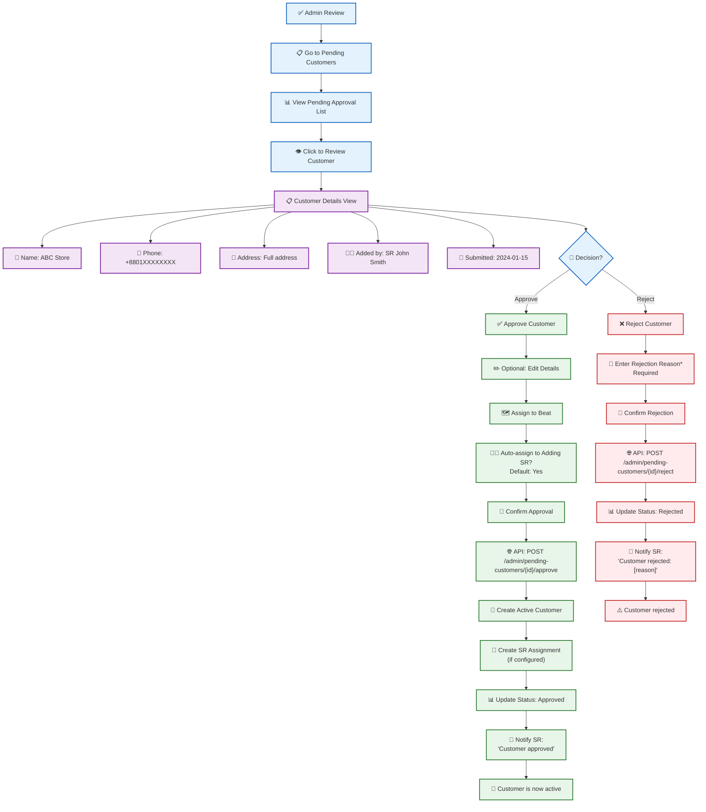

### 7.3 Pending Customer Status Reference

| Status | Description | Actions |
|--------|-------------|---------|
| **Pending** | Awaiting admin review | SR can edit, Admin can approve/reject |
| **Approved** | Customer activated | Available for orders, Assigned to SR |
| **Rejected** | Not approved | SR can see reason, Can resubmit if needed |

---

## 8. SR Dashboard & Reports

### 8.1 SR Dashboard Overview

```mermaid
flowchart TD
    A["📊 SR Dashboard"] --> B["🎯 Key Metrics"]
    
    %% Metrics
    B --> C1["📋 Today's Orders<br/>Count & Amount"]
    B --> C2["📊 Month-to-Date Sales<br/>vs Target"]
    B --> C3["👥 My Customers<br/>Total assigned"]
    B --> C4["📦 Products Assigned<br/>Portfolio size"]
    B --> C5["💰 Commission Balance<br/>Current earnings"]
    
    %% Recent Activity
    A --> D["📈 Recent Activity"]
    D --> D1["📝 Recent Orders<br/>Last 5 orders"]
    D --> D2["⏳ Pending Approvals<br/>Customer submissions"]
    D --> D3["📦 Low Stock Alerts<br/>Assigned products"]
    
    %% Quick Actions
    A --> E["⚡ Quick Actions"]
    E --> E1["➕ New Order"]
    E --> E2["➕ Add Customer"]
    E --> E3["📋 View My Orders"]
    E --> E4["👥 View My Customers"]
    
    %% Styling
    classDef dashboard fill:#e3f2fd,stroke:#1565c0,stroke-width:2px
    classDef metrics fill:#e8f5e9,stroke:#2e7d32,stroke-width:2px
    classDef activity fill:#fff3e0,stroke:#ef6c00,stroke-width:2px
    classDef actions fill:#f3e5f5,stroke:#7b1fa2,stroke-width:2px
    
    class A dashboard
    class B,C1,C2,C3,C4,C5 metrics
    class D,D1,D2,D3 activity
    class E,E1,E2,E3,E4 actions
```

### 8.2 Admin SR Dashboard

```mermaid
flowchart TD
    A["📊 Admin SR Dashboard"] --> B["🎯 Company-Wide Metrics"]
    
    %% Metrics
    B --> C1["🧑‍💼 Total SRs<br/>Active/Inactive count"]
    B --> C2["📊 Total SR Orders<br/>Today/This Month"]
    B --> C3["💰 Total Commission Due<br/>Pending disbursement"]
    B --> C4["⏳ Pending Customers<br/>Awaiting approval"]
    
    %% SR Performance
    A --> D["🏆 SR Performance"]
    D --> D1["📊 Top Performing SRs<br/>By sales amount"]
    D --> D2["📈 SR Order Trends<br/>Weekly/Monthly"]
    D --> D3["🗺️ Sales by Beat/Territory"]
    
    %% Actions
    A --> E["⚡ Administrative Actions"]
    E --> E1["✅ Review Pending Customers"]
    E --> E2["💰 Process Commission Disbursements"]
    E --> E3["📊 Generate SR Reports"]
    
    %% Styling
    classDef dashboard fill:#e3f2fd,stroke:#1565c0,stroke-width:2px
    classDef metrics fill:#e8f5e9,stroke:#2e7d32,stroke-width:2px
    classDef performance fill:#fff3e0,stroke:#ef6c00,stroke-width:2px
    classDef actions fill:#f3e5f5,stroke:#7b1fa2,stroke-width:2px
    
    class A dashboard
    class B,C1,C2,C3,C4 metrics
    class D,D1,D2,D3 performance
    class E,E1,E2,E3 actions
```

---

## 9. Data Models

### 9.1 Entity Relationship Diagram

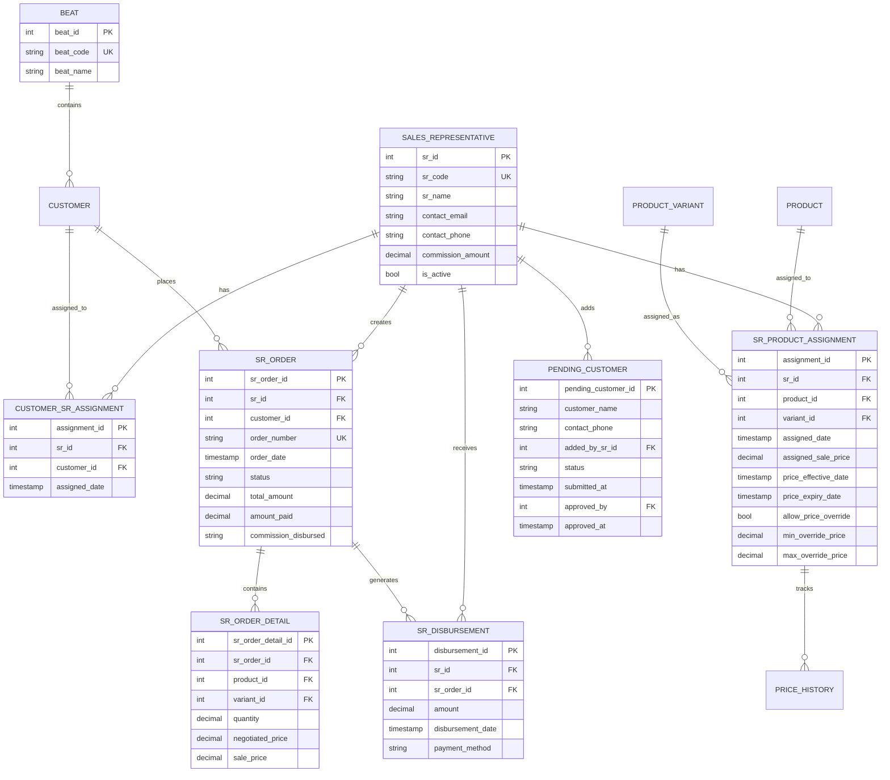

### 9.2 API Endpoints Reference

#### Sales Representative Management
| Endpoint | Method | Description |
|----------|--------|-------------|
| `/sr/sales-representative` | GET | List all SRs with filters |
| `/sr/sales-representative` | POST | Create new SR |
| `/sr/sales-representative/{id}` | GET | Get SR by ID |
| `/sr/sales-representative/{id}` | PATCH | Update SR |
| `/sr/sales-representative/{id}` | DELETE | Soft delete SR |
| `/sr/sales-representative/search/{code}` | GET | Get SR by code |

#### Customer Assignment
| Endpoint | Method | Description |
|----------|--------|-------------|
| `/sr/{id}/customer-assignments` | GET | List SR's assigned customers |
| `/sr/{id}/customer-assignments` | POST | Assign customer to SR |
| `/sr/{id}/customer-assignments/bulk-by-beat` | POST | Bulk assign by beat |
| `/sr/{id}/customer-assignments/{assignment_id}` | DELETE | Unassign customer |

#### Product Assignment
| Endpoint | Method | Description |
|----------|--------|-------------|
| `/sr/{id}/product-assignments` | GET | List SR's assigned products |
| `/sr/{id}/product-assignments` | POST | Assign product to SR |
| `/sr/{id}/product-assignments/{assignment_id}/price` | PATCH | Update assignment price |
| `/sr/{id}/product-assignments/{assignment_id}` | DELETE | Unassign product |

#### SR Orders
| Endpoint | Method | Description |
|----------|--------|-------------|
| `/sr/sr-orders` | GET | List SR orders |
| `/sr/sr-orders` | POST | Create SR order |
| `/sr/sr-orders/unconsolidated-by-customer` | GET | Get unconsolidated orders grouped |
| `/sr/sr-orders/consolidate` | POST | Consolidate orders into SO |
| `/sr/sr-orders/disbursements` | GET | List disbursements |
| `/sr/sr-orders/disbursements` | POST | Record disbursement |
| `/sr/sr-orders/bulk-disburse` | POST | Bulk disburse commission |

#### Pending Customers
| Endpoint | Method | Description |
|----------|--------|-------------|
| `/sr/pending-customers` | GET | List pending customers |
| `/sr/pending-customers` | POST | Submit new customer |
| `/admin/pending-customers/{id}/approve` | POST | Approve customer |
| `/admin/pending-customers/{id}/reject` | POST | Reject customer |

---

## Quick Reference Guide

### Common Tasks

| Task | Path | Key Action |
|------|------|------------|
| **Add Sales Rep** | Sales Reps → Add Sales Rep | Fill form, click Create |
| **Assign Customer** | SR → Manage Customers → Assign | Search and select customer |
| **Assign Product** | SR → Manage Products → Assign | Set price and override rules |
| **Create SR Order** | SR Orders → New Order | Select customer, add items |
| **Consolidate Orders** | SR Orders → Filter Unconsolidated → Select → Consolidate | Review and confirm |
| **Disburse Commission** | SR → Actions → Disburse Commission | Enter amount and method |
| **Approve Customer** | Pending Customers → Review → Approve | Verify details, assign SR |

### Status Meanings

**SR Order Status:**
- `pending` → New order, editable
- `approved` → Ready for consolidation
- `consolidated` → Merged into Sales Order
- `cancelled` → Order cancelled

**Commission Status:**
- `pending` → Not yet calculated
- `ready` → Ready for disbursement
- `disbursed` → Paid to SR

**Pending Customer Status:**
- `pending` → Awaiting admin review
- `approved` → Active customer
- `rejected` → Not approved

---

*Document Version: 1.0*  
*Last Updated: May 2026*  
*For: Shoudagor ERP SR Module*
