# Warehouse Module - User Manual Flow Diagrams

## Table of Contents
1. [Overview](#overview)
2. [Warehouse Module Entry Point](#1-warehouse-module-entry-point)
3. [Storage Location Management Workflow](#2-storage-location-management-workflow)
4. [Inventory Stock Management Workflow](#3-inventory-stock-management-workflow)
5. [Stock Transfer Workflow](#4-stock-transfer-workflow)
6. [DSR Storage Management Workflow](#5-dsr-storage-management-workflow)
7. [Data Models](#6-data-models)

---

## Overview

The Warehouse Module is the core inventory location management system of Shoudagor ERP. It manages physical storage locations, tracks inventory stock levels across locations, facilitates stock transfers between locations, and handles DSR (Delivery Sales Representative) storage operations.

### Key Entities
- **Warehouse**: Physical warehouse buildings with address information
- **Storage Location**: Specific storage areas within warehouses (bins, racks, zones)
- **Inventory Stock**: Stock levels tracked per product/variant per location
- **Stock Transfer**: Movement of stock between locations
- **DSR Storage**: Mobile storage locations assigned to Delivery Sales Representatives
- **DSR Stock Transfer**: Stock transfers between main warehouse and DSR storages

---

## 1. Warehouse Module Entry Point

### User Journey Overview

```mermaid
flowchart TD
    %% User Entry
    A["👤 User logs into Shoudagor ERP"] --> B{"📍 Where do you want to go?"}
    
    %% Navigation Options
    B -->|Click 'Warehouses'<br/>in main menu| C["🏭 Warehouses Page"]
    B -->|Click 'Storage Locations'<br/>in submenu| D["📦 Storage Locations Page"]
    B -->|Click 'Stock Transfer'<br/>in submenu| E["🔄 Stock Transfer Page"]
    B -->|Click 'DSR Storages'<br/>in submenu| F["🚚 DSR Storages Page"]
    
    %% Warehouses Page Components
    C --> C1["🏭 Warehouses Table"]
    C --> C2["🔍 Search & Filter Panel"]
    C --> C3["⚡ Quick Action Buttons"]
    
    %% Table Columns
    C1 --> C1a["Warehouse Name"]
    C1 --> C1b["Address"]
    C1 --> C1c["Country/State/City"]
    C1 --> C1d["Zip Code"]
    C1 --> C1e["Status<br/>Active/Inactive"]
    
    %% Storage Locations Page Components
    D --> D1["📦 Storage Locations Table"]
    D --> D2["🔍 Filter Panel"]
    D --> D3["⚡ Action Buttons"]
    
    %% Storage Table Columns
    D1 --> D1a["Location Name"]
    D1 --> D1b["Warehouse"]
    D1 --> D1c["Location Code"]
    D1 --> D1d["Location Type"]
    D1 --> D1e["Max Capacity"]
    D1 --> D1f["Status"]
    
    %% Stock Transfer Page
    E --> E1["🔄 Transfer Form"]
    E --> E2["📋 Transfer History"]
    
    %% DSR Storage Page
    F --> F1["🚚 DSR Storages Table"]
    F --> F2["📊 DSR Inventory"]
    
    %% Action Buttons
    C3 --> C3a["➕ Add Warehouse"]
    D3 --> D3a["➕ Add Storage Location"]
    E2 --> E2a["📤 Export Transfer History"]
    
    %% Row Actions
    D --> D4["⋮ Actions Menu (per row)"]
    D4 --> D4a["✏️ Edit Location"]
    D4 --> D4b["🗑️ Delete Location"]
    
    %% Styling
    classDef userAction fill:#e1f5ff,stroke:#01579b,stroke-width:2px
    classDef page fill:#fff8e1,stroke:#ff6f00,stroke-width:2px
    classDef component fill:#f3e5f5,stroke:#7b1fa2,stroke-width:2px
    classDef data fill:#e8f5e9,stroke:#2e7d32,stroke-width:2px
    
    class A,B,C,D,E,F userAction
    class C1,D1,E1,F1 page
    class C2,C3,D2,D3,E2,F2 component
    class C1a,C1b,C1c,C1d,C1e,D1a,D1b,D1c,D1d,D1e,D1f data
```

### How to Navigate the Warehouse Pages

1. **Getting There**: Click "Warehouses" in the left sidebar menu after logging in
2. **What You See**: Options to view Warehouses, Storage Locations, Stock Transfer, or DSR Storages
3. **Quick Actions**: Use the buttons at the top for common tasks (Add, Transfer)
4. **Row Actions**: Click the "⋮" (three dots) on any row to edit or delete that location

### UI Elements - Storage Locations List Page

| Component | Type | Description |
|-----------|------|-------------|
| Search Input | Text Field | Search by location name |
| Warehouse Filter | Dropdown | Filter by warehouse |
| Location Type Filter | Dropdown | Filter by type (e.g., Rack, Bin, Zone) |
| Status Filter | Dropdown | Active/Inactive filter |
| Max Capacity | Range | Min/Max capacity filter |
| Add Storage | Button | Navigate to creation page |
| Storage Table | Data Table | Paginated list with sorting |
| Actions Menu | Dropdown | Edit, Delete |

---

## 2. Storage Location Management Workflow

### 2.1 Step-by-Step: Creating a New Storage Location

**Overview**: This workflow guides you through creating a storage location within a warehouse.

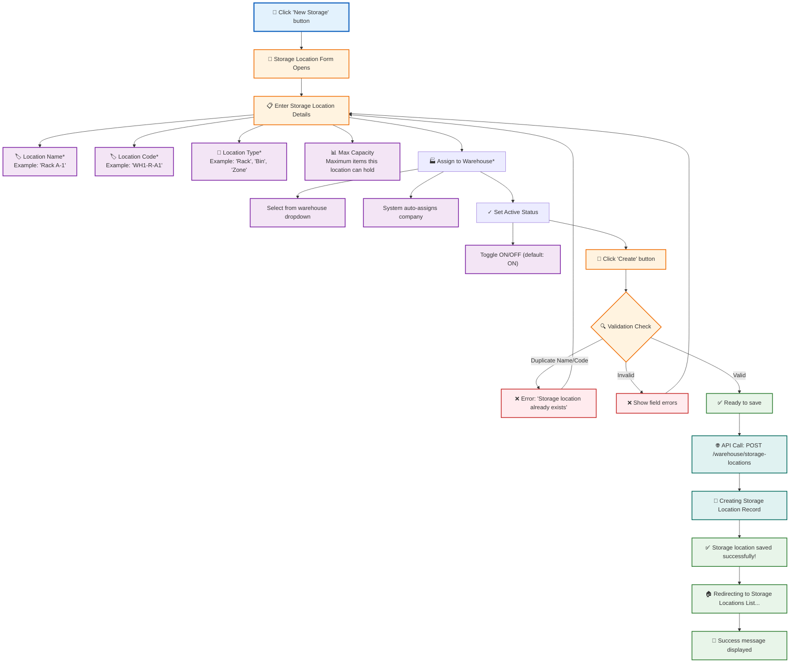

### 💡 Tips for Storage Location Creation

1. **Naming Convention**: Use consistent naming (e.g., Building-Section-Number)
2. **Location Code**: Make it unique and scannable if using barcode systems
3. **Location Types**: Define standard types (Rack, Bin, Floor, Cold Storage, etc.)
4. **Max Capacity**: Set realistic capacity limits for capacity planning

### 2.2 Editing a Storage Location

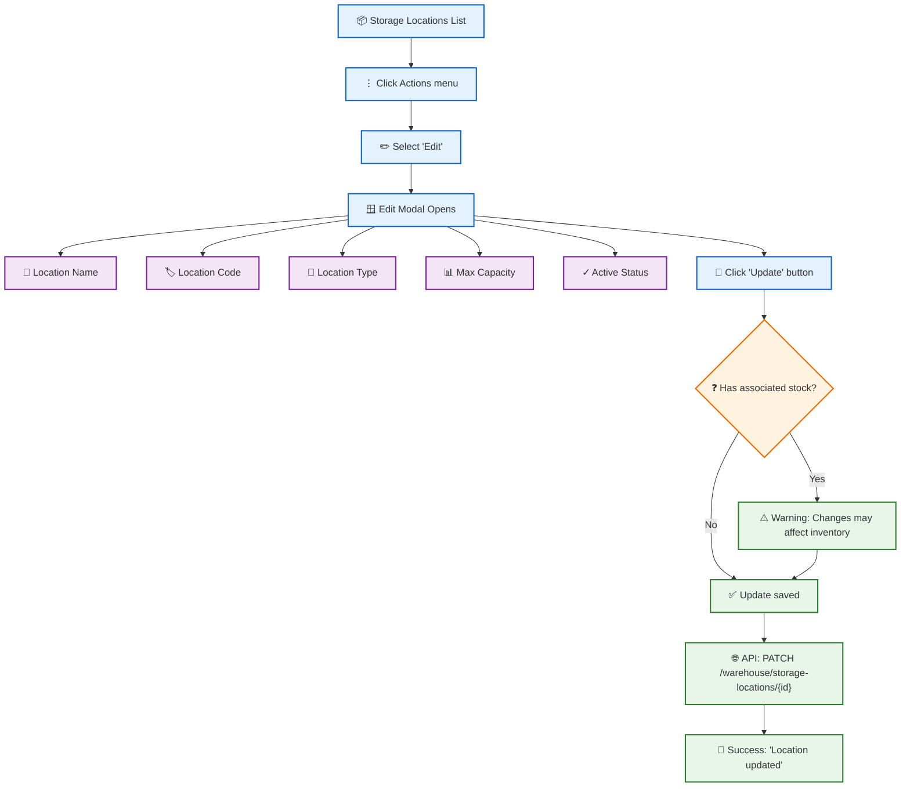

### 2.3 Deleting a Storage Location

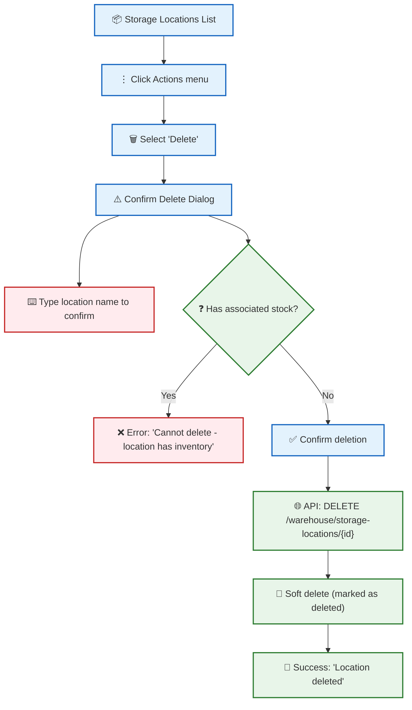

### 2.4 Field Requirements & Validation

| Field | Required | Validation Rules |
|-------|----------|------------------|
| Location Name | Yes | Min 1 char, unique per company |
| Location Code | Yes | Min 1 char, unique per company |
| Location Type | Yes | Must not be empty |
| Warehouse ID | Yes | Must exist in system |
| Max Capacity | No | Number >= 0 |
| Is Active | No | Boolean (default: true) |

---

## 3. Inventory Stock Management Workflow

### 3.1 Viewing Inventory Stock

**What happens when you view inventory stock:**

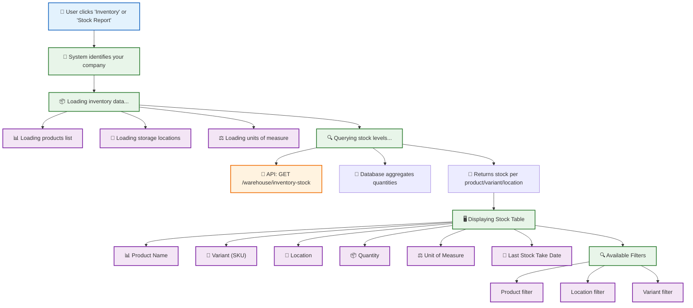

### 3.2 Creating/Updating Inventory Stock

**⚠️ IMPORTANT**: When batch tracking is enabled, manual stock creation/update is blocked. Use batch operations instead.

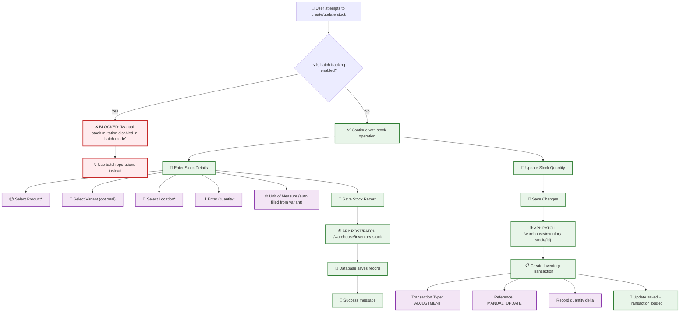

### 3.3 Deleting Inventory Stock

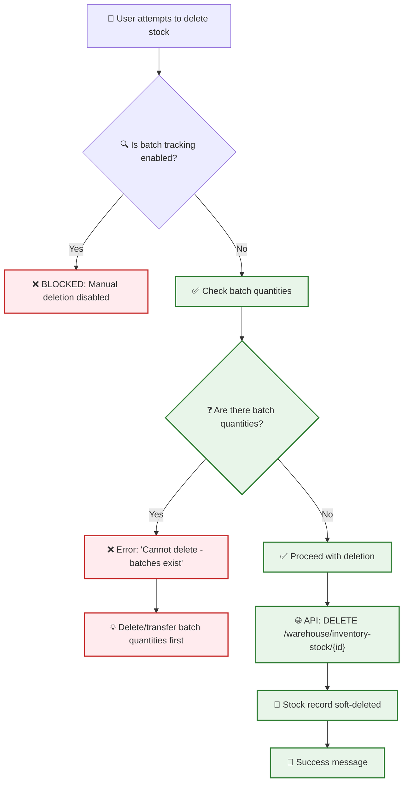

---

## 4. Stock Transfer Workflow

### 4.1 Creating a Stock Transfer

**Overview**: Transfer stock from one location to another with transaction logging.

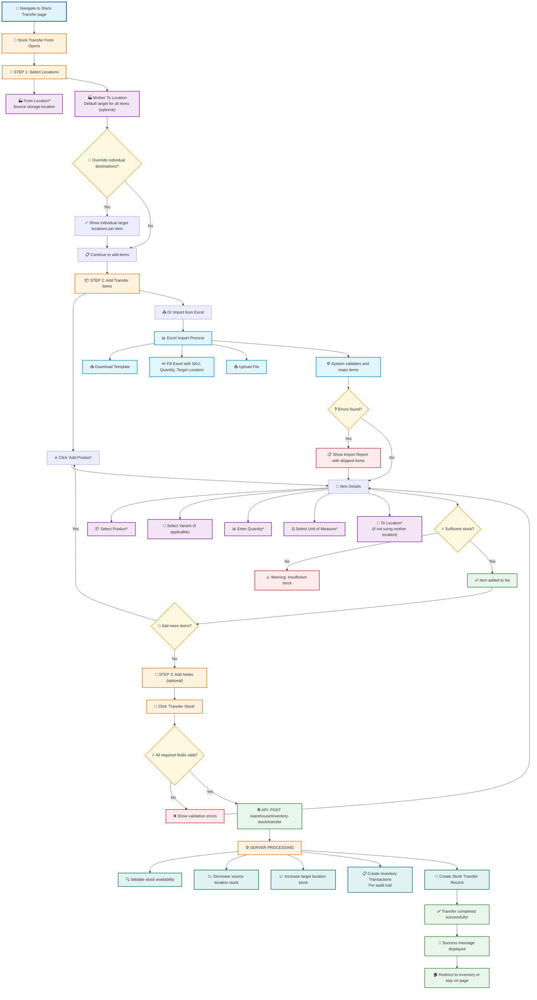

### 4.2 Excel Import Format

| Column | Required | Description |
|----------|----------|-------------|
| **Variant SKU** | Yes | Product SKU to transfer |
| **Product Code** | Optional | Alternative product identifier |
| **Quantity** | Yes | Amount to transfer |
| **Unit Name** | Yes | Unit of measure (e.g., "Piece", "Box") |
| **Target Location** | Yes | Destination storage location name |

### 4.3 Viewing Transfer History

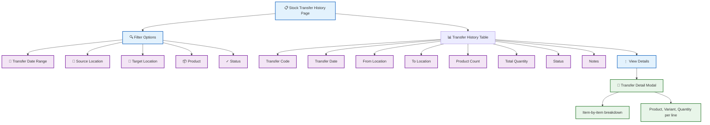

---

## 5. DSR Storage Management Workflow

### 5.1 DSR Storage Overview

**DSR (Delivery Sales Representative) Storage**: Mobile storage locations assigned to each DSR. One-to-one relationship - each DSR has exactly one storage.

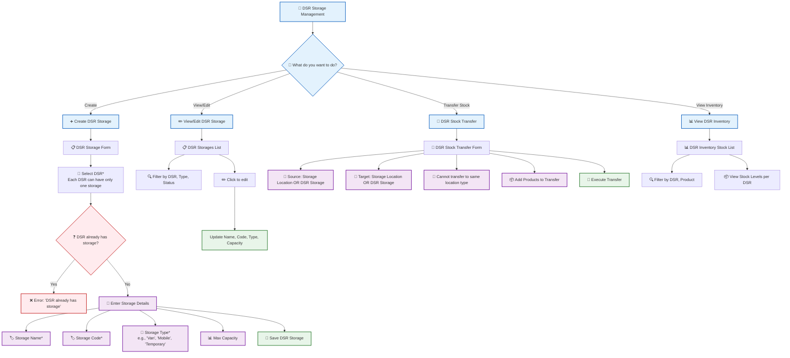

### 5.2 DSR Stock Transfer

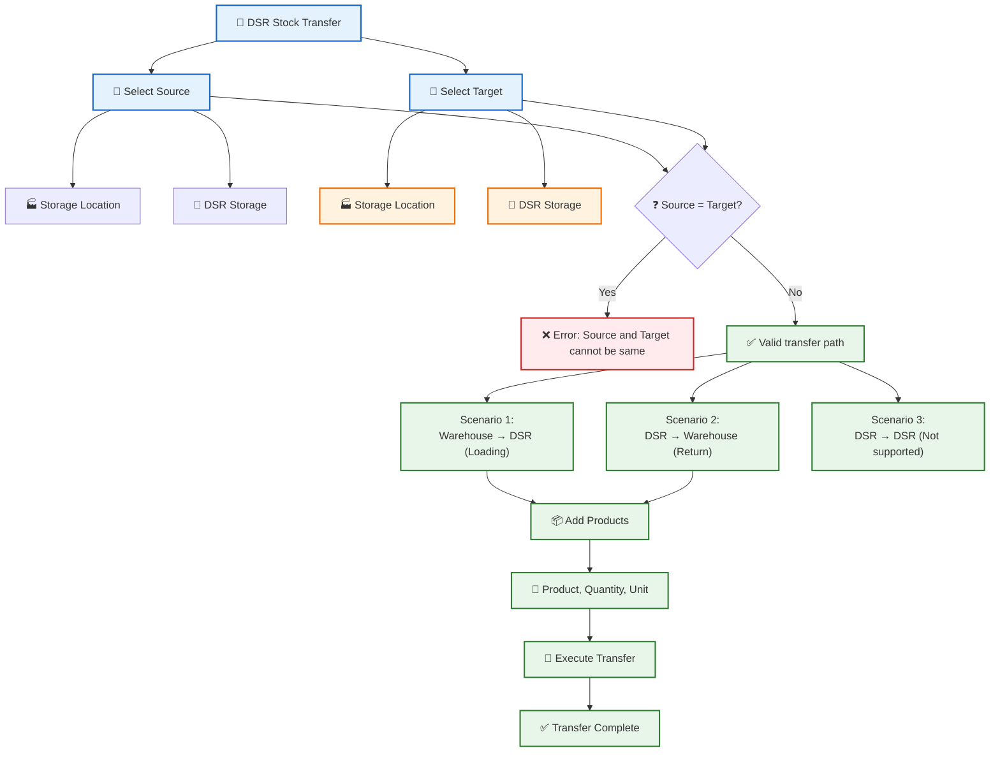

### 5.3 DSR Storage Field Requirements

| Field | Required | Description |
|-------|----------|-------------|
| DSR | Yes | One-to-one relationship with DSR |
| Storage Name | Yes | Unique name for the storage |
| Storage Code | Yes | Unique code (e.g., DSR-VAN-001) |
| Storage Type | Yes | Type classification |
| Max Capacity | No | Maximum holding capacity |
| Is Active | No | Boolean status |

---

## 6. Data Models

### 6.1 Entity Relationship Diagram

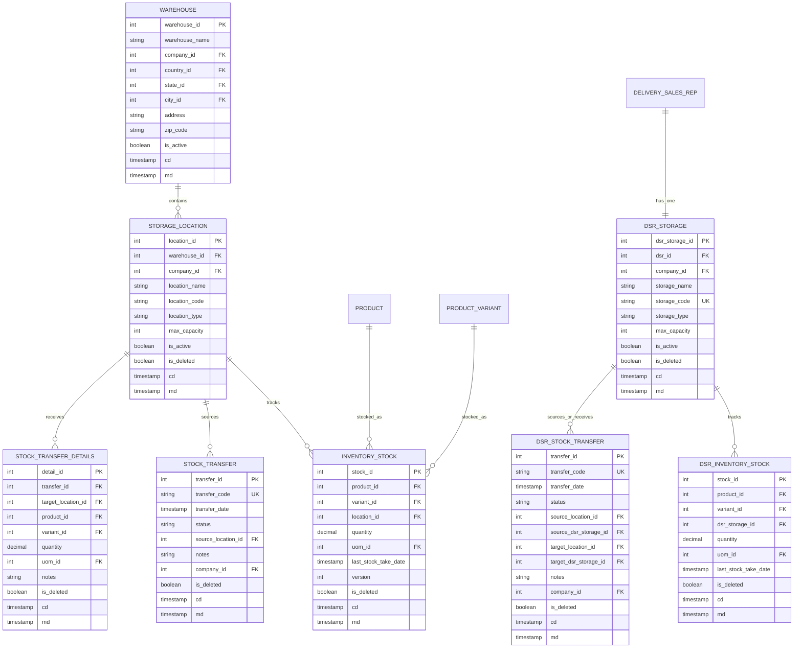

### 6.2 API Endpoints Reference

| Endpoint | Method | Description |
|----------|--------|-------------|
| `/warehouse/storage-locations` | GET | List storage locations with filters |
| `/warehouse/storage-locations` | POST | Create new storage location |
| `/warehouse/storage-locations/{id}` | PATCH | Update storage location |
| `/warehouse/storage-locations/{id}` | DELETE | Delete storage location |
| `/warehouse/inventory-stock` | GET | List inventory stock |
| `/warehouse/inventory-stock` | POST | Create inventory stock |
| `/warehouse/inventory-stock/{id}` | PATCH | Update inventory stock |
| `/warehouse/inventory-stock/{id}` | DELETE | Delete inventory stock |
| `/warehouse/inventory-stock/transfer` | POST | Transfer stock between locations |
| `/warehouse/stock-transfer` | GET | List stock transfers |
| `/warehouse/stock-transfer` | POST | Create stock transfer |
| `/warehouse/stock-transfer/{id}` | PATCH | Update stock transfer |
| `/warehouse/stock-transfer/{id}` | DELETE | Delete stock transfer |
| `/warehouse/dsr-storage` | GET | List DSR storages |
| `/warehouse/dsr-storage` | POST | Create DSR storage |
| `/warehouse/dsr-storage/{id}` | PATCH | Update DSR storage |
| `/warehouse/dsr-storage/{id}` | DELETE | Delete DSR storage |
| `/warehouse/dsr-storage/by-dsr/{dsr_id}` | GET | Get DSR storage by DSR ID |

### 6.3 Important Notes

#### Batch Tracking Mode
- When batch tracking is enabled for a company:
  - **Manual stock creation is BLOCKED** - use batch operations instead
  - **Manual stock updates are BLOCKED** - use batch adjustments instead
  - **Stock deletion is BLOCKED if batches exist** - delete batches first

#### Stock Transfer Rules
- Source and target locations **cannot be the same**
- Sufficient stock must exist at source location
- Transfer creates transaction records for audit trail
- Transfers are atomic operations (all succeed or all fail)

#### DSR Storage Constraints
- Each DSR can have **only ONE** storage location
- DSR storage code must be **unique**
- DSR storages are soft-deleted (not permanently removed)

---

## Quick Reference: Common Tasks

| Task | How To Do It |
|------|--------------|
| **Create new storage location** | Warehouses → Storage Locations → New Storage |
| **View stock levels** | Inventory → Stock Report or Stock by Location |
| **Transfer stock** | Warehouses → Stock Transfer → Fill form → Transfer |
| **Create DSR storage** | DSR → DSR Storages → New DSR Storage |
| **Load DSR van** | Stock Transfer → Source: Warehouse → Target: DSR Storage |
| **View transfer history** | Warehouses → Stock Transfer History |
| **Check batch tracking status** | Settings → Company Inventory Settings |
