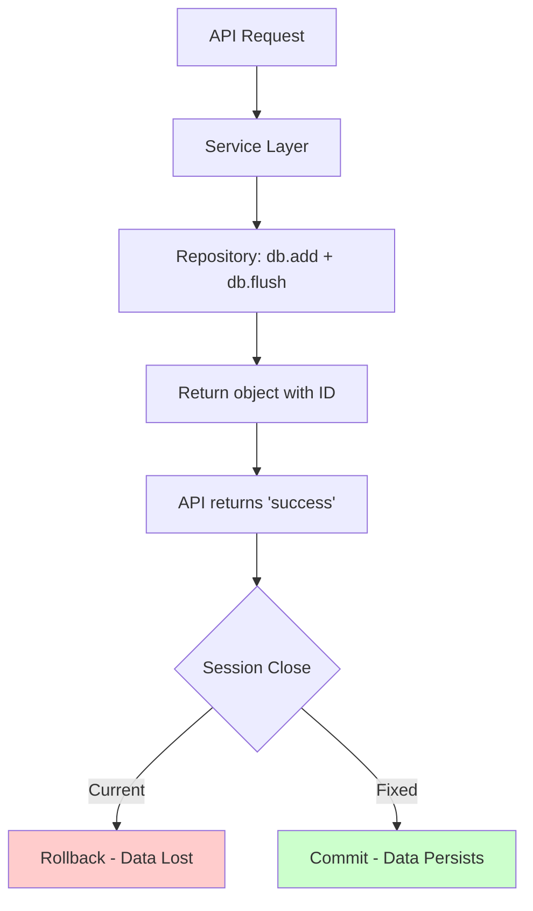

# Plan: Fix CRUD Operations Not Persisting to Database

## Root Cause Analysis

The issue has been identified: **CRUD operations are using `db.flush()` instead of `db.commit()`**, causing data to not be persisted to the database.

### Evidence

1. **Database Session Configuration** (`app/core/database.py` line 21):
   ```python
   SessionLocal = sessionmaker(autocommit=False, autoflush=False, bind=engine)
   ```
   - `autocommit=False`: Changes are NOT automatically committed - must explicitly call commit()
   - `autoflush=False`: Changes are NOT automatically flushed to DB

2. **Repository Layer** (`app/repositories/inventory/product_category.py`):
   - `create()` method (lines 107-111): Uses `db.add()` + `db.flush()` but NO commit
   - `update()` method (lines 113-116): Uses `db.flush()` but NO commit
   - `delete()` method (lines 118-125): Uses `db.flush()` but NO commit

3. **Inconsistent Service Layer**:
   - Some services like `SupplierService` explicitly call `self.repo.db.commit()` after create/update/delete
   - Most services like `ProductCategoryService` do NOT call commit
   - This explains why some operations work and others don't

4. **Session Lifecycle** (`app/core/database.py: get_db()`):
   - Session is created per-request
   - At end of request, session is closed (in finally block) WITHOUT commit
   - Uncommitted changes are rolled back when session closes

---

## Why Operations Return "Success" But Don't Persist

1. `db.flush()` writes changes to the database within the transaction
2. The ORM returns the updated object with the new ID (after flush)
3. The API returns this object as "success"
4. When the request ends and the session closes, the uncommitted transaction is rolled back
5. The data never makes it to the permanent database

---

## Plan to Fix

### Option A: Fix at Repository Layer (RECOMMENDED)

Add explicit `commit()` calls to all repository methods. This ensures consistent behavior across all services.

**Changes needed in each repository file:**

1. `create()` - Add `self.db.commit()` after `flush()` and `refresh()`
2. `update()` - Add `self.db.commit()` after `flush()` and `refresh()`
3. `delete()` - Add `self.db.commit()` after `flush()`

**Affected repositories (all need fixing):**
- `app/repositories/inventory/` - product_category.py, product.py, product_variant.py, product_group.py, unit_of_measure.py, product_price.py, batch.py, etc.
- `app/repositories/procurement/` - supplier.py, purchase_order.py, purchase_order_detail.py, product_order_delivery_detail.py, etc.
- `app/repositories/sales/` - customer.py, sales_order.py, sales_order_detail.py, sales_order_delivery_detail.py, beat.py, etc.
- `app/repositories/warehouse/` - warehouse.py, inventory_stock.py, stock_transfer.py, etc.
- `app/repositories/billing/` - invoice.py, expense.py, etc.
- `app/repositories/dsr/` - delivery_sales_representative.py, dsr_so_assignment.py, etc.
- `app/repositories/sr/` - sales_representative.py, sr_order.py, sr_order_detail.py, etc.
- `app/repositories/security.py`

**Implementation pattern:**
```python
def create(self, category_obj: ProductCategory):
    self.db.add(category_obj)
    self.db.flush()
    self.db.refresh(category_obj)
    self.db.commit()  # ADD THIS LINE
    return category_obj
```

### Option B: Fix at Service Layer

Add explicit `db.commit()` calls in all service methods that modify data. This would require changes in ~40+ service files.

### Option C: Fix at Database Dependency Layer (CLEANEST)

Modify `get_db()` to automatically commit when the request completes successfully:

```python
def get_db():
    db = SessionLocal()
    try:
        yield db
        db.commit()  # Commit on successful completion
    except Exception:
        db.rollback()  # Rollback on error
        raise
    finally:
        db.close()
```

**Risk**: This approach could cause issues with multi-step transactions where some operations should fail silently.

---

## Recommended Fix: Option A (Repository Layer)

This is the most explicit and maintainable approach. It ensures:
1. Each repository method handles its own transactions
2. Clear responsibility boundary
3. Easier to debug and test
4. Works with existing service patterns

---

## Implementation Steps

### Step 1: Create Fix Script
Create a script to systematically add `commit()` calls to all repository files.

### Step 2: Prioritize High-Impact Repositories
Fix in this order:
1. Product-related (products, categories, variants) - most used
2. Sales-related (orders, customers) - critical business logic
3. Procurement-related (suppliers, purchase orders)
4. Warehouse-related (inventory, stock)
5. All other repositories

### Step 3: Test Thoroughly
- Verify create operations persist
- Verify update operations persist
- Verify delete operations persist
- Test concurrent operations
- Test error rollback behavior

---

## Mermaid Diagram: Current vs Fixed Flow



---

## Verification Checklist

After implementing the fix, verify:
- [ ] Product category CRUD operations persist
- [ ] Supplier CRUD operations persist
- [ ] Customer CRUD operations persist
- [ ] Sales order CRUD operations persist
- [ ] Purchase order CRUD operations persist
- [ ] Inventory stock operations persist
- [ ] Concurrent requests don't cause conflicts
- [ ] Error scenarios properly rollback