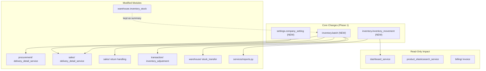
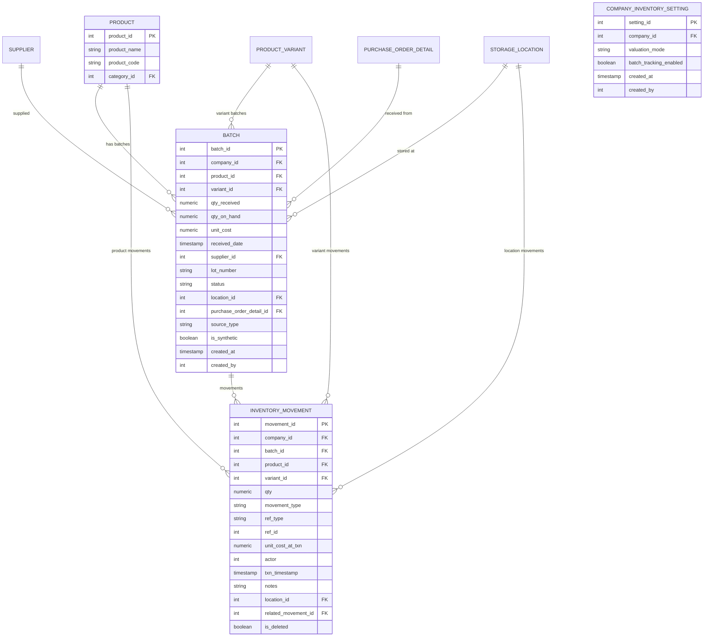
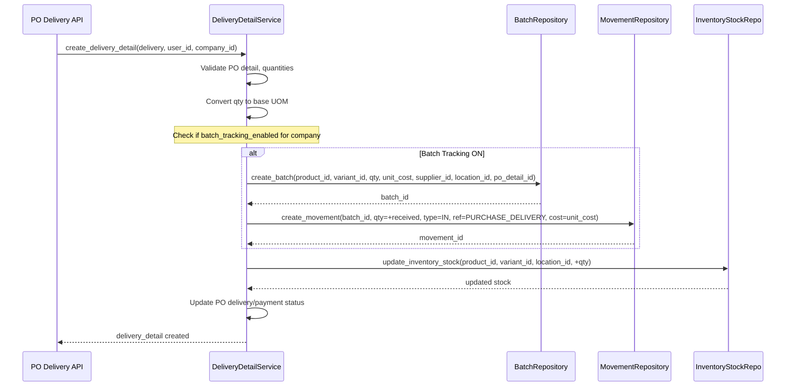
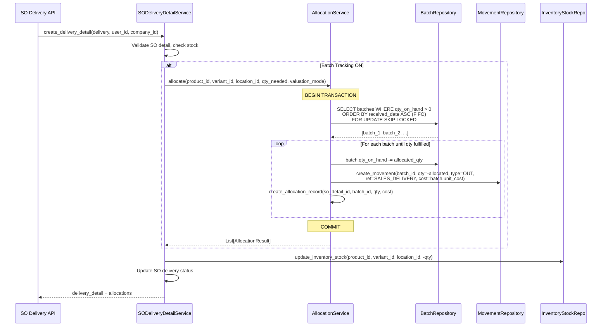
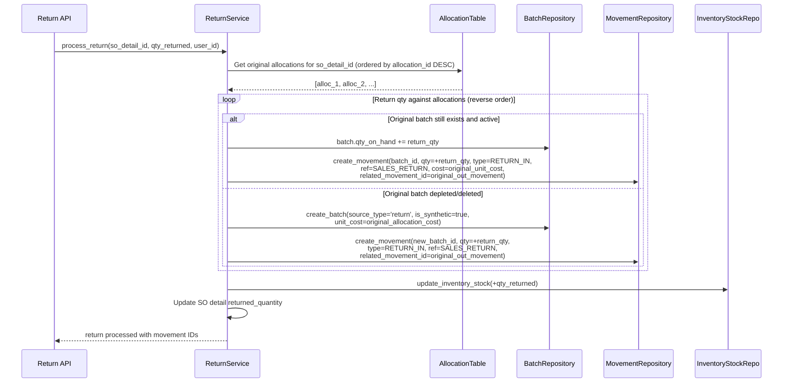
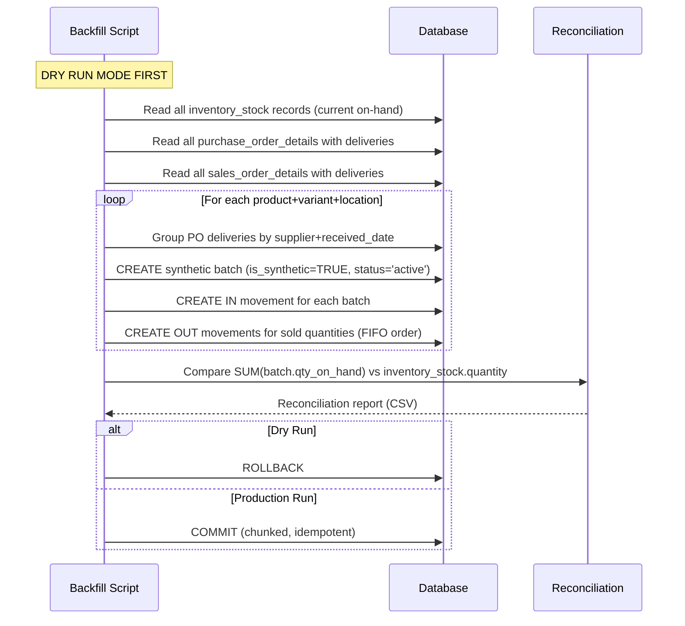

# Batch-Based Inventory Implementation Plan — Phase 1: Foundation

## Executive Summary

This plan adds **batch-based inventory** to Shoudagor ERP: every group of units received together carries its own purchase cost, and an immutable **inventory movement ledger** records every stock change with the cost locked at transaction time. The system will support **FIFO** (default), **LIFO**, and **Weighted Average** valuation modes, multicurrency cost tracking, and full return traceability.

### Current State

| Aspect | Current | Target |
|---|---|---|
| Cost tracking | `ProductPrice.purchase_price` (catalog-level) | `Batch.unit_cost` (per-receipt-level) |
| Inventory ledger | `InventoryTransaction` (qty only, no cost) | `InventoryMovement` (qty + `unit_cost_at_txn`) |
| Stock model | `InventoryStock` (product+variant+location qty) | Kept as materialized summary + new `Batch.qty_on_hand` |
| COGS calculation | Derived from PO prices at report time | Derived from immutable ledger entries |
| Valuation | Ad-hoc LIFO/FIFO in reports SQL | Configurable per-company valuation mode |
| Currency | Per-company `currency_id` | Per-company currency (single currency — no multicurrency needed) |

### Assumptions (to validate with team)

1. **No live DB access** — SQL migration plan is provided but must be dry-run tested in staging.
2. **Single currency** — all batches use the company's default currency. No multicurrency complexity.
3. **Existing `InventoryTransaction` table** — will be kept for backward compatibility; new `InventoryMovement` is the ledger of record going forward.
4. **Product variants** — batches track at the variant level (product_id + variant_id), consistent with existing stock tracking.
5. **DSR inventory** — DSR stock operations will integrate with batches in Phase 3.
6. **Valuation mode changeable** — company-level valuation mode can be changed after go-live (affects future transactions only).
7. **No external COGS dependency** — `ProductPrice.purchase_price` is NOT used by any external accounting system for COGS.

---

## 1. Dependency Graph & Breaking-Change Risks

### Modules Affected



### Breaking-Change Risks

| Risk | Severity | Mitigation |
|---|---|---|
| Reports using PO-derived LIFO/FIFO cost | HIGH | Add compatibility layer; old reports read from `inventory_movement` when available, fall back to PO data |
| `SalesOrderDeliveryDetailService._update_inventory_stock` | HIGH | Must call batch allocation before stock decrement |
| `ProductOrderDeliveryDetailService._update_inventory_stock` | HIGH | Must create Batch + inbound Movement on PO delivery |
| `InventoryAdjustmentService._process_inventory_update` | MEDIUM | Must create adjustment Movement with cost |
| `StockTransfer` / `DSRStockTransfer` | MEDIUM | Must create transfer Movement pairs (out + in) tracking batch origin |
| `InvoiceDetail` — no COGS field | LOW | Add optional `cogs_amount` computed from movements |
| `SalesOrderDetail` — no batch allocation reference | LOW | Add `batch_allocations` JSON or link table |
| Elasticsearch product sync | LOW | Add `avg_cost` and `total_stock` computed fields |

---

## 2. Data Model — ERD



---

## 3. SQL Migration Plan

### 3.1 New Tables

```sql
-- ============================================================
-- Table: inventory.batch
-- ============================================================
CREATE TABLE inventory.batch (
    batch_id        SERIAL PRIMARY KEY,
    company_id      INTEGER NOT NULL REFERENCES security.app_client_company(company_id),
    product_id      INTEGER NOT NULL REFERENCES inventory.product(product_id),
    variant_id      INTEGER REFERENCES inventory.product_variant(variant_id),
    qty_received    NUMERIC(18,4) NOT NULL,
    qty_on_hand     NUMERIC(18,4) NOT NULL DEFAULT 0,
    unit_cost       NUMERIC(18,4) NOT NULL,
    received_date   TIMESTAMP NOT NULL,
    supplier_id     INTEGER REFERENCES procurement.supplier(supplier_id),
    lot_number      VARCHAR(100),
    status          VARCHAR(20) NOT NULL DEFAULT 'active',
        -- active, depleted, expired, returned, quarantined
    location_id     INTEGER REFERENCES warehouse.storage_location(location_id),
    purchase_order_detail_id INTEGER REFERENCES procurement.purchase_order_detail(purchase_order_detail_id),
    source_type     VARCHAR(30) NOT NULL DEFAULT 'purchase',
        -- purchase, return, adjustment, transfer, synthetic
    is_synthetic    BOOLEAN NOT NULL DEFAULT FALSE,
    -- Audit
    cb              INTEGER NOT NULL,
    cd              TIMESTAMP NOT NULL DEFAULT NOW(),
    mb              INTEGER NOT NULL,
    md              TIMESTAMP NOT NULL DEFAULT NOW(),
    is_deleted      BOOLEAN NOT NULL DEFAULT FALSE
);

-- Indexes
CREATE INDEX idx_batch_company_product ON inventory.batch(company_id, product_id);
CREATE INDEX idx_batch_product_variant ON inventory.batch(product_id, variant_id);
CREATE INDEX idx_batch_product_qty ON inventory.batch(product_id, qty_on_hand)
    WHERE qty_on_hand > 0 AND is_deleted = FALSE;
CREATE INDEX idx_batch_received_date ON inventory.batch(product_id, received_date);
CREATE INDEX idx_batch_location ON inventory.batch(location_id)
    WHERE is_deleted = FALSE;
CREATE INDEX idx_batch_supplier ON inventory.batch(supplier_id);
CREATE INDEX idx_batch_status ON inventory.batch(status)
    WHERE is_deleted = FALSE;
CREATE INDEX idx_batch_po_detail ON inventory.batch(purchase_order_detail_id);


-- ============================================================
-- Table: inventory.inventory_movement (THE LEDGER)
-- ============================================================
CREATE TABLE inventory.inventory_movement (
    movement_id         SERIAL PRIMARY KEY,
    company_id          INTEGER NOT NULL REFERENCES security.app_client_company(company_id),
    batch_id            INTEGER NOT NULL REFERENCES inventory.batch(batch_id),
    product_id          INTEGER NOT NULL REFERENCES inventory.product(product_id),
    variant_id          INTEGER REFERENCES inventory.product_variant(variant_id),
    qty                 NUMERIC(18,4) NOT NULL,
        -- positive = inbound, negative = outbound
    movement_type       VARCHAR(20) NOT NULL,
        -- IN, OUT, RETURN_IN, RETURN_OUT, ADJUSTMENT, TRANSFER_IN, TRANSFER_OUT
    ref_type            VARCHAR(50) NOT NULL,
        -- PURCHASE_DELIVERY, SALES_DELIVERY, SALES_RETURN, PURCHASE_RETURN,
        -- ADJUSTMENT, STOCK_TRANSFER, DSR_TRANSFER, OPENING_BALANCE, BACKFILL
    ref_id              INTEGER,
        -- FK to the source record (delivery_detail_id, adjustment_id, etc.)
    unit_cost_at_txn    NUMERIC(18,4) NOT NULL,
    actor               INTEGER NOT NULL,
    txn_timestamp       TIMESTAMP NOT NULL DEFAULT NOW(),
    notes               VARCHAR(500),
    location_id         INTEGER REFERENCES warehouse.storage_location(location_id),
    related_movement_id INTEGER REFERENCES inventory.inventory_movement(movement_id),
        -- links return movements to original sale movements
    -- Audit (immutable ledger — soft delete only with adjustment record)
    is_deleted          BOOLEAN NOT NULL DEFAULT FALSE,
    cb                  INTEGER NOT NULL,
    cd                  TIMESTAMP NOT NULL DEFAULT NOW(),
    mb                  INTEGER NOT NULL,
    md                  TIMESTAMP NOT NULL DEFAULT NOW()
);

-- Indexes
CREATE INDEX idx_movement_company ON inventory.inventory_movement(company_id);
CREATE INDEX idx_movement_batch ON inventory.inventory_movement(batch_id);
CREATE INDEX idx_movement_product ON inventory.inventory_movement(product_id, variant_id);
CREATE INDEX idx_movement_ref ON inventory.inventory_movement(ref_type, ref_id);
CREATE INDEX idx_movement_timestamp ON inventory.inventory_movement(txn_timestamp);
CREATE INDEX idx_movement_type ON inventory.inventory_movement(movement_type);
CREATE INDEX idx_movement_location ON inventory.inventory_movement(location_id);
CREATE INDEX idx_movement_related ON inventory.inventory_movement(related_movement_id)
    WHERE related_movement_id IS NOT NULL;

-- Partitioning suggestion for large deployments (future):
-- PARTITION BY RANGE (txn_timestamp) with monthly partitions


-- ============================================================
-- Table: settings.company_inventory_setting
-- ============================================================
CREATE TABLE settings.company_inventory_setting (
    setting_id          SERIAL PRIMARY KEY,
    company_id          INTEGER NOT NULL UNIQUE REFERENCES security.app_client_company(company_id),
    valuation_mode      VARCHAR(20) NOT NULL DEFAULT 'FIFO',
        -- FIFO, LIFO, WEIGHTED_AVG
    batch_tracking_enabled BOOLEAN NOT NULL DEFAULT FALSE,
        -- Feature flag: when FALSE, system operates in legacy mode
    cb                  INTEGER NOT NULL,
    cd                  TIMESTAMP NOT NULL DEFAULT NOW(),
    mb                  INTEGER NOT NULL,
    md                  TIMESTAMP NOT NULL DEFAULT NOW(),
    is_deleted          BOOLEAN NOT NULL DEFAULT FALSE
);


-- ============================================================
-- Table: sales.sales_order_batch_allocation (link table)
-- ============================================================
CREATE TABLE sales.sales_order_batch_allocation (
    allocation_id           SERIAL PRIMARY KEY,
    sales_order_detail_id   INTEGER NOT NULL
        REFERENCES sales.sales_order_detail(sales_order_detail_id),
    batch_id                INTEGER NOT NULL
        REFERENCES inventory.batch(batch_id),
    qty_allocated           NUMERIC(18,4) NOT NULL,
    unit_cost_at_allocation NUMERIC(18,4) NOT NULL,
    movement_id             INTEGER REFERENCES inventory.inventory_movement(movement_id),
    cb                      INTEGER NOT NULL,
    cd                      TIMESTAMP NOT NULL DEFAULT NOW(),
    mb                      INTEGER NOT NULL,
    md                      TIMESTAMP NOT NULL DEFAULT NOW(),
    is_deleted              BOOLEAN NOT NULL DEFAULT FALSE
);

CREATE INDEX idx_alloc_so_detail ON sales.sales_order_batch_allocation(sales_order_detail_id);
CREATE INDEX idx_alloc_batch ON sales.sales_order_batch_allocation(batch_id);
```

### 3.2 Altered Tables

```sql
-- Add optional cogs_amount to invoice_detail for accounting export
ALTER TABLE billing.invoice_detail
    ADD COLUMN cogs_amount NUMERIC(18,4) DEFAULT NULL;

-- Add exchange_rate table for multicurrency (Phase 2 — placeholder)
-- CREATE TABLE settings.exchange_rate ( ... );
```

### 3.3 Alembic Migration Script (Template)

```python
"""add_batch_inventory_movement_tables

Revision ID: <auto>
Revises: <latest_head>
Create Date: <auto>
"""
from alembic import op
import sqlalchemy as sa

def upgrade():
    # 1. Create company_inventory_setting
    op.execute("""
        CREATE TABLE settings.company_inventory_setting (
            setting_id SERIAL PRIMARY KEY,
            company_id INTEGER NOT NULL UNIQUE
                REFERENCES security.app_client_company(company_id),
            valuation_mode VARCHAR(20) NOT NULL DEFAULT 'FIFO',
            batch_tracking_enabled BOOLEAN NOT NULL DEFAULT FALSE,
            cb INTEGER NOT NULL, cd TIMESTAMP NOT NULL DEFAULT NOW(),
            mb INTEGER NOT NULL, md TIMESTAMP NOT NULL DEFAULT NOW(),
            is_deleted BOOLEAN NOT NULL DEFAULT FALSE
        );
    """)

    # 2. Create batch table
    op.execute("-- [Full CREATE TABLE inventory.batch as above]")

    # 3. Create inventory_movement table
    op.execute("-- [Full CREATE TABLE inventory.inventory_movement as above]")

    # 4. Create sales_order_batch_allocation
    op.execute("-- [Full CREATE TABLE sales.sales_order_batch_allocation as above]")

    # 5. Alter existing tables
    op.add_column('invoice_detail',
        sa.Column('cogs_amount', sa.Numeric(18,4), nullable=True),
        schema='billing')

def downgrade():
    op.drop_column('invoice_detail', 'cogs_amount', schema='billing')
    op.execute("DROP TABLE IF EXISTS sales.sales_order_batch_allocation CASCADE")
    op.execute("DROP TABLE IF EXISTS inventory.inventory_movement CASCADE")
    op.execute("DROP TABLE IF EXISTS inventory.batch CASCADE")
    op.execute("DROP TABLE IF EXISTS settings.company_inventory_setting CASCADE")
```

---

## 4. Sequence Diagrams

### 4.1 Receiving Stock (Purchase Order Delivery)



### 4.2 Sale Allocation & Transaction Recording



### 4.3 Returns / Reversals



### 4.4 Reconciliation / Backfill



---

## 5. Allocation Algorithm — Pseudo-code

### 5.1 FIFO Allocation

```python
def allocate_fifo(
    db: Session,
    company_id: int,
    product_id: int,
    variant_id: int,
    location_id: int,
    qty_needed: Decimal,
    so_detail_id: int,
    user_id: int,
) -> List[AllocationResult]:
    """
    Allocate inventory using FIFO (oldest batch first).
    Uses SELECT ... FOR UPDATE SKIP LOCKED to prevent double allocation.
    """
    allocations = []
    remaining = qty_needed

    # Lock and fetch eligible batches ordered by received_date ASC (FIFO)
    batches = db.execute(
        text("""
            SELECT batch_id, qty_on_hand, unit_cost, received_date
            FROM inventory.batch
            WHERE company_id = :company_id
              AND product_id = :product_id
              AND variant_id = :variant_id
              AND location_id = :location_id
              AND qty_on_hand > 0
              AND status = 'active'
              AND is_deleted = FALSE
            ORDER BY received_date ASC, batch_id ASC
            FOR UPDATE SKIP LOCKED
        """),
        {"company_id": company_id, "product_id": product_id,
         "variant_id": variant_id, "location_id": location_id}
    ).fetchall()

    for batch in batches:
        if remaining <= 0:
            break

        alloc_qty = min(remaining, batch.qty_on_hand)

        # Decrement batch
        db.execute(
            text("""
                UPDATE inventory.batch
                SET qty_on_hand = qty_on_hand - :qty,
                    status = CASE
                        WHEN qty_on_hand - :qty <= 0 THEN 'depleted'
                        ELSE status END,
                    mb = :user_id, md = NOW()
                WHERE batch_id = :batch_id
            """),
            {"qty": alloc_qty, "user_id": user_id, "batch_id": batch.batch_id}
        )

        # Create OUT movement
        movement = create_movement(
            db, company_id=company_id,
            batch_id=batch.batch_id,
            product_id=product_id, variant_id=variant_id,
            qty=-alloc_qty,
            movement_type='OUT', ref_type='SALES_DELIVERY',
            ref_id=so_detail_id,
            unit_cost_at_txn=batch.unit_cost,
            actor=user_id, location_id=location_id,
        )

        allocations.append(AllocationResult(
            batch_id=batch.batch_id,
            qty_allocated=alloc_qty,
            unit_cost=batch.unit_cost,
            movement_id=movement.movement_id,
        ))
        remaining -= alloc_qty

    if remaining > 0:
        raise InsufficientStockError(
            f"Cannot allocate {qty_needed} units. "
            f"Short by {remaining} units after scanning {len(batches)} batches."
        )

    return allocations
```

### 5.2 LIFO Allocation

Same as FIFO but: `ORDER BY received_date DESC, batch_id DESC`

### 5.3 Weighted Average Allocation

```python
def allocate_weighted_avg(db, company_id, product_id, variant_id,
                          location_id, qty_needed, so_detail_id, user_id):
    """
    Weighted Average: compute average cost across all batches,
    then allocate from any batch using that averaged cost.
    """
    # Step 1: Compute weighted average cost
    result = db.execute(text("""
        SELECT SUM(qty_on_hand * unit_cost) / NULLIF(SUM(qty_on_hand), 0) as avg_cost,
               SUM(qty_on_hand) as total_on_hand
        FROM inventory.batch
        WHERE company_id = :cid AND product_id = :pid
          AND variant_id = :vid AND location_id = :lid
          AND qty_on_hand > 0 AND status = 'active' AND is_deleted = FALSE
    """), {"cid": company_id, "pid": product_id,
           "vid": variant_id, "lid": location_id}).fetchone()

    if result.total_on_hand < qty_needed:
        raise InsufficientStockError(...)

    avg_cost = result.avg_cost

    # Step 2: Allocate from batches (FIFO order for depletion, but all at avg_cost)
    # Same batch iteration as FIFO, but unit_cost_at_txn = avg_cost
    # ... (same loop as FIFO with cost override)
```

### 5.4 Concurrency Controls

- **Row-level locks**: `SELECT ... FOR UPDATE SKIP LOCKED` ensures concurrent sales skip already-locked batches.
- **Short transactions**: Allocation + movement creation is a single DB transaction.
- **Retry logic**: If all batches are locked (`SKIP LOCKED` returns empty), retry after short delay (max 3 retries).
- **Serializable fallback**: For Weighted Average, use `SERIALIZABLE` isolation level since avg_cost depends on all batches.

---

*Continued in Phase 2 document...*
