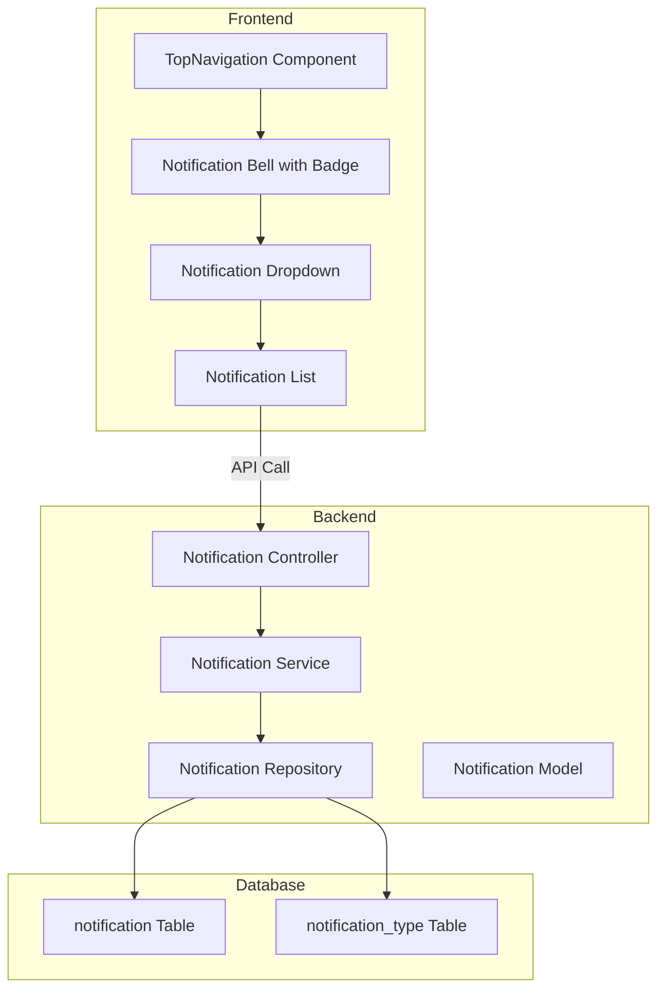
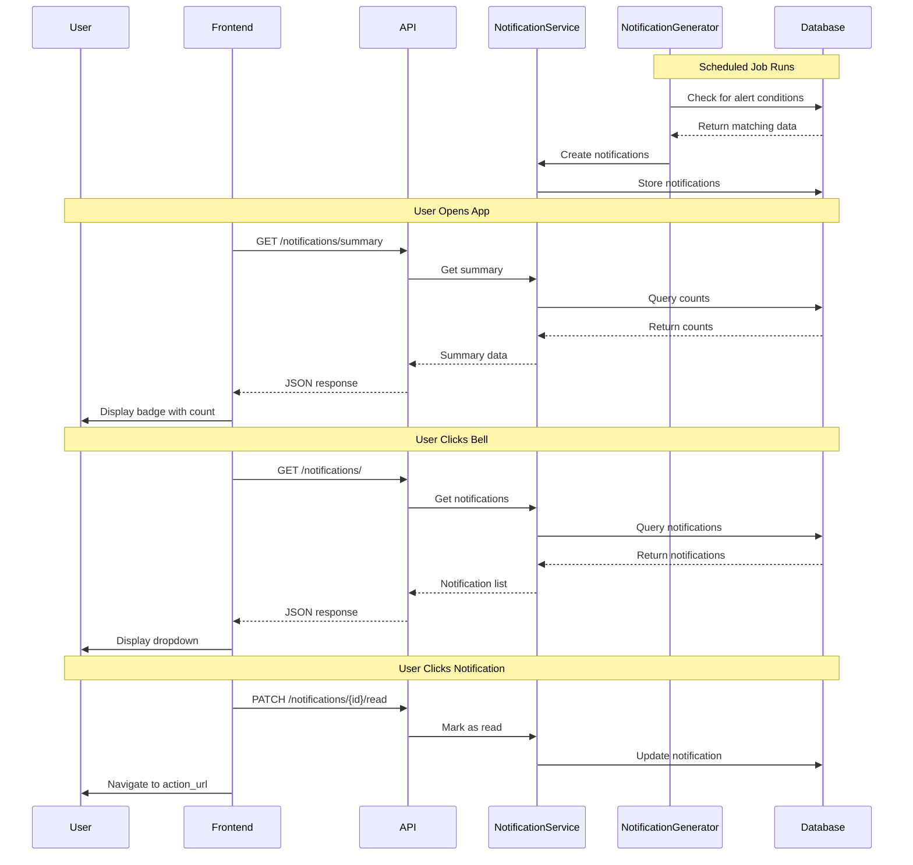
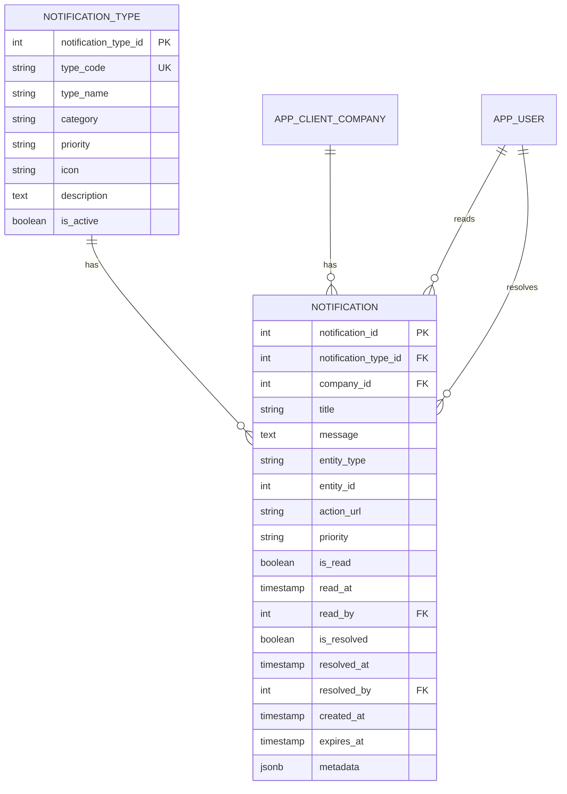

# Notification System Implementation Plan

## Overview

This document outlines the implementation plan for a critical notification system in the Shoudagor ERP. The notification dropdown will be placed in the TopNavigation component and will display only critical business alerts that require immediate attention.

---

## Critical Notifications Identification

Based on the analysis of the Shoudagor ERP business domains, the following notifications are identified as **critical**:

### 1. Inventory Alerts

| Notification | Priority | Description | Data Source |
|--------------|----------|-------------|-------------|
| **Low Stock Alert** | High | Products/variants below reorder level | `Product.reorder_level`, `ProductVariant.reorder_level`, `InventoryStock.quantity` |
| **Out of Stock Alert** | Critical | Products with zero stock | `InventoryStock.quantity = 0` |
| **Safety Stock Breach** | High | Stock below safety stock level | `Product.safety_stock`, `ProductVariant.safety_stock` |

### 2. Sales Order Alerts

| Notification | Priority | Description | Data Source |
|--------------|----------|-------------|-------------|
| **Unconsolidated SR Orders** | High | SR orders waiting to be converted to sales orders | `SR_Order` where not consolidated |
| **Pending Deliveries** | Medium | Sales orders with `delivery_status = 'Pending'` | `SalesOrder.delivery_status` |
| **Overdue Payments** | High | Sales orders with pending payment past expected date | `SalesOrder.payment_status`, expected dates |

### 3. Procurement Alerts

| Notification | Priority | Description | Data Source |
|--------------|----------|-------------|-------------|
| **Pending Purchase Deliveries** | Medium | POs awaiting delivery | `PurchaseOrder.delivery_status = 'Pending'` |
| **Overdue Supplier Payments** | High | POs with pending payment past due | `PurchaseOrder.payment_status` |
| **Expected Deliveries Today** | Medium | POs with expected delivery date = today | `PurchaseOrder.expected_delivery_date` |

### 4. DSR (Delivery Sales Representative) Alerts

| Notification | Priority | Description | Data Source |
|--------------|----------|-------------|-------------|
| **High Payment on Hand** | High | DSRs with payment_on_hand exceeding threshold | `DeliverySalesRepresentative.payment_on_hand` |
| **Pending SO Assignments** | Medium | Sales orders assigned but not completed | `DSRSOAssignment.status in ['assigned', 'in_progress']` |
| **Settlement Required** | High | DSRs needing payment settlement | `DeliverySalesRepresentative.payment_on_hand` |

### 5. SR (Sales Representative) Alerts

| Notification | Priority | Description | Data Source |
|--------------|----------|-------------|-------------|
| **Commission Ready for Disbursement** | Medium | SR commissions with status 'ready' | `SalesOrder.commission_disbursed = 'ready'` |
| **Pending Phone Suggestions** | Low | Customer phone corrections awaiting approval | `CustomerPhoneSuggestion.status = 'pending'` |

### 6. Customer Alerts

| Notification | Priority | Description | Data Source |
|--------------|----------|-------------|-------------|
| **Credit Limit Exceeded** | Critical | Customers over their credit limit | `Customer.credit_limit`, `Customer.balance_amount` |
| **High Outstanding Dues** | High | Customers with high balance amounts | `Customer.balance_amount` |

### 7. Invoice Alerts

| Notification | Priority | Description | Data Source |
|--------------|----------|-------------|-------------|
| **Overdue Invoices** | High | Invoices past due date unpaid | `Invoice.status`, `Invoice.payment_status` |

---

## Architecture Design

### System Architecture



### Database Schema

#### notification_type Table
Lookup table for different notification types.

```sql
CREATE TABLE notification.notification_type (
    notification_type_id SERIAL PRIMARY KEY,
    type_code VARCHAR(50) NOT NULL UNIQUE,
    type_name VARCHAR(100) NOT NULL,
    category VARCHAR(50) NOT NULL, -- 'inventory', 'sales', 'procurement', 'dsr', 'sr', 'customer', 'invoice'
    priority VARCHAR(20) NOT NULL DEFAULT 'medium', -- 'critical', 'high', 'medium', 'low'
    icon VARCHAR(50), -- Icon name for frontend
    description TEXT,
    is_active BOOLEAN DEFAULT TRUE
);
```

#### notification Table
Stores individual notifications.

```sql
CREATE TABLE notification.notification (
    notification_id SERIAL PRIMARY KEY,
    notification_type_id INTEGER REFERENCES notification.notification_type(notification_type_id),
    company_id INTEGER NOT NULL REFERENCES security.app_client_company(company_id),
    title VARCHAR(200) NOT NULL,
    message TEXT NOT NULL,
    entity_type VARCHAR(50), -- 'sales_order', 'product', 'customer', etc.
    entity_id INTEGER, -- ID of the related entity
    action_url VARCHAR(500), -- URL to navigate when clicked
    priority VARCHAR(20) NOT NULL DEFAULT 'medium',
    is_read BOOLEAN DEFAULT FALSE,
    read_at TIMESTAMP,
    read_by INTEGER REFERENCES security.app_user(user_id),
    is_resolved BOOLEAN DEFAULT FALSE,
    resolved_at TIMESTAMP,
    resolved_by INTEGER REFERENCES security.app_user(user_id),
    created_at TIMESTAMP DEFAULT CURRENT_TIMESTAMP,
    expires_at TIMESTAMP, -- Optional expiration for time-sensitive notifications
    metadata JSONB -- Additional data for flexible storage
);
```

### Notification Type Seeding

Pre-populated notification types:

| type_code | type_name | category | priority |
|-----------|-----------|----------|----------|
| LOW_STOCK | Low Stock Alert | inventory | high |
| OUT_OF_STOCK | Out of Stock | inventory | critical |
| SAFETY_STOCK_BREACH | Safety Stock Breach | inventory | high |
| UNCONSOLIDATED_SR_ORDER | Unconsolidated SR Orders | sales | high |
| PENDING_DELIVERY | Pending Deliveries | sales | medium |
| OVERDUE_PAYMENT | Overdue Payments | sales | high |
| PENDING_PO_DELIVERY | Pending Purchase Deliveries | procurement | medium |
| OVERDUE_SUPPLIER_PAYMENT | Overdue Supplier Payments | procurement | high |
| EXPECTED_DELIVERY_TODAY | Expected Deliveries Today | procurement | medium |
| HIGH_PAYMENT_ON_HAND | High Payment on Hand | dsr | high |
| PENDING_SO_ASSIGNMENT | Pending SO Assignments | dsr | medium |
| SETTLEMENT_REQUIRED | Settlement Required | dsr | high |
| COMMISSION_READY | Commission Ready for Disbursement | sr | medium |
| PENDING_PHONE_SUGGESTION | Pending Phone Suggestions | sr | low |
| CREDIT_LIMIT_EXCEEDED | Credit Limit Exceeded | customer | critical |
| HIGH_OUTSTANDING_DUES | High Outstanding Dues | customer | high |
| OVERDUE_INVOICE | Overdue Invoices | invoice | high |

---

## API Design

### Endpoints

| Method | Endpoint | Description |
|--------|----------|-------------|
| GET | `/api/company/notifications/` | Get notifications with pagination |
| GET | `/api/company/notifications/summary` | Get notification counts by category |
| GET | `/api/company/notifications/unread-count` | Get unread notification count |
| PATCH | `/api/company/notifications/{id}/read` | Mark notification as read |
| PATCH | `/api/company/notifications/mark-all-read` | Mark all notifications as read |
| PATCH | `/api/company/notifications/{id}/resolve` | Mark notification as resolved |
| DELETE | `/api/company/notifications/{id}` | Delete a notification |
| POST | `/api/company/notifications/generate` | Admin: Generate notifications from system data |

### Response Schemas

#### Notification Summary Response
```json
{
    "total_unread": 15,
    "critical_count": 2,
    "high_count": 5,
    "medium_count": 6,
    "low_count": 2,
    "by_category": {
        "inventory": 3,
        "sales": 4,
        "procurement": 2,
        "dsr": 3,
        "sr": 1,
        "customer": 1,
        "invoice": 1
    }
}
```

#### Notification List Response
```json
{
    "items": [
        {
            "notification_id": 1,
            "type": {
                "type_code": "OUT_OF_STOCK",
                "type_name": "Out of Stock",
                "category": "inventory",
                "priority": "critical",
                "icon": "alert-circle"
            },
            "title": "Product Out of Stock",
            "message": "Product 'Rice 5kg' is out of stock at Main Warehouse",
            "entity_type": "product",
            "entity_id": 123,
            "action_url": "/products/123",
            "priority": "critical",
            "is_read": false,
            "created_at": "2026-02-16T10:30:00Z",
            "metadata": {
                "product_name": "Rice 5kg",
                "location_name": "Main Warehouse",
                "current_stock": 0
            }
        }
    ],
    "total": 50,
    "unread_count": 15
}
```

---

## Frontend Implementation

### Component Structure

```
shoudagor_FE/src/
├── components/
│   ├── notifications/
│   │   ├── NotificationDropdown.tsx    # Main dropdown component
│   │   ├── NotificationList.tsx        # List of notifications
│   │   ├── NotificationItem.tsx        # Individual notification
│   │   ├── NotificationBadge.tsx       # Unread count badge
│   │   └── NotificationSummary.tsx     # Summary by category
│   └── TopNavigation.tsx               # Modified to include notification
├── lib/
│   └── api/
│       └── notificationApi.ts          # API functions
└── hooks/
    └── useNotifications.ts             # Custom hook for notifications
```

### UI Design

#### Notification Bell with Badge
- Bell icon in TopNavigation
- Red badge showing unread count
- Badge hidden when count is 0
- Pulse animation for critical notifications

#### Notification Dropdown
- Opens on click
- Shows notification summary at top
- Tabs for filtering by category
- List of notifications with:
  - Priority indicator (colored dot)
  - Icon based on category
  - Title and message
  - Relative time (e.g., "2 hours ago")
  - Click to navigate to action URL
- "Mark all as read" button
- "View all" link to full notifications page

#### Priority Colors
| Priority | Color | Dot Color |
|----------|-------|-----------|
| Critical | Red | `bg-red-500` |
| High | Orange | `bg-orange-500` |
| Medium | Yellow | `bg-yellow-500` |
| Low | Blue | `bg-blue-500` |

---

## Backend Implementation

### File Structure

```
Shoudagor/app/
├── models/
│   └── notification.py              # Notification models
├── schemas/
│   └── notification/
│       └── notification.py          # Pydantic schemas
├── repositories/
│   └── notification/
│       └── notification_repository.py
├── services/
│   └── notification/
│       ├── notification_service.py
│       └── notification_generator.py # Generates notifications from data
├── api/
│   └── notification.py              # API endpoints
└── subscribers/
    └── notification_subscriber.py   # Event listeners for auto-generation
```

### Notification Generation Logic

Notifications can be generated through:

1. **Scheduled Jobs** (Recommended for most cases)
   - Run periodically (e.g., every 15 minutes)
   - Check system data for conditions
   - Generate notifications for matching criteria

2. **Event-Driven** (For immediate notifications)
   - SQLAlchemy event listeners
   - Trigger on specific model changes
   - Example: When stock drops below reorder level

3. **On-Demand** (Admin triggered)
   - Manual refresh endpoint
   - Useful for testing or after data imports

### Notification Generation Service

```python
class NotificationGeneratorService:
    async def generate_low_stock_notifications(self, company_id: int):
        # Find products below reorder level
        # Create notifications for each
        pass
    
    async def generate_out_of_stock_notifications(self, company_id: int):
        # Find products with zero stock
        pass
    
    async def generate_credit_limit_notifications(self, company_id: int):
        # Find customers exceeding credit limit
        pass
    
    # ... other generation methods
```

---

## Implementation Phases

### Phase 1: Core Infrastructure
- [ ] Create database migration for notification tables
- [ ] Create notification models
- [ ] Create Pydantic schemas
- [ ] Create notification repository
- [ ] Create basic notification service
- [ ] Create API endpoints

### Phase 2: Notification Generation
- [ ] Implement notification generator service
- [ ] Add scheduled job for notification generation
- [ ] Implement notification cleanup (expired notifications)
- [ ] Add event-driven notifications for critical alerts

### Phase 3: Frontend Implementation
- [ ] Create notification API functions
- [ ] Create useNotifications hook
- [ ] Create NotificationBadge component
- [ ] Create NotificationDropdown component
- [ ] Create NotificationList component
- [ ] Create NotificationItem component
- [ ] Integrate with TopNavigation

### Phase 4: Testing & Refinement
- [ ] Write unit tests for notification service
- [ ] Write integration tests for API
- [ ] Test notification generation logic
- [ ] Test frontend components
- [ ] Performance optimization

### Phase 5: Advanced Features (Optional)
- [ ] Real-time notifications with WebSockets
- [ ] Email notifications for critical alerts
- [ ] Notification preferences per user
- [ ] Notification digest emails

---

## Technical Considerations

### Performance
- Use database indexes on `company_id`, `is_read`, `created_at`
- Implement pagination for notification list
- Cache notification summary with Redis
- Batch notification generation for large datasets

### Security
- Company-scoped notifications (multi-tenancy)
- User-level read status tracking
- Role-based notification visibility (optional)

### Scalability
- Consider partitioning notification table by company_id for large deployments
- Implement notification archival for old notifications
- Add soft delete for audit trail

---

## Mermaid Diagrams

### Notification Flow



### Database ERD



---

## Summary

This notification system will provide critical business alerts to users through a dropdown in the TopNavigation component. The system focuses on:

1. **Critical inventory alerts** - Stock levels, out of stock
2. **Sales alerts** - Unconsolidated orders, pending deliveries, overdue payments
3. **Procurement alerts** - Pending deliveries, overdue payments
4. **DSR alerts** - Payment on hand, pending assignments
5. **SR alerts** - Commission disbursement, phone suggestions
6. **Customer alerts** - Credit limits, outstanding dues
7. **Invoice alerts** - Overdue invoices

The implementation follows the existing 5-layer architecture pattern and integrates seamlessly with the current codebase structure.
